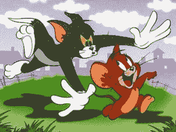
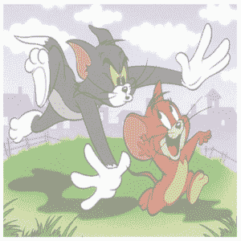

# 关于 CSS 中的不透明度，你需要知道的一切

> 原文：<https://www.edureka.co/blog/opacity-in-css/>

这篇文章将向你介绍帮助你理解 CSS 中不透明度的概念，并告诉你如何控制这个参数。本文将涉及以下几点:

*   [CSS 中的不透明度](#OpacityinCSS)
*   [继承级联元素的不透明度](#Opacityinheritedwithcascadingelements)
*   [层叠元素的 RGBA 属性设置](#RGBAAttributesettingforcascadingelements)
*   [悬停效果的不透明度变化](#Opacitychangesonthehovereffect)

元素的背景不透明度是 HTML 设计中一个有用的功能设置。通过设置不透明度的级别(与透明度相反)，设计人员可以通过 CSS 不透明度属性来控制元素的可见性。这通常在元素层叠放置时用作背景设置。

使用此功能的最常见场景如下:

*   部分透明的背景图像放置在文本元素后面。
*   背景图像模糊不清，因此它不会主导前面的文本。
*   当用户明确选择查看图像时，该图像可能会完全聚焦。

在开始学习 CSS 不透明度之前，你可能想先阅读一下 CSS 基础知识。

要获得全面的 CSS 教程，请访问 [Edureka CSS 初学者教程](https://www.youtube.com/watch?v=3_9znKVNe5g)。你将得到一个很好的关于 CSS 如何被用来增强 HTML 网页设计的提示。

继续这篇关于 CSS 不透明性的文章

## **CSS 中的不透明度**

在 CSS 中，不透明度被设置为范围在 0.0-1.0 之间的数值。值越接近零表示透明度越高，图像的可见度将非常低。让我们从一个以 50%透明度显示的图像的例子开始。参见下面的示例 1。

**示例 1:背景图像设置为半透明**

```
<!DOCTYPE html>
<html>
<body>
<style>
img
{
opacity: 0.5;
filter: alpha(opacity=50); /* For IE8 and earlier */
}
</style>

</body>
</html>

```

**例 1:输出**



Original Image (100% Opacity)




Image with 50% Opacity setting


在上面的例子中，只有一个元素——图像。也可以使用不透明度参数设置其他元素，如文本、div 元素等。

继续这篇关于 CSS 不透明性的文章

## **继承级联元素的不透明度**

当元素一个堆叠在另一个之上时，如果背景元素具有不透明度设置，则它会被所有子元素继承。这是**的默认设置**。这意味着如果一个文本框被放置在一个图像上，并且该图像具有 0.5 的不透明度设置，那么该图像和文本元素将仅部分可见。

在下一个例子中，让我们以放置在 TOM & JERRY 图像上的子文本元素为例。我们可以在示例 2 中看到默认的不透明度效果。

```
<!DOCTYPE html>
<html>
<body>
<style>
.container
{
position: relative;
text-align: center;
opacity: 0.5;
}
.centered
{
position: absolute;
top: 50%;
left: 50%;
transform: translate(-50%, -50%);
color: blue;
font-size: 40px;
}
}
</style>
<div class="container">

<div class="centered">TOM & JERRY</div>
</body>
</html>
```

**示例 2:文本从父图像继承不透明度**


继续这篇关于 CSS 不透明性的文章

## **层叠元素的 RGBA 属性设置**

还有另一种方法可以用层叠元素来控制不透明度。如果你希望子元素不受其背景元素不透明度的影响，那么你可以使用 **RGBA 属性设置**。

**示例 3:使用 RGBA 设置**

```

background: rgba(76, 175, 80, 1.0)
/*Image has no opacity setting*/
/*Green background for text with 100% opacity */
/*Blue color text has 100% opacity*/

```


```
background: rgba(76, 175, 80, 0.4)
/*Image has no opacity setting*/
/* Green background for text with 40% opacity */
/* Blue text still seen with 100% opacity*/

```


在 RGB 颜色代码之后，属性‘a’代表 ***阿尔法*** 。 ***alpha*** 参数是一个介于 0.0(完全透明)和 1.0(完全不透明)之间的数字。

继续这篇关于 CSS 不透明性的文章

## **悬停效果的不透明度变化**

在某些情况下，网页设计者希望不透明度随着用户是否关注元素而变化。例如，假设一个图像默认设置为 50%不透明度。然而，当用户将鼠标悬停在图像上时，我们希望图像以 100%的不透明度完全聚焦。

示例 4 展示了这是如何实现的。

**常见注意点:**

*   不透明度设置是在 CSS 中使用“visibility”属性的替代方法。但是，使用“不透明度”设置可以轻松设置不同的透明度，范围从零到全。
*   不透明度的水平将在各种浏览器中仔细测试后设定。当不透明度设置为低值时，有时文本或图像可能会变得完全不可见或不可读。
*   使用不透明度背后的想法是将焦点放在一些元素上，而其他背景元素不会分散用户的注意力。所以这样的背景元素设置为较低的不透明度。
*   在 Internet Explorer 中，对于 IE8 和更早的版本，不透明度属性是一个“过滤器”设置，范围从 1 到 100。在所有其他浏览器中，它的范围是从 0 到 1。

这就把我们带到了这篇关于 CSS 不透明性的文章的结尾。

如果你有兴趣学习更多关于网络开发的知识，可以看看 Edureka 的 **[网络开发认证培训](https://www.edureka.co/complete-web-developer)** 。 *Web 开发认证培训将帮助您学习如何使用 HTML5、CSS3、Twitter Bootstrap 3、jQuery 和 Google APIs 创建令人印象深刻的网站，并将其部署到亚马逊简单存储服务(S3)。*

如果你仍然感兴趣，如果你有任何问题，你可以在这个“CSS 的不透明性”博客的评论区发表，我们会尽快回复你。