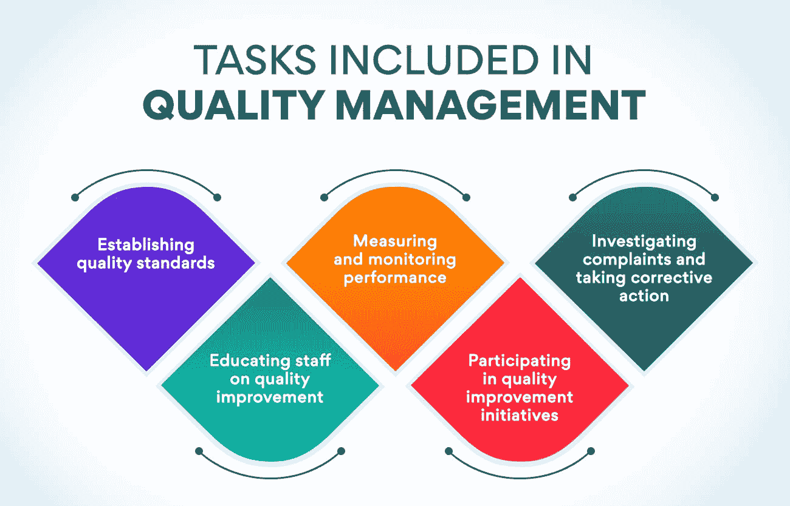
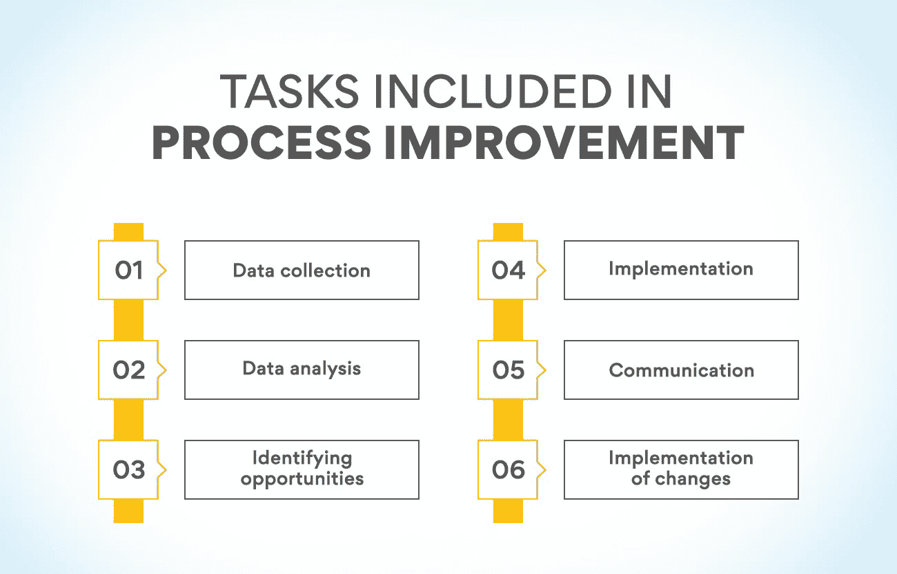

# 医院运营管理——了解关键职能

> 原文：<https://www.edureka.co/blog/operations-management-in-hospitals>

医院的运营管理是运作和顺利运营的最重要方面之一。它涵盖了医疗机构中所有不同的管理领域，从人力资源到供应链以及两者之间的一切。通过了解运营管理的关键职能，您可以帮助确保您的医院尽可能高效平稳地运行。

## **什么是医院运营管理？**

医院的运营管理是计划、组织和控制医疗机构运营的过程。它包括临床和非临床手术的管理。医院的运营管理的主要目标是确保所有运营高效且有效地进行。

它忽略了医院运营的各个重要方面，如人员配备、患者流动、资源分配和流程改进。医院的运营管理也有助于确保医院平稳运行并实现其目标。

## **医院运营管理的重要性**

医院的运营管理对任何医疗机构的成功都至关重要。它有助于确保所有操作都得到高效和有效的执行。此外，医院运营管理还帮助 提高患者护理质量和安全性。

由于经济原因，医院的运营管理也至关重要。适当的运营管理有助于降低成本和提高效率。反过来，这也能增加医院的利润。

医院的运营管理是一个复杂而富有挑战性的过程。然而，这对于任何医疗保健组织的成功都是必不可少的。适当的运营管理有助于提高患者护理质量和安全性，并增加利润。

没有运营管理，医院将无法正常运转。运营经理确保医院平稳运行并实现其目标。

你对医院的运营管理感兴趣吗？嗯，有很多很棒的节目。运营管理学位可以帮助你在这个重要领域开始一个有意义的职业生涯。我们为有抱负的运营经理提供运营、供应链和项目管理方面的高级证书。

**也读:[运营管理入门](https://www.edureka.co/blog/beginners-guide-to-operations-management/)**

## **医院运营管理的主要功能**

在任何组织中，运营管理(OM)都是协调和监督商品或服务生产的过程。它包括开发、实施和监督创造和交付公司产品或服务的系统。在医疗保健行业，运营管理对于确保患者安全高效地获得高质量的护理至关重要。

医院运营管理主要有四大职能:质量管理、资源管理、流程改进、病人安全。

### **质量管理**

质量管理对于提供安全、高质量的护理至关重要。质量管理是确保医疗服务满足并超越患者期望的过程。它包括制定质量标准，测量和监控绩效，并在必要时采取纠正措施。只有质量才能应对不断变化的医疗保健环境的挑战，并确保患者获得尽可能最好的护理。

运营经理有责任确保达到质量标准。为此，他们必须开发和实施质量管理体系。这些系统有助于运营经理在问题导致不良患者结果之前发现并纠正问题。

***质量管理中包含的任务:***

**建立质量标准:** 这包括制定衡量医疗服务质量的标准。运营经理可以选择采用许多不同的质量标准，例如政府制定的标准。

**衡量和监测绩效:** 这包括收集医疗服务质量的数据，并确定需要改进的领域。运营经理可以使用各种方法来收集数据，如调查和患者满意度评分。

**调查投诉并采取纠正措施:** 运营经理必须认真对待患者或其家属的投诉，并利用这些投诉来提高医疗服务质量。运营经理必须调查每一次投诉，找出根本原因，并采取纠正措施防止其再次发生。

**对工作人员进行质量改进教育:** 确保所有工作人员致力于提供高质量的医疗服务至关重要。运营经理必须提供质量改进方法的培训，并确保员工正确使用这些方法。

**参与质量改进计划:** 它涉及运营经理与医院其他部门合作，确定并实施质量改进计划。这些举措可能包括改变医疗保健服务的提供方式或修改医院的运营方式。

### **资源管理**

资源管理确保所有资源(如人员、设备、供应品)都得到有效利用。在医疗保健行业，资源管理对于确保患者及时获得所需的护理至关重要。医疗保健运营有不同的资源，每种资源都需要有效管理。

资源管理的第一步是规划。规划需要为资源的使用设定目标和目的。一旦设定了目标，就可以制定计划来实现它们。第二步是实施。这一步是将计划付诸实施，并确保所有资源都按照计划使用。最后一步是评估。这一步包括评估是否达到了目标和目的。如果不是，那么可以对计划进行调整。

***资源管理中包含的任务:***

**日程安排:** 此任务包括创建资源使用计划。时间表的设计应满足组织和患者的需求。在制定计划时，考虑资源的可用性至关重要。

预测: 此任务包括预测未来的资源需求。这是通过分析过去的趋势和当前的条件来完成的。预测可以帮助组织为未来的需求做准备，并对资源计划进行必要的调整。

**库存控制:** 准确的库存对于资源管理至关重要。这项任务包括跟踪资源水平，并确保它们足以满足组织的需求。

**预算:** 没有充足的预算，资源管理就很复杂。这项任务包括制定资源使用预算。预算的设计应该符合组织的目标和目的。

**供应链管理:** [供应链管理](https://www.edureka.co/blog/components-of-supply-chain-management/)管理资源(如材料、信息、资金)从供应商到客户的流动。在医疗保健行业，供应链管理对于确保患者按时获得所需的护理至关重要。

**人员配备:** 医疗保健运营中最基本的任务之一就是人员配备。这项任务包括确保有足够的人员来满足组织的需求。在做出人员配备决定时，考虑员工的技能和经验至关重要。

**培训:**医院运营管理的另一个关键职能是培训。这项任务包括为员工提供有效完成工作所需的知识和技能。需要学习新技能的新老员工都要接受培训。确保所有员工接受培训，他们需要有效地执行他们的工作是至关重要的。

## **流程改进**

流程改进是系统地识别和实施将提高医疗服务质量和效率的变更。运营经理经常与其他医疗团队成员合作，领导流程改进工作。

六适马被认为是流程改进工具箱中最重要的工具之一。六适马是一种数据驱动的方法，用于识别和消除医疗保健流程中的错误和浪费。它成功地改善了从病人登记到出院的各种医疗保健操作。

过程改进依赖于数据的有效利用。运营经理必须精通数据收集和分析，以发现改进机会。他们必须有效地将他们的发现传达给医疗团队的其他成员。

***流程改进中包含的任务:***

**数据收集:** 在做出任何改进之前，运营经理必须首先收集医疗保健流程当前状态的数据。这些数据可以通过各种方法进行管理，例如观察、访谈和调查。

**数据分析:** 一旦收集了数据，就必须对其进行分析，以确定机会所在。这个过程通常包括创建流程图和其他视觉辅助工具来帮助说明当前的过程。例如，一个流程图可以显示病人从登记到出院的过程中有多少步骤。

**识别机会:** 分析完数据后，运营经理可以开始识别改进的机会。这些机会可能包括消除流程中的步骤、简化部门间的沟通或增加技术的使用。

**实施:** 一旦确定了改进的机会，运营经理必须与医疗团队的其他成员一起实施变革。这一过程可能具有挑战性，因为它通常需要改变长期存在的流程和程序。

**沟通:** 在整个改进过程中，运营经理必须让医疗团队的其他成员了解他们的进展。这种交流可以采取多种形式，从团队会议上的定期更新到更正式的演示。

**变革的实施:** 改进完成后，运营经理需要监控流程，以确保变革达到预期效果。这种监视可以包括收集关于流程的数据，并将其与做出更改之前收集的数据进行比较。

### **患者安全**

医疗保健行业的运营管理部门负责确保患者的安全。它包括确保医院环境安全、干净、没有危险。运营经理还制定政策和程序来防止错误和事故。他们与员工协调，以确保他们在安全程序方面得到适当的培训。

随着患者安全成为医疗保健的重中之重，运营经理在确保医院成为患者和员工的安全场所方面发挥着至关重要的作用。它为优质护理和积极的患者体验奠定了基础。所有员工都必须接受适当的培训，并遵循设定的安全程序，以避免事故发生。运营经理必须持续监控医院环境，并做出必要的改变以确保其安全。

***患者安全中包含的任务:***

**制定政策和程序以防止错误和事故** 包括制定关于处理危险材料、火灾时应该做什么以及如何安全疏散大楼的政策。

**与医院工作人员合作，确保他们接受过充分的安全程序培训:** 这包括如何使用安全设备、处理危险材料以及在紧急情况下该做什么的培训。

检查医院环境包括检查绊倒的危险，确保充足的照明，并确保 建筑符合规范。还包括确保医院有应急计划。

调查事故和事件，以确定根本原因并防止将来发生。它包括采访证人，审查安全录像，并进行分析，以确定趋势。

## **医院运营管理:成功医疗保健行业的基石**

医院运营管理负责医院的平稳运行。运营经理确保所有医院部门高效工作，确保病人得到良好的护理。

他们还负责医院的财务管理，包括预算和预测。此外，他们还必须与医院的人力资源部门打交道，包括招聘、培训和发展。

医疗保健运营管理是医院的重要组成部分，在医疗保健行业的成功中起着至关重要的作用。没有它，医院就不能正常运转，病人就不能得到最好的治疗。因此，如果你正在考虑医疗保健职业，运营管理是一个很好的选择。

如果你有兴趣了解更多关于医院[运营管理](https://www.edureka.co/blog/what-are-the-objectives-of-operations-management/)的信息，网上有很多教育资源。你也可以找到很多关于这个主题的书。然而，了解这个领域的最好方法是获得在医院工作的经验。它将让您初步了解运营管理是如何工作的，以及它的职责是什么。

你也可以从我们的[运营、供应链和项目管理](https://www.edureka.co/highered/advanced-program-in-operations-supply-chain-project-management-iitg)高级证书开始，它会让你对运营管理有一个详细的了解。有了这个高级证书，让你的职业生涯走上正轨。现在就去看看。