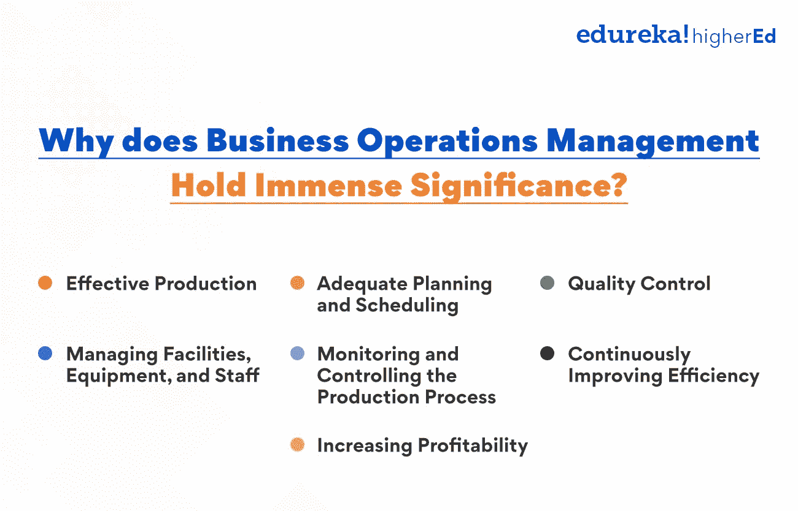
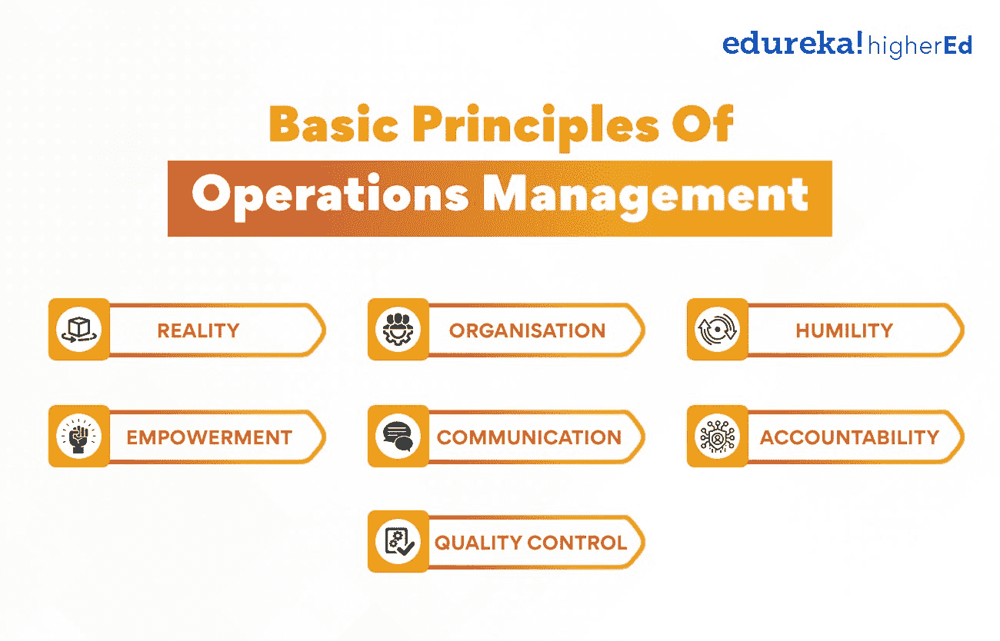
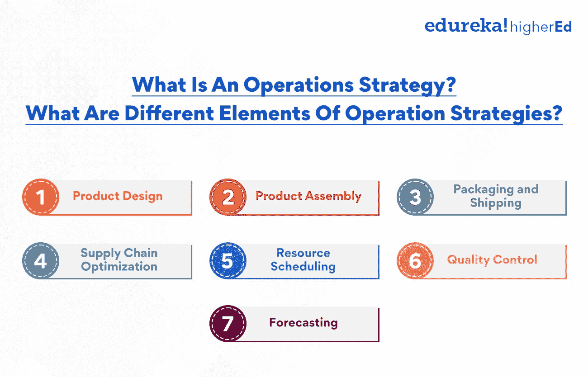

# 运营管理入门指南

> 原文：<https://www.edureka.co/blog/operations-management/>

你有没有想过品牌的商品和服务是如何最有效、最实用地传递的？是什么让从生产、供应到管理的整个过程看起来如此完美？成功的运营管理是数百万组织成功的秘诀。

[运营管理是一项不可或缺的职能](https://www.edureka.co/blog/roles-and-functions-of-operations-management/)，它奠定了任何组织的基础。没有有效的运营管理，一个组织将无法高效地生产商品和服务，也无法满足客户的需求。虽然这似乎是一个复杂而令人生畏的话题，但事实并非如此。

在这篇博文中，我们将提供运营管理(OM)的入门指南，并讨论一些你需要知道的最重要的话题。通过理解它的基本原理，你可以对业务及其运作做出更明智的决策。

## 为什么企业运营管理意义重大？

*“哈佛商业评论最近的一项研究发现，拥有卓越运营管理的公司获得行业财务绩效最高象限的可能性是其他公司的两倍。”*

运营管理是一个与商品和服务生产相关的垂直业务领域。它包括将输入转化为输出的计划、安排和控制活动。运营经理确保一个组织的运营是高效和有效的。他们还必须确保组织的产品和服务满足顾客的需求。

在当今竞争激烈的商业环境中，组织需要建立健全的运营管理流程。运营管理的目标是优化资源利用，充分满足多样化的客户需求。

运营管理涉及生产过程的方方面面，从原材料采购到成品交付。它包括设施、设备和员工的管理。OM 还负责生产任务的计划和执行。下面是 OM 的核心流程:

**有效生产:** 它确保资源被有效地用于生产商品和服务。这包括减少浪费和最大限度地利用资源来实现[产品](https://www.edureka.co/blog/product)的成功。

**充分的计划和调度:** 它确保生产任务得到计划和调度，以满足业务目标、生产能力和客户需求。

**质量控制:** OM 负责每一步的质量检查，确保生产和供应与业务目标相辅相成，并确保成品满足客户的期望。

**管理设施、设备和员工:** 它确保设施和设备得到充分维护，员工得到适当培训，并为实现共同目标而努力。

**监控生产过程:** 这包括监控生产指标，并根据需要对生产过程进行更改。

**持续提高效率:** OM 为改善生产流程、提高效率铺平了道路。

**增加盈利:** 这是所有企业的终极目标，运营经理应该时刻寻找增加盈利的方法。

**也读:[运营管理的范围是什么？](https://www.edureka.co/blog/what-is-the-scope-of-operations-management/)**

## **运营管理的基本原则**

运营管理是一个复杂的领域，需要考虑许多不同的方面。然而，通过理解运营管理流程的基本原则，你可以开始在你的组织中有所作为。在你的组织中实施这些原则，你很快就会看到好处。根据兰德尔·谢弗的观点。

1.  现实: 没有完美的方式来管理一个组织，总会有改进的空间。OM 流程应该关注核心问题并找出改进方法。
2.  组织: 每个组织都是不同的，因此你管理运营的方式也将是你公司独有的。你必须了解你的组织的优势和劣势，以确保最佳结果。
3.  **谦逊:** 试错法只有在你有足够的资源和时间时才是可取的。因此，理解这个限制总是很重要的，它将允许你在带来结果的最佳能力上工作。
4.  授权: 授权你的员工做出决定并采取行动。他们获得的权力越多，对工作的投入就越多。
5.  **沟通:** 清晰坦诚的沟通是成功运营管理的精髓。确保每个人都在同一页上，不要害怕给予反馈。
6.  作为一名运营经理，对自己带来的结果负责是很重要的。
7.  质量控制: 质量控制对于确保您的产品或服务满足客户需求至关重要。使用成熟的系统和策略来跟踪和提高质量。

这些只是运营管理的一些原则。通过恰当地实施这些原则，你可以开始在你的组织中有所作为。你很快就能收获提高效率和生产力的种子。

想要学习运营管理的基本原理并成为运营经理吗？我们有一门令人惊叹的互动课程，即[运营、供应链、项目管理高级证书](https://www.edureka.co/highered/advanced-program-in-operations-supply-chain-project-management-iitg)。试试看！

## **战略运营管理决策有哪些？**

在运营管理中的每一个决定都有不同的含义和考虑，但对你的业务成功都很重要。因此，这些应该考虑到公司的目标，资源和限制。以下是运营经理必须做出的一些战略决策。

**运营和供应链管理**

[这两个领域](https://www.edureka.co/blog/what-is-operations-and-supply-chain-management-oscm/)的战略决策主要关注公司生产过程的效率和有效性。它俯瞰整个生产过程，从获取原材料到将成品交付给客户。目标是在满足客户需求的同时，最大限度地减少浪费和利用资源。

**人力资源管理**

决策的重点是吸引、培养和留住员工。这包括制定和执行员工政策，以提供培训和发展机会。它创造了一支有技能、有动力、对公司忠诚的员工队伍。

**库存管理**

对于任何生产或销售产品的公司来说，这都是一个至关重要的领域。理想的目标是保持足够的库存，以满足不断增长的客户需求，同时不在库存中保持太多的资本。这可能是一个具有挑战性的平衡，在这个领域的战略决策的重点是实现它。

**预测和产能规划**

制造和销售公司的另一个关键领域是预测和[产能规划](https://www.edureka.co/blog/what-is-capacity-planning-in-operations-management/)。这包括决定生产什么产品，每种产品生产多少，以及何时生产。这里的目的是在与目标受众相关的同时，最大限度地降低生产过剩或生产不足的风险。

**设施管理**

该领域的战略决策集中在公司设施的布局、设计和维护上。这包括从选择工厂位置到设计生产流程布局的一切。它有助于为员工创造一个安全高效的工作环境。

**运营调度**

运营管理的最后一个领域是调度。这包括决定何时开始和完成生产过程中的每项任务。目标是在满足客户需求的同时，最大限度地减少停机时间，最大限度地利用资源。

## 什么是运营战略？运营策略的不同要素是什么？

运营战略是一个组织如何利用其资源为客户创造价值的计划。有了高效的[运营战略](https://www.edureka.co/blog/why-do-businesses-need-an-operations-strategy/)，公司可以比竞争对手以更低的成本生产商品或提供服务，或者创造更多的收入。运营战略的主要目的是提高公司的竞争地位。

运营策略的关键要素包括:

**产品设计:** 产品设计包括创造满足客户需求的产品，并能以允许组织获利的成本生产。

**产品组装:** 产品组装是将产品的组件组装在一起的过程，使其对公司有利可图，对客户相关。

**包装和运输:** 包装和运输负责将产品安全、及时地送到客户手中。

**供应链优化:** 供应链优化确保供应链的所有组成部分高效合作，向客户交付产品。

**资源调度:** 资源调度是指为任务分配资源，如机器和工人，以满足生产目标。

**质量控制:** 质量控制确保产品符合客户质量标准，并能按时交付。

**预测:** 它是一种估算产品未来需求的方法，以确保必要的资源可用。

**又读:[运营管理中的决策:要点](https://www.edureka.co/blog/operations-management-decisions)**

## **改善运营管理的系统和技术**

部署正确的资源和流程组合对于实现预期结果至关重要。有各种不同的工具和技术可以用来实现这一目标。

一种流行的工具被称为六适马。这种方法使用各种统计工具和技术来识别和消除浪费和变异的来源。六适马已被证明是改善多个行业运营的有效方法。

另一个流行的工具是精益制造。这种方法通过简化流程和消除不必要的步骤，消除了浪费的时间、精力和资源。精益制造已经成为各行各业提高生产率和效率的有效途径。

六适马和精益制造都是可以用来改善运营的流行系统。也可以使用各种其他工具和技术。确定哪种方法最适合您的组织的最佳方式是评估您的具体需求并选择最佳的行动方案。

## **运营管理改变了商业行业的维度？**

由于技术变革和全球经济的发展，运营管理领域正在迅速发展。这给企业带来了新的挑战，它们现在必须调整自己的做法以保持竞争力。因此，运营经理的角色变得越来越重要。

运营经理负责确保公司运营的各个方面平稳高效地运行。这包括监督生产，管理库存，协调产品和服务的分配。此外，运营经理必须能够与公司内的其他部门有效沟通，以确保实现所有目标。

不断变化的商业环境比以往任何时候都更加强调运营管理。全球市场的崛起和对更快周转时间的需求使得公司拥有高效和有效的运营管理系统变得至关重要。此外，产品和服务越来越复杂，这使得运营经理必须快速适应动态变化。

## 为什么运营管理是一个充满机遇的蓬勃发展的领域？

运营管理是管理资源的一项重要业务活动，这些资源负责公司产品和服务的创造和交付。它包括将输入转化为输出的过程的管理。运营经理管理的资源包括[人力资源](https://www.edureka.co/blog/role-of-human-resource-management-in-an-organization/)、机器、材料、信息和能源。

运营管理是任何业务的重要组成部分，对公司的发展起着至关重要的作用。它负责确保公司的产品和服务及时有效地交付。OM 是一个非常具有挑战性的领域，需要很多技能和知识。

运营经理必须能够计划、组织、控制和领导运营团队的活动。他还必须能够在快节奏的环境中做出决策，并且必须能够应对工作压力。运营管理是一个不断发展的领域，对于那些想要在这个不断发展的垂直领域胜出的人来说，有很多机会。

*“根据美国劳工统计局的数据，运营管理领域从 2010 年到 2020 年增长了 32%。”*

随着企业越来越依赖运营经理来帮助他们应对不断变化的商业环境中遇到的挑战，这一增长趋势有望继续。如果你有兴趣开始运营管理的职业生涯，现在是时候趁热打铁了。

通过花时间了解它是如何运作的以及[它的目标](https://www.edureka.co/blog/what-are-the-objectives-of-operations-management/)，你将更好地准备积极影响你公司的底线。我们正在提供一个出色的证书课程，让你为未来做好准备。

请花些时间来看看我们在运营、供应链和项目管理方面的高级证书。看看它能为你实现梦想提供什么。

## **更多信息:**

[医院运营管理——了解关键职能](https://www.edureka.co/blog/operations-management-in-hospitals)

什么是运营和供应链管理(OSCM)？

[运营管理的角色和职能](https://www.edureka.co/blog/roles-and-functions-of-operations-management/)

运营管理的目标是什么？