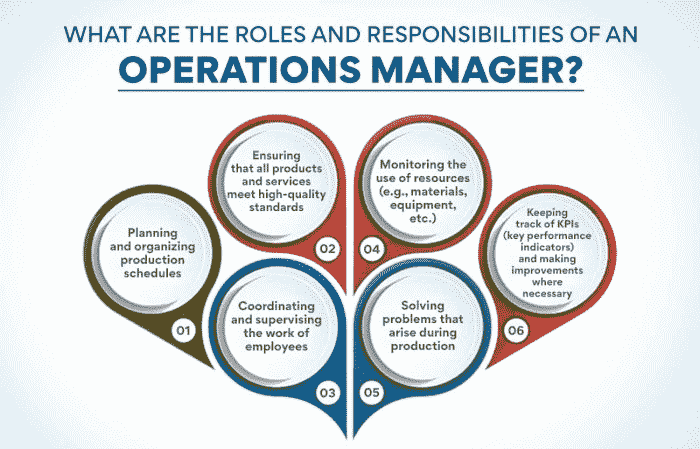
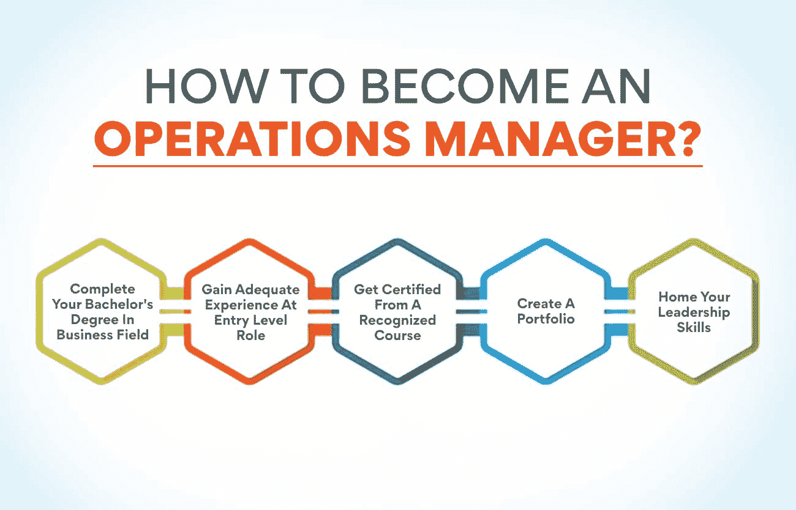

# 谁是运营经理？职业指南

> 原文：<https://www.edureka.co/blog/operations-managers/>

运营经理是确保企业顺利运营的人。从制造到客户服务，这些经理负责各种不同的任务。如果你正在考虑从事运营管理，那么这个指南就是为你准备的。我们将探讨运营经理做什么，他们需要的技能，以及你在这个领域开始职业生涯需要采取的步骤。

## 谁是运营经理？

运营经理是许多企业的支柱。他们负责确保公司内的所有业务顺利、高效地运行。要想在这个职位上取得成功，运营经理必须具备很强的领导能力，注重细节，并对企业的运营方式有深刻的理解。

虽然运营经理的具体职责因其工作的企业规模和类型而异，但所有运营经理都有一些共同的职责。这些包括监督生产过程、制定和实施政策和程序、管理员工以及监控绩效指标。

## 为什么运营经理在当今的工作文化中很重要？印度对运营经理有需求吗？

运营经理在当今的工作文化中非常重要，原因有几个。首先，它们在确保企业平稳高效运营方面发挥着至关重要的作用。第二，他们有责任确保所有员工都有效且高效地朝着组织的目标努力。第三，他们与组织内的其他部门联络，以确保每个人都和谐地一起工作。最后，他们还在制定和实施战略以提高企业整体绩效方面发挥着关键作用。

印度当然需要运营经理。该国是大量企业的所在地，其中许多企业都在不断努力提高运营效率。因此，需要高技能、经验丰富的运营经理来帮助他们实现这一目标。此外，随着全球市场竞争的日益加剧，印度企业面临着不断提高绩效以保持领先的压力。这导致对能够在这一领域提供专家指导和支持的运营经理的需求增加。

**也可阅读:[什么是运营管理中的能力规划？](https://www.edureka.co/blog/what-is-capacity-planning-in-operations-management/)**

你打算涉足运营管理领域吗？

运营管理是一个不断发展的领域。因此，保持最新和相关是很重要的。我们有一门课程可以满足您所有的[运营管理](https://www.edureka.co/blog/beginners-guide-to-operations-management/)需求。与我们一起学习运营管理，促进您的职业发展。查看我们的运营、供应链和项目管理高级证书，它为成功的运营管理职业生涯铺平了道路。

本课程涵盖了与运营管理相关的所有主题，并帮助您理解该领域中使用的各种概念、工具和技术。它还为您提供了一个在真实的商业环境中应用这些概念的机会。那么，你还在等什么？现在检查路线！

## 运营经理的角色和职责是什么？

运营经理负责监督一个组织内商品和服务的生产。他们确保所有的运作都是高效和有效的，符合公司的目标和目的。

运营经理在任何组织中都扮演着至关重要的角色——他们负责确保所有的运营都高效且有效地进行，符合公司的目标和[目的](https://www.edureka.co/blog/what-are-the-objectives-of-operations-management/)。如果没有有效的运营管理，组织将很快变得混乱不堪，难以正常运转。

运营经理的角色和职责因组织而异，但所有运营经理都必须履行一些共同的职责:

*   **计划和组织生产计划:** 它包括估计、预测和计划生产活动，以确保它们按时完成。
*   **确保所有产品和服务符合高质量标准:** 组织生产的一切都必须符合要求的质量标准。
*   协调和监督员工的工作: 通常有一个团队在运营经理的领导下工作，所以他或她有效地协调他们的工作并确保他们达到目标是很重要的。
*   **监控资源的使用(如材料、设备等。):** 每个企业的资源都是有限的，因此有效利用而不是浪费资源是非常重要的。
*   **解决生产过程中出现的问题:** 解决问题是运营经理的一项关键技能，因为他们经常会面临需要快速有效解决的生产问题。
*   **跟踪 KPI(关键绩效指标)并在必要时进行改进:** 没有 KPI，就很难衡量[运营职能](https://www.edureka.co/blog/roles-and-functions-of-operations-management/)的绩效并确定需要改进的领域。

## 在印度，运营经理的工资和其他福利如何？

印度运营经理的年薪通常为 160 万卢比。其他福利包括医疗和人寿保险、带薪休假和退休福利。

运营经理计划、指导和协调与商品和服务的生产和分销相关的活动。他们监督生产工人、工程师和其他参与创造和交付产品或服务的员工的工作。在小型组织中，运营经理可能有许多职责；在更大的组织中，他们可能专攻特定领域，如生产计划或质量控制。

运营经理通常至少需要工商管理或相关领域的学士学位。许多运营经理的工作需要 5 年或更多的管理或其他业务领域的经验。

## **如何成为运营经理？**

运营经理负责企业和组织的日常管理。他们计划、协调和指导组织的运作。运营经理在各种行业工作，包括制造业、医疗保健业、零售业和物流业。

运营经理的工作是确保组织平稳高效地运转。运营经理通常拥有工商管理或相关领域的学士学位。一些运营经理可能还拥有工商管理硕士学位(MBA)。

运营经理必须能够快速分析数据并做出决策。他们必须能够战略性地思考，有效地解决问题。他们还必须能够领导和激励员工团队。

如果你有兴趣成为运营经理，你可以做几件事来增加你在这个职位上成功的机会。首先，获得工商管理或相关领域的学士学位。第二，获得在组织中担任运营角色的经验。最后，发展你在数据分析、解决问题和团队领导方面的技能。

1.  **完成商业领域的学士学位**

运营经理负责企业和组织的日常管理。他们计划、指导和协调组织内部的运作。许多运营经理拥有商业或相关领域的学士学位。

运营经理通常拥有商业或相关领域的学士学位。然而，一些运营经理可能有另一个领域的学位，如工程或计算机科学。运营经理在被提升到管理层之前，通常有几年的运营经验。

运营经理负责企业和组织的日常管理。他们计划、指导和协调组织内部的运作。许多运营经理拥有商业或相关领域的学士学位。

运营经理通常在办公室工作，尽管他们也可能出差会见客户或供应商。他们通常全职工作，偶尔也会加班以满足最后期限或解决问题。

2.  **在初级职位上获得足够的经验**

运营经理负责公司或组织的日常运营。它们确保业务高效和有效，并确保资源得到有效利用。

运营经理通常拥有特定运营领域的经验，如生产、营销、财务或人力资源。然而，他们也可能有其他领域的经验。运营经理必须能够识别组织内部的问题和机会，并制定和实施解决方案。

要想在运营经理这个职位上取得成功，在一个组织的初级职位上获得足够的经验是非常重要的。这将让你发展必要的技能和知识，在这个职业中获得成功。有许多不同类型的入门级角色可以提供这种体验，如项目协调员、客户服务代表或营销助理。找到一个与你的兴趣和目标一致的角色是很重要的，这样你就可以获得尽可能多的相关经验。

3.  **获得认可课程的认证**

运营经理负责企业和组织的日常管理。他们计划、指导和协调企业和组织的运作。

运营经理通常拥有工商管理或相关领域的学士学位。许多运营经理也通过公认的课程获得认证，以提高他们的技能和知识。

获得公认课程的认证可以帮助你更多地了解运营管理领域，以及如何有效地管理企业和组织。这也能让你比其他没有任何证书的求职者更有优势。

要获得运营经理认证，你可以参加许多不同的公认课程。一些受欢迎的课程包括项目管理认证助理(CAPM)认证、六适马绿带认证和精益六适马认证。

你可以通过在网上做一些调查或者与你关系网中的运营经理交谈来了解更多关于这些课程的信息。一旦你决定了一门课程，你就可以注册，开始学习如何成为一名高效的运营经理。

**也读:[运营管理的范围是什么？](https://www.edureka.co/blog/what-is-the-scope-of-operations-management/)**

4.  **创建投资组合**

运营经理负责确保业务运营高效且有效。他们计划、协调和监督组织运作的所有方面。

运营经理在各种行业工作，包括制造业、医疗保健业、零售业等等。他们可能负责管理运营的所有方面，或者他们可能专注于一个领域，如人力资源或财务。

如果你有兴趣成为一名运营经理，你需要有很强的解决问题的能力，并且能够批判性地思考复杂的情况。你还应该能够有效地与组织的其他成员以及顾客和客户沟通。

运营经理通常至少需要工商管理或相关领域的学士学位。一些运营管理职位可能需要硕士学位或证书。

5.  **掌握你的领导技能**

作为运营经理，你将负责领导和管理公司的员工团队。要想在这个职位上取得成功，你需要有很强的领导能力。

优秀领导者的一些品质包括:

*   能够激励他人
*   具有优秀的沟通技巧
*   能够快速自信地做出决定
*   有条理，注重细节
*   能够很好地应对压力和压力

如果你觉得自己具备这些品质，那么运营经理的职业生涯可能非常适合你。

## **结论**

在印度，商业格局正在快速演变。这导致对能够有效管理企业和组织的运营经理的需求增加。

许多运营经理已经开创了成功的职业生涯。如果你想成为他们中的一员，那么你需要具备必要的技能和知识。你可以做几件事来增加成功的机会。首先，你应该通过在相关岗位工作来获得一些这方面的经验。你也应该考虑从一个公认的课程获得认证，这样你就可以获得优势。必须有一个投资组合，未来的雇主可以浏览，最后，妨碍你的领导技能，因为这是工作不可或缺的一部分。

从基础开始，然后转移到更复杂的运营管理方面是非常必要的。我们有一门课程将向你介绍运营管理领域以及如何有效地管理企业和组织。该课程名为[运营、供应链和项目管理](https://www.edureka.co/highered/advanced-program-in-operations-supply-chain-project-management-iitg)高级证书。这是你成为成功运营经理的必经之路。

本课程将涵盖以下主题:

*   运营管理简介
*   商业统计&分析
*   供应链管理
*   项目管理及更多内容

你对事业腾飞感兴趣吗？那么今天就来看看课程吧！

## **更多信息:**

[产品管理:初学者指南](https://www.edureka.co/blog/product-management/)

[如何成为一名更优秀的项目经理？十大秘诀](https://www.edureka.co/blog/become-a-better-project-manager)

[创建成功上市战略的步骤](https://www.edureka.co/blog/go-to-market-strategy/)

[运营管理入门指南](https://www.edureka.co/blog/operations-management/)