# Apache Pig 中的运算符:第 1 部分——关系运算符

> 原文：<https://www.edureka.co/blog/operators-in-apache-pig/>

这个帖子是关于 Apache Pig 中的操作者的。 Apache Pig 还使您能够在没有 Java 知识的情况下编写复杂的数据转换，这对于 ***[大数据 Hadoop 认证项目](https://www.edureka.co/big-data-and-hadoop#projects)*** 非常重要。在讨论操作员之前，让我们快速了解一下什么是 Pig 和 Pig Latin，以及它们的不同操作模式。

## **什么是阿帕奇猪？**

Apache Pig 是一种高级过程语言，用于使用 Hadoop 和 Map Reduce 平台查询大型数据集。它是一个 Java 包，其中的脚本可以从运行在 JVM 上的任何语言实现中执行。这在迭代过程中被大量使用。

Apache Pig 通过允许对分布式数据集进行类似 SQL 的查询，简化了 Hadoop 的使用，并使创建复杂任务以快速有效地处理大量数据成为可能。Pig 的最佳特性是，它支持许多关系特性，如连接、分组和聚合。

我知道 Pig 听起来更像是一个 ETL 工具，而且它确实有很多 ETL 工具共有的特性。但是 Pig 相对于 ETL 工具的优势在于它可以同时运行在许多服务器上。

## **什么是阿帕奇猪拉丁文？**

Apache Pig 在 Map Reduce 上创建了一个更简单的过程化语言抽象，为 Hadoop 应用程序提供了一个更类似于结构化查询语言(SQL)的接口，称为 Apache Pig Latin，因此您可以用 Apache Pig Latin 编写一个脚本，而不是编写一个单独的 Map Reduce 应用程序，该脚本可以自动并行化并跨集群分发。简单地说，Pig Latin 是一系列简单的语句，接受输入并产生输出。输入和输出数据由包、图、元组和标量组成。从海德拉巴 的 [数据工程课程中了解更多大数据及其应用。](https://www.edureka.co/microsoft-azure-data-engineering-certification-course-hyderabad-city)

## **阿帕奇猪执行模式:**

Apache Pig 有两种执行模式:

*   #### **Local mode**

在“本地模式”下，源数据将从计算机系统的本地目录中选取。可以使用“pig–x local”命令指定 MapReduce 模式。

[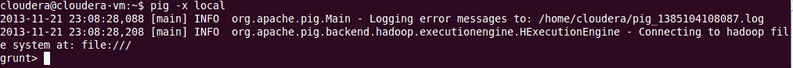](https://www.edureka.co/blog/wp-content/uploads/2014/01/operator1.png)

*   #### **MapReduce 模式:**

要在 MapReduce 模式下运行 Pig，您需要访问 Hadoop 集群和 HDFS 安装。可以使用“pig”命令指定 MapReduce 模式。

[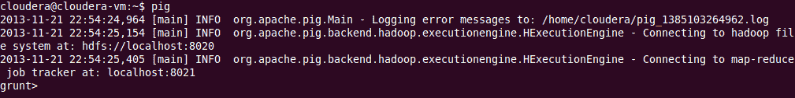](https://www.edureka.co/blog/wp-content/uploads/2014/01/operator2.png)

## **阿帕奇猪操作员:**

Apache Pig Operators 是一种高级过程语言，用于使用 Hadoop 和 Map Reduce 平台查询大型数据集。Pig Latin 语句是将一个关系作为输入并产生另一个关系作为输出的运算符。这些操作符是 Pig Latin 提供的对数据进行操作的主要工具。它们允许您通过排序、分组、连接、投影和过滤来转换它。通过 [蔚蓝数据工程认证](https://www.edureka.co/microsoft-azure-data-engineering-certification-course) 可以更好的理解。

让我们创建两个文件来运行命令:

我们有两个名为“第一”和“第二”的文件第一个文件包含三个字段:用户、url 和 id。

[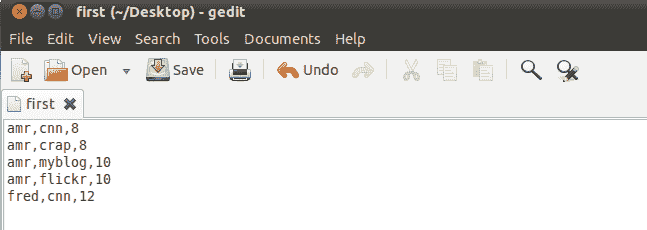](https://www.edureka.co/blog/wp-content/uploads/2014/01/operator3.png)

第二个文件包含两个字段:url 和 rating。这两个文件是 CSV 文件。

Apache Pig 操作符可以分为:*关系型和诊断型。*

### **关系运算符:**

关系运算符是 Pig Latin 提供的对数据进行操作的主要工具。它允许您通过排序、分组、连接、投影和过滤来转换数据。本节介绍基本的关系运算符。

#### **负载:**

加载操作符用于将数据从文件系统或 HDFS 存储加载到 Pig 关系中。

*在本例中，*加载操作符从文件‘first’加载数据，形成关系‘loading 1’。字段名是用户、url、id。

[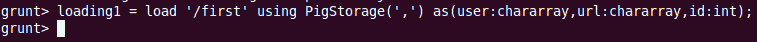](https://www.edureka.co/blog/wp-content/uploads/2014/01/operator5.png)

#### **FOREACH:**

该运算符基于数据列生成数据转换。它用于在关系中添加或删除字段。使用 FOREACH-GENERATE 操作处理数据列。

#### **每个结果:**

#### **过滤器:**

该运算符根据条件从关系中选择元组。

*在本例中，*当条件“id”大于 8 时，我们从“loading1”中过滤记录。

#### **过滤结果:**

#### **加入:**

联接运算符用于根据公共字段值对两个或多个关系执行内部等联接联接。联接运算符总是执行内部联接。内部联接忽略空键，因此在联接之前将其过滤掉是有意义的。

*在本例中，*根据“加载 1”和“加载 2”中的“url”列连接两个关系。

[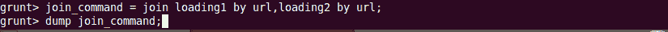](https://www.edureka.co/blog/wp-content/uploads/2014/01/operator11.png)

#### **加入结果:**

[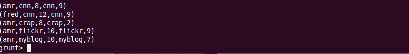](https://www.edureka.co/blog/wp-content/uploads/2014/01/operator12.png)

#### **排序依据:**

Order By 用于根据一个或多个字段对关系进行排序。您可以使用 ASC 和 DESC 关键字进行升序或降序排序。

在下面的示例中，我们在评级字段中按升序对 loading2 中的数据进行排序。

#### **按结果排序**:

#### **截然不同:**

Distinct 删除关系中的重复元组。让我们取一个如下的输入文件，它在文件中有两次 **amr，crap，8** 和 **amr，myblog，10** 。当我们对该文件中的数据应用 distinct 时，重复的条目将被删除。

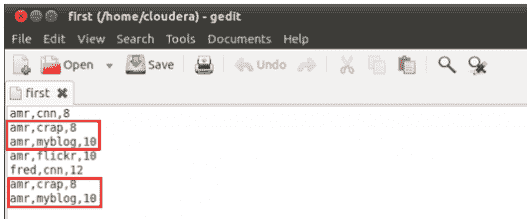

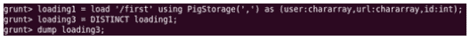

#### **不同的结果:**

#### **店铺:**

Store 用于将结果保存到文件系统中。

在这里，我们将**加载 3** 的数据保存到一个名为**的文件中，并将**存储在 HDFS 上。

#### **存储结果:**

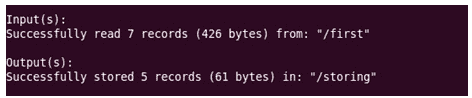

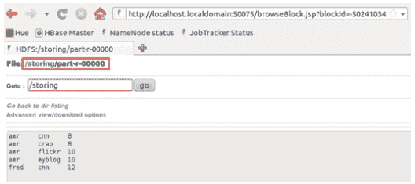

#### **组:**

GROUP 运算符将具有相同组键(键字段)的元组组合在一起。如果组键有多个字段，则键字段将是一个元组，否则它将与组键的类型相同。组操作的结果是每个组包含一个元组的关系。

*在本例中，*组 th

e 按列 url 的关系“加载 1”。

#### **分组结果:**

#### **共组:**

COGROUP 与 GROUP 运算符相同。为了可读性，程序员通常在只涉及一个关系时使用 GROUP，在涉及多个关系时使用 COGROUP。

在此示例中，按两个关系中的 url 字段对“加载 1”和“加载 2”进行分组。

#### **共组结果:**

#### **十字:**

交叉运算符用于计算两个或多个关系的叉积(笛卡尔积)。

在 loading1 和 loading2 上应用叉积。

#### **交叉结果:**

#### **极限:**

LIMIT 运算符用于限制输出元组的数量。如果指定的输出元组数量等于或超过关系中的元组数量，则输出将包括关系中的所有元组。

#### **极限结果:**

[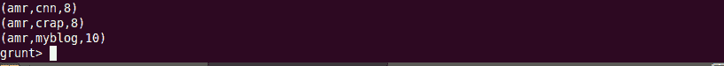](https://www.edureka.co/blog/wp-content/uploads/2014/01/operator20.png)

#### **拆分:**

SPLIT 运算符用于根据某个表达式将一个关系的内容划分为两个或多个关系。这取决于表达式中所述的条件。

将加载 2 拆分为两个关系 x 和 y。加载 2 创建的 x 关系包含等级大于 8 的字段，y 关系包含等级小于或等于 8 的字段。

有问题要问我们吗？请在评论区提及它们，我们将会回复您。

**相关帖子:**

[阿帕奇猪中的操作员——诊断操作员](https://www.edureka.co/blog/operators-in-apache-pig-diagnostic-operators/ "Operators in Apache Pig: Part 2- Diagnostic Operators")

[阿帕奇猪](https://www.edureka.co/blog/creating-udf-in-apache-pig/ "Steps to Create UDF in Apache Pig")创造 UDF 的步骤

[猪简介](https://www.edureka.co/blog/introduction-to-pig/ "Introduction to Pig")