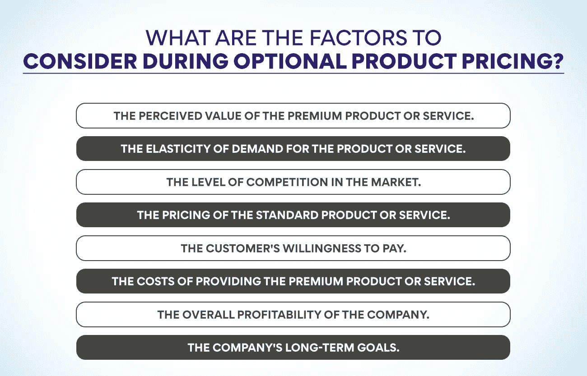
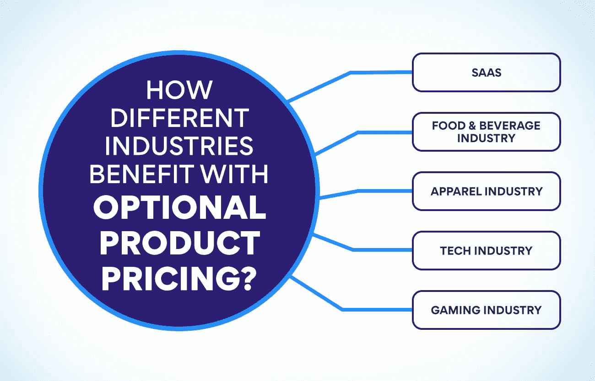

# 可选产品定价:它是什么，如何使用它？

> 原文：<https://www.edureka.co/blog/optional-product-pricing/>

可选产品定价是一种定价策略，客户可以支付更高的价格购买具有额外功能或优势的[产品](https://www.edureka.co/blog/product)，或者支付更低的价格购买基本版本。这种定价可以用来增加优质产品的销售，或者鼓励客户升级到价格更高的产品。

可选产品定价可以通过多种方式实施。例如，一家公司可以提供一种产品的两个版本，价格更高的版本包括额外的功能或好处。或者，公司可以为购买产品基本版本的客户提供升级折扣。

## **可选产品定价的好处**

1.  可选定价允许客户以折扣价购买额外商品，有助于提高产品销量。
2.  可选定价还可以让你向愿意支付更高价格的客户出售更贵的商品，从而帮助你提高利润。
3.  可选定价可以鼓励顾客从你这里购买多种商品，这有助于提高你的整体销售额。
4.  可选定价可以通过提供折扣来帮助您清理旧的或不太受欢迎的产品的库存。
5.  可选定价也是一种营销工具，用来吸引新顾客或鼓励现有顾客再次光顾。
6.  可选定价可以让你在产品定价上更加灵活，如果你想与行业内的其他企业竞争，这很有帮助。
7.  可选定价可以让你对不同的产品尝试不同的价格，在决定永久改变价格之前，看看哪些是最成功的。
8.  可选定价让客户觉得他们在购买额外商品时得到了一笔交易，这可以为您的企业创造商誉和忠诚度。

## **可选产品定价在业务中的意义是什么？**

随着企业越来越多地采用基于价值的定价策略，可选产品的定价变得更加重要。可选[产品定价](https://www.edureka.co/blog/product-line-pricing/)是一种为产品或服务定价的方式，这样客户可以在特定范围内选择他们想要支付的价格。这种定价可用于鼓励客户购买额外的产品或服务，或向他们追加销售更高价格的产品。

使用可选产品定价有几个好处:

1.  通过让客户选择他们愿意支付的价格，它允许企业从他们的客户那里获取更多的价值。
2.  通过让客户更好地控制自己的购买决策，它可以提高客户满意度。
3.  通过吸引客户购买可选的附加产品或升级产品，它可以帮助企业提高销售额和收入。

虽然可选产品定价对企业有益，但也存在一些风险。首先，如果处理不当，它会在客户中造成混乱并降低满意度。其次，公司必须注意不要把价格定得太低或太高，因为这可能会阻碍购买或导致收入损失。总体而言，可选产品定价是帮助企业增加销售和从客户那里获取更多价值的有力工具。尽管如此，它必须小心使用，以避免负面后果。

**也可阅读:[产品生命周期的阶段和例子有哪些？](https://www.edureka.co/blog/product-lifecycle/)**

## **优点&可选产品定价的缺点**

可选定价是一种定价方式，客户可以为包含额外功能或好处的产品或服务支付更高的价格。可选定价可以以多种方式使用，但最常见的是在餐馆、酒店和在线零售商等企业中作为一种促销策略。

就像任何其他定价系统一样，使用期权定价既有好处也有坏处。一些优势包括以下:

*   **收入增加:** 通过向客户提供支付更多附加值的选项，企业可以看到收入的显著增加。
*   **更高的客户满意度:** 那些觉得升级后的产品或服务物有所值的客户通常会对自己的购买更加满意。
*   **提高感知价值:** 如果做得正确，可选定价可以帮助提高产品或服务在顾客眼中的感知价值。这可以带来重复的业务和积极的口碑营销。

另一方面，也有一些可能的缺点需要考虑，例如:

*   **较低的转化率:** 提供太多的选择会导致较低的转化率，因为顾客会不知所措，不知道该选择哪一个。
*   **利润率下降:** 附加值产品和服务的价格上涨意味着利润率下降，除非销量大幅增加。如果竞争对手开始以更低的价格提供类似的可选升级，这一点尤其正确。
*   **不愿支付额外费用的顾客的不满:** 虽然大多数顾客明白他们可能需要多付一点钱，但很多人不喜欢这种文化。

## **可选产品定价与专属产品定价**

产品经理面临的最具挑战性的决策之一是如何给可选产品定价。有两种常见的方法:专属产品定价和可选产品定价。

[专属产品定价](https://www.edureka.co/blog/captive-product-pricing/)是可选产品的价格包含在基础产品价格中。例如，如果你买了一辆车，经销商可能会为你提供额外费用的延长保修。这种方法的优势在于它简化了客户的购买决策。他们不必权衡可选产品的收益和成本，因为它已经包含在基础产品的价格中了。

可选产品定价是指客户支付额外费用，将可选产品添加到他们的购买中。例如，许多在线零售商提供额外收费的运输保险。这种方法受欢迎的特别优势是客户可以根据自己的需求和预算定制他们的购买。

这两种方法各有利弊，所以最终，这取决于产品经理 T2 来决定哪一种对他们的业务更有意义。

## 可选产品定价时需要考虑哪些因素？

可选产品定价被认为是一种流行的定价策略，通过这种策略，客户可以为优质产品或服务支付额外的价格。这种类型的定价可以在不同的情况下使用，例如在销售附加产品或升级产品时，或者在提供产品的豪华版本时。

产品经理在实施可选产品定价时，需要考虑各种因素:

1.  **优质产品或服务的感知价值。**

顾客需要意识到优质产品或服务值得付出额外的价格。如果他们没有，那么他们不太可能支付额外的金额。确保您传达了升级产品或服务的优势，以及它与标准产品或服务的不同之处。

2.  **产品或服务的需求弹性。**

弹性是指对产品或服务的需求随着价格的变化而变化的程度。如果需求是高度弹性的(即人们容易受到价格变化的影响)，那么期权定价就不太可能起作用，因为客户会简单地选择更便宜的选项。相反，如果需求是无弹性的(即，人们对价格变化不是很敏感)，那么可选定价可能是成功的，因为客户可能愿意为溢价产品支付更多。

3.  市场的竞争程度。

如果许多竞争对手都在提供类似的产品或服务，那么客户会对价格更加敏感，可选定价可能就不那么管用了；然而，如果你有一个特殊的产品或服务或几个竞争对手。客户可能对价格不太敏感，更有可能为溢价产品支付额外费用。

4.  **标准产品或服务的定价。**

如果标准产品或服务已经很贵了，那么客户就不太可能为高级版本支付更多。相反，如果标准产品或服务相对便宜，客户可能愿意为升级版多付一点钱。

5.  **顾客的支付意愿。**

一些客户可能愿意为优质产品或服务支付任何价格，而另一些客户只需支付少量费用。在实施可选产品定价之前，了解你的目标市场和他们愿意支付的价格是至关重要的。

6.  提供优质产品或服务的成本。

如果提供优质产品或服务的成本很高，你可能需要收取更高的价格才能获利。相反，如果成本很低，那么你可以收取较低的价格，仍然可以获利。

7.  **公司的整体盈利能力。**

如果公司不盈利，那么可选产品定价就不太可能成功。然而，如果公司财务状况良好，那么期权定价可以作为增加利润的一种方式。

8.  **公司的长期目标。**

可选产品定价可用作提高利润的短期策略，也可用作将公司与竞争对手区分开来的长期策略。在决定可选产品定价是否适合你的企业时，考虑公司的目标。

## 不同行业如何从 OPP 获益？

**SaaS**

SaaS 的产品有很多定价选择。这是因为 SaaS 行业仍相对较新，各公司有许多不同的产品定价方式。SaaS 产品的一些最常见的定价模型包括基于订阅的定价、基于使用的定价和基于功能的定价。

基于订阅的定价可能是 SaaS 产品最常见的定价方式。这种定价包括对产品的访问收取月费或年费。这种定价类型是有益的，因为它是可预测的和易于理解的。缺点是，根据客户的需求向上或向下提升会很有挑战性。

基于使用量的定价是 SaaS 产品的另一个受欢迎的选择。

在这种定价下，客户根据他们使用产品的多少来付费。对于只需要偶尔使用产品或希望根据实际使用情况付费的客户来说，这是一个很好的选择。基于使用计费的缺点是，如果没有一个完善的系统，很难跟踪使用情况并准确地向客户计费。

**食品&饮料行业**

食品和饮料公司可以通过几种不同的方式来为他们的产品定价。最常见的方法是简单地对每个项目收取固定的价格。但是，有些公司会为批量购买或购买多件商品的客户提供折扣。此外，许多食品和饮料公司提供忠诚度计划，奖励持续光顾的顾客。

食品和饮料行业另一种流行的定价策略叫做“动态定价”它包括根据实时需求不断改变价格。例如，一家公司可能会在午餐高峰时间或周末提高价格，因为那时可能会有更多的人外出。相比之下，在较慢的时段，如深夜或清晨，价格会降低。

最后，一些食品和饮料公司提供基于订阅的模式，客户支付月费或年费来换取独家内容或交易。例如，一家咖啡店可能提供包括无限量冲泡咖啡和特色饮料折扣的订阅。或者，一个送餐服务可以为所有超过 50 美元的订单提供免费送货服务。

**服装行业**

服装行业竞争非常激烈；因此，许多公司都在努力脱颖而出。一种方法是为他们的产品提供可选价格。这意味着消费者可以为包含他们更看重的功能或好处的产品支付更高的价格。例如，顾客可能愿意为一件由有机棉或道德采购制成的衬衫支付额外的费用。

这种定价方式对客户和公司都有好处。顾客可以选择他们认为值得多付的东西，公司可以使用可选定价在市场上区分他们的产品并获得更多利润。然而，只有当客户认为所提供的附加功能或好处有价值时，可选定价才起作用。否则，他们每次都会选择更便宜的选项。

**科技行业**

没有放之四海而皆准的答案，因为科技行业可选产品的定价会因不同因素而异，包括产品类型、功能和优势、公司的目标市场以及竞争格局。然而，在为可选产品定价时，公司应该记住一些通用的提示:

*   不要低估你的产品。如果你这样做，客户可能会认为它质量差或不值得投资。
*   做好调查，确保你的价格与市场上类似产品的售价一致。
*   灵活选择价格——考虑为购买多种产品的客户提供折扣，或根据客户希望使用的功能数量提供分级价格选项。
*   确保你的价格反映了顾客从使用你的产品中获得的价值。如果你的产品比竞争对手的产品更有优势，你应该相应地收费。

**又读:[制定优秀产品战略指南](https://www.edureka.co/blog/product-strategy/)**

**博彩业**

游戏行业的公司可以选择几种不同的方式来为他们的产品定价。一些公司选择简单的定价结构，所有产品都以固定价格定价。其他公司可能使用更复杂的定价策略，根据各种因素对不同的产品进行不同的定价。

可选产品的一种常见定价方式是基于产品的感知价值。例如，如果一家公司认为其新游戏将非常受欢迎，并在游戏玩家中产生很多兴奋，它可能会将该游戏的价格定得高于市场上的其他游戏。另一方面，如果一家公司认为自己的新游戏可能不如竞争对手的游戏受欢迎，它可能会降低游戏价格以吸引消费者购买。

可选产品的另一种定价方式是基于生产成本。开发和制造不同类型的游戏，公司通常会有不同的成本。例如，需要更多开发时间或昂贵硬件组件来运行的游戏可能比简单的游戏定价更高。公司在决定如何给产品定价时，也可能会考虑运输和处理成本。

## **结论**

可选产品定价是提高平均订单价值和增加利润的好方法。通过向客户提供为产品的升级或高级版本支付更多费用的选项，您可以在为他们提供价值的同时赚更多的钱。当使用可选产品定价时，必须确保价格差异是合理的，并且升级是值得的。否则，你可能会失去客户，损害你的声誉。不过，如果使用得当，可选产品定价可以成为发展业务的有力工具。

[我们的产品管理高级执行官证书课程](https://www.edureka.co/highered/advanced-executive-program-in-product-management-iitg)将教你关于可选产品定价的一切。您将学习如何在为客户提供价值的同时设定利润最大化的价格。有了这些知识，你就能成为一名产品经理，创造出人们喜爱的产品。

**更多信息:**

[创建成功上市战略的步骤](https://www.edureka.co/blog/go-to-market-strategy/)

[什么是产品规划，是怎么做的？](https://www.edureka.co/blog/product-planning/)

[新时代产品开发过程的 7 个动态阶段](https://www.edureka.co/blog/product-development/)

[品牌管理 v/s 产品管理:了解关键差异](https://www.edureka.co/blog/brand-and-product-management/)