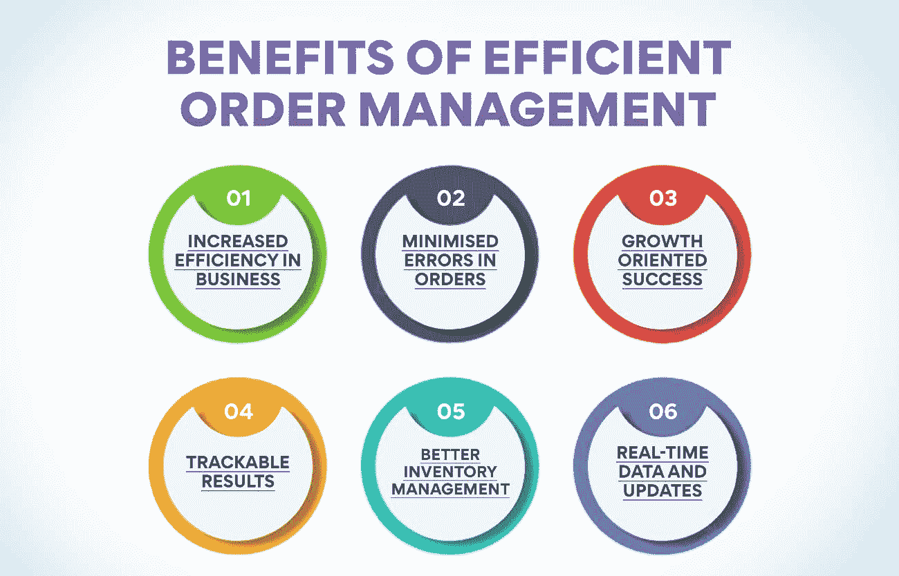
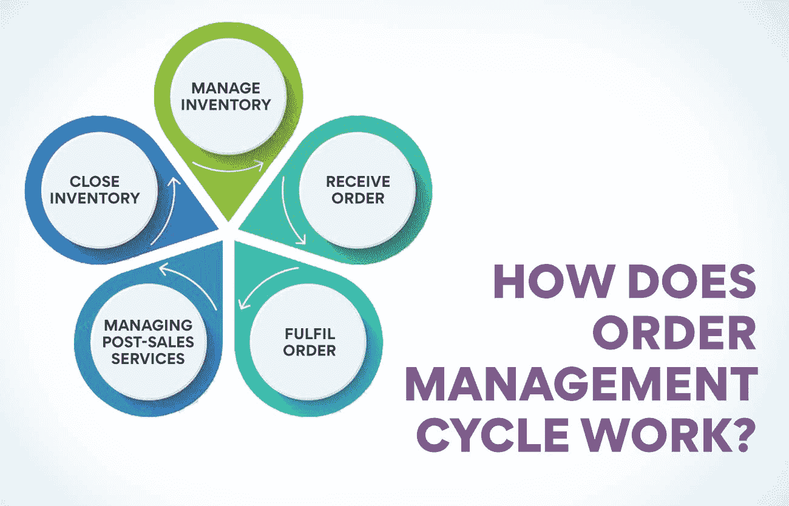

# 什么是订单管理？综合指南

> 原文：<https://www.edureka.co/blog/order-management/>

订单管理系统是在线业务成功的关键。它们简化了流程，便于跟踪库存、客户和订单。订单管理对于任何处理订单的企业都是至关重要的，无论是在线订单还是实体订单。它涉及从头到尾管理整个流程，包括接受客户订单、处理支付和履行。

对于企业而言，高效的订单管理有助于提高客户满意度和保留率，并促进销售和利润。这份完整的指南将探讨什么是订单管理，它是如何工作的，以及它如何能为您的业务带来好处。

**什么是订单管理？详细概述**

订单管理是管理订单生命周期的过程，从客户下单到订单履行。 订单管理的目的是确保订单准确高效地履行，让客户满意，防止销售流失。

订单管理包括几个不同的活动，例如:

*   接受并处理客户订单
*   跟踪库存水平并根据需要重新订购库存
*   与供应商协调，确保货物及时交付
*   包装和装运订单
*   跟踪订单，直到订单成功交付
*   处理与订单相关的客户服务问题

## **订单管理的历史**

订单管理的历史可以追溯到商业早期，当时订单由企业手工管理。这一过程既耗时又容易出错，并且经常导致订单丢失或延迟。

随着 20 世纪末计算机和企业资源规划(ERP)系统的出现，企业开始自动化他们的订单管理流程。这使得订单处理更加准确和高效，并能实时跟踪订单和库存水平。

如今，订单管理是任何电子商务运营的重要组成部分，许多公司都依赖专业软件来管理他们的订单和库存。有了合适的系统，企业可以简化运营、改善客户服务并增加销售额。

## **订单管理在电子商务领域有什么意义？**

在电子商务环境中，订单管理是从下订单到完成订单的跟踪和管理过程。这包括管理库存、处理付款和装运订单。

订单管理是经营电子商务的重要组成部分。它可以确保客户准时收到订单，并对收到的产品感到满意。适当的订单管理还有助于防止欺诈，并最大限度地减少因商品损坏或丢失造成的损失。

有许多不同的软件解决方案可以帮助自动化和简化订单管理流程。为您的企业选择合适的解决方案将取决于您的具体需求和要求。

## **高效订单管理的优势**

高效的订单管理系统可以为您的企业节省时间和金钱。通过自动化订购流程，您可以消除手动数据输入的需要，这有助于减少错误并提高准确性。此外，自动化系统有助于简化各部门之间的沟通，从而进一步减少错误并提高效率。查看订单管理的一些最佳福利:

**提高业务效率**

在商业中，订单管理是管理客户订单的过程。这包括接受订单、处理付款和运送产品。它还包括跟踪库存水平，并确保客户需要时产品可用。

订单管理是成功经营企业的重要组成部分。它可以帮助您跟踪库存，快速有效地处理付款，并及时将产品发送给客户。高效的订单管理系统可以节省您的时间和金钱，并帮助您让客户满意。

**最大限度地减少订单中的错误**

订单管理系统通过自动化和简化订单流程，帮助最大限度地减少订单错误。通过电子化管理订单，企业可以降低人为错误的风险和相关成本。

订单管理系统可以自动完成订单输入、定价和开具发票等任务。这意味着企业可以利用规模经济，同时仍然确保准确性和效率。此外，订单管理系统可以提供库存水平的实时可见性，以便企业可以避免缺货和延期交货。

总的来说，订单管理系统有助于企业减少订单中的错误，同时提高效率并降低成本。

**成长导向的成功**

任何企业的成功都取决于其发展能力。要做到这一点，企业需要有促进增长的系统和流程。有效的订单管理系统是这个等式的关键部分。

订单管理系统有助于企业跟踪订单和库存，以及管理客户数据。这些信息对于企业做出如何发展业务的决策至关重要。此外，订单管理系统可以自动执行许多与管理订单和库存相关的任务，从而为企业腾出时间，专注于其他增长领域。

如果你想让你的业务更上一层楼，订单管理系统是一个有价值的工具，可以帮助你实现目标。

**可跟踪结果**

为了有效地排序，能够跟踪和衡量你努力的结果是很重要的。有几个关键绩效指标(KPI)可用于评估订单管理流程的有效性。一些最重要的 KPI 包括:

*   **订单准确度:** 这衡量您的订单在满足客户需求方面的准确度。
*   **订单完成率:** 衡量成功完成的订单百分比。
*   **订单交付周期:** 这衡量的是从下订单到客户收到订单的平均时间。
*   **客户满意度:** 这衡量客户对您的订单管理流程的满意度。

**更好的库存管理**

为了简化您的业务并跟踪您的库存，您需要一个良好的订单管理系统。这种类型的系统可以帮助您跟踪您的库存、需要订购的商品以及何时需要重新进货。它还可以帮助您跟踪销售和趋势，以便您可以对库存做出明智的决策。

有几种不同类型的订单管理系统可供选择，因此选择一种符合您业务需求的系统非常重要。如果你有一个小企业，你可能不需要更复杂系统的所有功能。另一方面，如果您有大量库存或在线销售产品，您将需要一个足够强大的系统来满足您的需求。

**实时数据和更新**

为了获得成功的业务，掌握订单进展的实时数据和更新非常重要。订单管理系统通过跟踪订单流程的每一步并让您了解订单的最新状态，为您提供了这种能力。这样，您可以快速、轻松地查看是否有任何延迟或需要解决的问题。此外，随时掌握这些信息可以让您对业务运营做出更明智的决策。

## **什么是订单管理系统？举例说明**

订单管理系统(OMS)是一个软件应用程序，使企业能够在一个系统中管理所有渠道的订单。这包括在线、亲自或通过电话接受订单。OMS 通常还管理库存水平，并为客户提供订单状态的最新信息。

常见的订单管理系统包括 TradeGecko、Brightpearl 和 Skubana。从小型企业到大型企业，各种规模的企业都使用这些系统

订单管理系统的一些特性包括:

**跟踪多个地点的能力:** 如果你有不止一个商店或仓库，你需要一个能跟踪每个地点库存水平的系统。

**与其他软件集成的能力:** 如果你使用其他软件程序进行会计或客户关系管理(CRM)，寻找一个可以与这些程序集成的订单管理系统。这将通过消除向多个系统输入数据的需要来节省您的时间和精力。

**自动化任务的能力:** 一个好的订单管理系统将允许你自动化任务，例如向供应商发送采购订单

## **订单管理系统的好处**

使用 OMS 有很多好处，包括:

**提高效率:** 所有订单都集中在一个系统中，企业可以更轻松地跟踪和履行订单。这可以减少错误和加快周转时间。在单一渠道中，OMS 可以管理订单，包括在线订单、亲自订单或电话订单。

**更高的可见性:**OMS 为企业的运营提供了更高的可见性。这有助于识别问题和瓶颈，以便更快地解决它们。OMS 通常还管理库存水平，并为客户提供订单状态的最新信息。它们非常适合为所有订单创建一个系统化的数据库，从而提供对信息的轻松访问。

**提高客户满意度:** 通过向客户提供准确的订单状态信息，企业可以提高客户满意度。订单管理系统也有利于管理和分析客户购买趋势。

## **订单管理周期是如何运作的？**

订单管理是从客户下订单到订单完成的跟踪和管理过程。它涉及公司内部不同部门之间的协调，以及与客户和供应商的沟通。

订单管理周期可分为四个主要阶段:

**1)订单录入:** 接收客户订单并录入系统的阶段。这可以手动或电子方式完成。

**2)订单处理:** 在这个阶段，对订单进行拣货、打包、发货。必要的文书工作也在这一阶段产生。

**3)订单跟踪:** 这个阶段涉及到跟踪订单的进度，确保按时交货。订单的任何延迟或问题也在此阶段解决。

**4)订单完成:** 一旦客户收到他们的订单，这个周期就完成了。

这些阶段的详细说明:

**管理库存**

订单管理的一个重要部分是库存管理。组织需要跟踪他们库存的产品，并确保手头有足够的库存来满足客户需求。

库存管理不仅仅是跟踪[产品](https://www.edureka.co/blog/product)的数量。它还包括预测未来的需求，设置库存水平，并确保库存妥善储存和轮换。组织需要有适当的系统和流程来有效地管理库存的所有这些方面。

有几种不同的软件解决方案可以帮助库存管理。这些解决方案可以自动执行库存管理中的许多任务，包括跟踪产品数量、下订单和生成报告。

**接收订单**

订单管理部门负责跟踪和管理客户订单，从下订单到完成订单。这包括管理库存、处理客户服务查询、处理退货等等。

订单管理系统(OMS)是一个软件应用程序，帮助企业自动化和简化这些流程。OMS 通常包括订单跟踪、库存管理和运输集成等功能。它们还可能包括会计、CRM 和 ERP 集成功能。

OMS 的特性和功能各不相同，因此选择一款能够满足您特定业务需求的产品非常重要。如果您不确定从哪里开始，我们的专家可以帮助您找到适合您企业的 OMS。

**完成订单**

假设你已经找到了要卖的产品，并建立了你的电子商务商店，下一步就是完成订单。履行订单意味着将客户订购的产品发送给他们。这似乎是一项艰巨的任务，但通过一些技巧和窍门，您可以确保您的客户快速、顺利地收到商品。

在完成订单时，需要记住以下几点:

1.  确保你手头有足够的库存来完成你所有的订单。最糟糕的事情莫过于接到订单后发现自己没有库存。密切跟踪你的库存水平，这样你就永远不会遇到这个问题。
2.  选择一种能够快速、经济地将产品送到客户手中的运输方式。如果你卖的是时间敏感的物品，考虑使用加急运输方式，如 UPS 次日空运或 FedEx 2Day。
3.  小心包装产品，确保它们完好无损地到达。如果需要，使用大量包装材料，并确保包括装箱单或发票，以便您的客户知道他们收到的是什么。
4.  下订单后，尽快寄出。顾客喜欢及时的服务，如果你能很快拿到订单，这会对你的生意有很好的影响。

遵循这些建议，你可以确保你的顾客自始至终对他们的购买感到满意。

**管理售后服务**

假设你有一个卖得很好的产品或服务，拥有一个管理售后服务的系统是很重要的。这包括从处理退货和换货到提供客户支持的一切。

订单管理系统可以帮助您在一个地方跟踪所有售后活动。如果您有大量的订单需要管理，这将特别有帮助。

在建立订单管理系统时，需要记住几个关键事项:

*   确保系统易于使用。您的员工应该能够快速轻松地找到他们需要的信息。
*   考虑尽可能多地实现流程自动化。从长远来看，这将有助于节省时间和金钱。
*   确保系统是可扩展的。随着您业务的增长，您的订单管理系统应该能够与您一起增长。
*   将您的订单管理系统与您的其他业务系统集成。这将有助于确保顺利和有效的运作全面。

**关闭库存**

在你决定了需要从供应商那里订购什么产品后，下一步就是“关闭”或最终确定你的库存。这仅仅意味着对商店中的商品进行实物清点，并确保数量与记录中的数量相符。

如果有任何差异，你需要调查错误发生在哪里，并做出必要的调整。例如，如果你有两个以上的产品比你的记录显示，有人可能已经偷走了他们，或者他们可能已经损坏，并没有适当的说明。

一旦你的库存关闭，你就可以继续履行客户订单。

## **订单管理面临的常见挑战是什么？**

在管理订单时，有几个常见的挑战会影响流程的效率和准确性。这些包括:

**订单提货错误**

仓库或配送中心可能会出现几种不同类型的拣货错误。最常见的错误是订单提货人从货架或箱柜中挑选了错误的商品。如果提货人注意力不集中，商品标签不清晰，或者提货人匆忙出错，就会发生这种情况。很难跟踪进度和识别潜在问题，导致订单履行延迟。

另一种可能发生的错误是，订单提货人将错误数量的商品放入箱子或货盘。如果提货人数错了，货架上的商品丢失了，或者提货人不小心拿错了商品，就会发生这种情况。

有时，订单管理系统中输入的信息不正确或缺失，会导致延误或错误。这可能导致缓慢的数据和手动流程，从而难以获得整个操作的概览。

最后，订单提货人可能会将错误的商品放入错误的箱子。如果盒子贴错了标签，如果物品在货架上放错了位置，或者如果提货人不清楚每个盒子里装的是什么，就会发生这种情况。

如果这些错误中的任何一个发生，都可能导致订单发货延迟，并可能导致客户不满。仓库和配送中心需要有适当的系统和程序，以最大限度地减少提货错误。

**维护库存**

这些通常容易出错且耗时，影响整个操作的效率。库存管理是订单管理的重要组成部分。没有适当的库存管理，订单会积压，客户会变得沮丧。

在维护库存时，有一些关键的事情需要记住:

1.  确保你手头有足够的库存来满足顾客的需求。这似乎是显而易见的，但是确保你手头随时有足够的产品是很重要的。
2.  跟踪你的库存水平，必要时再订购产品。不要让你的库存水平太低，否则你会有失去销售的风险。使用库存管理系统来帮助您跟踪库存水平，并在必要时重新订购产品。
3.  利用预测来预测未来的客户需求，并据此制定计划。有一个准确的预测将有助于你避免库存过多或过少的产品。
4.  灵活运用你的库存管理策略。随着客户需求的变化，您的库存管理策略也应随之变化。准备好根据需要做出改变，以保持高效和有效。

**结论**

如果没有有效的订单管理，企业永远也不会成功。无论是接受订单、履行订单还是解决客户对订单的疑问，一切都必须井然有序才能正常运转。上面提到的指南已经全面地包括了你必须知道的关于订单管理的一切。如果你想拓展你的知识面，我们为你设计了一门课程，涵盖了[运营管理、供应链和项目管理的方方面面。](https://www.edureka.co/highered/advanced-program-in-operations-supply-chain-project-management-iitg)