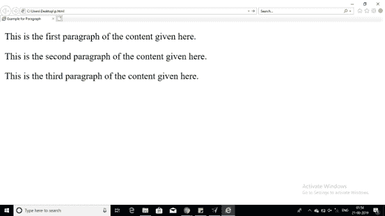
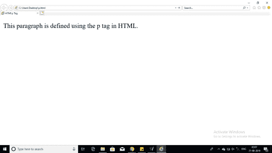

# 关于 HTML 中的 p 标签，你需要知道的就是

> 原文：<https://www.edureka.co/blog/p-tag-in-html/>

**< p >** 标签将有助于将你的内容组织到接下来的段落中。每段内容都应该在开始的< p >和结束的< p >标签之间给出，就像本文中给出的 HTML 中的 P 标签一样。

## **HTML 中 P 标签的具体属性**

在 HTML 中

标签还支持下面表格中提到的下列附加属性。

| 属性 | 值 | 描述 |
| 对齐 | 左右居中对齐 | 这指定了段落内的内容对齐。 |

基本上，HTML 中的 p 标签定义了内容的段落。让我们来看一个 HTML 中 p 标签的例子

```

<!DOCTYPE html>
<html>
		<head>
			<title> Example for Paragraph </title>
		</head>
		<body>
			<p>This is the first paragraph of the content given here.</p>
			<p>This is the second paragraph of the content given here.</p>
			<p>This is the third paragraph of the content given here.</p>
		</body>
</html>

```

**输出:**



上面提到的代码代表

标签，它用于各种区分段落。在 HTML 中，这些标签被相应地使用，并且是用户友好的，它帮助用户得到他们想要的网页。我们可以改变代码，并按照我们的要求完成它。

进一步可以添加到其他标签，使您的网页更有吸引力。HTML

标签有开始和结束标签，内容可以在这里输入，如果需要可以得到不同的段落。HTML 中的这个

标签是基本标签。

你可以通过给出你自己的例子，改变所有的标签，让它变得更有趣，来简单地浏览一下。虽然

标签在创建网页时随处可见。

```

<!DOCTYPE html>
<html>
		<head>
			<title> HTMl p Tag </title>
		</head>
		<body>
			<p>This paragraph is defined using the p tag in HTML.</p>
		</body>
</html>

```

**输出:**



至此，我们结束了 HTML 博客中的这个 p 标签。现在你知道如何在 HTML 中定义段落了。

*查看我们的  [全栈 Web 开发人员硕士课程](https://www.edureka.co/masters-program/full-stack-developer-training) ，该课程包含讲师指导的现场培训和真实项目体验。本培训使您精通使用后端和前端 web 技术的技能。它包括关于 Web 开发、jQuery、Angular、NodeJS、ExpressJS 和 MongoDB 的培训。*

有问题要问我们吗？请在这篇文章的评论部分提到它，我们会给你回复。