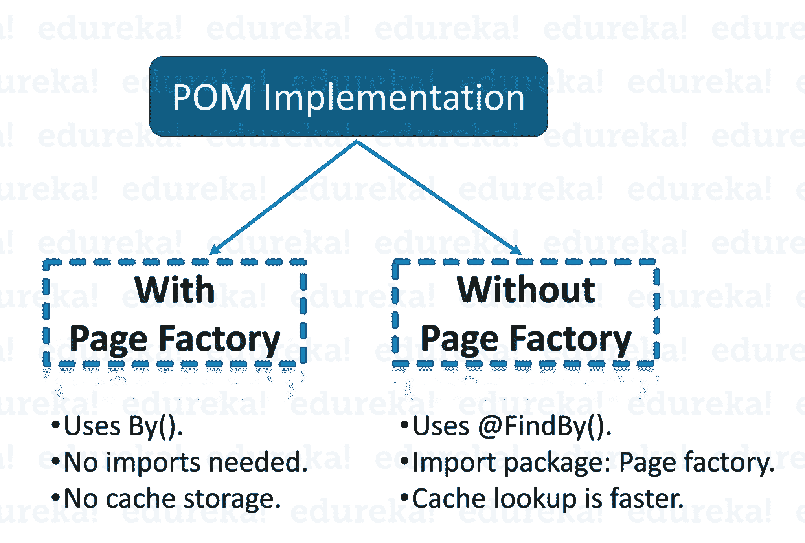

# 关于 Selenium 中的页面对象模型，您只需要知道

> 原文：<https://www.edureka.co/blog/page-object-model-in-selenium/>

在一个类文件中维护 1000 行代码是一项繁琐的任务，同时也增加了它的复杂性。为了维护 selenium 脚本的项目结构和高效性能，有必要为不同的任务使用不同的页面。为了简化将代码分发到不同模块的过程，页面对象模型就派上了用场。在这篇关于 [Selenium](https://www.edureka.co/blog/selenium-tutorial) 中页面对象模型的文章中，您将在一个示例的帮助下学习页面对象模型和页面工厂的一些核心概念。

下面是本文涉及的主题:

*   [什么是页面对象模型？](#WhatisthePageObjectModel?)
*   [为什么要建立页面对象模型？](#WhyPageObjectModel?)
*   [页面对象模型的优点](#AdvantagesofthePageObjectModel)
*   [什么是页面工厂？【T2](#WhatisPageFactory?)
*   [在 Selenium WebDriver 中用页面工厂创建页面对象模型](#CreatingaPageObjectModelwithPageFactoryinSeleniumWebDriver)

*您还可以通过 Selenium 认证专家录制的 [**Selenium 培训**](https://www.edureka.co/selenium-certification-training) 中的 Selenium 项目，您可以通过示例详细了解这些主题。*

## **Selenium web driver 中的页面对象模型|带有页面工厂的页面对象模型**


[//www.youtube.com/embed/xalRieVr3m8?rel=0&showinfo=0](//www.youtube.com/embed/xalRieVr3m8?rel=0&showinfo=0)

本视频讲述了页面对象模型的基本原理、页面工厂及其使用页面对象模型的实现。

## **什么是页面对象模型？**

页面对象模型是测试自动化中的一种设计模式，为 web UI 元素创建一个**对象库**。应用程序中的每个网页都应该有一个相应的 page 类。这个 page 类将找到 WebElements，并且还可能包含对这些 WebElements 执行操作的 Page 方法。

然后，每当测试需要与页面的 UI 交互时，就使用这个页面对象类的方法。这样做的好处是，如果页面 UI 发生变化，那么测试不需要改变，只需要改变页面对象中的代码。 之后，所有支持新 UI 的改动都位于一处。这就是定位器和测试脚本分开存储的原因。

现在我们来看看为什么需要页面对象模型。

## **为什么要建立页面对象模型？**

以下步骤描述了 [Selenium](https://www.edureka.co/blog/selenium-tutorial) 中页面对象模型的需求。

1.  **代码重复:** 增加 g [自动化测试覆盖率](https://www.edureka.co/blog/test-automation-strategy/)如果定位器管理不当，会导致项目结构不可维护。这通常是因为代码重复或者主要是因为重复使用[定位器](https://www.edureka.co/blog/locators-in-selenium/)而导致的。
2.  **更少的时间消耗:**脚本维护的主要问题是，如果十个不同的脚本使用同一个页面元素，如果这个元素有任何变化，你需要改变所有的十个脚本。这既耗时又容易出错。 维护脚本的最好方法之一是创建一个单独的类文件，它可以找到 web 元素，填充或验证它们。
3.  **代码维护:**将来，如果 web 元素发生变化，您只需要在一个类文件中进行更改，而不是 10 个不同的脚本。 这是用 POM 实现的，它使得代码可重用、可读和可维护。 *比如*在 web 应用的首页，我有一个菜单栏，它通向不同功能的不同模块。当执行[自动化测试](https://www.edureka.co/blog/automation-testing-tutorial/)时，许多测试用例会点击这些菜单按钮来执行特定的测试。
4.  **自动化测试脚本的重组:** 现在假设用户界面被修改，所有菜单按钮被重新定位到主页中的不同位置。因此，这将导致自动化测试失败。自动化测试用例将会失败，因为脚本将无法找到特定的元素定位器来执行动作。 现在，QA 工程师需要遍历整个代码，在必要的地方更新定位器。在复制的代码中重新调整元素定位器将花费大量的时间来调整定位器，而这些时间可以用来增加测试覆盖率。在这里，您可以通过使用我们的[测试自动化框架](https://www.edureka.co/blog/test-automation-frameworks/)中的**页面对象模型**来节省时间。

我希望你明白为什么你需要一个页面对象模型。现在，让我们进一步看看 Selenium 中页面对象模型的一些优点。

**页面对象模型的优点:**

1.  根据**页面对象模型**，你应该分开保存测试和元素定位器。这将保持代码的整洁，易于理解和维护。
2.  页面对象方法使得自动化框架在测试中对程序员更友好、更持久和更全面。
3.  另一个重要的优势是我们的 ***页面对象库独立于自动化测试*** 。如果您为页面对象保留一个单独的存储库，这有助于我们将这个存储库用于不同框架的不同目的，就像您将能够将这个存储库与其他工具集成，如**JUnit**/**NUnit**/**PhpUnit**以及[**TestNG**/**cumber**/等。](https://www.edureka.co/blog/selenium-webdriver-tutorial)
4.  测试用例变得简短和优化，因为你将能够在**POM**中重用页面对象方法
5.  POM 最适用于包含多个页面的应用程序。每个页面都具有可以相对于页面唯一引用的字段。

对于自动化测试人员来说，这些是使 POM 独一无二且易于使用的一些优点。现在，让我们进一步深入，了解什么是页面工厂。

## **什么是页面工厂？**

页面工厂是 [Selenium WebDriver](https://www.edureka.co/blog/selenium-tutorial) 的一个内置页面对象模型概念，但它是非常优化的。 在这里，你遵循分离页面对象库的概念和测试方法。

另外，在 PageFactory 类的帮助下，我将使用注解 **@FindBy** 来查找 WebElement。

我希望你明白什么是页面工厂。现在让我们更深入地研究这篇文章，并借助下面的例子来理解页面对象模型的工作原理。

## **在 Selenium WebDriver 中用页面工厂创建页面对象模型**

**场景:**这里需要在“*脸书登录”*页面输入有效凭证，才能重定向到“ *Facebook 主页*”页面，然后注销账户。

按照以下步骤实现页面对象模型设计模式。

**第一步:**创建 *TestBase* 类。这里我创建了一个 WebDriver 的对象，最大化浏览器，实现等待，启动 URL 等等。

在下面的示例程序中，我使用了 Chrome 浏览器并设置了系统属性来启动 Chrome 浏览器。

```
package edureka.tests;
import java.io.IOException;
import java.util.concurrent.TimeUnit;
import org.openqa.selenium.WebDriver;
import org.openqa.selenium.chrome.ChromeDriver;
import org.testng.annotations.AfterSuite;
import org.testng.annotations.BeforeSuite;
public class TestBase {
public static WebDriver driver = null;
@BeforeSuite
public void initialize() throws IOException{
System.setProperty("webdriver.chrome.driver", System.getProperty("user.dir")+"srctestjavadriverschromedriver.exe");
driver = new ChromeDriver();
//To maximize browser
driver.manage().window().maximize();
//Implicit wait
driver.manage().timeouts().implicitlyWait(20, TimeUnit.SECONDS);
//To open facebook
driver.get("https://www.facebook.com");
}
@AfterSuite
//Test cleanup
public void TeardownTest()
{
TestBase.driver.quit();
}
}

```

**第二步:**为每个页面创建类(例如，*脸书登录*页面，*脸书收件箱*页面)来保存[元素定位器](https://www.edureka.co/blog/locators-in-selenium/)及其方法。通常，您可以为 AUT 中所有可用的页面创建页面对象。对于每一页，您都可以用构造函数创建一个单独的类。识别所有定位器，并将它们放在一个类中。它允许我们在多种方法中重用定位器，也有助于我们轻松维护，如果用户界面有任何变化，您只需在一个页面上进行更改。

在这里，我已经为相应的页面(*脸书登录*页面、*脸书收件箱*页面)创建了 java 文件(*FacebookLoginPage.java*和*FacebookInboxPage.java*，用于保存元素定位器及其方法。

```
package edureka.pages;
import org.openqa.selenium.WebDriver;
import org.openqa.selenium.WebElement;
import org.openqa.selenium.support.FindBy;
import org.openqa.selenium.support.How;

public class FbHomePage {
WebDriver driver;
public FbHomePage(WebDriver driver){
this.driver=driver;
}
//Using FindBy for locating elements
@FindBy(how=How.XPATH, using="//div") WebElement profileDropdown;
@FindBy(how=How.XPATH, using="//text()[.='Log Out']/ancestor::span[1]") WebElement logoutLink;
// Defining all the user actions (Methods) that can be performed in the Facebook home page
// This method to click on Profile Dropdown
public void clickOnProfileDropdown(){
profileDropdown.click();
}
// This method to click on Logout link
public void clickOnLogoutLink(){
logoutLink.click();
}
}

```

```
package edureka.pages;
import org.openqa.selenium.WebDriver;
import org.openqa.selenium.WebElement;
import org.openqa.selenium.support.FindBy;
import org.openqa.selenium.support.How;
public class FbLoginPage {
WebDriver driver;
public FbLoginPage(WebDriver driver){
this.driver=driver;
}
//Using FindBy for locating elements
@FindBy(how=How.XPATH, using="//input[@type='email'][@name='email']") WebElement emailTextBox;
@FindBy(how=How.XPATH, using="//input[@type='password'][@name='pass']") WebElement passwordTextBox;
@FindBy(how=How.XPATH, using="//input[@type='submit'][@id='u_0_5']") WebElement signinButton;
// Defining all the user actions (Methods) that can be performed in the Facebook home page</span>

// This method is to set Email in the email text box
public void setEmail(String strEmail){
emailTextBox.sendKeys(strEmail);
}
// This method is to set Password in the password text box
public void setPassword(String strPassword){
passwordTextBox.sendKeys(strPassword);

// This method is to click on Login Button
public void clickOnLoginButton(){
signinButton.click();
}
}

```

**第三步:**这里，你需要根据上面的页面创建测试(例如 *FBLoginTest* )。按照我上面提到的测试场景，测试脚本运行如下。

1.  启动浏览器并打开 facebook.com
2.  输入用户凭证并登录
3.  验证登录用户名并注销

```
package edureka.tests;
import org.openqa.selenium.support.PageFactory;
import org.testng.annotations.Test;
import pages.FbHomePage;
import pages.FbLoginPage;
public class FbLoginTest extends TestBase{
@Test
public void init() throws Exception{
//driver.get("https://www.facebook.com");
FbLoginPage loginpage = PageFactory.initElements(driver, FbLoginPage.class);
loginpage.setEmail("your-username");
loginpage.setPassword("your-password");
loginpage.clickOnLoginButton();
FbHomePage homepage = PageFactory.initElements(driver, FbHomePage.class);
homepage.clickOnProfileDropdown();
homepage.verifyLoggedInUserNameText();
homepage.clickOnLogoutLink();
}
}

```

最后，您需要创建 testng.xml 文件，并链接到上面创建的测试用例类文件。

**第四步:**创建 testng.xml 文件


```
<?xml version="1.0" encoding="UTF-8"?>
<!DOCTYPE suite SYSTEM "http://testng.org/testng-1.0.dtd">
<suite name="Everjobs Suite">
<test name="Page Object Model Project">
<classes>
<class name="edureka.tests.TestBase" />
<class name="edureka.tests.FbLoginTest" />
</classes>
</test>
</suite> <!-- Suite -->

```

在测试套件上执行这个 testnG.xml 文件时，它将重定向到 facebook.com 网页并输入所有凭证。然后，它将验证用户名，然后注销帐户。这就是如何用页面工厂实现页面对象模型。

到此，我们结束这篇关于页面对象模型的文章，在[硒](https://www.edureka.co/blog/what-is-selenium/)。我希望你理解了这些概念，并且它增加了你知识的价值。

*如果您希望学习 Selenium 并在测试领域建立自己的事业，那么请在这里查看我们的交互式在线直播 **[Selenium 认证培训](https://www.edureka.co/selenium-certification-training)** ，它将为您提供全天候支持，在整个学习期间为您提供指导。*

*有问题吗？请在 Selenium 文章的页面对象模型的评论部分提到它，我们将会回复您。*