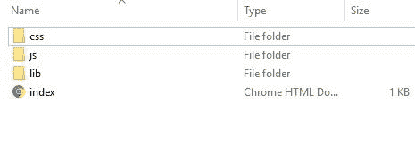
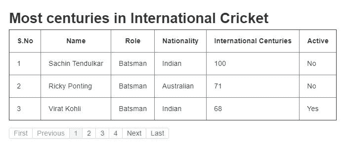
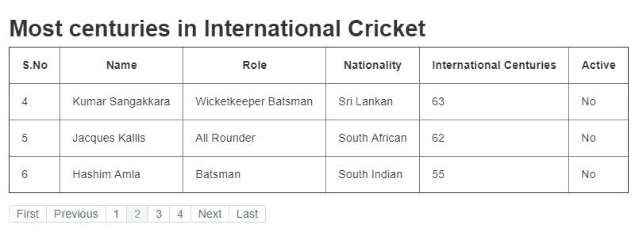
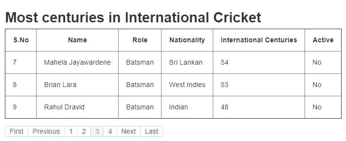

# 如何在 Angular JS 中实现分页

> 原文：<https://www.edureka.co/blog/pagination-in-angular-js/>

Angular JS 是一个 JavaScript 框架，允许开发者创建动态网页。使用这个框架的主要优点是它是可扩展的和灵活的，也就是说，它可以很好地与 Bootstrap 等其他库一起工作，并且它的特性可以很容易地修改以适应开发工作流和满足未来的需求。在本文中，我们将按照以下顺序学习 Angular JS 中的分页:

继续阅读 Angular JS 中的这篇分页文章

## **分页介绍**

简单来说，分页就是将单页网站内容分成多个网页的过程。这一功能主要被 Google 和 Bing 这样的搜索引擎以及基于内容的网站所使用，以使它们对用户友好。这增加了页面浏览量，从而增加了广告收入。

看看 Google 使用的分页。


这种分页系统也可以使用 AngularJS、Bootstrap(CSS 框架，有助于开发设备响应网站)和 angular ui(angular js 的配套套件)来创建。因此，我们将从将所有这些嵌入到我们的“index.html”页面开始。

```


<link data-require="bootstrap-css@2.3.2" data-semver="2.3.2" rel="stylesheet" href="//netdna.bootstrapcdn.com/twitter-bootstrap/2.3.2/css/bootstrap-combined.min.css" />


 	<link rel="stylesheet" href="//netdna.bootstrapcdn.com/twitter-bootstrap/2.3.2/css/bootstrap-combined.min.css" data-require="bootstrap-css@2.3.2" data-semver="2.3.2" />

```

将这段代码复制并粘贴到索引页面的“head”标记中。为了使事情容易理解，我们将首先浏览一下 index.html 和 app.js 文件。然后我们将继续输出和解释部分。



这是项目的文件夹分布。css 和 js 文件夹分别包含样式表和 JavaScript 文件；lib 文件夹包含“angular.min.js”文件和“ui-bootstrap-tpls-0.3.0.min.js”文件。这两个文件都必须存在于项目文件夹中，以使应用程序正常运行。您可以下载这些文件，也可以复制粘贴上面提供的代码块。

继续阅读 Angular JS 中的这篇分页文章

## **角度 JS 示例中的分页**

源代码 index.html

```

<!DOCTYPE html>
<html ng-app="myApp">
<head >

<link data-require="bootstrap-css@2.3.2" data-semver="2.3.2" rel="stylesheet" href="//netdna.bootstrapcdn.com/twitter-bootstrap/2.3.2/css/bootstrap-combined.min.css" />

<link rel="stylesheet" href="style.css" />


</head>


<body ng-controller="ListController as list">

<h1>Most centuries in International Cricket</h1>

<table border=1>

<thead>

<tr>

<th>S.No</th>

<th>Name</th>

<th>Role</th>

<th>Nationality</th>

<th>International Centuries</th>

<th>Active</th>

</tr>

</thead>

<tr ng-repeat="item in filteredItems">

<td> {{item.sno}} </td>

<td> {{item.name}} </td>

<td> {{item.role}} </td>

<td> {{item.nationality}} </td>

<td> {{item.centuries}} </td>

<td> {{item.active}} </td>

</tr>

</table>

<div data-pagination="" data-num-pages="numOfPages()" data-current-page="curPage" data-max-size="maxSize" data-boundary-links="true"></div>

</body>

</html>

```

**app.js**

```

var app = angular.module('myApp', ['ui.bootstrap']);

app.controller('ListController', function($scope){

$scope.curPage = 1,
$scope.itemsPerPage = 3,
$scope.maxSize = 5;

this.items = itemsDetails;

$scope.numOfPages = function () {
return Math.ceil(itemsDetails.length / $scope.itemsPerPage);

};

$scope.$watch('curPage + numPerPage', function() {
var begin = (($scope.curPage - 1) * $scope.itemsPerPage),
end = begin + $scope.itemsPerPage;

$scope.filteredItems = itemsDetails.slice(begin, end);
});
});

var itemsDetails = [
{ sno : 1,
name : 'Sachin Tendulkar',
role : 'Batsman',
nationality : 'Indian',
centuries : 100,
active : "No",
},
{ sno : 2,
name : 'Ricky Ponting',
role : 'Batsman',
nationality : 'Australian',
centuries : 71,
active : "No",
},
{ sno : 3,
name : 'Virat Kohli',
role : 'Batsman',
nationality : 'Indian',
centuries : 68,
active : "Yes",
},
{ sno : 4,
name : 'Kumar Sangakkara',
role : 'Wicketkeeper Batsman',
nationality : 'Sri Lankan',
centuries : 63,
active : "No",
},
{ sno : 5,
name : 'Jacques Kallis',
role : 'All Rounder',
nationality : 'South African',
centuries : 62,
active : "No",
},
{ sno : 6,
name : 'Hashim Amla',
role : 'Batsman',
nationality : 'South Indian',
centuries : 55,
active : "No",
},
{ sno : 7,
name : 'Mahela Jayawardene',
role : 'Batsman',
nationality : 'Sri Lankan',
centuries : 54,
active : "No",
},
{ sno : 8,
name : 'Brian Lara',
role : 'Batsman',
nationality : 'West Indies',
centuries : 53,
active : "No",
},
{ sno : 9,
name : 'Rahul Dravid',
role : 'Batsman',
nationality : 'Indian',
centuries : 48,
active : "No",
},
{ sno : 10,
name : 'AB de Villiers',
role : 'Wicketkeeper Batsman',
nationality : 'South African',
centuries : 47,
active : "No",
},

];

```

继续这篇分页角度的文章

**输出**

**第一页**

 **第二页**



**第三页**



**第四页**


您可以通过点击此处的链接获得该项目的现场演示。

继续这篇分页角度的文章

## **代码解释**

该网页以各种格式显示了国际板球赛中最高的世纪得分者。分页系统只允许在一个网页上以表格形式显示三个名字。要看接下来的三个名字，我们必须翻到第二页。总共将创建四个页面，最后一个页面将只显示表中的一个名称。

从 app.js 页面开始。

我们将从添加 ui.boostrap 作为 AngularJS 应用程序的依赖项开始。这是一个必要的步骤，否则我们的分页栏将无法显示，也无法正常工作。

```

$scope.curPage = 1, //starting page of pagination
$scope.itemsPerPage = 3, //number of names to be displayed per page
$scope.maxSize = 5; //maximum number of pages

```

“curPage”范围变量被赋值为 1。这意味着第一页将是网页加载后显示的默认页面。“itemsPerPage”作用域变量等于我们希望在一页上显示的玩家名字的数量。在这种情况下，它是 3。“maxSize”作用域变量等于分页系统中允许的最大页数。this . items = items details；

在这一行中，我们初始化了“itemDetails”变量。要了解 JavaScript 中“this”关键字的更多信息，请点击这个 MDN 链接。

```

$scope.numOfPages = function () {
return Math.ceil(itemsDetails.length / $scope.itemsPerPage);
};

```

在这一行中，我们创建了一个函数并存储在“numOfPages”范围变量中。顾名思义，这个函数计算分页系统中的页数。

在我们的示例中，我们在“itemDetails”数组中有 10 个玩家，并且“itemsPerPage”被设置为 3。10 除以 3 得 3.3333。数学。Ceil()'函数将任意数字向上舍入到下一个最大的整数。因此，3.3333 被向上舍入为 4，这正好是显示 10 个姓名(每页 3 个姓名)所需的页数。

```

$scope.$watch('curPage + numPerPage', function() {
var begin = (($scope.curPage - 1) * $scope.itemsPerPage),
end = begin + $scope.itemsPerPage;

$scope.filteredItems = itemsDetails.slice(begin, end);
});

```

这里，我们定义了一个函数，它将决定将要显示的数组值。我们知道在“itemsDetails”数组中有 10 个项目。这意味着数组索引的范围将从 **0 到 9。** 每页显示三个名字，这意味着第一页将需要索引为 0、1 和 2 的数组项。

对于第一页，“curPage”的值将为 0。这将使 begin 的值为 0。它将帮助我们获得数组的第一个索引值。“结束”变量的值将是 0 + 3 = 3。

现在，为了获得前三个元素，我们将使用 JavaScript 的“slice”方法。slice()方法选择从 start 参数开始的元素，但不包括 end 参数。这意味着它将选择 0、1 和 2，而不是 3。

这将有助于显示 itemDetails 数组中的前三个名称。

**类似地**，对于第二页，“开始”和“结束”变量的值将分别为 3 和 6。slice()方法将选择索引为 3、4 和 5 的项目。因此，显示数组中接下来的三个名字。这个过程将一直持续到最后一页。

现在进入 index.html 页面。我们将从嵌入所需的框架和库开始。数组中的项目将以表格形式显示在网页上。我们将使用“ng-repeat”服务来迭代数组并获得所需的值。表达式写在双括号内。它有助于在解析表达式后将数据绑定到 HTML。简单地说，这有助于向用户显示姓名。

这个空的 div 是显示分页栏所必需的。这里使用的所有术语，如“数据分页”、“数据最大大小”等都是预定义的，我们只需输入正确的值即可正常工作。

这就是如何使用 AngularJS 创建一个合适的分页系统。

使用$http 服务时，不要忘记使用本地主机，否则您可能会遇到 CORS 问题。一个正常工作的服务器需要发送一个 get 请求，然后接收数据。

**注意 02:** 不要忘记嵌入需要的框架和库。

至此，我们结束了这篇关于 Angular JS 分页的文章。

*既然你已经了解了 Angular JS 中的分页，那就去看看 Edureka 的 **[Web 开发认证培训](https://www.edureka.co/complete-web-developer)** 。* *Web 开发认证培训将帮助您学习如何使用 HTML5、CSS3、Twitter Bootstrap 3、jQuery 和 Google APIs 创建令人印象深刻的网站，并将其部署到亚马逊简单存储服务(S3)。*

有问题要问我们吗？请在“Angular JS分页”的评论区提及，我们会回复您。