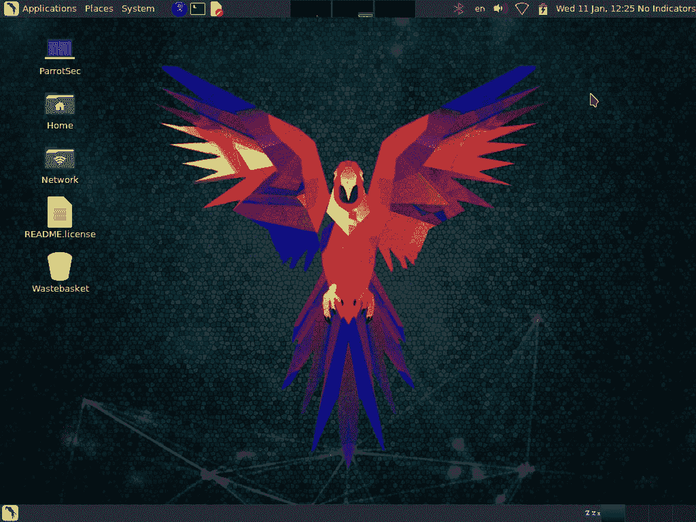

# ParrotOS vs Kali Linux:如何选择最好的？

> 原文：<https://www.edureka.co/blog/parrot-os-vs-kali-linux/>

Linux 以其迎合各种需求的各种发行版而闻名。其中最著名的发行版是 Kali Linux，一个面向渗透测试的操作系统。自发布以来，Kali 已经经历了各种形式的更新，而其他[渗透测试](https://www.edureka.co/blog/what-is-penetration-testing/) / [网络安全](https://www.edureka.co/blog/what-is-cybersecurity/)相关的发行版也在世界各地开发。在这篇文章中，我们将 Kali 与一个受到关注的分布进行比较，即 ParrotOS。掌握这两种操作系统中的任何一种都会让你更接近成为[认证的网络安全专家](https://www.edureka.co/cybersecurity-certification-training)。

下面是这篇“ParrotOS vs Kali Linux”文章中涉及的主题:

*   [什么是 Kali Linux？](#kali)
*   [什么是 ParrotOS？](#parrot)
*   [卡利 vs 帕罗托斯](#kali-vs-parrot)
*   [结论](#conclusion)

| **公制** | **鹦鹉** | 卡利 Linux |
| [硬件要求](#hardware) | 轻量级选手 | 不适用于旧配置 |
| [看起来&感觉起来](#interface) | 安装各种工具 | 如果你是新来的，容易迷路 |
| [黑客工具](#tools) | 工具比卡莉多 | 缺少匿名和加密工具 |
| [变化](#variations) | 多样的变化 | 没有太大变化 |
| [更适合初学者](#difficulty) | 宽容随和 | 初学者的攻击性环境 |

## **什么是 Kali Linux？**

 Kali Linux 是一个[渗透测试](https://www.edureka.co/blog/what-is-penetration-testing/)和关注安全的操作系统。顾名思义，Kali 的核心是一个 Linux 内核。在此之上，Kali、 ** *【马体】Aharoni******Deavon Kearns***的创作者，也加入了最新的注射包，帮助试笔者节省一些时间。 [Kali Linux](https://www.edureka.co/blog/ethical-hacking-using-kali-linux/) 根据 Debian 开发标准开发。它是作为一个改进的笔测试发行版开发的，将作为回溯操作系统的替代品。

## **什么是 ParrotOS？**

ParrotOS 很像 Kali，也是基于 Debian 的 Linux 发行版。当我说基于 Debian 时，这意味着代码库遵循 Debian 开发标准。ParrotOS 也有自己的渗透测试和安全相关工具。Kali 上也提供了这些工具中的大部分。ParrotOS 于 2013 年首次发布，由安全专家、Linux 爱好者和开源开发者组成的团队开发。这支队伍由*T3【洛伦佐】法勒特拉 率领。*

You could also go through this video to learn about the differences between Kali Linux and ParrotOS in a more visual manner.

## Kali Linux vs ParrotOS |你该学哪个？|爱德华卡

[https://www.youtube.com/embed/I3IXZhz0SZA?rel=0&showinfo=0](https://www.youtube.com/embed/I3IXZhz0SZA?rel=0&showinfo=0)This Edureka Live session on “ParrotOS vs Kali Linux”, we will be discussing the differences between the two operating systems on various parameters.

## **ParrotOS vs Kali Linux**

现在比较两个操作系统，当两个系统的目的相同时，即[渗透测试](https://www.edureka.co/blog/what-is-penetration-testing/)。在这种情况下，大多数因素都可以归结为个人品味的问题，而不是客观的比较。现在，在我们开始比较 ParrotOS 和 Kali Linux 之前，让我列出两个操作系统之间的相似之处。

### 【Kali Linux 和 ParrotOS 的相似之处

*   操作系统针对渗透测试进行了调整
*   基于 Debian 开发标准
*   支持 32 位和 64 位架构
*   两种操作系统都支持云 VPS
*   他们支持嵌入式和物联网设备
*   预装了大量黑客工具

现在，让我们来看看不同之处。

### **ParrotOS vs Kali Linux:硬件要求**

| **鹦鹉 OS** | **卡利** |
| 不需要图形加速 | 需要图形加速 |
| **320mb 帧** | **1GB 内存** |
| 1GHZ 双核 CPU | 1GHZ 双核 CPU |
| 可以在传统和 UEFI 中启动 | 可以在传统和 UEFI 中启动 |
| **16GB** 硬盘空间 | **20GB** 硬盘空间 |

我们看到 ParrotOS 由于其轻量级的特性，在硬件需求方面绝对胜过 Kali Linux。它不仅需要更少的内存来正常工作，而且完整的安装也是相当轻量级的；这要归功于开发人员对无光桌面环境的使用。如果你的硬件配置比较老，ParrotOS 绝对应该是你的选择。

### **帕罗托斯 vs 卡利 Linux:看&感受**

这部分完全归结为个人选择。就我个人而言，我更喜欢 ParrotOS 提供的简约外观。

ParrotOS 的界面是使用 Ubuntu-Matte-Desktop-Environment 构建的。有两个清晰的部分。在顶部，你会看到一个包含应用程序、位置、系统的面板，它很像 [Kali](https://www.edureka.co/blog/ethical-hacking-using-kali-linux/) 本身。ParrotOS 还提供了一些关于 CPU 温度的有用信息以及一个使用图表。底部窗格包含菜单管理器和工作站管理器。

另一方面，Kali Linux 遵循 Gnome 桌面界面。虽然它仍然具有 ParrotOS 的功能，但在我看来，它没有提供同样干净、精致的外观。如果你对 Kali 界面不熟悉，很容易迷路。

### **ParrotOS vs Kali Linux:黑客工具**

当谈到通用工具和功能特性时，ParrotOS 在与 Kali Linux 的比较中胜出。ParrotOS 拥有 Kali Linux 中所有可用的工具，还添加了自己的工具。您可以在 ParrotOS 上找到一些 Kali Linux 上没有的工具。让我们来看几个这样的工具。

#### **wifiphisser**

Wifiphisher 是一个流氓接入点框架，用于执行 red team 约定或 Wi-Fi 安全测试。使用 Wifiphisher，渗透测试人员可以通过执行有针对性的 Wi-Fi 关联攻击，轻松实现针对无线客户端的[中间人](https://youtu.be/_QtSB0Old_Q)位置。Wifiphisher 还可用于对连接的客户端发起受害者定制的网络钓鱼攻击，以获取凭据或使受害者工作站感染恶意软件。

#### **匿名冲浪**

对于黑客来说，匿名是入侵系统的第一步。以一种理想的方式匿名化一个系统不是一件容易的事情。没有人能完全匿名化一个系统。互联网上有许多工具声称它们可以匿名化系统。 匿名 rf 使用 TOR IPtables 来匿名化整个系统。更不用说 tor 已经预装在 ParrotOS 上了。当然，你可以在 Kali 上导入 AnonSurf 和下载 tor，但它们不是预装的，这是目前最重要的。

除此之外，由于 ParrotOS 在设计时也考虑到了开发，所以它还预装了一堆有用的编译器和 ide，这些在 Kali Linux 上是没有的。

### ParrotOS vs Kali Linux:变化

两种操作系统都有各种各样的变化，但 ParrotOS 的变化要多得多。下面是两种操作系统的差异表。

| **鹦鹉 OS** | **卡利** |
| Parrot Sec OS 完整版 | 卡利完整版 |
| Parrot Sec 操作系统精简版 | 卡利简装版 |
| Parrot Sec OS Air 版 | 卡利桌面变体(e17/KDE/Xfce) |
| Parrot Sec OS 工作室版 | Kali armhf/armel(物联网设备) |

正如你们所看到的，Parrot 有一些不同的特性，一个版本侧重于无线渗透测试(air ),另一个版本针对多媒体内容创作(studio)进行了调整。除此之外，它还发布了云支持和物联网设备支持。Kali 提供了基本的完整版和精简版以及自定义桌面界面(e17/KDE/Matter/LXDE)。Kali 还支持[云](https://www.edureka.co/blog/what-is-cloud-computing/)和[物联网](https://www.edureka.co/blog/iot-tutorial/)设备。

### **ParrotOS vs Kali Linux:新手用哪个好？**

现在主要的问题仍然是，这两个发行版中哪一个更适合初学者。嗯，应该注意的是，这两个发行版并不完全适合初学者。如果你想了解 Linux 操作系统，你最好使用 Ubuntu。这也并不意味着你不能学习帕罗托斯或卡利的基础知识。

另一方面，如果你已经了解了 Linux 的基础知识，并且想接触一个操作系统来学习[道德黑客](https://www.edureka.co/blog/what-is-ethical-hacking/)，我个人推荐使用 ParrotOS Sec OS Light。轻量级版本带有最少的网络工具。这意味着，随着你慢慢了解你的道德黑客概念，你可以一个接一个地开发/安装工具，而不是一开始就被一大堆工具淹没。这不仅能让你成为一名[道德黑客](https://www.edureka.co/blog/how-to-become-an-ethical-hacker/)和渗透测试员，还能确保你的基础以有条不紊的方式建立起来。

## **结论**

我推荐 ParrotOS 而不是 Kali 还有一个原因。Kali 的默认用户是 root。这使得环境变得更加咄咄逼人，错误也变得更加难以处理。总的来说，说到 ParrotOS vs Kali Linux，**我个人更喜欢 ParrotOS** 。

这就把我们带到了这篇“ParrotOS vs Kali Linux”文章的结尾。这是我发表的一长串[道德黑客博客](https://www.edureka.co/blog/?s=ethical+hacking)中的一个。关于网络安全的更多信息，你可以看看我的其他[博客](https://www.edureka.co/blog/?s=cybersecurity)。如果你对这篇文章有任何疑问，请在下面的评论区留下你的评论！

如果您希望学习网络安全，并在网络安全领域建立丰富多彩的职业生涯，那么请查看我们的 [***网络安全认证培训***](https://www.edureka.co/cybersecurity-certification-training) ，该培训带有讲师指导的现场培训和真实项目体验。本培训将帮助您深入了解网络安全，并帮助您掌握该主题。

*您还可以看看我们新推出的关于 [**CompTIA Security+认证**](https://www.edureka.co/comptia-security-plus-certification-training) 的课程，这是 Edureka & CompTIA Security+首次与官方合作。它为您提供了一个获得全球认证的机会，该认证侧重于安全和网络管理员不可或缺的核心网络安全技能。*

<article class="maincontentblog">*Got a question for us? Please mention it in the comments section of “ParrotOS vs Kali Linux” and we will get back to you.*</article>

<article>Learn Cybersecurity the right way with Edureka’s [**POST-GRADUATE PROGRAM** with **NIT Rourkela**](https://www.edureka.co/post-graduate/cybersecurity) and defend the world’s biggest companies from phishers, hackers and cyber attacks.</article>