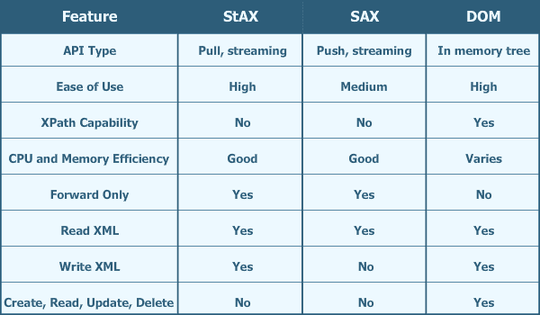
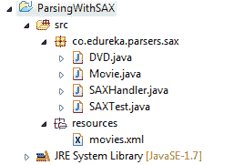
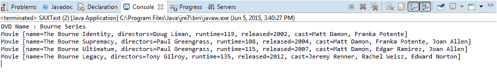

# 使用 SAX 解析器解析 XML 文件

> 原文：<https://www.edureka.co/blog/parsing-xml-file-using-sax-parser/>

Java 提供了许多解析 XML 文件的方法。例如，使用 DOM 解析器、SAX 解析器或 StAX 解析器解析 XML 文件。在这篇文章中，我们将看到如何使用 SAX 解析器解析 XML 文件

在详细介绍如何使用 SAX 解析器解析 XML 文件之前，我们先来看看通过不同解析器进行解析的区别，以及何时选择一种解析器。

**SAX 解析器**–SAX 是 XML 的简单 API 的缩写。SAX 解析器逐行解析 XML 文件，并在遇到 XML 文件中的开始标记、结束标记或字符数据时触发事件。这就是为什么 SAX 解析器被称为基于事件的解析器

**DOM 解析器**–DOM 是文档对象模型的缩写。与 SAX 解析器不同，DOM 解析器将完整的 XML 文件加载到内存中，并创建一个树结构，其中树中的每个节点代表 XML 文件的一个组件。使用 DOM parser，您可以创建节点、删除节点、更改节点内容以及遍历节点层次结构。DOM 在处理 XML 文件时提供了最大的灵活性，但是在处理大型 XML 文件时，它的代价是潜在的大量内存占用和大量的处理器需求

**StAX 解析器**–StAX 是 Streaming API for XML 的首字母缩写。当应用程序有内存限制时，基于流的解析器非常有用。例如，运行 Java Micro Edition 的手机。类似地，如果您的应用程序需要同时处理几个请求，例如一个应用服务器，应该使用 StAX 解析器。

## **基于流的解析可以进一步归类为:**

**拉解析**–在拉解析中，当客户端应用程序需要与 XML 信息集交互时，它会调用 XML 解析库上的方法。换句话说，客户机只有在明确请求时才能获得 XML 数据。

**推送解析**–在推送解析中，当 XML 解析器遇到 XML 信息集中的元素时，它会将 XML 数据推送到客户端。换句话说，解析器将数据发送给应用程序，而不管应用程序是否准备好使用它。

## **SAX、DOM、StAX 解析器比较:**

下表总结了 SAX、DOM 和 StAX 解析器的特性

[](https://www.edureka.co/blog/wp-content/uploads/2015/06/Java_bloge_2.png)

现在我们已经了解了不同的解析器，让我们看看如何使用 SAX 解析器解析 XML 文件

**XML 文件** 下面是我们将要解析和构造 Java 对象的 XML 文件

```
< dvd name="Bourne Series">

< movies>

< movie>
< name>The Bourne Identity< /name>
< directors>Doug Liman< /directors>
< runtime>119< /runtime>
< cast>Matt Damon, Franka Potente< /cast>
< released>2002< /released>
< /movie>

< movie>
< name>The Bourne Supremacy< /name>
< directors>Paul Greengrass< /directors>
< runtime>108< /runtime>
< cast>Matt Damon, Franka Potente, Joan Allen< /cast>
< released>2004< /released>
< /movie>

< movie>
< name>The Bourne Ultimatum< /name>
< directors>Paul Greengrass< /directors>
< runtime>115< /runtime>
< cast>Matt Damon, Edgar Ramirez, Joan Allen< /cast>
< released>2007< /released>
< /movie>

< movie>
< name>The Bourne Legacy< /name>
< directors>Tony Gilroy< /directors>
< runtime>135< /runtime>
< cast>Jeremy Renner, Rachel Weisz, Edward Norton< /cast>
< released>2012< /released>
< /movie>

< /movies>

< /dvd>
```

**项目结构** 下面是 Eclipse IDE 中项目结构的截图

[](https://www.edureka.co/blog/wp-content/uploads/2015/06/project-structure.png)

下面是保存电影对象列表的 DVD 类

```
package co.edureka.parsers.sax;

import java.util.List;

public class DVD {
	private String name;	
	private List movies;

	public String getName() {
		return name;
	}
	public void setName(String name) {
		this.name = name;
	}
	public List getMovies() {
		return movies;
	}
	public void setMovies(List movies) {
		this.movies = movies;
	} 
}
```

电影对象的属性包括名字、导演、电影的运行时间(时长)、上映年份和演员

```
package co.edureka.parsers.sax;

public class Movie {

	private String name;
	private String directors;
	private int runtime;
	private int released;
	private String cast;

	public String getName() {
		return name;
	}
	public void setName(String name) {
		this.name = name;
	}	
	public String getDirectors() {
		return directors;
	}
	public void setDirectors(String directors) {
		this.directors = directors;
	}
	public int getRuntime() {
		return runtime;
	}
	public void setRuntime(int runtime) {
		this.runtime = runtime;
	}
	public int getReleased() {
		return released;
	}
	public void setReleased(int released) {
		this.released = released;
	}
	public String getCast() {
		return cast;
	}
	public void setCast(String cast) {
		this.cast = cast;
	}

	@Override
	public String toString() {
		return "Movie [name=" + name + ", directors=" + directors
				+ ", runtime=" + runtime + ", released=" + released + ", cast="
				+ cast + "]";
	}

}
```

**实现 SAX 处理器:**

我们将扩展 org . XML . sax . helpers . default handler 类，它提供了许多回调方法，并将覆盖以下方法:

**startElement()**–当遇到一个标签的开始时，这个方法被调用

**end element()**–当遇到一个标签的结尾时，这个方法被调用

**characters()**–当遇到一些文本数据时调用这个方法

注意:还有许多其他的回调方法，如 startDocument()、endDocument()等。如果需要，可以覆盖它。

```
package co.edureka.parsers.sax;

import java.util.ArrayList;
import java.util.List;

import org.xml.sax.Attributes;
import org.xml.sax.helpers.DefaultHandler;

public class SAXHandler extends DefaultHandler{

	DVD dvd=new DVD();
	ListmovieList=new ArrayList();
	Movie movie=null;
	String content =null;	

	public void startElement(String namespaceURI,String localName,String qname,Attributes attributes){				
		if(qname.equals("dvd")){
			String dvdName=attributes.getValue("name");
			dvd.setName(dvdName);
		}else if(qname.equals("movie")){
			movie=new Movie();
		}
	}

	public void endElement(String namespaceURI,String localName,String qname){

		switch(qname){
		   case "movie":      movieList.add(movie);
		                       break;
		   case "name" :      movie.setName(content);
		                       break;
		   case "directors" : movie.setDirectors(content);
		                       break;
		   case "released"  : movie.setReleased(Integer.parseInt(content));   
		                       break;
		   case "runtime"   : movie.setRuntime(Integer.parseInt(content));
		                       break;
		   case "cast"      : movie.setCast(content);
		                       break;

		   case "dvd" : dvd.setMovies(movieList);
		                break;

		}

	}	
	public void characters(char []ch,int start,int length){		
		content=new String(ch, start, length);
	}
	public DVD getDVD(){
		return dvd;
	}	
}
```

**测试 SAX 处理程序** 现在让我们测试我们的 SAX Handler。下面是测试类 SAXTest，我们首先从 SAXParserFactory 获得 SAXParser 的一个实例，并调用接受两个参数的 parse 方法:一个文件和一个处理程序实例。

```
package co.edureka.parsers.sax;

import java.io.IOException;
import java.nio.file.Path;
import java.nio.file.Paths;
import java.util.List;

import javax.xml.parsers.ParserConfigurationException;
import javax.xml.parsers.SAXParser;
import javax.xml.parsers.SAXParserFactory;

import org.xml.sax.SAXException;

public class SAXTest {

	public static void main(String[] args) throws ParserConfigurationException, SAXException, IOException {
		SAXParserFactory parserFactor = SAXParserFactory.newInstance();	
		SAXParser parser = parserFactor.newSAXParser();
	    SAXHandler handler = new SAXHandler();	  
	    Path path = Paths.get("src/resources", "movies.xml");

	    parser.parse(path.toFile(),handler);

	    DVD dvd=handler.getDVD();

        List movies=dvd.getMovies();
        System.out.println("DVD Name : "+dvd.getName());
        for(Movie movie:movies){
        	System.out.println(movie);
        }
	}
}
```

在执行 SAXTest 类时，您将得到下面的输出:

[](https://www.edureka.co/blog/wp-content/uploads/2015/06/output.png)

**注意:**如果你试图解析一个与 movies.xml 结构不同的 XML 文件，那么方法 startElement()和 endElement()中的代码需要更改。

如果您有兴趣亲自尝试代码，请下载代码[button leads form _ title = " Download Code " redirect _ URL = https://edu reka . wistia . com/medias/ST 5 gg 7 RP 15 course _ id = 44 button _ text = " Download Code "]

***有问题吗？请在评论区提到它，我们会给你回复。***

**相关帖子:**

[Java 入门/J2EE](https://www.edureka.co/java-j2ee-soa-training)

[使用 JSP Servlet 创建在线测验应用程序](https://www.edureka.co/blog/creating-an-online-quiz-application-using-jsp-servlet/)