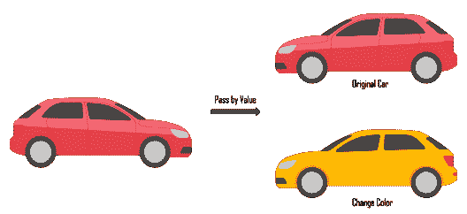

# Java 中的按值传递和按引用传递

> 原文：<https://www.edureka.co/blog/pass-by-value-pass-reference-java/>

Java 是任何人都能掌握的最基础的编程语言之一。它是如此简单，同时，使用 Java 开发的可能性是无限的！ 这就是 Java 成为当今业界最广泛使用的语言的原因。 本博客将按以下顺序帮助你理解 Java 中的值传递和引用传递:

*   [Java 中的按值传递和按引用传递](#valuereference)
*   [程序插图](#program)

## **Java 中的按值传递和按引用传递**

通过值传递和通过引用传递是我们在函数中将值传递给变量的两种方式。

*   **传值:** 将函数参数值复制到另一个变量中，而不是传递这个复制的对象的过程。这就是所谓的按值调用。

*   **按引用传递:** 是将引用的实际副本传递给函数的过程。这被称为引用。

说起 Java，我们可以说 Java 是传值而不是传引用。

我们将通过编程来说明上面引用的语句。

## **程序插图**

比方说我们有一个 **汽车** 类如下图。

```

public class Car {

private String color;

public Car () {}

public Car (String a) {

this.color=a; }

public String getColor() {

return color;

public void setColor (String color) {

this.color = color;

}

```

接下来我们有一个交换两个对象的程序。

```

public class Disp {

public static void main(String[] args) {

Car red = new Car("Red"); 

Balloon yellow = new Balloon("Yellow"); 

swap(red, yellow);

System.out.println("red color="+red.getColor());

System.out.println("yellow color="+yellow.getColor());

desc(yellow);

System.out.println("yellow color="+yellow.getColor());

}

private static void desc(Car car) { //car=100

balloon.setColor("Red"); //car=100

car= new car("Green"); //car=200

car.setColor("Yellow"); //car = 200

}

// swap method

public static void swap(Object o1, Object o2){

Object temp = o1;

o1=o2;

o2=temp;

}

}

```

## **输出**

红色=红色

黄色=黄色

黄色=红色

**说明:**

正如我之前所说，JAVA 是按值传递的，因此，我们可以看到，输出中的前两行 swap()方法没有起作用。让我们对代码做一个彻底的解释。



首先，我们通过使用 **new** 操作符创建了一个类的实例。它被创建并且值被存储在存储器位置。因此，这个实例指向“红色”和“黄色”对象的内存位置。现在，当我们调用新对象 o1 和 o2 的值时，它指向两个对象“红色”和“黄色”的内存位置。因此，当一开始调用 swap 方法时，它指向“Red”的内存位置。在下一行中，Car 引用被更改为下一个地址，并指向“黄色”的内存位置。因此，它们在第二步交换，而不是在第一步交换。这就是为什么 JAVA 被称为按值传递而不是引用。

*现在，您已经了解了 Java 中的按值传递和按引用传递，请查看 Edureka 提供的* [***Java 认证培训***](https://www.edureka.co/java-j2ee-training-course)*，edu reka 是一家值得信赖的在线学习公司，在全球拥有超过 250，000 名满意的学习者。Edureka 的 Java J2EE 和 SOA 培训和认证课程是为想成为 Java 开发人员的学生和专业人士设计的。该课程旨在为您提供 Java 编程的良好开端，并训练您掌握核心和高级 Java 概念以及各种 Java 框架，如 Hibernate & Spring。*

*有问题吗？请在这篇“在 Java 中按值传递和按引用传递”文章的评论部分提到它，我们会尽快回复您。*