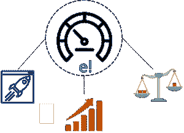
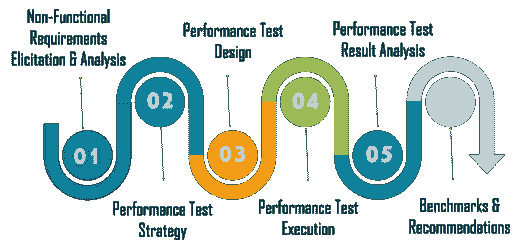
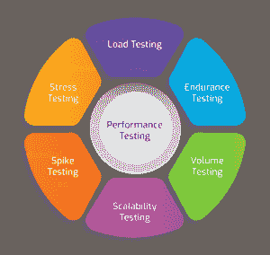

# 性能测试生命周期:关于测试阶段你需要知道的一切

> 原文：<https://www.edureka.co/blog/performance-testing-life-cycle/>

IT 的现代时代已经见证了一场势不可挡的演变软件测试行业让位给了更绿的草地。因此，确保软件应用程序的有效性能变得非常重要。这篇“性能测试生命周期”文章将按以下顺序提供关于测试过程的深入知识:

*   [什么是性能测试？](#performancetesting)
*   [性能测试的优势](#advantages)
*   [性能测试生命周期](#lifecycle)
*   [性能测试的类型](#performancetestingtypes)
*   [性能测试工具](#performancetestingtools)

## **什么是性能测试？**

性能测试是 [软件测试](https://www.edureka.co/blog/what-is-software-testing/) 的一种，确保应用在工作负载下运行良好。性能测试的目标不是发现错误，而是消除性能瓶颈。它 测量系统的质量属性。

[性能测试](https://www.edureka.co/blog/performance-testing-tutorial/)的属性包括:

*   **速度**–它决定了应用程序是否快速响应。
*   **可扩展性**–它决定了软件应用程序可以处理的最大用户负载。
*   **稳定性**–它决定应用程序在变化的负载下是否稳定。

现在让我们继续我们的性能测试生命周期文章，看看性能测试的优点。

## **性能测试的优势**

****

1.  **验证特性**–性能测试验证软件的基本特性。测量基本软件功能的性能可以让企业领导做出关于软件设置的关键决策。
2.  **测量速度、准确性和稳定性—**它帮助你在压力下监控软件的关键组件。这为您提供了软件如何处理可伸缩性的重要信息。
3.  **让您的用户满意—**测量应用程序的性能可以让您观察客户对您的软件的反应。这样做的好处是，您可以先于客户发现关键问题。
4.  **识别差异—**在发布之前，测量性能为开发人员提供了一个缓冲。任何问题一旦发布都有可能被放大。
5.  **提高优化和加载能力—**测量性能可以帮助您的组织处理大量数据，以便您的软件能够应对高水平的用户。

既然您已经知道了性能测试的优点，那么让我们来看看性能测试生命周期中涉及的不同步骤。

## **性能测试生命周期**

性能测试与[软件开发生命周期](https://www.edureka.co/blog/software-testing-life-cycle/) (SDLC)并行开始。性能测试生命周期(PTLC)的不同阶段是:

### ****

### **非功能需求获取与分析**

理解 PTLC 的非功能需求是最重要和最关键的步骤之一。它有助于评估对非功能性需求的遵从程度。

| **参赛标准** | **任务** | **退出标准** |
| 

*   Application under test (AUT) architecture
*   Non-functional requirement questionnaire

 | 

*   Understand AUT architecture
*   Identify key scenes and understand
*   Understanding interface details
*   Growth pattern

 | 

*   Customers sign for NFR documents

 |

**性能测试策略**

第二个定义了如何对已识别的关键场景进行性能测试。您需要解决性能测试的种类和所需的工具。

| **参赛标准** | **任务** | **退出标准** |
| 

*   Sign for NFR documents

 | 

*   Prepare test strategy and review data settings.
*   Define in-range and out-of-range
*   服务等级协议
*   Workload model
*   Prepare and mitigate risks and review

 | 

*   Benchmark performance test strategy document

 |

### **性能测试设计**

这个阶段包括在专用环境中使用确定的测试工具生成脚本。需要完成脚本增强并进行单元测试。

| **参赛标准** | **任务** | **退出标准** |
| 

*   Baseline testing strategy
*   testing environment
*   test data

 | 

*   Test script
*   Parameterization
*   be related
*   Design actions and transactions
*   unit testing

 | 

*   Unit test performance script

 |

### **性能测试执行**

下一阶段致力于测试工程师，他们根据确定的工作负载设计场景，并用并发虚拟用户加载系统。

| **参赛标准** | **任务** | **退出标准** |
| 

*   Baseline test script

 | 

*   Design scene
*   Load test script
*   Test script execution
*   Monitor execution
*   Collect logs

 | 

*   Test script execution log file

 |

### **性能测试结果分析**

在这个阶段，由经验丰富的测试工程师对收集的日志文件进行分析和审查。如果发现任何冲突，将给出调整建议。

| **参赛标准** | **任务** | **退出标准** |
| 

*   Collect log files

 | 

*   Create chart
*   Associating various charts
*   Prepare detailed test report
*   Test report analysis and audit
*   Tuning recommendation

 | 

*   Performance analysis report

 |

### **基准&推荐**

这是 PTLC 的最后一个阶段，包括基准测试和向客户提供建议。

| **参赛标准** | **任务** | **退出标准** |
| 

*   Performance analysis report

 | 

*   Compare the result with the previous execution result.
*   Compare with benchmark standard
*   Verify with NFR
*   Prepare test report demonstration

 | 

*   The performance report was approved.

 |

这些是性能测试生命周期中涉及的不同阶段。现在让我们来看看不同类型的性能测试。

## **性能测试类型**

不同类型的性能测试包括:

*   **负载测试–**它检查应用程序在预期用户负载下的执行能力。目标是在软件应用程序上线之前识别性能瓶颈。
*   **压力测试–**这包括在极端工作负载下测试应用程序，以了解它如何处理高流量或数据处理。目标是确定应用程序的突破点。
*   **耐久性测试–**这样做是为了确保软件能够长时间处理预期的负载。

****

*   **峰值测试—**测试软件对用户产生的负载突然大幅增加的反应。
*   **容量测试**–容量测试下的大数量。数据被填充到数据库中，并且整个软件系统的行为被监控。目标是检查软件应用程序在不同数据库容量下的性能。
*   **可扩展性测试**–可扩展性测试的目标是确定软件应用在支持用户负载增加方面的有效性。它有助于规划软件系统的容量增加。

现在，如果您想要在您的服务器上执行任何这些测试，您将需要与您的测试计划兼容的不同类型的工具。让我们来看看一些重要的性能测试工具。

## **性能测试工具**

市场上充斥着大量的测试管理、性能测试、 [GUI 测试、](https://www.edureka.co/blog/jmeter-tutorial/)、[功能测试、](https://www.edureka.co/blog/what-is-functional-testing/)等工具。我建议你选择一个随需应变的工具，根据你的技能，容易学习，通用和有效的测试类型。让我们来看看十大[性能测试工具](https://www.edureka.co/blog/performance-testing-tools) :

*   loadminja
*   阿帕奇 JMeter
*   WebLOAD
*   LoadUI Pro
*   LoadView
*   新负载
*   负载运行器
*   丝绸表演者
*   应用程序加载器
*   SmartMeter.io

至此，**性能测试生命周期**的文章结束了。我希望你们喜欢这篇文章，并对性能测试的不同阶段有所了解。

*现在您已经了解了不同的性能测试工具，请查看由 Edureka 提供的使用 JMeter 课程 进行的 [**性能测试，Edureka 是一家值得信赖的在线学习公司，拥有遍布全球的 250，000 多名满意的学习者。本课程让您深入了解工作负载期间的软件行为。在本课程中，您将学习如何检查软件的响应时间和延迟，以及测试软件包是否能够高效扩展。本课程将帮助您检查强度并分析应用在不同负载类型下的整体性能。**](https://www.edureka.co/jmeter-training-performance-testing)*

有问题要问我们吗？请在“性能测试生命周期”的评论部分提到它，我们会回复您。