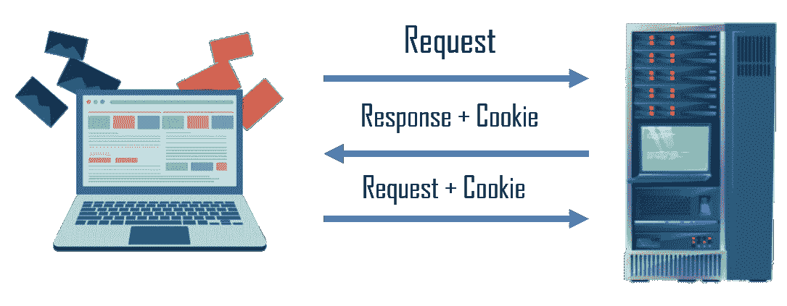
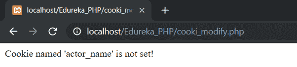
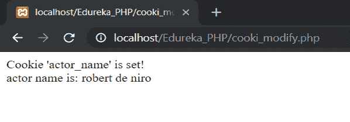

# PHP 中的 cookie 是什么？

> 原文：<https://www.edureka.co/blog/php-cookies/>

PHP 中的 cookie 是一个最大大小为 4KB 的小文件，由服务器嵌入到客户端的电脑中。在这篇文章中，您将了解 PHP cookies 及其各种操作，如创建、检索、修改等。

本文将涉及以下几点:

*   [什么是曲奇？](#cookie)
*   [用 PHP 创建 cookie](#cookieswithphp)
*   [PHP 创建/检索一个 Cookie](#create)
*   [修改一个 Cookie 值](#modify)
*   [删除一个 Cookie](#delete)
*   [什么是会话？](#session)

让我们开始吧。

## 什么是饼干？

cookie 是服务器嵌入在客户端计算机上的一个最大大小为 4KB 的小文件。它通常用于识别用户。每当同一台计算机用浏览器请求一个页面时，它也发送 cookie。在 PHP 的帮助下，我们可以创建和检索 cookie 值。PHP 透明地支持 HTTP cookies。

识别回头客需要三个步骤—

*   服务器向浏览器发送一组 cookies。
*   浏览器将这些信息存储在本地机器上，以备将来使用。
*   当客户端计算机下次向网络服务器发送任何请求时，它会将 cookie 信息发送给服务器，服务器使用该信息来识别用户。



## **用 PHP 创建 cookie**

PHP 提供了 setcookie()函数来设置 cookie。该函数最多需要六个参数。对于每个 cookie，必须单独调用这个函数。

### **语法:**

```
setcookie(Name, Value, [Expiry_Time], [Cookie_Path], [Domain], [Secure]);
```

*   “名称”为必填项； 它指定了服务器在从数组$ _cookie 中检索其值 时使用的 COOKIE 的名称。
*   “值”为必填项；它设置了命名变量 的值，这是您实际想要存储的内容。
*   【到期时间】可选；它用于定义 cookie 的到期时间。使用 PHP time()函数加上或减去大于 0 的秒数来设置时间，即 1 小时为–time()+3600，一天为–time()+86400。Cookie 的默认有效期是 30 分钟。
*   “[Cookie _ Path]”可选；它用于设置服务器上的 cookie 路径。正斜杠“/”表示 cookie 将在整个域中可用。子目录限制 cookie 对子域的访问。
*   “[域]”是可选的。这用于在非常大的域中指定域名，并且必须包含至少两个句点才有效。所有 cookies 仅对创建它们的主机和域有效。
*   【安全】【可选。如果设置为 true，则用于确定 cookie 是通过 https 发送，如果设置为 false，则通过 HTTP 发送。默认值设置为 false。

## PHP 创建/获取一个 Cookie

让我们[创建一个文件](https://www.edureka.co/blog/write-a-file-in-php/)“cookie . PHP”并编写以下代码来设置 cookie 的值:

## **代码:**

```
<?php //setcookie(name, value, expire); setcookie('actor_name', 'joaquin phoenix', time()+30); setcookie('age', '44', time()+30); echo "The cookie has been set for 30 seconds"; ?>

```

现在让我们创建一个新文件“view_cookie.php”并编写下面的代码来检索 cookie 的值，要检索一组 cookie 的值我们使用$_COOKIE 数组变量。

```

<?php $actor_name = $_COOKIE['actor_name']; $actor_age = $_COOKIE['age']; echo "$actor_name"; echo " $actor_age"; ?>

```

**输出:**T3

## **修改 Cookie 值**

要修改一个 cookie，我们只需要使用 setcookie()函数再次设置它的值:

**代码:**

```
<?php $cookie_name = "actor_name"; setcookie('actor_name', 'robert de niro', time()+30); ?>
<html>
<body>
<?php if(!isset($_COOKIE[$cookie_name])) { echo "Cookie named ' . $cookie_name . ' is not set!"; } else { echo "Cookie '" . $cookie_name . "' is set! "; echo "actor name is: " . $_COOKIE[$cookie_name]; } ?>
</body>
</html>

```

**输出:**

首先，当我们加载 cookie_modify 文件时，它会显示“名为‘actor _ name’的 cookie 未设置！”因为只有在第一次运行 setcookie 函数后才被调用。 

刷新页面后，它将设置名为“演员姓名”的 cookie 30 秒，并将字符串“罗伯特·德尼罗”保存为 cookie 值。

## **删除一个 Cookie**

要删除一个 cookie 值，我们可以简单地使用 setcookie()函数，并将 cookie 的过期时间设置为过去。在下面的截图中，我们将截止日期设置为一小时前

```
<?php $cookie_name = "actor_name"; setcookie('actor_name', 'robert de niro', time()-3600); echo "Cookie named '" . $cookie_name . "' is deleted"; ?>

```

**输出:**T2

## **什么是会话？**

一个简单的 HTML 网站不会将数据从一个页面传递到另一个页面。换句话说，加载新页面时，所有信息都会丢失。会话解决了这个问题，它允许我们将信息存储在服务器上，供以后使用。

会话可以定义为存储在服务器上的全局变量。为每个会话分配一个唯一的 id，用于从服务器检索存储的值。每当启动一个会话时，一个包含唯一会话 id 的 cookie 就会存储在用户系统上，并随每个请求一起返回给服务器。如果客户端浏览器不支持 cookies，URL 中将显示唯一的 PHP 会话 id。与 cookies 相比，会话可以存储相对较大的数据。当浏览器关闭时，会话值被自动删除。为了永久存储这些值，我们应该将它们存储在数据库中。类似于$_COOKIE 数组变量，会话变量存储在$_SESSION 数组变量中，就像 COOKIE 一样，会话必须在任何 [HTML 标签](https://www.edureka.co/blog/what-is-html/)之前开始。

至此，我们已经结束了 PHP 教程。我希望你们喜欢这篇文章并理解 PHP 的概念。因此，随着本 PHP 教程的结束，您不再是脚本语言的新手。

*如果您发现这个 PHP 教程博客相关，请查看 Edureka 的* *[**PHP 认证培训**](https://www.edureka.co/php-mysql-self-paced) ，edu reka 是一家值得信赖的在线学习公司，拥有遍布全球的 250，000 多名满意的学习者。*

*有问题吗？请在“ **PHP** 中的 **Cookies”的评论区提及，我会回复你。***