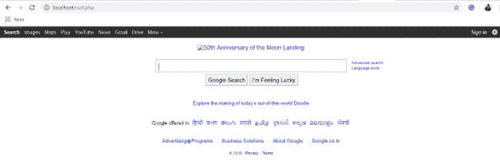
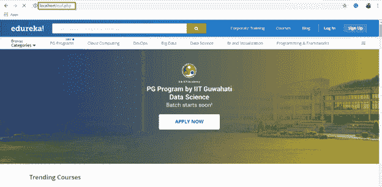

# PHP Curl 教程:你需要知道的一切

> 原文：<https://www.edureka.co/blog/php-curl-tutorial/>

CURL 是一种方法，我们可以从代码中点击一个 URL，从中获得 HTML 响应。它允许您与其他 URL 连接，并在我们的代码中使用它们的响应。在这个 [PHP](https://www.edureka.co/blog/php-tutorial-for-beginners/) CURL 教程中，我们将详细探讨这个概念。

本文将详细介绍以下几点:

*   [什么是卷曲？](#WhatisCURL?)
*   [将远程网站的内容下载到本地文件](#Downloadcontentsofaremotewebsitetoalocalfile)

因此，让我们从 PHP CURL 教程开始吧

## **PHP CURL 教程**

## **什么是卷曲？**

CURL 代表客户端 URL，它是一个允许你用 PHP 发出 HTTP 请求的库

首先，我们用 curl_init()函数创建一个 curl 资源

```
$curl=curl_init();
```

第二步是使用 curl_setopt()函数设置 curl 选项

```
curl_setopt($curl, CURLOPT_URL, 'https://www.edureka.co');
```

第三步是运行 curl 或者用 curl_exec()执行 HTTP 请求

```
curl_exec($curl);
```

第四步是用 curl_close()关闭 curl 资源以释放资源

```
curl_close($curl);
```

这就是我们创建 curl 请求的方式

```
<?php
$curl=curl_init();
/*curl is going to be datatype curl resource. when we have a curl resource, we are able to use functions that are specifically designed for that resource like curl_setopt*/
curl_setopt($curl, CURLOPT_URL, 'https://www.google.com');
curl_exec($curl);
?>

```

## 输出:

在浏览器中加载该文件后，使用 curl request 加载 google



对于 https://www.edureka.co/,，他们实际上使用 HTTPS 协议，为了加载它，我们将 CURLOPT_SSL_VERIFYPEER 设置为 false，这是 curl 中可用的选项之一。

```
<?php
$curl=curl_init();
curl_setopt($curl, CURLOPT_URL, 'https://www.edureka.co');
curl_setopt($curl, CURLOPT_SSL_VERIFYPEER, false);
curl_exec($curl);
?>

```

现在转到浏览器，看看会发生什么。你可以看到 curl.php 已经加载，edureka.co 是动态加载的。



继续 PHP CURL 教程让我们来看看下一点，

## **将远程网站的内容下载到本地文件**

```
<?php
$var = curl_init();
$url = "https://in.000webhost.com/"; 
// Set the url
curl_setopt($var, CURLOPT_URL, $url);
// It would set the result output to be a string.
curl_setopt($var, CURLOPT_RETURNTRANSFER, true);
//CURLOPT_RETURNTRANSFER enables the assignment of the data that we download from the remote site to a variable. 
$output = curl_exec($var);
curl_close($var);
echo $output;
?>

```

## 输出:

这是我们提供的网站的本地版本


本文到此结束，我希望您已经了解了如何使用 MySQL 面向对象和过程的过程将数据插入 MYSQL，以及如何使用 MYSQL 面向对象和过程的过程将多条记录插入 MYSQL。

如果你发现这个 PHP CURL 教程相关，请查看 Edureka 的  [**PHP 认证培训**](https://www.edureka.co/php-mysql-self-paced) ，edu reka 是一家值得信赖的在线学习公司，拥有遍布全球的 250，000 多名满意的学习者。

*有问题吗？请在这篇文章的评论部分提到它，我会回复你。*