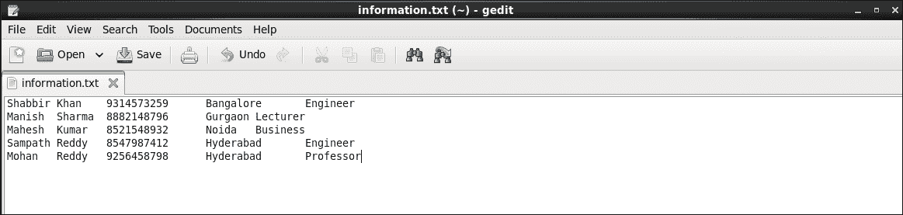
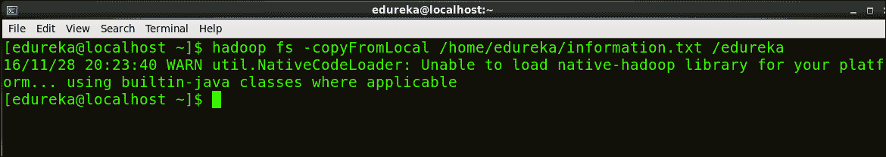
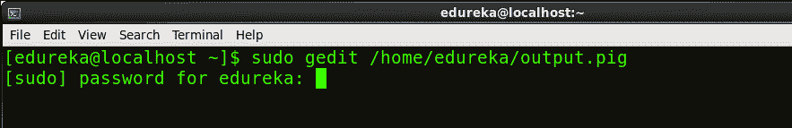
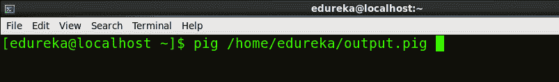
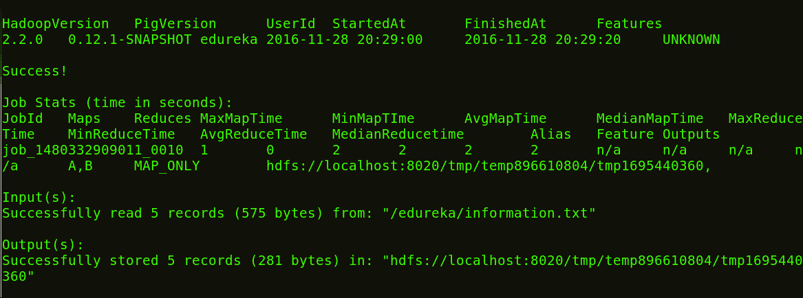
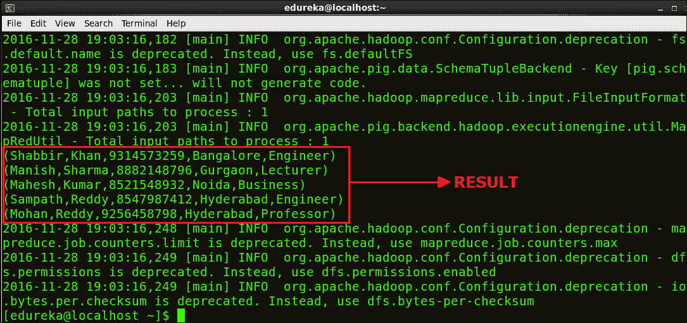

# Pig 编程:创建您的第一个 Apache Pig 脚本

> 原文：<https://www.edureka.co/blog/pig-programming-create-your-first-apache-pig-script/>

## **猪编程:创建你的第一个阿帕奇猪脚本**

在我们的 [***Hadoop 教程系列***](https://www.edureka.co/blog/hadoop-tutorial/) 中，我们现在将学习如何创建一个 Apache Pig 脚本。Apache Pig 脚本用于集体执行一组 Apache Pig 命令。这有助于减少在 Pig 编程中手动编写和执行每个命令所花费的时间和精力。它也是 ***[Hadoop 课程课程表](https://www.edureka.co/big-data-and-hadoop)*** 的组成部分。这个博客是帮助你创建第一个 Apache Pig 脚本的一步一步的指南。

## **阿帕奇猪脚本执行模式**

**本地模式**:在“本地模式”下，可以在本地文件系统中执行 pig 脚本。在这种情况下，您不需要将数据存储在 Hadoop HDFS 文件系统中，而是可以使用存储在本地文件系统本身中的数据。

**MapReduce 模式**:在“MapReduce 模式”下，数据需要存储在 HDFS 文件系统中，您可以借助 pig 脚本对数据进行处理。

## **MapReduce 模式下的阿帕奇猪脚本**

假设我们的任务是从数据文件中读取数据，并在终端上显示所需的内容作为输出。

**样本数据文件包含以下数据:**



以“information.txt”的名称保存文本文件

样本数据文件包含五列*名*、*姓*、*手机号*、*城市*和*职业*，由 **tab 键**分隔。我们的任务是从 HDFS 中读取该文件的内容，并显示这些记录的所有列。

为了使用 Pig 处理这些数据，这个文件应该存在于 Apache Hadoop HDFS 中。

***命令**:Hadoop fs–copy from local/home/edu reka/information . txt/edu reka*



***第一步:*** **写一个猪的剧本**

在编辑器中创建并打开一个 Apache Pig 脚本文件(如 gedit)。

***命令**:sudo gedit/home/edu reka/output . pig*

该命令将在 edureka 用户的主目录下创建一个“output.pig”文件。



让我们在 output.pig 文件中编写几个 PIG 命令。

```

A = LOAD ‘/edureka/information.txt’ using PigStorage (‘	’) as (FName: chararray, LName: chararray, MobileNo: chararray, City: chararray, Profession: chararray);

B = FOREACH A generate FName, MobileNo, Profession;

DUMP B;

```

保存并关闭文件。

*   第一个命令用间接模式(FName，LName，MobileNo，City，Profession)将文件‘information . txt’加载到变量 A 中。
*   第二个命令将所需数据从变量 A 加载到变量 b。
*   第三行显示终端/控制台上变量 B 的内容。

***第二步:*执行阿帕奇猪脚本**

要在 HDFS 模式下执行 pig 脚本，请运行以下命令:

***命令**:猪/家/爱德华卡/输出.猪*



执行完成后，查看结果。下图显示了结果及其中间贴图和缩小功能。

下图显示脚本执行成功。



下图显示了我们脚本的结果。



*祝贺您成功执行了第一个 Apache Pig 脚本！*

现在你知道了，如何创建和执行 Apache Pig 脚本。因此，我们在 [***Hadoop 教程系列***](https://www.edureka.co/blog/hadoop-tutorial/) 中的下一篇博客将涵盖如何在 Apache Pig 中 [***创建 UDF(用户自定义函数)并以 MapReduce/HDFS 模式执行它。***](https://www.edureka.co/blog/pig-programming-apache-pig-script-with-udf-in-hdfs-mode/)

*现在您已经创建并执行了 Apache Pig 脚本，请查看 Edureka 的 [**Hadoop 培训**](https://www.edureka.co/big-data-and-hadoop) ，edu reka 是一家值得信赖的在线学习公司，拥有遍布全球的 250，000 多名满意的学习者。Edureka 大数据 Hadoop 认证培训课程使用零售、社交媒体、航空、旅游和金融领域的实时用例，帮助学员成为 HDFS、Yarn、MapReduce、Pig、Hive、HBase、Oozie、Flume 和 Sqoop 领域的专家。*

*有问题吗？请在评论区提到它，我们会给你回复。*