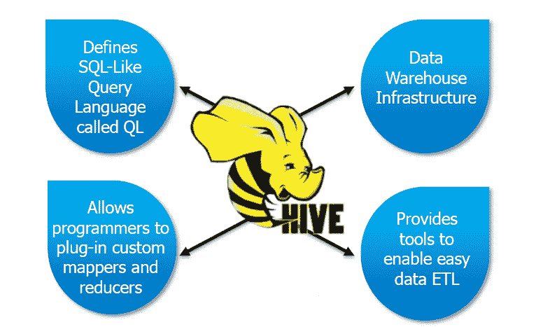
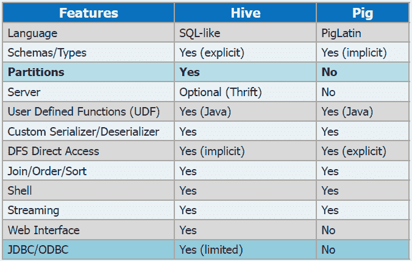

# 猪对蜂房

> 原文：<https://www.edureka.co/blog/pig-vs-hive/>

[//www.youtube.com/embed/-LWstuKsIIU](//www.youtube.com/embed/-LWstuKsIIU)

## **猪简介**

Pig 是一个开源的高级数据流系统，它提供了一种简单的语言 Pig Latin，用于查询和数据操作。

像雅虎、谷歌和微软这样的公司正在利用 Pig 来收集大量的点击流、搜索日志和网络爬虫形式的数据集。Pig 还用于对所有信息进行特定形式的处理和分析。

## **需要为猪**

*   容易学习，尤其是如果你熟悉 SQL。
*   多查询方法减少了扫描数据的次数。这意味着与编写原始 MapReduce 相比，只需要 1/20 的代码行和 1/16 的开发时间。
*   性能与原始 MapReduce 相当
*   提供数据操作，如过滤、连接、排序等。以及 MapReduce 中缺少的嵌套数据类型，如元组、包和地图。
*   易于书写和阅读。

## **小猪创作的目的**

Pig 最初是由雅虎在 2006 年开发的，为研究人员提供了一种在非常大的数据集上创建和执行 MapReduce 作业的特别方法。创建它是为了通过多查询方法减少开发时间。

## **蜂巢简介**

Hive 最初是由杰夫·哈默巴赫尔发现的，当时他还在脸书工作。脸书每天都会收到海量的数据。因此，他们希望寻找不同的方法来存储、挖掘和分析数据。Hive 就是这种寻找的结果而诞生的。

随着 Hive 由脸书实现，数据现在由夜间 cronjobs 收集，然后存储到 OracleDB 中。ETL 是通过硬编码的 Python 完成的。在 Hive 的帮助下，脸书现在能够处理从 2006 年的 10gb 数据到目前的 10tb 数据。成为一名数据工程师的最好方法是在华盛顿参加 [Azure 数据工程培训](https://www.edureka.co/microsoft-azure-data-engineering-certification-course-washington) 。

## **什么是蜂巢？**

Hive 是构建在 Hadoop 之上的数据仓库包，用于执行数据分析。Hive 的目标用户是熟悉 SQL 的用户。Hive 有一种类似于 SQL 的编程语言，叫做‘hive QL’。配置单元用于管理和查询结构化数据。请注意，配置单元可以用在数据“结构化”的地方。

Hive 抽象了 Hadoop 的复杂性，也就是说，你不必编写 mapreduce 程序。使用 Hive，用户也不需要学习 Java 和 Hadoop APIs。凭借 Hive 令人难以置信的功能，脸书现在每天能够分析几万亿字节的数据。向 [蔚蓝数据工程师助理](https://www.edureka.co/microsoft-azure-data-engineering-certification-course) 了解更多大数据及其应用。

## **猪 Vs 蜂巢**

以下是 Hive 和 Pig 之间的一些基本区别，根据数据的类型和用途给出了使用哪一种的想法。

## 猪在的时候为什么要去找蜂巢？

既然有猪，为什么还要去找蜂巢。下面的表格列给出了两者之间的综合比较。Hive 可以用在需要分区的地方，以及为多种语言定义和创建跨语言服务的时候。

有问题要问我们吗？在评论区提到它们，我们会给你回复。

**相关帖子:**

[大数据和 Hadoop 培训](https://www.edureka.co/big-data-and-hadoop)

[蜂巢命令](https://www.edureka.co/blog/hive-commands-with-examples "HIVE COMMANDS")

[如何运行蜂巢脚本](https://www.edureka.co/blog/how-to-run-hive-scripts/ "How to Run Hive Scripts?")

[阿帕奇蜂巢安装在 Ubuntu 上](https://www.edureka.co/blog/apache-hive-installation-on-ubuntu "Apache Hive Installation on Ubuntu")

[创建你的第一个蜂巢脚本](https://www.edureka.co/blog/apache-hadoop-hive-script/ "Apache Hadoop : Create your First HIVE Script")