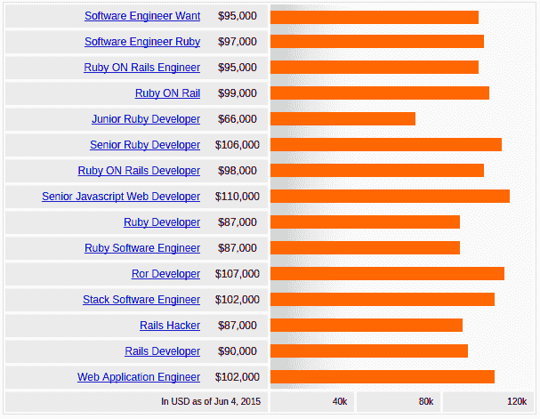
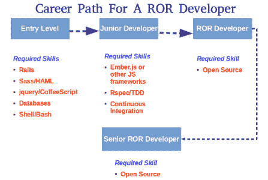

# Ruby on Rails 开发人员职业规划指南

> 原文：<https://www.edureka.co/blog/planning-a-career-as-ruby-on-rails-developer>

Ruby on Rails (RoR)是一个对开发人员友好的 web 应用程序框架，它为您提供了用更少的代码完成更多事情的工具，同时也让您乐在其中。RoR 给了你创造力的翅膀，让你尝试新事物。Ruby on Rails 赋予你的想法生命，让它们成为现实。随着创造力的自由而来的是在工作中探索新的和未尝试的选择的满足感，从而对你的职业感到满意。哦，还有一件事！Ruby on Rails 开发人员比其他开发人员获得更高的薪酬。

这有什么令人信服的理由吗？？！！已经感兴趣了？然后继续阅读…

Ruby on Rails 即将成为最流行的 Web 应用程序框架之一。像 Twitter、SlideShare、Hulu、易贝、Scribd 这样的组织以及其他许多组织已经利用了 Ruby on Rails 框架，并且正在享受他们的投资成果。即使是中小型组织也有望加入 Ruby on Rails 粉丝的长长名单。Ruby on Rails 的成功故事为 RoR 开发者创造了巨大的需求。

对 Ruby on Rails 的需求毫无疑问。有几家公司正在排队为熟练的 RoR 开发者提供更高的薪水。

## **需要对 Ruby On Rails 进行训练**

为了满足资源需求和弥补巨大的技能缺口，专业人员必须重视 RoR 培训。RoR 培训变得如此重要，以至于一些组织都在培养自己的内部人才。在培训期间，开发人员可以了解这项技术的关键，这将有助于他们的职业发展。

ROR 因其最新的成就而变得更有竞争力；JRuby、Ruby 1.9 和 Rubinius。随着众多组织从 Rails 极快的交付速度和敏捷的应用程序开发方式中受益，这导致了对 Ruby on Rails 的需求激增。因此，RoR 培训将打开新机会的大门。

## **Ruby On Rails 成为 Web 开发者的首选**

程序员喜欢 Ruby on Rails，因为它帮助他们抽象和简化常见的重复性任务。以下是更多选择 Ruby on Rails 的理由:

*   **快速**–它可以显著加快开发过程，并提供更清晰的代码库。它还允许您重用其现有组件。

*   **成本效益**–它是高度自动化的，有效地帮助删除整个项目的重要部分。

*   **绝佳选择**–它不仅结合了动态语言的一些最佳特性，还利用了静态语言的有效解决方案。

*   开源–框架和它的大多数库都是开源的。Rails 本身运行在 Linux 上，Linux 也是开源的。

*   **灵活性**–添加新功能、对数据模型进行更改以及其他修改都可以轻松完成。

## **Ruby on Rails 的优势**

Ruby on Rails 框架现在被广泛用于构建网站。使用该框架的一些好处是:

*   Ruby on Rails 的关键优势在于它提供了巨大的自由度和灵活性。只需几行代码，这个框架就能让你比其他编程语言做更多的工作。

*   说到多功能性，Ruby on Rails 取代了大多数传统的编程语言。此外，大多数 web 开发人员更喜欢它整洁简洁的语法。

*   Ruby on Rails 提供了一个在平台上和在需要快速网站开发的情况下高效且容易工作的工具。

*   RubyGems 是流行背后的另一个主要原因。这个包管理器使得开发和分发软件库或 gem 变得非常简单。

## **了解 Ruby on Rails**

对 Ruby on Rails 人才的需求持续稳定增长，IT 就业市场对具备相关技能的专业人士的需求非常旺盛。拥有 Ruby on Rails 技能的开发人员确实在根据工作门户网站赚钱，因为 Ruby on Rails 的平均工资比全国所有职位发布的平均工资高 86%。

RoR 开发人员的年薪从 10 万美元开始，到 15.3 万美元不等。寻找 Ruby on Rails 开发人员的组织支付相对较高的薪水，即使是入门级的职位。由于 Rails framework 是一个开源平台，组织不必为这项技术投入太多，这反过来可以分配他们的资源，为 RoR 开发者提供更高的报酬。

## **‘红宝石之轨’技能的职称&报酬**

这里列出了 Ruby on Rails 技能的职位及其薪水:

考虑到职业选择的数量，RoR 的专业人士可以做出自己的选择，并在选择的职业中留下自己的印记。

## **对红宝石技能的需求**

根据 PayScale 的首席经济学家 Katie Bardaro 的说法，Ruby on Rails 技能确实可以在工作满意度和就业机会方面对开发人员的职业生涯产生影响。以下是更多的原因:

Mondo 数字营销战略副总裁 Laura McGarrity 也肯定了这一点，并指出 Ruby on Rails 是需求排名第三的技能，多年来一直保持稳定。

工作门户确实表明了对 Ruby on Rails 技能的巨大需求。

节省成本和低前期投资的特性使得 Ruby on Rails 成为一项热门技术，并增加了 RoR 开发者的重要性和需求。RoR 开发人员的就业率提高了 Ruby on Rails 的受欢迎程度。有几个 Ruby on Rails 的工作机会，从初级工作开始，比如初级程序员和联合开发人员，到高级工作，比如首席技术官、项目负责人和高级开发人员。

根据 Payscale 的数据，对 Ruby on Rails 技能的需求在过去的 5 年中翻了两番，并且被证明是对开发人员简历的宝贵补充。据报道，这一比例是五年前将 It 作为一项关键技能的员工的 4.5 倍。

尽管对 Ruby on Rails 技能的需求激增，但这一技术领域的熟练人才却严重短缺。几家调查公司得出结论，全球许多领先的组织都面临着人才短缺的压力，印度是其中之一。在正确的专业知识的需求和供应之间存在着巨大的差距，这个差距可以通过 Ruby on Rails 培训来大大缩小

## **职业道路为**ROR**Developer**

以下是一个希望拥有成功职业生涯的网络专业人士所需要的技能。Ruby on Rails 是进步事业的一项基本技能，因为它是开源的。

## **角色&一个 Ruby on Rails 专业人员的职责:**

**入门级职责:**

初级 Ruby on Rails 开发人员的职责包括设置 rail 环境、管理数据库、处理请求、基本的 HTML、JavaScript 和 CSS 知识，以及执行与 RoR 应用程序开发相关的基本任务。

**中层职责:**

中级 RoR 开发人员角色需要 ActiveRecord 关联、设计模式和面向对象方面的知识。

**高层职责:**

高级 Ruby on Rails 开发人员需要精通 Ruby 元编程、数据库建模、监控技能、计划和评估。高级 RoR 开发人员必须具备的另一项关键技能是识别内存和性能问题的强大分析能力。

## **Ruby on Rails 的新功能**

Rails 在 2014 年发布了 4.2 最终版。以下是一些新功能:

*   ActiveJob——通过新的 active job 库，Rails 提供了一个独特的队列接口，允许您在不更改应用程序代码的情况下替换队列 gem。

*   充足的记录–活动记录中的一组性能改进，使常见的 find 和 find_by 调用以及一些关联查询的速度提高了 2 倍。

*   Web 控制台–提供 Rails 异常页面上的 REPL。它能够在 Rails 应用程序的任何页面上放置一个控制台。

有问题要问我们吗？请在评论区提及它们，我们将会回复您。

**相关帖子:**

[Ruby on Rails 入门培训](https://www.edureka.co/ruby-on-rails-sp)