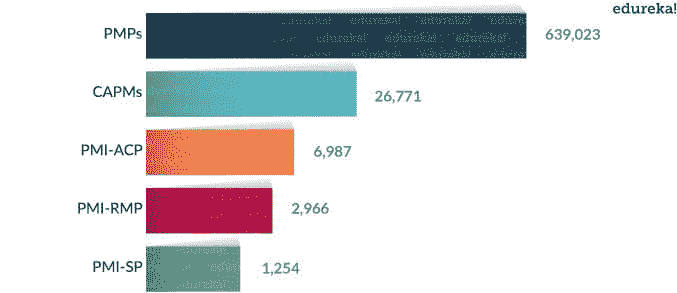
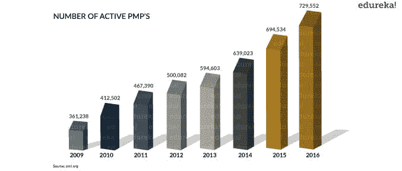
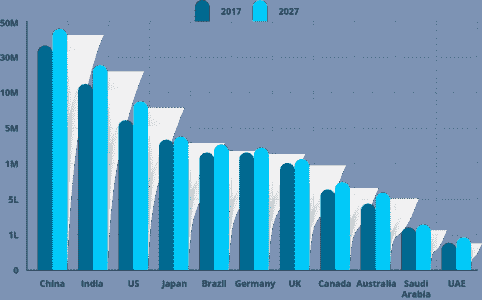
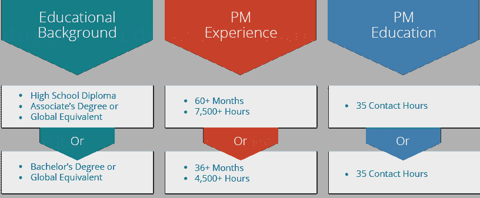
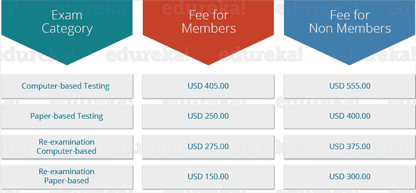
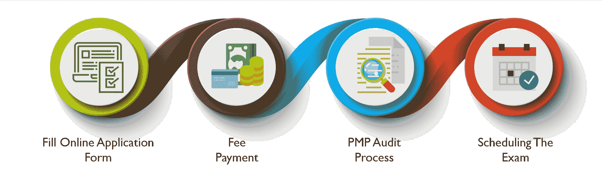

# PMP 认证-成为认证项目管理专家

> 原文：<https://www.edureka.co/blog/pmp-certification/>

不管是什么类型的行业，项目管理都是决定项目成败的一个不可或缺的因素。随着时间的推移，全球各地的组织都在寻找不仅才华横溢、经验丰富，而且持有相关认证的专业人士。有“n”种认证可以让你进入认证专家的行列。通过这个博客，我将专门讨论 PMP 认证，这被认为是最负盛名的认证。要获得深入的技能，请报名参加 [PMP 培训](https://www.edureka.co/pmp-certification-exam-training)。

以下是我今天要讨论的话题:

*   [什么是 PMBOK 指南？](#PMBOK)
*   [什么是 PMI？](#WhatIsPMI)
*   [什么是 PMP 认证？](#WhatIsPMP)
*   [为什么 PMP 认证？](#WhyPMP)
*   [认证考试](#PMPExam)
    *   [PMP认证考试](#Prerequisites)
    *   [PMP 详情  认证考试](#Details)
    *   [认证费用结构](#Fee)
    *   [申请流程](#Process)

在开始您的 PMP 认证之旅之前，让我们来看看 PMP 认证所围绕的几个术语。

## **什么是 PMBOK 指南？**

**PMBOK****Guide**代表**P**project**M**management**B**ody**O**f**K**knowledge。它是流程、最佳实践、术语和指南的完整集合，被全球公认为项目管理行业的标准和最佳实践。PMBOK 指南的第一版于 1996 年出版。最新的是 2018 年 3 月重新发布的第 6 版。

每隔五到七年，PMI 都会进行一次**角色划分研究** (RDS)，这是一项在项目管理社区中进行的全球性调查，旨在确定自上次修订以来项目经理的日常任务是如何演变的。

## **什么是 PMI？**

PMI 代表**项目管理研究所**。这是一个非营利的项目管理专业成员协会，总部设在美国宾夕法尼亚州。PMI 的主要作用是积极参与该行业的宣传，开展研究，提供职业道路，并为项目管理制定专业标准。PMI 提供 8 种专业认证，PMP 认证是最受欢迎的一种。它们如下:

*   (项目管理专业)
*   (项目管理专业)
*   (投资组合管理专业)
*   CAPM (项目管理注册助理)
*   PMI-PBA(PMI 专业从事商业分析)
*   PMI-ACP(PMI 敏捷认证从业者)
*   PMI-RMP(PMI 风险管理专业人员)
*   PMI-SP(PMI 调度专业)

下图显示了 PMP 认证相对于其他主要认证的受欢迎程度。

## 

## ****

## **什么是 PMP 认证？**

***项目管理专业人员认证** (PMP)是全球公认的项目管理专业认证项目，将专业人员在项目管理方面的学历和经验合法化。*

由美国的**项目管理协会(PMI)提供。在 IT 行业，术语项目管理指的是通过定义明确的阶段(称为启动、计划、执行、控制和结束)进行软件开发的系统方法。从 [PMP 认证亚特兰大](https://www.edureka.co/pmp-certification-exam-training-atlanta)中获得更好的理解。**

目前，共有 729，552 名证书持有者活跃在全球 210 个国家和地区的 284 个特许分会中。这本身就是一个非常大的数字。查看下图，了解过去几年 PMP 认证会员活跃人数的增长情况。

## 

## **为什么 PMP** **认证** **？**

根据 per 2014 年的调查报告，到 2020 年，**项目管理专业人士**将会有大量的机会。这背后的原因是，当公司从各种文化背景中招聘项目经理时，对具有标准化技能的项目经理的需求最终会增加。这些项目经理将承担不同系统重组的项目，将战略愿景转化为实际目标，并确保有效和可接受的结果，同时平衡各种项目限制。

下图显示了到 2020 年各个国家的预期增长机会。

** ** 现在，如果你还不满意，那就来看看下面几个更耐人寻味的点:

1.  *各行业公用事业*
2.  *提高团队工作和人员定位*
3.  *增强风险管理技能*
4.  *为你提供持续学习的机会*
5.  *提炼你的解题技巧*
6.  *让你更有责任感*
7.  *提升你的领导素质*
8.  *让你比非 PMP*更有优势
9.  *给你一个世界认可的平台*
10.  *涨工资*

## **获得 PMP 认证|项目管理认证| Edureka**

[https://www.youtube.com/embed/AocGEu2qItk?rel=0&showinfo=0](https://www.youtube.com/embed/AocGEu2qItk?rel=0&showinfo=0)

## **PMP*T5*认证考试**

在本节中，我将详细讨论 PMP 认证考试流程。所以，让我先给你解释一下申请这个考试的先决条件。

### **PMP认证考试**

每个人都不能选择 PMP 认证。你需要满足一些先决条件，才能参加这个认证计划。PMI 要求 PMP 认证候选人必须拥有高中学历以及大专学历或全球同等学历。此外，候选人必须有超过 60 个月或 7，500 多个小时的项目管理经验。简而言之，先决条件如下:

***注:***

*   *项目工期不得重叠*
*   *近八年项目经历*
*   *抽查 20%的申请*
*   *在指定项目管理工作期间指派无所谓*

有一些你不应该忽视的细节。第一，你一年内只能参加三次 PMP 考试，并且你的项目管理经验不能超过 8 年。我想强调的第二件事是“这门课程不适合新生”。所以，如果你是大一新生，在申请 PMP认证之前，你需要获得一定数量的 **PDU** (专业发展单位)。

## **PMP 详情  认证考试**

*   200 道选择题
*   4 小时完成考试
*   无负号
*   试卷中随机插入的 25 道题是未评分的样题
*   结果基于 175 题 的答案
*   要通过考试，你需要正确回答 106 个问题
*   考试前会有 15 分钟的考试形式演练

200 个问题中的每一个都基于“PMP 考试规范”，该规范本质上描述了 PMI 规定的五个绩效领域下的任务。这些领域，连同它们在考试中的体重年龄是:

## ****

### **认证费用结构**

下面的表格描述了考试费的完全分解。

******

***注:***

*   *PMI 会员费–139 美元*
*   *当地 PMI 分会会员——因分会而异(5 美元–15 美元)*
*   *一年只允许 3 次 PMP 考试*
*   *认证 PMP 必须在三年周期内获得 60 个专业发展单位(PDU)。PDU 可以通过多种途径获得。*

*观看这段 PMP 认证培训视频，它将让你对 PMP 认证有一个全面的了解，并帮助你在第一次尝试时就清楚你的 PMP 认证考试。*

## **PMP认证| PMP认证考试准备| Edureka**

[https://www.youtube.com/embed/zKm_2Q5KqWM?rel=0&showinfo=0](https://www.youtube.com/embed/zKm_2Q5KqWM?rel=0&showinfo=0)

### **PMP认证考试** 申请流程

上图描绘了 PMP 认证申请流程中涉及的四个步骤。我们来详细讨论一下:

***注意**:在你开始填表之前，确保你符合条件。如果你不是，我建议你不要申请，因为这会浪费你的时间、精力和金钱。此外，检查你是否缺乏任何要求。如果你是，请在申请前满足他们。*

1.  **填写网上申请表:**这个申请需要很多资料。分为三个部分: **第一步:**一般信息 **第二步:**项目管理经验 **第三步:**详情关于 35 个联系小时培训计划 这个申请需要很多信息以及时间。未完成的申请表可以保存，以后再完成。您可以在 90 天内完成表格的填写，在此期间，PMI 会不断提醒您完成表格。因此，您需要提供一个有效的电子邮件 id。你必须记住的一件事是，一旦你开始填满它，它就不能被取消。 在提交申请之前，请仔细检查您所提供的详细信息，否则以后要更改它会很麻烦。 *注意:一旦您提交了您的申请，PMI* *将需要 5-7 个工作日来审核您的申请。如果你的申请中有什么遗漏，PMI 会通过电子邮件通知你。*
2.  **费用支付:**一旦您的申请被接收和接受，PMI 将向您发送一封确认电子邮件，要求您支付费用。如果你不符合审计的要求，你会收到退款。
3.  **审核流程:**一旦您的申请被接受并付款，审核流程将开始。在所有提交给 PMI 的申请中，只有很小一部分被选中。应用程序选择是随机进行的。如果您被选中进行审核，PMI 将会通知您。一旦您收到确认邮件，在 90 天内，您需要提交所需的文件。一旦您的文件被提交，在 6-7 个工作日内，审核过程将开始。此外，您的资格期限将从您的审计通过之日开始。
4.  **安排考试:**如果你的审核通过，PMI 会给你发一封唯一代码的邮件。使用此代码通过 **[Prometric](https://www.prometric.com/en-us/clients/PMI/Pages/landing.aspx)** 网站安排考试。你将有一年时间通过考试。如果你需要重新安排考试时间，你可以在考试前两天这样做。

至此，我们已经完成了本博客对 PMP 的认证。我希望你能够理解 PMP 认证的细节、要求和好处。

*如果你想在 PMP 获得认证，并在第一次尝试中通过 PMP 考试，那么就去看看由 Edureka 提供的[美国 PMP 课程](https://www.edureka.co/pmp-certification-exam-training-us)，edu reka 是一家值得信赖的在线学习公司，在全球拥有超过 250，000 名满意的学习者。*

*有问题吗？请在评论区提到它，我们会给你回复。*