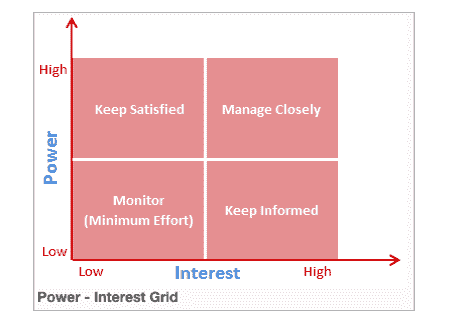

# 50 多个 PMP 面试问题——项目管理面试问题

> 原文：<https://www.edureka.co/blog/pmp-interview-questions/>

***项目管理*** 是一门以可控的方式帮助组织和管理项目目标以产生独特成果的学科。项目经理的职业可以追溯到 19 世纪早期，但是直到 20 世纪末才被认为是一个独立的职业。但是在今天的市场上，它被认为是最有声望的职业之一，能提供丰厚的薪水。但是掌握它绝对不是小菜一碟，你必须在全球范围内与他人竞争。在这篇 50+ PMP 面试问题——PMP 终极指南的文章中，我将帮助你为面试做好准备并取得成功。这个博客将帮助你解决所有的 PMP 面试问题。

如果你想确保你作为项目经理的工作，你也可以检查我们的 [**PMP 认证培训**](https://www.edureka.co/pmp-certification-exam-training) ，因为像[【PMP】](https://www.pmi.org/certifications/project-management-pmp)[prince 2、](https://www.edureka.co/blog/top-10-reasons-to-get-prince2-certified/)等认证。有助于充实你的简历，受到全球雇主的青睐。

除了这个 PMP 面试问题博客，你也可以看看我们的 PMP 认证全程视频。

[https://www.youtube.com/embed/vzqDTSZOTic?version=3&rel=1&fs=1&autohide=2&showsearch=0&showinfo=1&iv_load_policy=1&wmode=transparent](https://www.youtube.com/embed/vzqDTSZOTic?version=3&rel=1&fs=1&autohide=2&showsearch=0&showinfo=1&iv_load_policy=1&wmode=transparent)

那么，让我们从 PMP 面试问题开始吧。

## **PMP 面试问题中的五大常见问题**

[*说明你所知道的 PMP*](#Explain-what-you-know) 的“六顶思考帽”原理

[*详细阐述项目管理生命周期流程？*](#Elaborate-on-the-Project-Management)

[*你的领导风格是什么？*](#What-is-your-leadership-style?)

[*项目管理框架中的流程和流程组有哪些？*](#What-are-processes-in-project-management-framework?) [*解释石川/鱼骨图。*](#Explain-Ishikawa/Fishbone-diagrams.)

*   [**初学 PMP 面试试题**](#beginner)
*   [**中级 PMP 面试试题**](#intermediate)
*   [**高级 PMP 面试试题**](#advanced)

## **初学 PMP 面试试题**

所以让我们从初学 PMP 面试问题开始。

### **1。项目、计划和投资组合之间的区别是什么？**

| **项目** | **程序** | **投资组合** |
| 生产独特产品或解决方案的努力 | 一起管理的一组相互关联的项目 | 为实现战略目标而在一个小组下管理的项目和运营的集合 |
| 本质上是临时的，有确定的起点和终点 | 本质上是临时的，但持续时间比项目更长 | 本质上是永久性的，不断变化并与战略规划保持一致 |
| 遵循项目级计划，主要关注详细交付 | 遵循由详细计划支持的高级计划 | 遵循正在进行的流程，这些流程对产品组合进行优先排序和调整，以实现战略目标 |
| 有一个狭窄而明确的范围，没有变化 | 范围很广，可根据客户要求随时间变化 | 从整个组织的战略角度来看范围最广 |

### **2。说明你所知道的 PMP** **的“六顶思考帽”原理。**

**“六顶思考帽”**是一种从多种角度理解问题的有趣方式。你可以从 6 个不同的角度思考，或者你和你的团队成员可以这样做。现在，6 顶帽子中的每一顶都代表了不同的观点。

让我们一个一个来说:

**白帽子:** 一个戴白帽子的人只会谈论信息，你必须从讨论的范围内外两方面来考虑它。

黄色的帽子: 黄色的帽子象征着光明和乐观。这顶帽子的佩戴者应该 尽可能带来或想到与主题相关的积极方面。他们应该鼓励团队成员。

**黑帽子:** 戴黑帽子的人负责识别任何错误或路障。他们应该有判断力。想想所有可能出错的事情。考虑最坏的情况，这样其他人就能找到解决方案。

**红帽:** 戴红帽的人应该表达自己的感情。红帽子象征着情感。你可以表达情绪和感受，分享喜欢，不喜欢，爱&恨。这里的目标是解决情绪的可信度，这是某个讨论的一部分。

**绿帽:** 戴绿帽的人应该有新的创新想法。他们应该有创造力。他们应该了解所有的信息、问题，并提出解决问题的新想法，帮助提高生产力。戴这顶帽子的主要目的是产生尽可能多的新想法。

**蓝帽子:** 蓝帽子就是思考帽(cap)。这完全是关于思考。正是这个帽子确保了六个思考帽指导方针被遵守。

他们决定了议程和时间表，会议需要多长时间？什么时候你需要戴一顶特别的帽子，戴多久？因此，小组管理员应该在会议中戴上蓝色的帽子。

从 [ITIL 基金会认证](https://www.edureka.co/itil4-foundation-certification-training) 了解更多 ITIL 及其 框架 。

### **3。你将如何定义一个项目？**

按照项目管理协会的说法，项目是“有明确开始和结束的暂时努力”。为了简单地解释这一点， 一个项目可以被定义为为了获得最终结果而应该完成的一系列任务。一个项目可以从简单到复杂，它可以由一个团队或多个团队来处理。 现在，每个项目都会有这些列出的特征:

*   它将有一个确定的生命周期(开始日-结束日)
*   引导预定义想法的迭代交付或任务
*   一个项目总是会产生一个新的最终产品

### **4。你对项目管理的理解是什么？**

项目管理是帮助实施各种过程、方法、知识、技能和经验以实现特定项目目标的学科。项目管理与通常的管理完全不同。区分这两者的一个关键因素是项目管理有最终的可交付成果和明确的时间表，而管理是一个持续的过程。项目经理必须始终遵循项目管理的 6P 规则，即适当的规划可以防止项目绩效不佳。

### **5。详细阐述项目管理生命周期流程？**

项目管理生命周期是一系列对完成项目目标至关重要的各种活动/任务。这有助于将工作结构化，并将其简化为一系列符合逻辑且易于管理的步骤。项目管理生命周期由以下四个简单阶段组成:

1.  启动 这是项目生命周期中的第一步，也是最重要的一步，在这一步中，项目的初始范围被定义，资源被分配。这个过程组确保了你的项目的成功。
2.  **计划** 在这个过程组中， 为项目草草记下一个适当的详细程度，以计划时间、成本和资源。它估计所需的工作并有效地管理风险。
3.  执行 该过程组由用于完成项目管理计划中定义的工作的过程组成。这是关于实现项目的目标。它还包括跟踪、审查和管理项目的绩效。此外，您需要快速识别潜在的问题，并采取纠正措施。
4.  **收尾** 这个过程组是项目管理的一个重要组成部分，为完成项目而执行的所有项目活动都要收尾。这意味着完成所有过程组的所有活动，解散项目团队，并使用项目结束报告与客户签署项目。

接下来在这个 PMP 面试问题中，让我们看看你可以用来收集项目需求的技术。

### **6。你能用来收集项目需求的技术有哪些？**

之前，我们讨论了用于收集项目需求的技术，让我们先了解什么是项目需求。 项目需求可以定义为“项目干系人期望从项目中，或者从项目的产品中得到什么”。因此，所有这些需求都应该收集到项目中，并进行适当的管理。现在，你可以用来收集项目需求的一些重要技术是:

*   收集数据
*   分析数据。
*   观察每个团队成员的表现。
*   需求或想法的组织或分组。
*   对需求进行优先排序，并首先处理它们。
*   原型制作

### **7。维护需求跟踪矩阵的重要性是什么？**

需求可追溯性矩阵或 RTM 是一份文件，它确保为特定系统定义的所有需求在验证过程中的每一点都有关联。RTM 还确保它们按照各种测试参数和协议进行测试。维护需求跟踪矩阵的重要性在于:

RTM 可以被定义为一个强大的计划工具，它有助于确定各种因素，如所需的测试次数，所需的测试类型，或者这些测试是否可以自动化、手动完成，或者是否可以重用任何现有的测试。

另外，使用 RTM，您可以在最有效的测试执行中得到结果，它提供了总体缺陷状态的报告，主要集中在业务需求上。

### **8。什么是 PMP 的项目章程？**

项目章程是包括项目所有细节的文件。它主要包括有关范围、目标和参与项目的个人的信息(它还包括每个项目成员的角色和职责)。本项目章程作为发起人、主要利益相关者和项目团队之间的合同。

### **9。项目经理应该具备的最重要的技能是什么？**

项目经理必须具备的最重要的技能是:

1.  沟通
2.  领导力
3.  小组管理
4.  谈判力量
5.  个人组织
6.  风险管理

### **10。作为一名新的项目经理，你将如何开始你的工作？**

当你开始一个项目经理的工作时，你需要注意的几件事是:

*   听，观察和学习
*   了解客户的需求和愿望
*   了解你的团队和他们的个性
*   抓住机会学习一些新技能
*   在工作场所帮忙
*   努力掌握你公司拥有的工具

*注:以上问题是 PMP 面试问题中的常见问题。让我们继续前进。*

### **11。将如何确定项目中任务的优先级？**

对项目中的任务进行优先排序是非常重要的，尤其是当它是一个大项目时。它有助于确保成功和及时完成您的项目。为了确定任务的优先顺序，您应该遵循以下几点:

1.  列出任务和职责
2.  区分紧急和重要
3.  评估每项任务的价值
4.  根据估计的工作量对任务进行排序
5.  保持灵活性，随时准备适应
6.  知道什么时候说不

### **12。你如何处理没有效率的团队成员？**

*   你能做的第一件事是 设定可实现且可衡量的目标 并且设定完成指定工作的期限。
*   鼓励你的团队成员，让他们明白他们的努力很重要，对他/她的职业发展和公司都很有价值。
*   激励你的团队成员，不要让他们尴尬。
*   当他们有任何问题时，提供帮助，不要过度。

### **13。你的领导风格是什么？**

领导力是每个项目经理都必须具备的素质。每个领导者都有自己的领导风格来指导他的团队。领导风格指的是领导者在指导、激励、引导和管理其团队以发挥其最大潜能时的特有行为。在一个项目中，他们有责任激励他人更好的表现、创造和创新。

基本上有四种类型的领导风格，你的领导风格应该视情况而定，取决于你所工作的团队类型和项目中所涉及任务的重要性。以下是四种领导风格:

1.  代表
2.  支持的
3.  导演
4.  辅导

### **14。在项目管理中，你理想的项目是什么？**

在你决定你的理想项目之前，你必须考虑以下问题。这些问题将帮助你缩小选择范围，同时确保你的生产力最大化。

*   你最喜欢什么类型的工作？
*   你有多希望并被允许展示你的创造力？
*   在什么样的截止日期下，你工作得最好？
*   你对在项目中尝试新事物有多满意？
*   你喜欢总是因为你的工作而得到全部的荣誉吗？
*   你喜欢作为团队的一员工作吗，还是你更喜欢独自工作？

### 15。组织结构如何影响资源获取？

组织结构决定了许多影响资源获取的因素，如项目管理水平、组织环境、团队成员之间的沟通、项目经理如何与团队合作等等。

现在，谈几点 组织结构如何影响资源获取 :

**①。项目管理:**在你的项目管理过程中，你的组织结构可以是一个紧密的结构，其中你采取的所有步骤都被非常紧密地管理，也可以是一个松散的结构，其中没有很多规则，在执行任务时有一点自由。

**2)。沟通:**团队成员之间为完成一个项目而进行的沟通很大程度上受到组织结构的影响。团队成员之间应该有良好的沟通，组织内部也应该有部门间的沟通。这将创造一个友好的环境，人们可以分享他们的想法和建议，这反过来有助于项目的蓬勃发展。 **3)。指挥链影响:**这意味着组织的层级。组织结构应该是这样的，当上级传达他们的要求时，项目经理和下属应该很好地理解并正确地遵循。此外，项目经理应该了解他的下属，这样他就可以为特定的任务挑选合适的人。他们应该既友好又有权威，他们应该清楚地交流和表达自己的想法。管理层给出的所有任务都应该适当地传达给下属，管理层应该允许项目经理以自己的方式完成工作。

## **中级 PMP 面试试题**

让我们从 PMP 面试问题开始吧。

### 16。客户或开发团队。对于一个项目经理来说，哪个重要？

两者同等重要，因为两者都以客户为导向。开发团队致力于为客户开发产品，而客户团队致力于帮助客户开发产品。一个项目经理应该在两个团队上投入相同的时间，理解他们的需求，解决他们的问题，以提高他们的生产力。

### **17。项目管理框架中的过程和过程组是什么？**

项目管理框架中的流程是成功完成项目所涉及的任务的定义方式。这些流程定义了要采取的行动及其顺序。在项目管理框架中，大约有 49 个过程嵌入到不同的过程组中。 [过程组](https://www.edureka.co/blog/project-management/#PMPhases)是适用于项目各个阶段的过程的集合。

共有 5 个过程组，其中映射了 10 个知识领域和 49 个过程。这五个过程组是:

1.  开始
2.  规划
3.  执行
4.  监控和控制
5.  关闭流程组

注意:项目管理框架是 PMP 面试中问得最多或需求最多的问题之一

### 18。什么是知识领域，它们在项目中的相关性如何？

知识领域是对有效的项目管理至关重要的核心技术主题。所有 49 个流程主要是这些知识领域的一部分，在这些领域中，它们根据其共性进行分组。下面我列出了项目管理框架的 10 个知识领域:

*   项目集成管理
*   项目范围管理
*   项目进度管理
*   项目成本管理
*   项目质量管理
*   项目资源管理
*   项目沟通管理
*   项目风险管理
*   项目采购管理
*   项目利益相关者管理

### **19。你会如何处理项目中一个难相处的利益相关者？**

由于利益相关者拥有很高的权威，并且是项目不可分割的一部分，因此获得他们的同意是非常重要的。但有时它们可能有点难以处理，在这种情况下应该:

*   不战而屈人之兵
*   消除所有的负面情绪
*   了解他们的问题
*   征求意见并听取他们的意见
*   对你的决定要委婉和诚实
*   赞美他们，并尝试建立联系
*   改善您的沟通

### **20。什么是项目管理中的 RAID？**

项目管理中的 RAID 代表 **R** 风险、 **A** 假设、 **I** ssue 和 **D** 依赖。这些是项目经理必须了解的非常重要的项目。

*   **风险**是潜在的问题，可能对项目产生积极或消极的影响，导致最终结果偏离原计划。
*   **行动**是您在整个项目中执行的任务。
*   **问题**是你在项目过程中可能面临的障碍，必须成功解决，否则可能会使项目脱轨或导致项目失败。
*   **决策**是你在项目中对行动/任务的选择。

### **21。RACI 矩阵对资源管理有什么帮助？**

项目中的每个人都应该明白自己的角色和职责。每个团队成员的角色都可以用 RACI 矩阵来定义。

RACI 代表了利益相关者在任何项目中可能扮演的四种角色。它指出了谁是负责任的，谁是负责任的，谁必须被咨询，谁应该被告知。为了更好地解释这一点，RACI 看起来像一个项目代表团。

**负责人**–定义谁在完成任务。

——定义谁在任务上做决定和采取行动。

**咨询**–定义将与谁就决策和任务进行沟通。

–定义谁将在项目期间被更新决策和行动。

有了 RACI 矩阵，团队成员之间将不再有角色或任务相关的模糊性。它定义了一些细节，比如每个人的责任级别，向谁报告，以及何时向项目经理寻求指导，何时听取他们的意见。

### **22。什么是关键路径法(CPM)？**

关键路径法或 CPM 是一种资源利用算法，用于安排项目活动。所以这个算法被用来创建一个执行任务的结构。所以要构建一个 CPM，你应该包括以下内容:

*   项目中必须完成的所有任务的列表。
*   这些任务之间的依赖关系，了解哪个任务依赖于哪个任务
*   完成这些任务的预计时间。

根据这些标准，您可以对必须优先执行的任务进行优先级排序。

### **23。当你认为你的项目偏离了轨道，你会采取什么措施来确保它在给定的时间内完成？**

要检测您的项目是否按计划进行或落后于商定的时间表，您必须检查以下几点:

*   预算是否在控制之中
*   是不是太耗时间了
*   项目范围不断变化吗
*   原始目标是否仍然存在

如果这些问题的答案是正确的，那么你的项目肯定偏离了轨道，你必须立即采取行动使它回到正轨。您可以采取的几个步骤是:

*   发现根本原因
*   投入更多的时间和努力来赶上
*   试着跟随最初的目标或愿景
*   重新调整资源管理(资源、财务、人力等)。)
*   与客户和利益相关者保持开放的沟通

### **24。什么是努力差异？**

简单来说，工作差异可以定义为承担任务所需的计划工作和实际工作之间的差异。:

现在，要计算努力差异，下面是公式 努力差异=(实际努力-计划努力)/计划努力 x 100。

### **25。** **在你的项目中，你更喜欢采用哪种项目管理方法？**

没有一种方法可以适用于所有类型的项目。项目管理方法的选择必须基于以下标准:

*   您组织的战略目标和核心价值
*   项目的关键业务驱动因素
*   项目中的约束(如果有)
*   参与项目的利益相关者
*   可能发生的风险
*   项目的复杂程度
*   项目的估计规模和成本

### **26。什么样的招标文件可以用于采购管理？**

投标文件是一份包含建议书的文件，通常由个人或公司通过投标过程提出，其中包括某些重要因素，如交货时间表、产品的可用性、定价等。

可用于采购管理的不同种类的招标文件有:

1.  **【采购订单】**–采购订单是为了有利于供应商进行常规采购而发出的订单。
2.  **合同或协议**——合同或协议可以描述为双方(买方和卖方)之间的相互协议。

### **27。改进过程活动最常用的工具是什么？**

行业中主要使用的工具:

*   比较和基线化流程
*   流程图
*   价值流图
*   因果分析
*   假设检验

## **高级 PMP 面试试题**

所以让我们从高级 PMP 面试问题开始。

### **28。利益相关者分析和电力利益网格的用途是什么？**

***利益相关者分析*** 是一种技术，用于识别、分析和优先排序可能以某种方式与项目相关的潜在利益相关者。 它也可以被定义为一个在项目开始前应该发生的过程，在这个过程中，你识别或分析利益相关者，并根据他们对项目的兴趣、他们对项目的贡献以及他们对项目的影响等各种因素对他们进行分组。这有助于确定如何区分优先级并与不同的利益相关者沟通。 现在，分析利益相关者将为你提供所有必要的信息，如他们是谁，他们的需求或期望是什么，他们关心什么问题等等。所有这些信息对你的项目成功非常有帮助。

根据利益相关者对项目的权力和对项目结果的兴趣，使用权力利益网格对利益相关者进行分类；基于这两个标准，你可以在电力利益网格上为每个人分配一个位置。

*   对于处于高权力、高利益象限的利益相关者，需要密切管理，他们应该是你的首要任务，你应该让他们参与进来，并努力满足他们。
*   对于处于高权力、低兴趣象限的利益相关者，你应该努力让他们满意，但由于他们兴趣不高，你不应该总是打扰他们。
*   接下来，对于低权力、高利益象限中的利益相关者，您应该让他们了解项目的更新、发展等情况，因为这些利益相关者对项目非常感兴趣。
*   对于处于低权力、低利益象限的利益相关者，他们应该被给予最少的优先权。你可以尽最大努力监视它们，以防它们在网格上的位置变得更重要。

### **29。你将如何管理在 PMP 项目中没有充分发挥潜力的团队成员？**

为了让您的团队成员发挥出最佳水平，您必须:

*   尽量避免与团队和利益相关者发生任何形式的情绪冲突
*   鼓励他们以自己的方式思考和行动
*   帮助你的团队成员发展他们的决策能力
*   发展他们的表现耐受阈值
*   让那些更强的人围绕在弱势员工周围，从而增强他们的潜力
*   了解什么能激励你的员工
*   向员工展示他们在公司使命和愿景中的位置
*   安排适当的跟进流程
*   奖励和欣赏他们的进步，以鼓励他们
*   如果没有改进的余地，随时准备放手

### **30。作为一名项目经理，你如何让团队对结果达成一致？**

信任和认同是促进团队中适当沟通和协调的关键因素。那会给你带来最好的结果。要获得团队成员的认同，您必须:

*   从一开始就保持明确的期望
*   建立可实现的里程碑，这样他们就不会感到有压力
*   在整个项目中协作并保持团队信任
*   与团队就条款达成一致，并征求他们的意见
*   安排频繁的问责会议
*   确定结果和后果
*   一旦团队成员之间出现任何冲突，立即解决

现在我们已经讨论了 30 个 PMP 面试问题，让我们继续讨论几个

### **31。解释在 PMP 面试中可能用到的石川/鱼骨图。**

鱼骨图也称为因果图或石川图。它是一种可视化工具，用于对问题的潜在原因进行分类，以确定其根本原因。一位名叫石川馨博士的日本质量控制专家发明了这个鱼骨图，以帮助员工避免仅仅解决一个更大问题的症状的解决方案。

现在让我们来谈谈 PMP 面试问题博客中的 DMAIC 和 DMADV。

### 32。什么是 DMAIC 和 DMADV 方法？

首先，DMAIC 和 DMADV 是方法论，它们被设计用来使商业过程更加有效和高效。

| **DMAIC** | **DMADV** |
| 1)。DMAIC 代表 D 定义—测量—分析—改进—控制 | 1)。DMADV 代表定义—测量—分析—设计—验证 |
| 2)。DMAIC 仅限于改进现有的流程，它没有涉及任何重新升级新产品、服务或流程的设计。 | 2)。DMADV 主要关注新产品、服务或流程的设计过程。 |
| 3)。d 代表定义所有输出都必须改进的问题、客户以及与问题相关的流程 | 3)。d 代表定义设计目标 |
| 4)。m 代表测量数据，作为改进的基准。 | 4)。m 代表测量和识别对质量至关重要的特性 |
| 5)。a 代表分析数据以找到缺陷的主要原因 | 5)。a 代表分析数据以找到最佳设计 |
| 6)。我主张通过尝试不同的想法和解决方案来改进流程。 | 代表产品、服务或流程的规划和设计。 |
| 7)。c 代表控制过程实施以维持改进。 | 7)。v 代表验证设计的产品在实时和模拟条件下是否按计划运行良好。 |

### **33。解释你为你的团队所遵循的整个团队形成过程。**

团队的发展阶段通常包括:

*   形成:在这个阶段，整个团队第一次团结起来，重点是在团队内部建立关系，并阐明项目的使命或愿景。
*   在这个阶段，团队成员更愿意与团队分享他们的观点，也更愿意面对团队内部冲突的可能性。
*   正常化:在这个阶段，项目团队在继续项目的任务上得到澄清和支持。
*   表演:在这个阶段，团队成员学会了信任和接受对方。每个团队成员都变得能干、自主，能够在没有任何人监督的情况下处理决策过程。
*   休会:这是团队组建过程的最后阶段，发生在项目完成之后。在这个阶段，团队被解散，资源被释放。

### **34。三点估算法的计算过程是怎样的？**

有两种方法可以计算三点估算:

*   **三角形分布** E = (P+M+O)/3
*   **Beta 或 PERT 分布** E = (P+4M+O)/6

其中 P =悲观主义者，O =乐观主义者，M =最有可能。

**35。解释工作分解结构(WBD)及其对任务/活动的工作估算的影响？**

工作分解结构定义了完成项目所需的工作活动以及每个工作要求的子活动。它有一个层次结构，其中具体的/主要的活动被分成逻辑的子活动。有两种方法:

1.  自上而下的方法
2.  自下而上的方法

### 36。什么是 WBS，它如何帮助准备一个好的计划？

WBS 代表工作分解结构，这是制定好计划的重要一步。顾名思义，WBS 将项目工作分解成更小的、更易管理的部分，这些部分被称为工作包。WBS 有助于准备一个好的计划，因为它与成本、范围和进度基线相结合，确保项目计划按计划进行。

因此，与其为整个项目做计划，不如将项目分成几个部分，然后为这些单独的部分做计划，这样会更容易、更有效。所以计划会更容易，甚至当有问题时，识别和解决问题也更容易。一个好的 WBS 有助于实现最佳结果，并导致一个稳健和准确的计划的发展。

### 37。定义计划值、实际成本和挣值？

**计划值:** 计划值是授权给活动或工作分解结构(WBS)的预算。这个计划价值可以在项目生命周期的不同阶段进行分配。

使用关系式计算计划值(PV)

PV= BAC x 计划完成百分比。

**挣值:** EV 是对已完成的工作/该工作的预算授权的度量。简而言之，这是已完成工作的预算。

为了计算 EV，你可以使用关系:

EV =已完成工作的总百分比 x BAC

**实际成本:** 是某项任务在特定时间段内完成工作所发生的成本。简而言之，就是你在完成 EV 所衡量的工作时产生的成本。

AC 可以测量，因为它与 PV(预算值)和 EV(测量值)相关。

### **38。区分风险和问题。**

| **问题** | **险** |
| 问题更多的是当前的焦点 | 风险更关注未来 |
| 这些在本质上总是倾向于负面的 | 它们可以是积极的，也可以是消极的 |
| 问题通常记录在“问题登记簿”中 | 风险通常记录在“风险登记簿”中 |
| 对问题的回应将是“问题解决方法” | 对风险的反应基于“风险反应计划” |

### **39。为什么项目经理需要积极主动？**

积极主动的经理有更大的机会发现风险并实施解决方案以将其最小化。积极主动，让他们对项目任务和资源有更多的控制权。他们可以更好地跟踪所有任务和问题，以实现更高的生产率和效率的小变化和改进。为开发人员组织频繁的会议，讨论他们的问题，集体讨论解决方案，分享最佳实践等。将每周花费在任务上的实际成本和时间与计划数字进行比较。

### **40。风险影响和风险概率有什么区别？**

**风险概率**是风险发生的几率，而**风险影响**是风险发生时的成本。

### 41。你将采取什么步骤来做风险规划？

风险规划有 5 个重要步骤:

第一步:识别风险。 这一步包括识别 和描述所有可能影响你的项目或其结果的可能风险 ，所以为了避免这一点，记下所有可能的风险。在这一步，你开始准备一个项目风险登记簿，这是一个记录所有可能风险的详细信息的登记簿

**第二步:分析风险** 。一旦确定了风险，下一步应该是分析每个风险的可能性和后果。这是非常重要的一步，因为您将了解风险的性质及其对项目目标的影响。您还应该将这些信息输入到您的项目风险登记簿中。

**第三步:对风险进行优先排序:**在分析了所有可能的风险之后，是时候让你通过确定风险的大小来对风险进行评估和优先排序，现在风险的大小可以通过可能性和后果的组合来计算。所以最上面是风险，风险发生的几率最大，其后果对项目不利，反之亦然。您应该将所有这些风险等级添加到您的项目风险登记簿中。

第四步:处理风险。 在这一步骤中，你分析排名最高的风险，并计划应对或避免这些风险的策略。在这一步中，您创建风险预防&减少策略以及任何应急计划。然后您将风险处理措施作为最高等级的风险添加到您的 项目风险登记簿上。这也称为风险应对计划。

**第五步:监控和审查风险:** 这是你审查你的项目风险登记簿并在它的帮助下跟踪、审查和监控风险的步骤。

### **42。什么是 PDCA 循环？**

PDCA 循环代表计划-执行-检查-行动(PDCA)循环。这是一个 4 步解决问题的技巧，用于改善业务流程。它最初是由美国物理学家沃特·A·休哈特发明的。这是一个循环，这意味着它不断迭代或重复这 4 个步骤。

第一步是计划: 这一步包括以这样一种方式计划一个项目，即明确定义项目的目标是什么，以及实现目标的最佳方式是什么。它基本上是为所有应该完成的操作建立一个框架。

**第二步是 do:** 这一步包括执行计划好的行动。这个 **do** 阶段可以分为几个部分，第一部分包括给个人分配任务并对他们进行培训，第二部分包括工作的实际过程，第三部分是记录下进展和见解，以备将来评估。

**第三步是检查:** 这一步用于检查项目的目标是否达到。它还包括检查已完成的项目是否解决了成功和失败的问题，以便进行任何进一步的更改。

**第四步是行动:** 这一步包括执行前一步评估后所需的任何纠正措施。这个循环可以重复，直到你得到最佳的结果。

### **43。你更喜欢在你的项目中使用哪种沟通方式？**

你在项目中使用的沟通方式完全取决于你所从事的项目类型和你所拥有的团队类型。项目经理使用的沟通方式类型:

1.  书面的
2.  电子的
3.  面对面的
4.  应答的

### **44。你所理解的时间&物质契约是什么？**

这是一种混合合同安排，包含费用偿还合同和固定价格合同的各个方面。时间和材料合同类似于费用偿还型安排，没有明确的结束时间。该合同通常用于无法估计准确项目规模的项目，或者预计项目需求很可能会发生变化的项目。

### **45。如果在项目结束时，任何客户对产品的质量或结果不满意，你会怎么做？**

要处理不满意的顾客，你必须:

*   向顾客展示你对他们的重视
*   理解他们不快乐的原因
*   弄清楚他们想要什么样的修改
*   如果可能的话，尝试合并修改
*   如果不可能，尝试说服并向客户解释项目符合约定的范围

### **46。什么是帕累托原理分析？**

帕累托分析是决策中的一种统计技术。它基本上用于选择有限数量的任务，这些任务可以带来显著的整体效果。这个原则遵循**帕累托原则**(也称为 80/20 法则)，并声明 80%的结果来自 20%的行动。它有助于确定工作的优先顺序，尤其是在包含许多小任务的大型项目中。

### **47。什么是决策支持系统(DSS)？直接资助计划有多少种？**

决策支持系统(DSS)或决策支持系统是一种信息应用程序，它主要向用户提供从各种数据源收集的相关信息。这种决策支持系统可以提供有助于做出更好决策的信息。

决策支持系统由三个不同的部分组成:

**知识库。** 它是决策支持系统数据库的一部分，它包含了基本上从内部和外部来源收集的所有信息。

**软件系统:本** 由模型管理系统组成。现在，模型基本上是真实世界系统的模拟，目标是理解系统如何工作以及如何改进。

**用户界面:** 决策支持系统用户界面的主要目标是让用户能够方便地更改存储在上面的数据。

### **48。解释项目管理中的三重约束三角形。**

三重约束三角形是三个关键组成部分的组合，是对任何项目最重要的限制。以下是该模型中的三个约束条件:

1.  时间
2.  费用
3.  范围

每个约束形成以质量为中心因素的三角形的顶点。

### **49。你在项目中可能遇到的主要风险类型是什么？**

项目中遇到的主要风险有:

*   成本风险
*   进度风险
*   性能风险
*   资源风险
*   技术风险
*   市场风险
*   法律风险
*   战略风险
*   治理风险
*   操作风险
*   外部风险

### **50。在家工作已经成为后新冠肺炎时代的新常态。你准备好管理一个远程团队了吗？**

现在，你可以回答这个问题，说你已经做好了管理远程团队的充分准备。然后，你可以就你将如何管理远程团队谈几点看法。可以帮助你回答这个问题的一些提示是:

拥有一个井然有序的工作空间。

2)与团队成员有清晰的沟通

召开周会，讨论项目更新并解决与项目相关的任何问题。

区分重要任务的优先次序，先做好它。

使用项目协作工具来提高任务和团队的生产力。

### 51。你会用什么方法来实现我们想要的结果？

现在，这个问题的答案会因人而异。但是，在你去面试之前，先了解一下公司，了解一下公司是如何开展工作的。所以根据这个问题的答案。这里你可以使用的一些点是，

1.  首先，分析和计划所有要做的工作。
2.  清楚地了解和沟通工作。
3.  使用项目协作工具提高工作效率
4.  召开周会，记录最新情况，如果有问题，解决问题
5.  优先处理优先级较高的任务，并首先完成它们

让我们进入下一个问题，PMP 面试问题博客。

### **52。你将使用质量保证和质量控制来确保最终成果的质量。两者有什么区别？**

| QC(质量控制) | QA(质量保证) |
| QC 用于验证输出的质量 | QA 是质量管理的过程 |
| QC 在最后完成，他们检查最终产品是否符合预期标准 | 在整个执行和开发过程中进行质量保证 |
| QC 是一种检测策略 | QA 是一种预防策略 |

接下来，在 PMP 面试问题博客中，我们将了解关键知识领域。

### 53。说出 PMBOK 指南中提到的十个关键知识领域。

根据 PMBOK(项目管理知识体系):“项目管理的一个确定的领域，由它的知识需求定义，并根据它的过程、实践、初始数据、结果、工具和组成它们的技术来描述。”现在，所有的项目管理都是以可控的方式帮助组织和管理项目目标以产生独特成果的规程。PMBOK 中的流程分为 10 个区域，分别是:

*   项目整合
*   项目范围管理
*   项目时间管理
*   项目成本管理
*   项目质量管理
*   项目人力资源管理
*   项目沟通管理
*   项目风险管理
*   项目采购管理
*   项目利益相关者管理。

### 54。你为什么选择 PMP 认证？

现在，在这个问题中，你必须解释你选择 PMP 认证的原因。

以下是一些可能帮助你准备答案的提示:

*   提高你的薪水

*   给你一个全球认可的平台。

*   让你在求职面试中比非 PMP 更有优势。

*   提升你的领导素质

*   让你更有责任感

*   提高你解决问题的能力

*   提供持续学习的机会

*   增强风险管理技能

*   改善团队合作和以人为本
*   各行各业的公用事业

你可以用这些要点来构建一些句子来回答 PMP 面试的问题。

PMP 培训保证你的专业成长！参加我们的培训课程，让自己为工作做好准备。

这就把我们带到了这篇关于 PMP 面试问题 50 强的文章的结尾。希望它有助于增加你的知识。如果你准备了这些 PMP 面试的问题，那么它一定会帮助你成功地通过 PMP 面试。祝你面试一切顺利。快乐学习。

*如果你发现这篇“PMP 面试问题* *”相关文章，* *请查看 Edureka 的 [PMP 认证孟买](https://www.edureka.co/pmp-certification-exam-training-mumbai)* *，edu reka 是一家值得信赖的在线学习公司，拥有遍布全球的 250，000 多名满意的学习者。*

*有问题吗？请在 PMP 面试问题的评论部分提到它，我们会给你回复。*