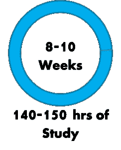
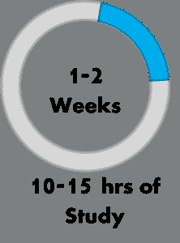
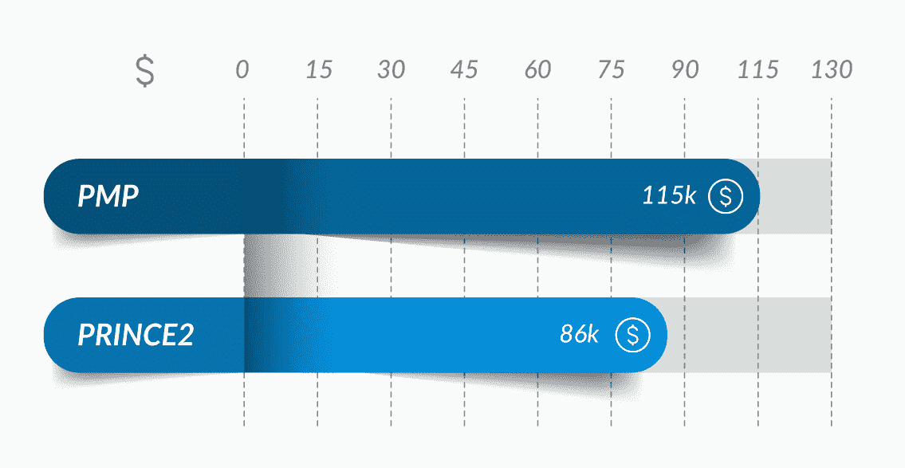
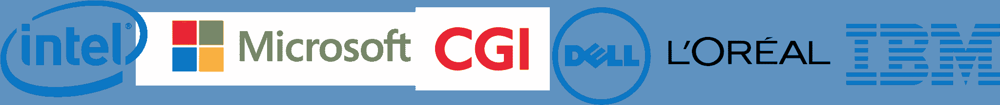
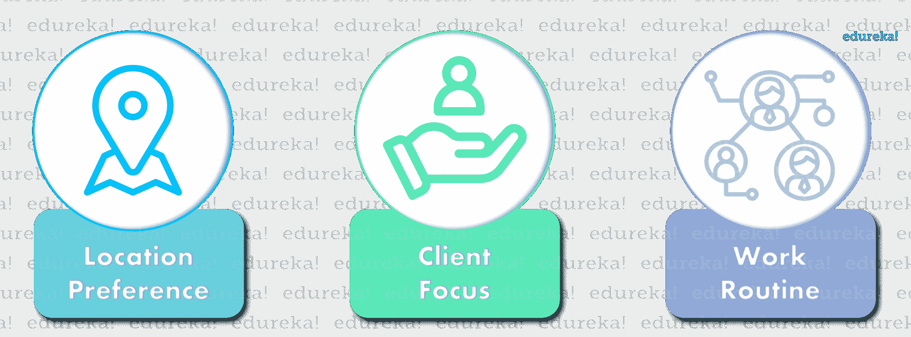

# PMP vs 普林斯 2——选择哪个认证？

> 原文：<https://www.edureka.co/blog/pmp-vs-prince2-comparison/>

在 [**项目管理**](https://www.edureka.co/blog/project-management/) 领域提升你的职业生涯可能会很乏味。寻找合适的专业证书似乎从未停止。如果以上几点让你感到困扰，那么你必须阅读这篇关于 PMPvs prince 2的文章，它肯定会澄清你所有的疑问，并帮助你理解 PMP 认证和 [PRINCE2 认证之间的所有区别。](https://www.edureka.co/prince2-foundation-and-practitioner-certification-training)

下面是我将用来比较与【王子 2】:的几个因素

*   [认证](#pmp)
*   [prince 2认证](#prince2)
    *   [项目管理方法论](#methodology)
    *   [项目管理办法](#approach)
    *   [行业/地理相关性](#industry)
    *   [认证机构](#certificationbodies)
    *   [&费用结构](#eligibility)
    *   [考试形式](#format)
    *   [准备时间](#preptime)
    *   [平均工资](#salary)
    *   [公司](#companies)
*   [哪种认证适合你？](#whichcertification)

大家可以在 PMPvs prince 2上观看这个视频进行详细讲解。

## **PMP vs 普林斯 2 |项目管理认证|爱德华卡**

[https://www.youtube.com/embed/njJPq_qKri4?rel=0&showinfo=0](https://www.youtube.com/embed/njJPq_qKri4?rel=0&showinfo=0)*This Edureka video on PMP® vs PRINCE2® will compare two major certifications in the field of Project Management.*

但是，在我开始这篇 PMPvs prince 2的博客之前，让我给你简单介绍一下这些认证。

## **认证**

[**PMP 认证**](https://www.edureka.co/pmp-certification-exam-training) 代表 **P** 项目 **M** 管理 **P** 专业认证。该认证是任何项目管理从业者在项目管理领域的教育和经验的证明。它被称为项目管理的**黄金标准**，并得到全球组织的认可。一旦你成功通关[**PMP考试**](https://www.edureka.co/blog/pmp-exam-all-you-need-to-know/) ，你就落入了奶油层，会被招聘者优先考虑。

## **prince 2认证**

**prince 2**代表中的**PR**objects**C**受控**E**n 环境。 [PRINCE2 认证](https://www.edureka.co/prince2-foundation-and-practitioner-certification-training)侧重于结构化项目管理方法 和从业者认证项目。这是一种系统的基于过程的方法，有助于通过清晰的模板、过程和步骤交付成功的项目。

和 prince 2都是针对有经验的项目管理从业者的认证。你必须记住的一件事是，这些认证是"*"而不是"*相互竞争的，相反，它们是相互排斥和相互补充的。此外，如果他们一起追求，可以拓宽你作为一个项目经理的视野。因此，在选择其中任何一个之前，你必须对这些认证的内容有一个清晰的了解。通过这篇关于 PMP与王子 2 的博客，我将阐明它们之间的主要区别以及各自的优势。

那么，让我们开始比较 PMP 与普林斯 2 认证的第一个主题，即 PM 方法论。

## **vs prince 2:项目管理方法论**

项目管理方法是一种模型，组织采用它来设计、计划、实施和完成项目目标。对于特定的项目应该采用什么样的项目方法，这取决于行业或商业领域。您可以将这些方法视为这两种认证在行业中运作的门槛。

|  | **prince 2** |
| 

*   **基于 PMBOK**T7T9**指南**
*   Follow the knowledge-based method and cover 10 knowledge areas

 | 

*   Prince2 follows the process-based method
*   This is an instruction that specifies a clear process and defines what should be done

 |

vs prince 2接下来的比较点就是 PM 的做法了。所以，让我们继续，看看他们在方法上有什么不同。

## **vs prince 2:项目管理方法**

项目管理方法基本上是用于处理项目的不同因素并成功完成项目的框架。

|  | **prince 2** |
| 

*   The project is completed in sequence
*   Before the project starts, its scope, time and cost are finalized
*   The customer cannot change these factors

 | 

*   The scope, time and cost of shall be finalized before the project starts
*   The project development follows an iterative method

 |

## **行业/地理相关性**

现在我们已经明确了这三种认证之间的区别，让我们来看看这三种认证在特定行业或地理上的突出之处。

|  | **普林斯 2** |
| 

*   has been recognized by all major industries
*   PMP has been certified by India, the United States, Canada, the Middle East, Southeast Asia and Australia

广泛认可 | 

*   Prince2 is mainly applicable to industries such as construction, engineering, IT, commerce and financial services
*   in India, UK, EU and Australia

 |

## **vs prince 2:认证机构**

这些认证是由著名的项目管理认证机构提供的，同样享有盛誉。拥有这些机构的认证印章会自动增强你的简历，让你成为专业人士中的精英。

|  | **普林斯 2** |
|  |   |

## **vs prince 2:资格&费用结构**

现在，先决条件是你在申请这些认证之前必须了解的重要因素。PMP 和普林斯 2 ，两者要求不同。查看下表，详细了解它们:

|  |  | **PRINCE2 基础** | **PRINCE2 从业者** |
| *最小所需经验* | 3 年 | 不适用 |
| *PM 所需经验* | 4500/ 7500 小时。 | 不适用 |
| *正式培训所需* | 是 |
| *考试费用* | 555 美元 | 计入培训费 |
| *更新周期* | 3 年 | 不适用 | 5 年 |
| *续保标准* | PDU | 不适用 | 简短考试 |

## 您甚至可以通过查看 ITIL 的详细情况。

## **考试形式**

熟悉考试形式是破解它的第一步。作为项目管理领域最著名的认证，通过这些考试可不是闹着玩的。你必须对你要参加的考试有透彻的了解。下面列出了几个主要区别:

|  |  | **PRINCE2 基础** | **PRINCE2 从业者** |
| *问题数量* | 200 | 75 | 8 x 10 |
| *总时间* | 4 小时 | 1 小时 | 2.5 小时 |
| *考试模式* | 抽象选择题 | 抽象选择题 | 基于情景的主观题 |
| *及格分数* | 未披露，心理评估 | 50% | 55% |
| *考试中心* | Prometric | 上线 | 上线 |

## **准备时间**

熟悉考试模式是备考的第一步。但是对于实际的准备，你需要根据你所拥有的时间段和你需要涵盖的课程大纲建立一个详细的时间表。但是仅仅制定时间表是不够的，为了成功，坚持时间表是必须的。所以，为了你的参考，我已经为所有三个认证考试增加了一个大概的准备时间。

或者，您也可以参加[在班加罗尔的 PMP 培训！](https://www.edureka.co/pmp-certification-exam-training-bangalore)

|  | **普林斯 2** |
|  |  |

## **平均工资**

现在，最后但不是最不重要的。促使专业人士参加这些认证的驱动因素是工资因素。以下是持有vs prince 2中任意一种证书的职业人士的平均工资总和。

## **公司**

全球的大品牌经常雇佣拥有这些证书的专业人士。少数招聘 PMP和普林斯 2专业人士的公司有:

**PMP*T3T5***

****

**prince 2**

既然你已经熟悉了 PMP和普林斯 2认证的实质，在下一节中，我将处理你心中的主要问题。

## **哪个认证更适合你？**

正如我已经提到的，这两个认证在项目管理领域都很突出，并且非常重要。所以，你可以选择这两个中的任何一个。但是在你选择你的认证之前，有几个重要的方面你需要考虑，比如:

1.  决定你想在哪里工作，你的位置偏好是什么？
2.  在你的项目中，哪个阶段你会关注你的客户？
3.  你认为哪种工作方式更适合你？

一旦你根据这些方面理清了你的优先事项，我相信你的问题的答案会变得非常清楚。或者，您也可以访问班加罗尔的 [PRINCE2 培训，获得专家指导。](https://www.edureka.co/prince2-foundation-and-practitioner-certification-training-bangalore)

这就把我们带到了本博客的结尾vs prince 2。希望我能给你一个清晰的关于这些认证的图片，并帮助你决定去哪一个认证。

*If you found this PMP***®*** vs PRINCE2***® *****blog, relevant, **check out the *[**PMP Training in Chennai**](https://www.edureka.co/pmp-certification-exam-training-chennai) ***by Edureka, a trusted online learning company with a network of more than 250,000 satisfied learners spread across the globe. **Got a question for us? Please mention it in the comments section and we will get back to you.*