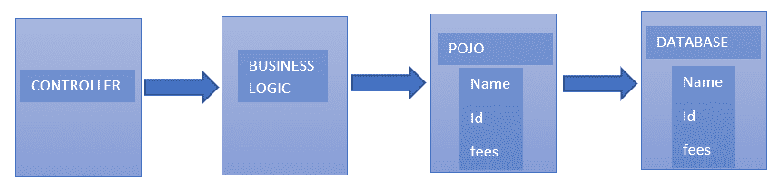

# 关于 Java 中的 POJO，您需要了解的一切

> 原文：<https://www.edureka.co/blog/pojo-in-java/>

Java 中的 Pojo 代表普通老式的 Java 对象 T2，它们用于增加程序的可读性和可重用性。它们是普通的 java 对象，不受特殊限制的约束，而不是 Java 语言规范所强制的。本文将帮助您详细探索这个主题，

本文将涉及以下几点

*   [Java 中的 POJO](#POJOInJava)
*   [POJO 的工作](#WorkingofPOJO)
*   [爪哇豆](#JavaBeans)
*   [Getter 和 Setter](#GetterandSetter)

让我们从这篇关于 Java 中 POJO 的文章开始吧，

## **Java 中的 POJO**

简单地说，Pojo 被定义为一个纯数据结构，包含 getter 和 setter 字段。它能够从对象或接口(如 Serializable)重写某些方法。 它们是由 Sun Microsystems 公司在 EJB 3.0 中推出的，由于它们易于书写和理解而被广泛使用。

POJO 不得:

*   扩展预先指定的类:Ex- public 类测试扩展 javax.servlet.http.HttpServlet 不被认为是 POJO 类。
*   包含预先指定的注释:Ex- @javax.persistence.Entity 公共类 Test{..}不是 pojo 类。
*   实现预先指定的接口:Ex- public 类测试实现 javax.ejb.EntityBean { … }不被认为是 POJO 类。

继续这篇关于 Java 中 POJO 的文章，

**举例:**

给定的例子是 POJO 类的一个清晰的例子。

```
(// Student POJO class to represent entity Student
public class Student
{
// default field
String name;
//public field
public String id;
//private fees
private double fees;
//argument-constructor to initialize fields
public Student(String name, String id,
double fees)
{
this.name = name;
this.id = id;
this.fees = fees;
}
//getter method for name
public String getName()
{
return name;
}
//getter method for id
public String getId()
{
return id;
}
//getter method for Fees
public Double getFees()
{
return fees;
}
}

```

可以看出，字段的访问修饰符不包含任何限制，即它们被允许是默认的、受保护的、私有的或公共的。

继续这篇关于 Java 中 POJO 的文章，

## **POJO 的工作**

POJO 类的工作方式如下所示。图中给出的业务逻辑是用 POJO 封装的。控制器与业务逻辑交互，业务逻辑又与 POJO 交互以访问数据库。

 现在让我们来了解一下 Java Beans，

## **爪哇豆**

特殊类型的 Pojos 被称为 JavaBeans。

*   所有的 JavaBeans 都可以被认为是 Pojos，但反之则不然。
*   可序列化的接口应该由他们来实现。
*   字段应设置为私有，以提供对字段的完全控制。
*   字段必须有 getters、setters，或者两者都有。
*   bean 必须包含无参数构造函数。
*   只有构造函数、getter 和 setter 才能访问字段。

继续这篇关于 Java 中 POJO 的文章，

## **Getter 和 Setter**

getter 和 setter 可以定义如下:

#### **吸气器**

```
public void getName()
{
return Name;
}

```

#### **设定器**

```
public void setName(name)
{
this.name=name;
}

```

**例子**

```
class Student implements java.io.Serializable{
private int id;
private String name;
public Student(){}
public void setId(int id)
{
this.id=id;
}
public int getId()
{
return id;
}
public void setName(String name)
{
this.name=name;
}
public String getName()
{
return name;
}
}
public class Test{
public static void main(String args[]){
Student s=new Student(); //object is created
s.setName("Jeremy"); //setting value to the object
System.out.println(s.getName());
}
}

```

**输出**

杰里米

java 中的 pojos 在定义对象时非常有用，可以增加它们的可读性和可重用性。对他们没有其他限制。

***另一方面，Beans 被定义为具有某些限制的 POJO***

这样，我们就结束了这篇关于“Java 中的 POJO”的文章。如果您想了解更多，请查看 Edureka(一家值得信赖的在线学习公司)提供的 [Java 在线培训](https://www.edureka.co/java-j2ee-training-course)。Edureka 的 Java J2EE 和 SOA 培训和认证课程旨在培训您掌握核心和高级 Java 概念以及各种 Java 框架，如 Hibernate & Spring。

有问题要问我们吗？请在这个博客的评论部分提到它，我们会尽快回复你。