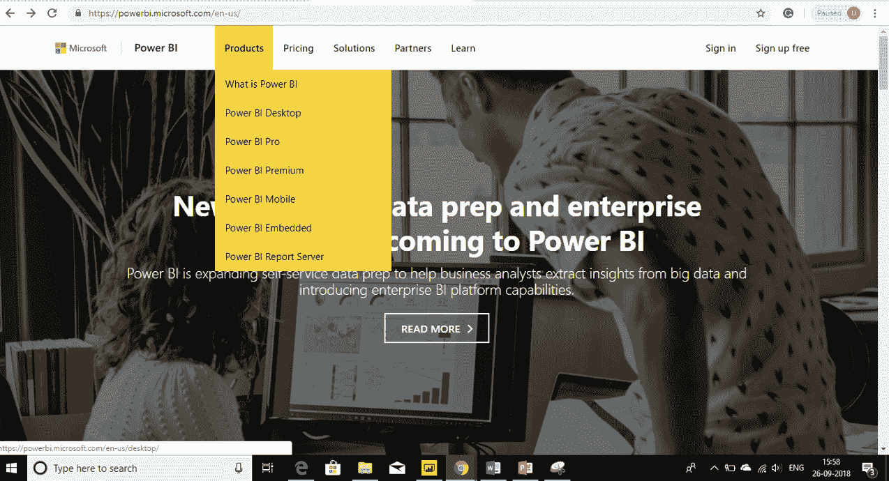
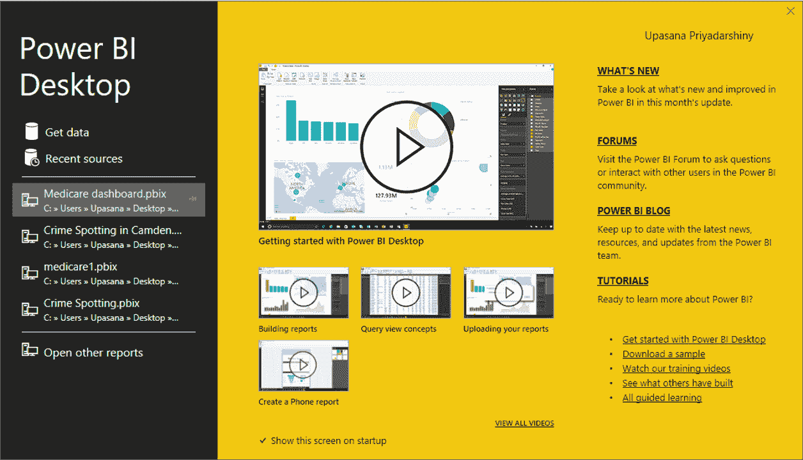
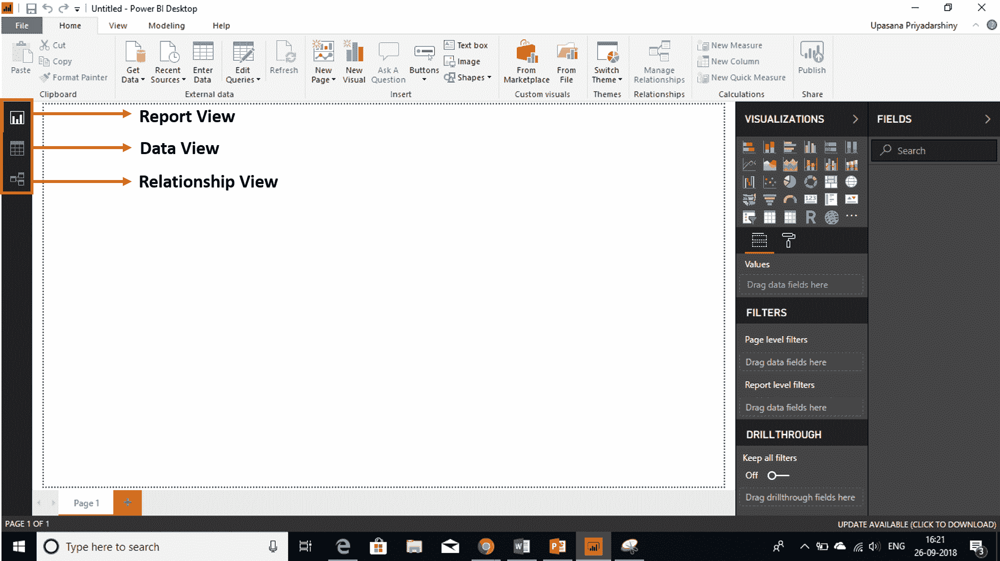
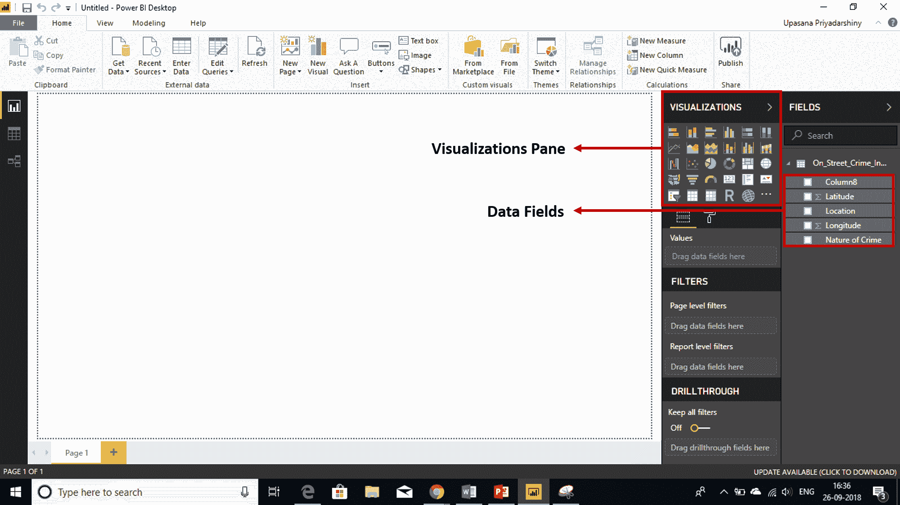
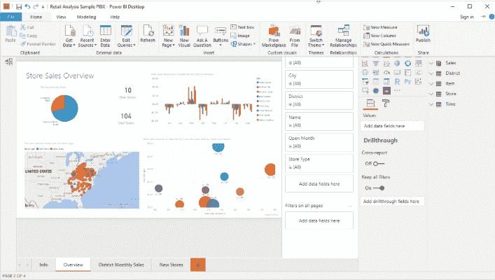

# 超级商务智能桌面:以前所未有的方式可视化数据

> 原文：<https://www.edureka.co/blog/power-bi-desktop/>

我们生活在数据不断膨胀的时代。哪里有数据，哪里就有分析。任何曾经使用过数据或渴望使用数据的人都需要有使用一些工具的实践经验。一个这样的工具是**微软 Power BI 桌面**。

我想这就是为什么你们都在这里。因为你可能听说过或者读过微软的这个新的终端分析工具。嗯，你来对地方了。 这个博客，具体来说，将帮助你入门 [***Power BI 认证培训***](https://www.edureka.co/power-bi-certification-training) 。希望你喜欢学习这项新技术。

在本 *Power BI Desktop* 教程中，您将学习以下主题:

*   **[什么是权力匕？](#powerbi)**
*   **[什么是权力 BI——桌面](#powerbi-desktop)**
*   [**电源 BI–桌面安装**](#desktopinstallation)
*   [**将数据集导入 Power BI–桌面**](#getdata)
*   [**电力 BI-桌面中的基本视图**](#basicviews)
*   [**一栋楼**](#report)
*   [**出版一份报告**](#publishreport)

那么，让我们先来稍微了解一下权力匕。

## **什么是权力 BI？**

是微软基于云的 ***[商业智能](https://www.edureka.co/blog/business-intelligence-tools/)*** 服务，为非技术业务用户提供 [***报表***](https://www.edureka.co/blog/power-bi-reports/)***分析*** 和 ***可视化*** 工具。

博客中的所有概念在这里给出的视频中都有详细的解释。

[https://www.youtube.com/embed/3u7MQz1EyPY?rel=0&showinfo=0](https://www.youtube.com/embed/3u7MQz1EyPY?rel=0&showinfo=0)

本 Edureka 视频将帮助您详细了解和学习 Power BI。此视频对于初学者和希望掌握 Power BI 概念的专业人士来说都是理想之选。

## **什么是 Power BI 桌面？**

*Power BI Desktop* 让您能够摄取、转换、集成和丰富您的数据。Power BI Desktop 连接到您的所有数据源，并通过可扩展的仪表板、交互式报告、嵌入式视觉效果等简化数据评估和共享。

Power BI Desktop 最常见的用途如下:

*   连接到数据

*   转换和清理数据，以创建数据模型

*   创建视觉效果，如图表或图形，提供数据的可视化表示

*   在一个或多个报表页面上创建可视化集合报表

*   使用 Power BI 服务与其他人共享报告

最经常负责此类任务的人通常被认为是(有时被称为  *分析师*)或商业智能专业人士(通常被称为  *报告创建者*)。

然而，许多不认为自己是分析师或报告创建者的人使用 Power BI Desktop 来创建引人注目的报告，或者从各种来源提取数据并构建数据模型，以便与他们的同事和组织共享。

在 *Power BI 桌面上创建报表*基本包括 3 个步骤:

*   将数据集导入模型
*   体验可视化效果
*   创建报告

你用得越多，你就会掌握得越好。那么，我们开始吧。

**了解我们在顶级城市举办的 Power BI 培训课程**

| 印度 | 美国 | 其他国家 |
| [海德拉巴的 Power BI 培训](https://www.edureka.co/power-bi-certification-training-hyderabad) | [达拉斯的 Power BI 球场](https://www.edureka.co/power-bi-certification-training-dallas) | [墨尔本 Power BI 球场](https://www.edureka.co/power-bi-certification-training-melbourne) |
| [班加罗尔的 Power BI 培训](https://www.edureka.co/power-bi-certification-training-bangalore) | [夏洛特动力 BI 课程](https://www.edureka.co/power-bi-certification-training-charlotte) | [伦敦 Power BI 课程](https://www.edureka.co/power-bi-certification-training-london) |
| [在钦奈的电力 BI 培训](https://www.edureka.co/power-bi-certification-training-chennai) | [纽约的 Power BI 课程](https://www.edureka.co/power-bi-certification-training-new-york-city) | [悉尼 Power BI 球场](https://www.edureka.co/power-bi-certification-training-sydney) |

**Power BI 桌面安装**

这是一个非常简单的过程。你要做的就是:

*   前往**powerbi.com**
*   **产品> >电源 BI 桌面> >下载页面**
*   点击**下载**按钮下载

你可以先做一个免费用户，如果你愿意，以后可以下载付费版本。你可以在**定价**页面上看到免费用户和付费用户的区别。基本的区别只出现在数据使用能力上。

您可以从这里直接打开您的 *Power BI 桌面*。所以，当打开 *Power BI 桌面*时，你看到的是这些关于构建报告、查询概念等的教程视频。 

## **将数据集导入 Power BI 桌面**

为了构建仪表板，您要做的第一件事就是连接到数据源。以下是导入数据集时需要遵循的步骤。

*   点击**获取数据**按钮
*   选择您想要连接的数据源。你有 excel，CSV，azure 等。你甚至可以从网页上抓取数据，所以有很多好东西。
*   **将**加载到你的模型中。 

## **Power BI 桌面中的基本视图**

因此，当你第一次加载数据时，你会看到一个空白屏幕。在左边，你可以看到这三个基本视图。

1.  ### **报表查看**

    您将在这里创建仪表板。

2.  ### **数据视图**

    在这里，您可以预览您的数据，并根据需要进行修改。这也是您可以创建新的计算列的地方。

3.  ### **关系视图**

    在这里你可以看到对象之间的关系。

## **亲提示**

从**数据视图**开始总是明智的。您基本上可以预览数据的外观。在您真正开始创建仪表板之前，有几件事情需要注意。

1.  ### **重命名列**

    我们正在为用户构建仪表板。所有的命名约定和数据类型都将出现在表面上，我们希望它尽可能具有交互性。

2.  ### **删除列**

    任何在模型中不是绝对必要的东西——删除它。因为它会增加模型的大小，并在处理时占用更多的系统资源。

3.  ### **隐藏列**

    隐藏您稍后需要用于计算的列，但用户不一定需要看到。隐藏列将灰显，不会出现在报告视图中。

    

完成所有转换后，您可以直接进入 Power BI 桌面的报告视图。

## **大楼报告**

现在，您已经准备好开始有趣的部分，它正在创建报告。

这很容易操作。因此，如果我想创建一个图表，我所要做的就是选择你的**数据字段**，将它们拖放到显示**将数据字段拖到这里**的地方。

It should end up looking something like the following.****

## **发布报告**

现在您已经准备好将它部署到 Power BI 站点。你所要做的就是点击屏幕右上角的**发布**按钮。

现在您已经了解了关于 *Power BI Desktop* 的所有内容，继续使用这项技术创建全面而强大的可视化报告。 你可以使用这些 ***[样本数据集](https://drive.google.com/drive/folders/1_SSoYp81ziJlPm6Ub4ER6ZX6Ost5Zn7X?usp=sharing)*** 开始试验 Power BI 桌面。

如果你希望在商业智能领域建立职业生涯，我们的[商业智能课程](https://www.edureka.co/masters-program/business-intelligence-certification)将帮助你挖掘数据，并增强整个组织的决策过程。