# Power BI 教程:带示例的逐步指南

> 原文：<https://www.edureka.co/blog/power-bi-tutorial/>

如今，很少有人对商业智能的概念感到陌生。随着每天都有更新的工具出现来帮助解决数据管理的危机，大多数组织已经开始或计划使用商业智能来解决他们的危机。Power BI 是微软最新的 BI 工具，主要目的是帮助每个人分析和可视化他们的数据。本 Power BI 初学者教程将按以下顺序让你对 Power BI 有一个完整的了解:

1.  [什么是商业智能，我们为什么需要它？](#WhatIsBusinessIntelligenceAndWhyDoWeNeedIt)
2.  [什么是数据可视化及其重要性？](#WhatIsDataVisualizationAndItsImportance?)
3.  [需要力量的匕](#NeedForPowerBI)
4.  [什么是权力 BI？](#WhatIsPowerBI?)
5.  [功率 BI 的分量](#ComponentsOfPowerBI)
6.  [权力架构毕](#ArchitectureOfPowerBI)
7.  [power bi 的特性](#featuresofpowerbi)
8.  [Power BI 中的数据源](#datasourcesinpowerbi)
9.  [使用电力 BI 的公司](#companiesusingpowerbi)
10.  [安装电源 BI 的步骤](#stepsforinstallingpowerbi)
11.  [积木式的力量匕](#BuildingBlocksOfPowerBI)
12.  [使用 Power BI](#CreatingAReportUsingPowerBI) 创建报告
13.  [Power BI 用例:wire pas](#UseCase)
14.  [功率 BI 和 Tableau 之间的差异](#diffpowerbitableau)
15.  [功率 BI 和 SSRS 之差](#diffpowerbissrs)
16.  [功率 BI 和 MSBI 之差](#diffpowerbimsbi)
17.  [电力历史 BI](#historyofpowerbi)
18.  [权力 BI 的利弊](#proscons)
19.  [电动 BI 工具](#powerbitools)
20.  [谁用电 BI](#whousespowerbi)
21.  [Power BI 中使用的关键术语](#keyterms)

*您可以浏览一下这个微软 Power BI 记录，其中我们的 **[Power BI 课程](https://www.edureka.co/power-bi-certification-training)*** 专家*已经用示例详细地解释了这些主题，这将帮助您更好地理解这些概念。*

## **异能 BI 初学者教程|异能 BI 培训| Edureka**

[//www.youtube.com/embed/gqO0EiCn4cY?rel=0&showinfo=0](//www.youtube.com/embed/gqO0EiCn4cY?rel=0&showinfo=0)

本视频将帮助您了解什么是智能以及智能电源。然后，在本视频中，我们讨论了 Power BI 的组件和构建模块。

## **异能匕初学者教程**

让我们从解决最重要和最基本的问题开始这个强大的 BI 教程，商业智能到底是什么？

## **什么是商业英特尔 ligence (BI)？**

在这个时代，商业智能已经成为比大多数趋势技术更大的领域，如果你问 20 个人商业智能是什么意思，你可能会得到 10 个不同的答案。所以让我用最简单的术语来表达，不要失去它的技术性。商业智能(BI)是将原始数据转换成有意义和有用的商业分析信息的一套技术和工具。简而言之，商业智能是一种在正确的时间将正确的数据提供给正确的人的技术，以便他们能够做出更有效的商业决策。

下图展示了商业智能的优势。

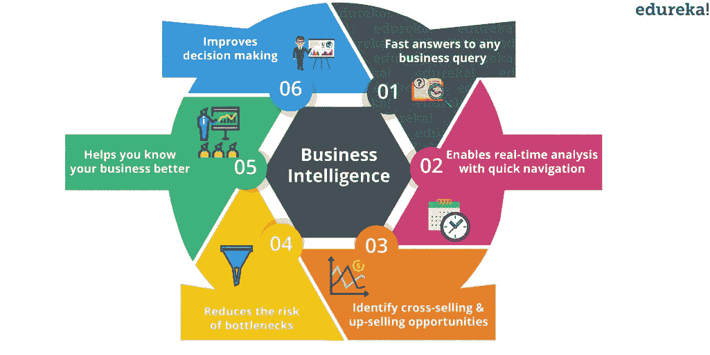

O 多年来，商业智能的过程已经发展并适应于通过涉及更新的工具和技术来帮助解决处理数据时的几乎所有挑战。商业智能这些年来所经历的变化可以分为三波，所以让我们继续我们的 Power BI 教程，看看这三波。

**第一波:技术(IT 到最终用户)**

在第一波商业智能浪潮中，最终用户不得不依赖 IT 部门来获得数据洞察力。这是因为最终用户不可能自己创建可视化/报告，因为可用的工具需要技术知识。这种对 IT 部门洞察力的依赖导致了更多的精力和时间消耗来完成更新。

**第二波:自助服务(分析师到最终用户)**

第二波浪潮让分析师们接触到了商业智能。现在，具有一些分析知识的人可以使用 BI 工具。这意味着更多的团队可以访问 BI，更多的人可以获得更好的数据洞察力，这缓解了 IT 团队的角色。

**第三波:所有人(最终用户)**

第三次浪潮使得访问数据、创建报告和可视化工具变得更加容易，从而获得更好的业务洞察力。Power BI 等工具的引入使这种转变变得容易。现在，任何对数据有基本了解的人都可以创建报告来构建直观且可共享的仪表板。

这是关于 BI 的，现在让我们继续我们的 Power BI 教程，并了解与 BI 相关的另一个重要主题。

## **什么是数据可视化及其重要性？**

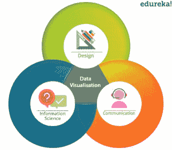简而言之，数据可视化就是信息/数据的图像或图形表示。它通过以更直观和更有意义的方式交流关键方面，提供了对复杂数据集的见解。数据可视化处于设计的、*传播学、*、*信息科学的【交汇点】。*

即使数据可视化已经被 称为二十一世纪研究 的关键技能， 也可以追溯到很久以前。它存在于 18 世纪晚期，可以追溯到威廉·普莱费尔发明几何图的时候。1781 年，他的条形图被用来表示苏格兰对 17 个国家的进出口情况。这些条形图构成了对离散定量比较问题的一个纯粹的解决方案。

### **为什么数据可视化很重要？**

人类大脑处理信息的方式是，使用图像、图表或图形来理解和可视化大量复杂的数据比使用电子表格或报告更容易。以任何图像为例，我们都知道“一幅图像胜过千言万语”这句话。这是完全正确的，因为图像不仅仅是像素的集合，它们还包含大量信息。视觉形式的信息比阅读文本形式的信息更容易理解。

数据可视化是一种以通用方式传达概念或信息的快速简便的方法。 数据可视化可以帮助到:

*   识别关键区域和隐藏模式。
*   获取能够更好地洞察客户的因素。
*   正确分析和关联数据和产品。
*   做出正确的预测。

这是关于数据可视化的。接下来，在这个 Power BI 教程中，我们将了解 Power BI 为什么重要。

以下几点使 Power BI 成为数据可视化的重要工具之一。如果不理解这些要点，这篇 Power BI 教程将是不完整的。

*   **实时发现趋势:** 传统的 BI 工具，如 Tableau 或 Qlikview，会限制您进行历史分析。通过使用 Power BI，您可以访问*实时*信息，从而尽早发现趋势。通过这样做，您可以发现问题并提高性能。
*   **自动搜索隐藏的洞察:**借助 Power BI，您可以使用*快速洞察在几秒钟内自动搜索数据集以找到隐藏的洞察。*用户可以简单地提出问题，Power BI Q & A 会立即回答他们的问题。
*   **自定义** **可视化:** 借助自定义的可视化效果，Power BI 允许您以几乎所有可能的方式来可视化数据。因此，你并不局限于盒子里的东西。

*   **企业级:** 借助 Power BI 和 Power BI Desktop，您可以安全地连接到自己的内部数据源。借助 内部*数据网关*，您可以实时连接到您的 SQL Server 和其他数据源 。它提供了安全、可扩展和可靠的企业级信息技术。

上述原因使得 Power BI 在数据可视化的背景下非常重要。让我们继续这个 Power BI 新手教程，了解什么是 Power BI。

## **什么是权力匕？**

Power BI，嗯这个名字在 BI 市场上已经有相当长的时间了。微软团队花了很长时间构建了一个名为 Power BI 的大伞，这个伞结合了强大的可视化、数据分析和基于云的工具。

定义一下，Power BI 是微软提供的一项商业分析服务。它提供了具有自助业务智能功能的交互式可视化，最终用户可以自己创建报告和仪表板，而不必依赖信息技术人员或数据库管理员。

Power BI 还为您提供基于云的 BI 服务，称为“Power BI 服务”，以及基于桌面的界面，称为“Power BI 桌面”。它提供了数据仓库功能，包括数据准备、数据发现和交互式仪表板。【2016 年 3 月，微软在其 Azure 云平台上发布了一项名为 Power BI 的额外服务，该服务使用户能够轻松分析数据，执行各种 ETL 操作，并通过 Power BI 交付报告。

Power BI 网关可让您将 SQL Server 数据库、分析服务和许多其他数据源连接到 Power BI 中的 仪表板 和re porting门户，嵌入 Power BI 报告和仪表板，为您提供统一的体验。下图显示了 Power BI 的一般工作流程。

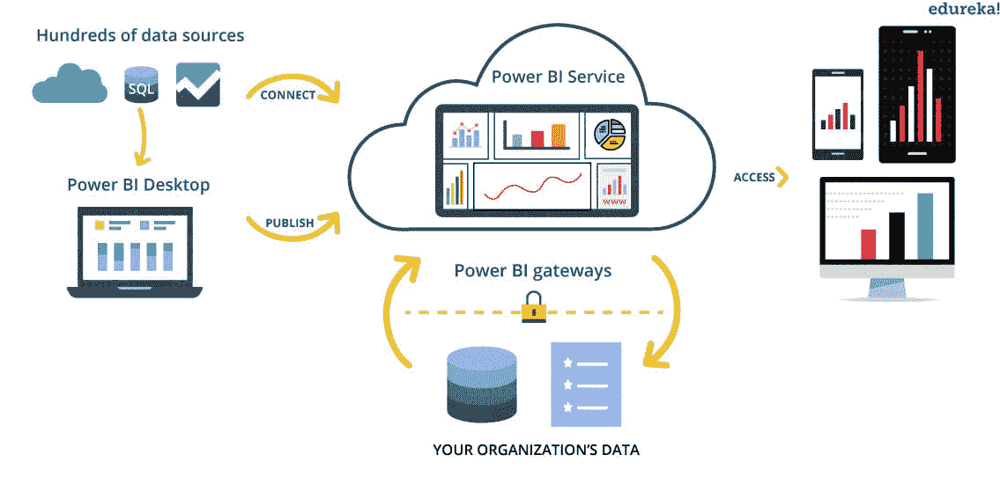 既然我们已经了解了什么是 Power BI，那么就让我们在本 Power BI 教程的下一个主题中尝试并了解它的重要组成部分。

## **电力元件毕**

电源 BI 由以下部分组成:

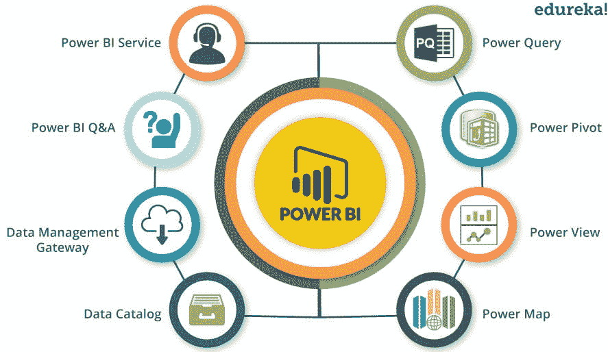

*   **Power Query:** 可用于搜索、访问和转换公共和/或内部数据源。
*   **动力中枢**:用于内存分析的数据建模。
*   **Power View:** 您可以使用 Power View 对数据进行分析、可视化并显示为交互式数据可视化。
*   **Power Map:** 它通过交互式地理可视化将数据带入生活。
*   **Power BI 服务:**您可以共享可从内部和基于云的数据源刷新的数据视图和工作簿。
*   **Power BI Q & A:** 提出问题，用自然语言查询得到即时答案。
*   **数据管理网关:**通过使用该组件，您可以定期刷新数据，显示表格并查看数据馈送。
*   **数据目录**:用户可以使用数据目录轻松发现和重用查询。可以为搜索功能提供元数据。

既然我们已经看到了上面提到的组件。让我们继续这个 Power BI 教程，了解 Power BI 的架构。

## **异能架构毕**

下图显示了 Power BI 的架构。

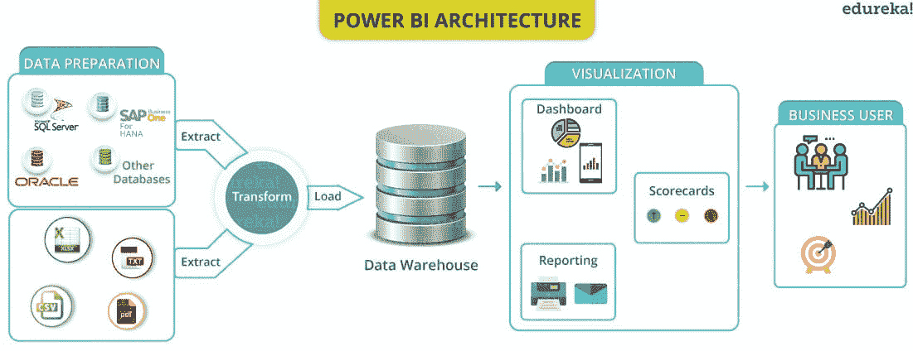

Power BI 的架构分为三个阶段。前两个阶段部分使用 ETL(提取、转换和加载)来处理数据。让我们一个一个来看看这些阶段:

### **1。数据整合**

一个组织可能需要处理来自不同来源的数据。来自数据源的数据可以以不同的文件格式 成为 。数据首先从不同的来源提取，这些来源可以是不同的服务器或数据库等。然后，这些数据以标准格式集成，并存储在一个称为暂存区的公共区域。

### **2。数据处理**

集成的数据仍未准备好进行可视化，因为数据在呈现之前需要处理。这些数据经过预处理或清理。例如，从数据集中删除缺失值或冗余值。清理数据后，将业务规则应用于数据，并将其转换为可呈现的数据。然后将这些数据加载到数据仓库中。

### **3。数据展示**

因此，一旦加载并处理了数据，就可以使用 Power BI 提供的各种可视化工具更好地对其进行可视化。使用报告、仪表板有助于以更直观的方式呈现数据。这些视觉效果和报告有助于企业最终用户根据洞察做出业务决策。

**功率 BI 的特性**

1.  **可视化:**

Power BI 提供了可视化表示我们的数据或其子集的功能，以便可以使用它进行推断或获得对数据的更深入理解。这些视觉效果可以是条形图、饼图等。以下是 Power BI-中提供的一些基本可视选项的示例

1.  **卡片**–用于表示单一数值，如总销售额等。
2.  **堆积条形图/柱形图**–它们结合了折线图(用一条线连接代表一些值的点)和条形图/柱形图(代表与目的和其他可选字段相对应的值)。
3.  **瀑布图**–它代表一个不断变化的数值，数值的增减可以用不同颜色的条来表示。
4.  **饼图**–它代表特定字段的每个类别的分数值。
5.  **地图**——用来表示地图上不同的信息。
6.  **KPI**-它代表朝着目标取得的持续进展。
7.  **切片器**–切片器有代表字段不同类别的选项。选择该类别只会在其他视觉效果中显示特定于该类别的信息。
8.  **表格**–表格以表格形式表示数据，即行和列。

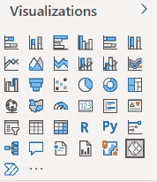

以下是使用 Power BI 创建的 4 种基本视觉效果(切片图、表格、饼图和堆积柱形图)的示例。

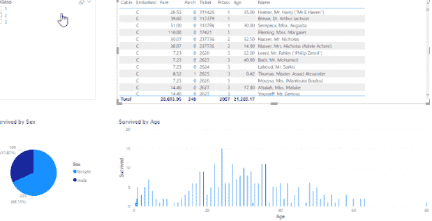

除了这些基本的视觉效果，还有获得更多视觉效果的选择。通过点击“获得更多视觉效果”选项，我们获得以下选项-

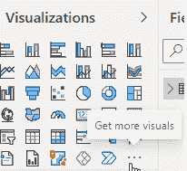

1.  **自定义视觉文件**–自定义视觉可以编码并存储在文件中。pbiviz 扩展。该选项使用户能够导入这样的视觉效果。
2.  **组织视觉效果**–该选项可用于导入特定于用户组织的视觉效果。
3.  市场视觉效果-它用于从微软及其社区成员导入视觉效果。

2.  **采购各种数据集**

power bi 中的数据集可以来自

一些常见的数据源示例是-

*   擅长
*   Power BI 数据集
*   功率 BI 数据流
*   SQL Server
*   MySQL 数据库
*   分析服务
*   蔚蓝的
*   Text/CSV
*   神谕
*   便携文档格式
*   接近
*   可扩展标记语言
*   JSON

3.  **数据集过滤**

在获取数据时，用户可以获取数据集的子集，而不是导入整个数据集。该子集可以根据用户要求。数据可能与 Excel，SQL 数据库，Azure，脸书，MailChimp 等集成。

数据可以来自单一来源，也可以来自多个来源。以下是 Power BI 中的数据集示例

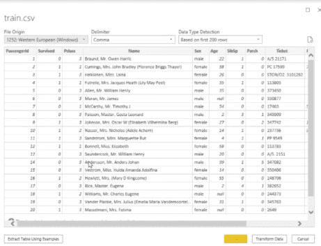

点击转换数据。

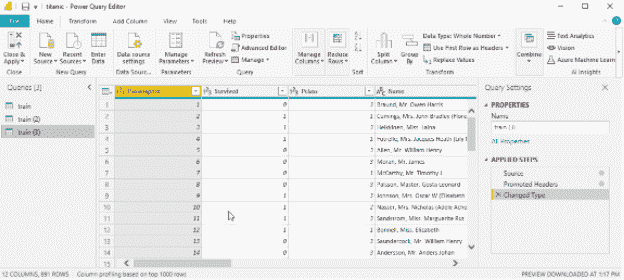

用户可以根据需要选择行或列，从而创建所需的子集。该选择可以基于某个条件，例如选择包含特定范围内特定字段的值的行。

下图显示了应用于上述数据集中 Pclass 字段的过滤器。

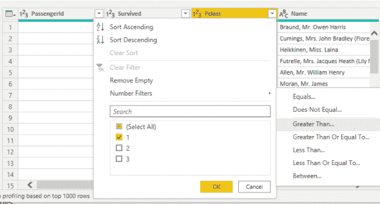

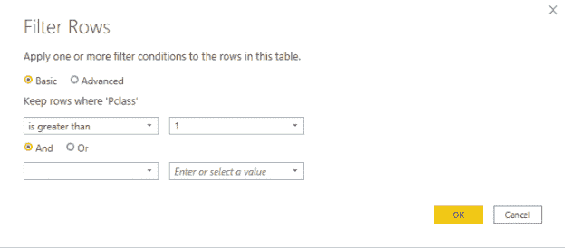

应用过滤器后，它只显示属于 Pclass 2 和 3 的行。

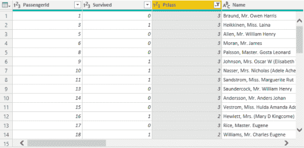

4.  **报告:**

与 Power BI 中特定主题相关的可视化集合构成了一个仪表板。这些仪表板的组合形成了一个报告。报告包含与特定主题相关的视觉效果。用户可以在报告中添加任意数量的页面。每一页都是包含视觉效果的单个屏幕。页面可以按照用户要求的顺序排列。

下图显示了一个示例报告。

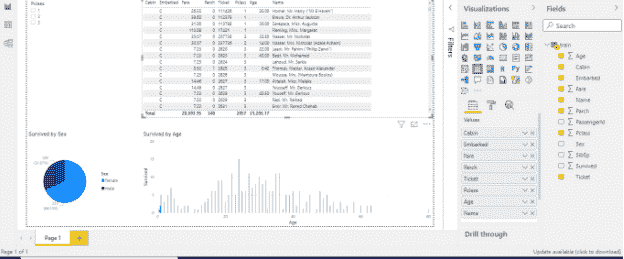

5.  **仪表盘:**

出现在单个 Power BI 页面上的所有视觉效果构成了一个仪表板。它是报告中的一页。视觉效果可以按任何顺序或位置排列。因为它是一个单一的页面，一个仪表板通常只包含最重要的或相关的视觉效果。每个仪表板也可以与其他用户共享。

6.  **柔性瓷砖**

在 Power BI 中，图块是在报告或仪表板中找到的单个可视化内容。图块可以被认为是包含单个视觉对象的正方形或矩形边界。

每个瓷砖的高度和宽度都是可调的。仪表板上每个区域的顺序或位置也是可以调整的。

7.  **导航窗格**

导航窗格位于 Power BI 屏幕的顶部。它有以下选项卡-

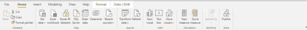

*   文件
*   主页
*   插入
*   系统模型化
*   视角
*   帮助

每个选项卡中都有一系列选项可供使用。

#### 8.问答框

单击插入选项卡中的问答按钮。用户可以在问答框中用自然语言键入任何与数据相关的问题。Power BI 将自动尝试使用诸如重新措辞、自动填充、建议等技术来自动完成问题。答案以可视或文本的形式返回。用户也可以选择将文本回复转换成视觉效果。

下图显示了一个用自然语言提出的问题(拼写会自动更正)及其数字回答，该数字也可以转换为视觉效果。

下图显示了转换为视觉效果的答案。

#### 9.DAX 数据分析功能

要对数据执行功能，用户可以使用一些预定义的 DAX 数据分析功能。目前 power BI 中有大约 200 个 DAX 预定义函数可用。DAX 或数据分析表达式是一种用于与 Power BI、PowerPivot 和 SSAS 等平台上的数据进行交互的语言。它简单易学，易于使用。

#### 10.支持和建议

#### **在帮助选项卡中，用户有各种选项，包括支持解决任何查询。用户还可以给出反馈或改进建议。**

11.  **与 R 整合**

Power BI 也可以与 R 脚本集成。这有助于数据清理、数据整形，从而获得高级分析。

12.  **安全-**

Power BI 提供强大的安全性，对每个成员的访问都受到控制。它提供了对安全威胁的快速响应。它还提供持续监控、报告、数据保护和统一终端管理等功能。

## **Power BI 中的数据源**

可以在 PowerBI 中导入的数据集合称为数据集。通过“获取数据”功能，Power BI 用户可以从一系列数据源中进行选择。数据源的范围可以从内部到基于云的、非结构化到结构化。每个月都会添加新的数据源。数据可能来自一个或多个可以组合在一起的不同来源。

要获取数据，请单击屏幕顶部的获取数据图标。每个类别可用的数据来源如下-

**文件类别:**

*   擅长
*   Text/CSV
*   可扩展标记语言
*   JSON
*   文件夹
*   便携文档格式
*   镶木地板
*   SharePoint 文件夹

**数据库类别**

*   SQL Server 数据库
*   Access 数据库
*   SQL Server Analysis Services 数据库
*   Oracle 数据库
*   IBM Db2 数据库
*   IBM Informix 数据库(测试版)
*   IBM Netezza
*   MySQL 数据库
*   PostgreSQL 数据库
*   Sybase 数据库
*   Teradata 数据库
*   SAP HANA 数据库
*   SAP 业务仓库应用服务器
*   SAP 业务仓库消息服务器
*   亚马逊红移
*   英帕拉
*   谷歌大查询
*   垂直的
*   雪花
*   Essbase
*   Actian (Beta 版)
*   AtScale 立方体
*   双连接器
*   数据虚拟 LDW
*   我的名字
*   哆来咪
*   Exasol
*   索引马
*   系统间 IRIS(测试版)
*   叶忒罗(贝塔)
*   凯莉安
*   Linkar 挑选风格/多值数据库(测试版)
*   MariaDB(测试版)
*   MarkLogic
*   亚马逊雅典娜(测试版)

**动力平台类别**

*   Power BI 数据集
*   功率 BI 数据流
*   公共数据服务(传统)
*   数据世界
*   电源平台数据流(测试版)

**天蓝色类别**

*   Azure SQL 数据库
*   Azure Synapse 分析(SQL 数据仓库)
*   Azure Analysis Services 数据库
*   PostgreSQL 的 Azure 数据库
*   Azure Blob 存储
*   Azure 桌面储物
*   天蓝色宇宙数据库
*   Azure 数据浏览器(Kusto)
*   Azure 数据湖存储第二代
*   Azure 数据湖存储第一代
*   Azure HDInsight (HDFS)
*   Azure HDInsight Spark
*   HDInsight 交互式查询
*   Azure 成本管理
*   Azure 数据块
*   Azure 时序洞察(测试版)

**在线服务类别**

*   SharePoint 在线列表
*   Microsoft Exchange Online
*   动态 365(在线)
*   动态导航
*   动态 365 商务中心
*   Dynamics 365 商务中心(酒店内)
*   微软 Azure 消费洞察(测试版)
*   Azure DevOps(仅限主板)
*   Azure DevOps 服务器(仅限主板)
*   Salesforce 对象
*   Salesforce 报告
*   谷歌分析
*   Adobe Analytics
*   appFigures(测试版)
*   数据。世界–获取数据集(测试版)
*   GitHub(测试版)
*   LinkedIn 销售导航器(测试版)
*   Marketo(测试版)
*   混合面板(测试版)
*   平面视图企业一号-PRM(测试版)
*   在线 QuickBooks(测试版)
*   智能工作表
*   火花柱(测试版)
*   SweetIQ(测试版)
*   平面视图企业一号 Beta(测试版)
*   Twilio (Beta)
*   Zendesk(测试版)
*   Asana(贝塔)
*   集合视图(测试版)
*   自动化无处不在
*   Emigo 数据源
*   Entersoft Business Suite(测试版)
*   eWay-CRM(测试版)
*   事实集分析
*   帕兰提尔铸造厂
*   Hexagon PPM 智能 API
*   工业应用商店
*   Intune 数据仓库(测试版)
*   Power BI 的项目位置
*   产品洞察(测试版)
*   快速基地
*   SoftOne BI (beta 版)
*   Spigit(测试版)
*   团队桌面(测试版)
*   Webtrends 分析(测试版)
*   维蒂维乌
*   工作场所分析(测试版)
*   Zoho 创建者(测试版)
*   Dynamics 365 客户洞察(测试版)

**其他类别**

*   Zucchetti HR Infinity(测试版)
*   空白查询

## **使用电力 BI 的公司**

以下是目前使用 Power BI 的一些公司

1.  史崔克
2.  德马蒂奇
3.  罗克韦尔自动化
4.  (美)政府雇员保险公司(Government Employees Insurance Company)
5.  指南针组
6.  舵

## **安装电源 BI 的步骤**

1.  先去微软 Power BI 桌面网站-[https://powerbi.microsoft.com/en-us/desktop/](https://powerbi.microsoft.com/en-us/desktop/)

2.点击免费下载按钮。将出现以下页面。

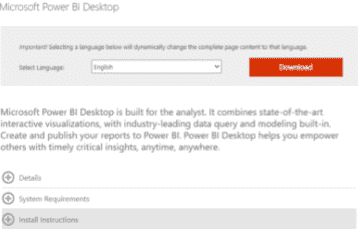

3.选择语言并单击下载按钮。出现以下页面-

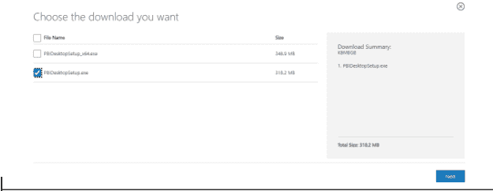

4.  选择要下载的文件，然后单击下一步。电源 BI 设置已下载。
5.  打开电源 BI 设置。
6.  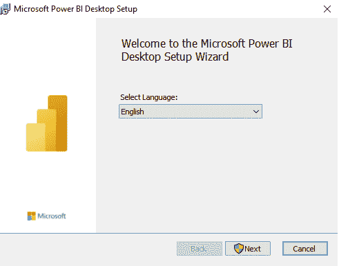

7.  单击下一步。
8.  接受条款，然后单击下一步。

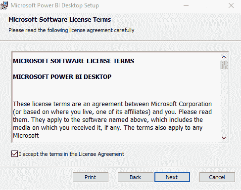

9.  根据需要选择目标文件夹，然后单击下一步。
10.  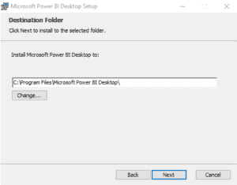
11.  点击安装。

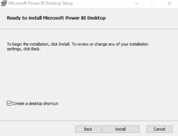

安装程序已安装。

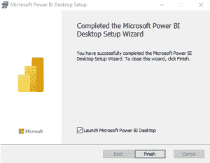

12.单击完成。

Power BI 桌面安装完成。

现在，我将进一步介绍 Power BI 教程，演示如何使用 Power BI 创建一个简单的报告。但是，入门的前提条件很少。首先，您需要在系统上安装一个“Power BI Desktop ”,这是一个您可以创建报告的界面。可以免费下载。您可以使用此 *[链接](https://goo.gl/kNVmzp)* 下载 Power BI 桌面。

您将需要使用一个组织电子邮件 ID 登录，比如一个机构电子邮件 ID 或您所在组织的电子邮件 ID。创建一个帐户很重要，因为这将使您能够访问 Power BI 服务，这是发布您的报告和创建仪表板所必需的。

下载了 Power BI 桌面后。你需要一个数据集来可视化它。我将使用微软创建的财务数据集，它可以通过这个 *[链接](https://goo.gl/Ebgnpu) 下载。*

## **创建报表使用权力 BI**

下图显示了 Power BI 台式机的界面外观。左侧面板中以蓝色突出显示的部分显示了报告、数据和关系工作区。默认情况下，*report*workspACe 将打开。 这是你创建报表的地方。报告工作区下面是数据工作区，用于查看导入的数据集。最后一个选项卡是 relations 选项卡，它给出了数据集中不同变量之间的关系，如果它们定义得很好的话。在右侧，您将看到可视化效果和外业工作空间。

### **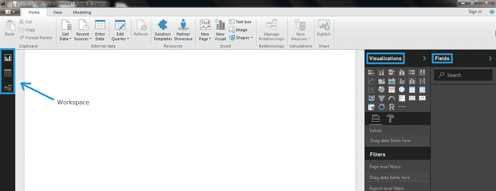**

### **电力 BI 教程:导入数据**

因此，让我们将财务数据集导入 Power BI。您可以点击下图中突出显示的 G *et Data* 选项卡，并加载数据以供使用。

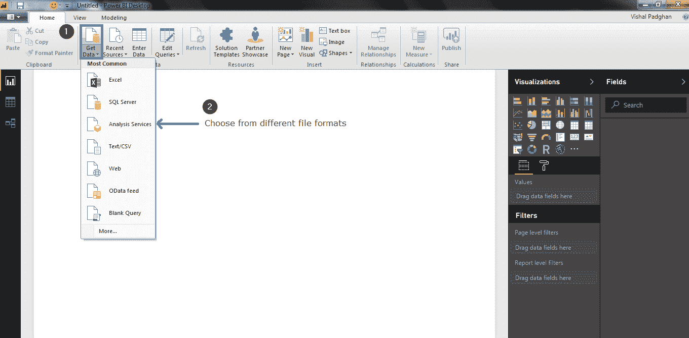

我已经添加了*金融*数据集。Power BI 会问你是要加载数据还是编辑数据。我只是简单地加载了它，因为数据集不需要任何编辑。

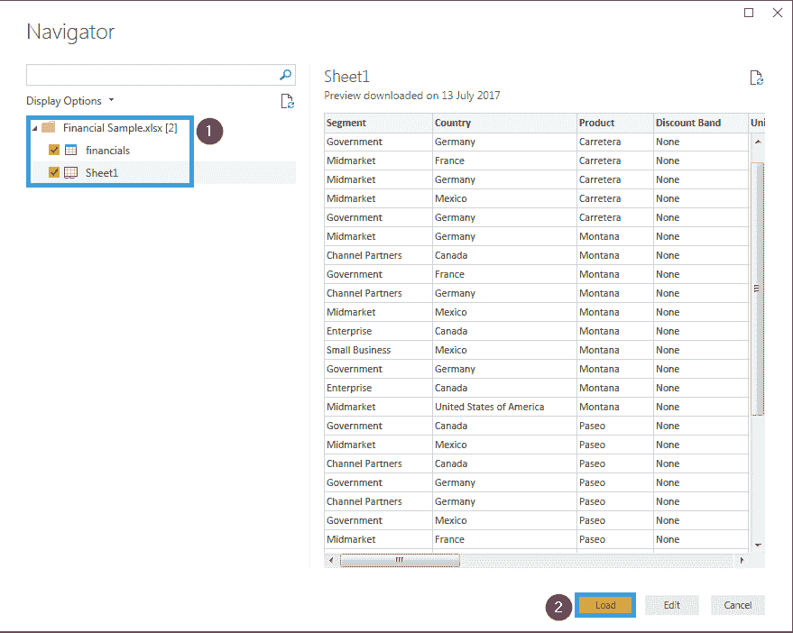

点击界面左上角的*数据选项卡*即可查看。如果你看过这些数据，你就会明白，这只是关于几个国家及其总体销售情况的简单数据。在屏幕的右上角，您可以看到数据集的所有字段。使用下面的图片作为参考。

### **异能 BI 教程:创建可视化效果**

让我们回到报告工作区，创建一个简单的报告。第一步是选择一个可视化。我会使用聚集柱形图可视化。当您单击所需的可视化时，会在报告工作区中创建一个模板。

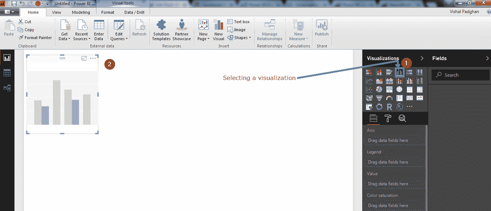

既然我们已经选择了可视化，我将在 Y 轴上显示销售额和利润，在 X 轴上显示日期。因为您使用的是 Power BI，所以您不必担心选择轴的复杂性。您只需选择字段，它就会反映在图表中。参考下图。

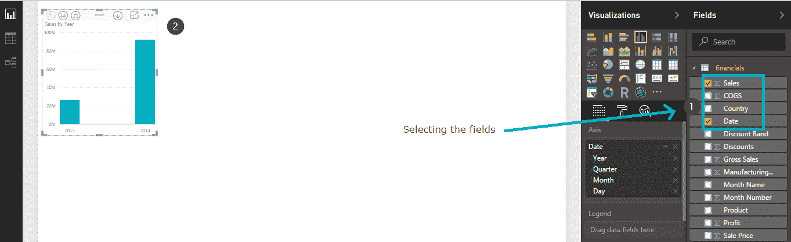

您甚至可以在可视化界面上拖放字段，更改会立即反映出来。在下图中，我拖动了“利润”字段。

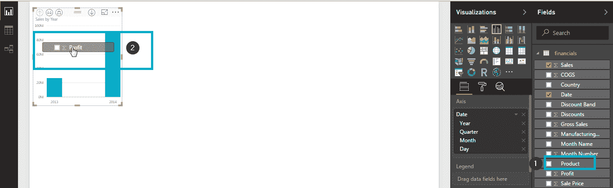

您可以通过拖动边框来调整这些可视化效果的大小，甚至可以通过单击并将其放置在工作区的任何位置来移动图像。

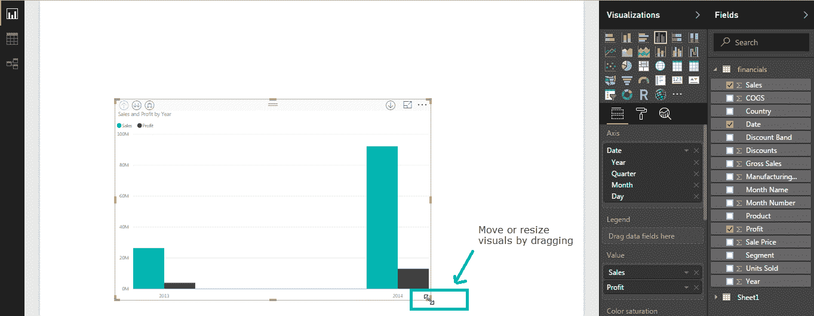

只需点击鼠标，您甚至可以根据时间表更改图形。我已经将上图中销售数据的年度表示法改为月度表示法。见识也完全变了。你可以参考下面的图片来看看这些变化。

在可视化面板下面，有*字段*和*格式*选项卡。通过使用*字段*选项卡，您可以执行统计操作，如计算各种参数的平均值、中值、总和甚至过滤数据。通过使用*格式*选项卡，您可以使用不同的配色方案来使您的可视化更具吸引力和洞察力。下图显示了如何更改可视化中使用的字段的颜色。

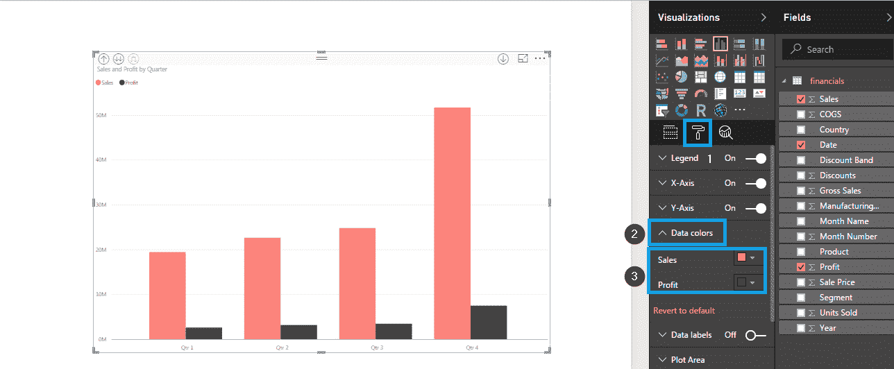

我们已经成功地创建了一个可视化。在 Power BI 中创建可视化就像这样简单。我希望到现在为止，你已经能够自己创建可视化了。你甚至可以将你的报告发布到网上。下图显示了如何在 Power BI 中发布报告。

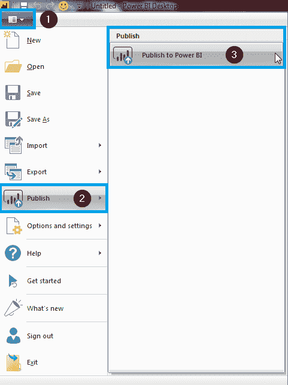

一旦发布报告，Power BI 会给你一个链接。您可以点击该链接，并在报告发布后查看报告。供您参考，我在一个报告中创建了一些其他的可视化，并将其发布。你可以把这份报告以 GIF 格式附在下面。以下已被可视化:

*   表示销售和利润的簇状柱形图
*   销售总额的国家地图表示
*   销售价格卡片可视化
*   不同国家销售单位的树形图。
*   季度销售饼图

当您在 Power BI 桌面上创建这样的报告时，您将获得洞察力，并可以深入了解统计数据。这可以通过点击可视化中出现的不同字段来实现。

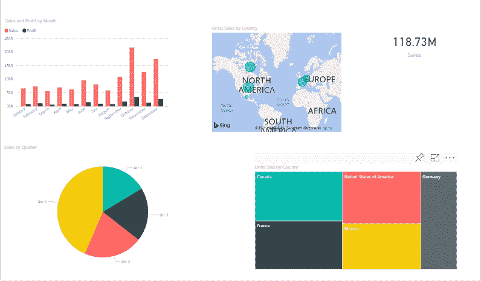

您可以选择适合您需求的视觉效果，并进行相应的实验。有很多可视化方法可以尝试和实验。此外，当谈到可视化时，没有两个人以相同的方式可视化数据，因此您的报告可能会产生不同的结果。这就是您使用 Power BI 创建和编辑报告的方式。

现在让我们继续前进，看一看本 Power BI 教程的最后一个主题。

## **功率 BI 用例:Wirepas**

让我们看看这个用例，了解一下 *Wirepas* 如何使用 Power BI 快速、轻松、有效地可视化大量传感器收集的数据。

**关于公司**

Wirepas 致力于为客户提供最可靠、优化和可扩展的设备连接。借助 Wirepas，客户可以数字化其当前的业务流程，并为新的颠覆性模式进行创新。Wirepas 总部位于芬兰坦佩雷，在法国、德国、韩国和美国设有办事处，于 2010 年在坦佩雷成立。

**挑战**

Wirepas technology 通过其连接服务收集各种数据。每个基于 Wirepas 软件技术的无线设备都可以收集和发送大量数据。这些数据通过多种方式收集，然后存储在数据库中。将这些数据可视化是获得技术跟踪的“事物”的当前状态的概述的关键。Wirepas 需要克服以下障碍:

*   数据是从数百万个不同格式的来源收集而来的
*   难以显示为包裹追踪服务收集的大量传感器数据
*   查找哪个包裹在何时何地
*   包裹的状态如何
*   终端用户如何理解收集的物联网数据

Wirepas 使用 Power BI 克服了上述所有挑战。让我们来看看解决方案。

**解押交付**

**采集数据**

数据从不同来源导入，并使用 Power BI 和查询编辑器进行清理。

**设计报表使用 Power BI 桌面**

在导入和清理来自 100 万个传感器的数据后，Power BI 用于设计仪表板，使客户能够获得所有数据的概览，并使他们能够深入了解一个*单个包裹和包裹历史*。

**创建一个 Power BI 工作空间**

为了在 Azure 中创建 Power BI 工作区，使用了 Power BI-CLI 。当时，没有 UI 可用于在 Azure 中为 Power BI 创建工作区。因此，他们使用 Power BI 命令行工具来管理 Power BI 嵌入式工作区集合。

**在 web app 中嵌入 Power BI**

*Power BI Embedded* 使开发者能够在几乎所有类型的应用程序中嵌入报告。这是将报告嵌入网站的最简单的方法。

以下架构用于解决整个问题:

## **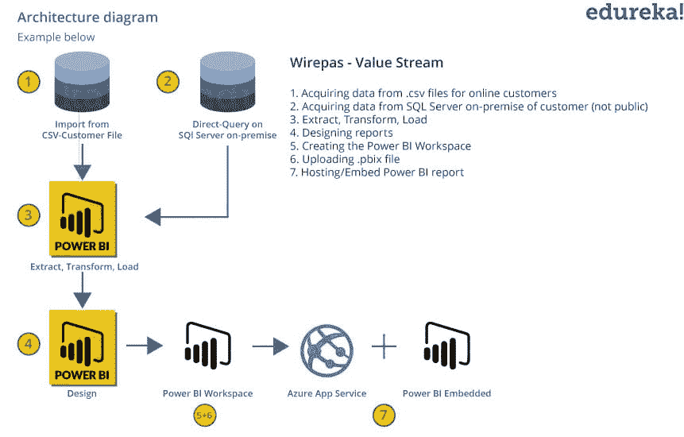**

## **结论**

对于 Wirepas 来说，这是一种将他们的知识产权引入云的明智方式，既简单又快速。整个项目需要有限的通话时间、咨询和实施。

对于博世互联世界来说，这是基于 Azure 和 Power BI Embedded 的复杂数据的简单演示。 自研讨会以来，Wirepas 已经赢得了几个新客户，他们正在使用由 Power BI Embedded 驱动的产品和仪表盘。

如果你需要详细了解这个用例，那么 你可以参考这个 *[链接](https://goo.gl/iZjpNH) ，*它将引导你到实际案例研究发表的页面。

## **功率 BI 和 Tableau 之间的差异**

它使用 DAX 语言来计算和测量列

| 表 | **功率 BI** |
| 它可以更好地处理大量数据。 | 它更适合较小的数据集。 |
| 比 power BI 稍微难用一点。 | 它更容易使用，更友好的用户。 |
| 在 Tableau 中嵌入报表更加困难 | 在 Power BI 中嵌入报告更容易 |
| Tableau 更贵。 | 动力 BI 更便宜。 |
| 它提供了更好的客户支持 | 它的客户支持不是很好。 |
| 专业知识较好的用户使用较多。 | 新手和专家用户都可以使用它。 |
| 它为数据存储提供了便利。 | 它不提供数据存储功能。 |
| 它可以连接到单个网络中的多个数据源。 | Power BI 只能连接到少数有限的数据源。 |
| 它使用 MDX 语言计算和测量列。 |
| 它被大中型组织使用。 | 它被小型、中型和大型组织使用。 |
| 它更多地用于长期运行的操作和分析。 | 它用于生成个性化的可视化和报告。 |
| 许可更加灵活。 | 动力 Bi 有严格的许可。 |

**功率 BI 和 SSRS 之差**

| **功率 BI** | **SSRS** |
| 它可以用于生成基于云的报告和基于服务器的报告。 | 它只能用于基于服务器的报告。 |
| 它对用户更友好。 | 它相对来说更难使用。 |
| 它是开源的，所有人都可以使用。 | 这是一个付费工具 |
| 它使用了更多的图形可视化，使用它不需要编码技能。 | 在 SSRS 获得专业知识需要编码技能.. |
| 它处理结构化和非结构化数据。 | 它处理结构化和半结构化数据。 |
| 电力毕是 SRSS 的继承者，有更多的特点。 | 它的功能更少。 |
| 也可以在移动应用程序上访问 | 无法在手机上访问。 |
| 获得专业知识不需要编码知识。 | 获得专业知识需要编码知识。 |
| 它提供了与人工智能集成的便利 | 没有配备人工智能的集成设施 |
| 只有专业服务和高级服务才需要许可。 | 多个版本都需要许可。 |
| 实现起来很容易。 | 实现更加复杂。 |
| 它有一个基于自然语言的问答选项 | 它没有基于自然语言的问答选项。 |

## **功率 BI 和 MSBI 之差**

| **功率 BI** | **MSBI** |
| 新手和有经验的用户都可以使用它 | 使用它需要编码知识。 |
| 它提供了更多的图形可视化 | 它提供了更少的图形可视化。 |
| 它不太具体。 | 它提供了更多的特异性。 |
| 它是基于云的软件 | 它不是基于云的，而是安装在本地。 |
| 它可以处理高达 10 MB 的数据 | 它可以处理更大量的数据。 |
| 免费版本的期限是 60 天。 | 免费版本的期限是 180 天。 |
| 学习 M 和 DAX 语言是获得专业知识所必需的 | 学习 MDX 语言需要获得专业知识 |
| 它有更高层次的视觉表现。 | 它用于更详细地表现视觉效果。 |
| 它可以用来创建数据模型以及可视化和报告。 | 它不能用于创建数据模型。 |

## **电力历史 BI**

*   Power BI 应用理念最早是由微软的 Thierry D'Hers 和 Amir Netz 提出的。
*   最初的项目名称是双子座。
*   它于 2009 年作为一个名为“PowerPivot”的 excel 插件发布。
*   慢慢流行起来。
*   2010 年，它被命名为新月计划。
*   2011 年 7 月 11 日公开发售。

## **权力 BI 的利弊**

| **优点** |
| 它是开源的，可以免费获得。 |
| 可以从本地以及其他连接的数据集导入数据 |
| 它会根据用户的建议定期更新。 |
| 由于数据存储在一个集中的位置，因此可以从任何地方访问。 |
| 它提供了交互式图形可视化，因此是用户友好的，易于使用。 |
| Power BI Embedded 允许用户将 Power BI 图表、视觉效果和报告嵌入电子邮件和网站。 |
| 用户还可以选择在 excel 中上传和查看数据。 |
| 它可以通过个人网关集成内部和其他数据源 |
| 转移到云时没有内存限制 |

| **CONS** |
| 使用 Power BI 即 DAX 所需的语言不好用。 |
| 它只能处理高达 10 MB 的数据。 |
| Power BI 在多于一个互连表的情况下性能不太好。 |
| Power BI 的用户界面非常拥挤，很难查看报告。 |
| 很难获得高级 Power BI 工具(如网关、Power BI 报告服务器、Power BI 服务)方面的专业知识。 |
| 它不提供数据清理功能 |
| 数据共享有限 |
| 生成视觉效果和报告的过程需要手动操作，无法实现自动化。 |

## **电动 BI 工具**

以下是各种可用的电动 BI 工具-

1.  **Power BI Desktop**——它是 Power BI 用来从头开始生成模型和报告的主要工具。它是开源的，对所有人都是免费的。
2.  **Power BI 服务**-这是一项在线 Power BI 服务，可以在云上访问。数据模型和报告托管在软件即服务(SaaS)上。管理和共享报告等都是通过云来完成的。它是一个付费工具。
3.  **Power BI 数据网关**-用于访问前提数据集中的数据，如 DirectQuery、Import、Live Query 等。在云上。网关由 BI 管理员安装。
4.  **Power BI 报告服务器**-用于托管分页报告、KPI、移动和桌面报告。它由 It 团队安装和管理。每 4 个月更新一次。
5.  **Power BI Mobile Apps**-该工具用于在移动设备上查看报告，包括 iOS、Android 和 Windows 应用程序。这些报告存储在 Power BI 服务报告服务器上。它是通过微软 Intune 管理的。

## **谁用电 BI**

功率 BI 由以下类型的配置文件使用:

*   数据分析师
*   商业智能专家
*   没有技术背景的幼稚用户

Power BI 经常被管理层用来对公司的预测、客户行为等进行洞察和推断。它还可以用于跟踪组织内部员工的绩效等。

员工人数在 50-200 人、收入在 1000-5000 万美元的公司最常使用微软 Power BI。

## **Power BI 中使用的关键术语**

以下是 Power BI 中使用的一些关键术语

1.  **仪表板**-仪表板是 Power BI 中显示视觉效果的单个页面。每个视觉称为一个图块。可以按照用户的要求，以任何位置或顺序排列块。
2.  **向下钻取**–可以有一个层次结构，其中在仪表板上维护主题。下钻功能为用户提供了扩展任何一个主题可视化的选项，而无需通过单击特定级别的主题离开页面。
3.  **Drill through**-Drill through facility 使用户能够通过点击报告中的可视部分从一个报告导航到另一个报告。设计良好的仪表板包含更广泛的主题，这些主题可以通过在其他报告中进行钻取来扩展。
4.  **数据模型**-数据模型用于优化数据。他们以表格的形式存储数据。它们还显示了数据源之间的关系。它可以用来创建更复杂的仪表板和报告。
5.  **数据集市**-数据集市是一个关系数据库，其中存储了建模所需的数据。它也可以是更大的数据仓库的子集。
6.  **Power BI Embedded**–Power BI Embedded 是开发人员用来将 Power BI 仪表盘和报告嵌入到他们自己的应用、网站和工具中的产品。
7.  **Power view**–这是一款高度交互式且易于使用的工具，用于创建仪表盘和报告。Power View 需要 Analysis Services 多维数据集、表格模型或 PowerPivot 模型。它不能用于关系数据库中的数据。
8.  **SQL Server**–用于存储和管理数据。它用于事务/操作数据库。
9.  **分析服务**–该技术用于存储、优化和建模用于创建仪表板和报告的数据。它可以处理表格或多维数据。
10.  **内部**–内部资源是指位于组织自有设施中的资源，而不是所有人都可以通过网络访问的资源。
11.  **发布**–当 Power BI 中的用户发布报告时，该报告将被发送到中的 Power BI 服务。pbix 格式。这些。pbix 文件可以与其他用户共享。
12.  SaaS:这是软件即服务的缩写。它用于在 web 上交付应用程序。
13.  **关联**–关联指的是两件事情是如何关联的。正相关意味着当一个量增加时，另一个量也增加。而负相关是指随着第一件事的量增加，第二件事的量减少。
14.  **交叉过滤**–通过在一个视觉对象中选择一种类型，在另一个视觉对象上应用过滤器，这称为交叉过滤。
15.  **网关**–网关用于连接本地数据源。通过网关向云或基于移动的服务提供对内部数据的访问。

还有几个其他的关键字，你应该知道。请查看以下链接了解更多关键词:

https://docs.microsoft.com/en-us/power-bi/consumer/end-user-glossary

这篇博客到此结束。我希望你喜欢这个 Power BI 教程博客。这是力量 BI 系列的第一篇博客。这篇 Power BI 教程之后将是我的下一篇博客，重点是 Power BI 仪表板，也请阅读。

#### 订阅我们的 youtube 频道获取新的更新..！