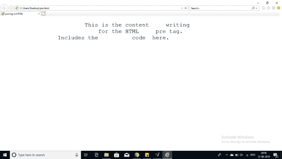

# 知道如何在 HTML 中实现前置标签

> 原文：<https://www.edureka.co/blog/pre-tag-in-html/>

在 [HTML](https://www.edureka.co/blog/what-is-html/) 中的

```
标签用于识别预先格式化的文本。代码标签被所标记的代码包围。让我们理解这一点
```

*   [HTML 中的 pre 标签有什么用？](#what)
*   [特定属性和浏览器支持](#attributes)
*   [例子<前置>标签](#example)

## **HTML 中的 pre 标签有什么用？**

在你的网络浏览器中，通常以固定间距的字体呈现托词，保留空白，不换行。

 在这种情况下，pre 标签将允许用户输入相同的空格和字体。下面提到的是 HTML 中的 pre 标签将在提到的表格中支持的特定属性。

## **特定属性和浏览器支持**

这个 HTML

```
标签还将支持以下附加属性:
```

*   **宽度**

*值:*号

*描述*:指定预格式化内容所需的宽度。

**浏览器支持**

这里列出了所有支持的浏览器。它给出了下面提到的表格。因此，如果你有任何这些它将支持。

| **铬合金** | **IE** | **歌剧** | **狩猎之旅** | **安卓** | **火狐** |
| **是** | ****是**** | ****是**** | ****是**** | ****是**** | ****是**** |

## **例子<前置>标签**

**例 1:**

```
<!DOCTYPE html>
<html>
		<head>
			<title> pre tag in HTML</title>
		</head>
		<body>

<pre>
			This is the content     writing
			    for the HTML     pre tag.
		Includes the          code  here.
		</body>
</html>

```

**输出:**



**例 2:**

```
<!DOCTYPE html>
<html>
		<head>
			<title> pre tag in HTML</title>
		</head>
		<body>

<pre>
			I'm working for           edureka
			Writing         blogs     on the        programming 
			                 language
		</body>
</html>

```

**输出:**


至此，我们结束了这篇关于 HTML 中 pre 标记的文章。我希望你通过这些例子了解了如何在 HTML 中预先格式化文本。一定要看看我们其他的 HTML 博客。

*查看我们的  [全栈 Web 开发人员硕士课程](https://www.edureka.co/masters-program/full-stack-developer-training) ，该课程包含讲师指导的现场培训和真实项目体验。本培训使您精通使用后端和前端 web 技术的技能。它包括关于 Web 开发、jQuery、Angular、NodeJS、ExpressJS 和 MongoDB 的培训。*