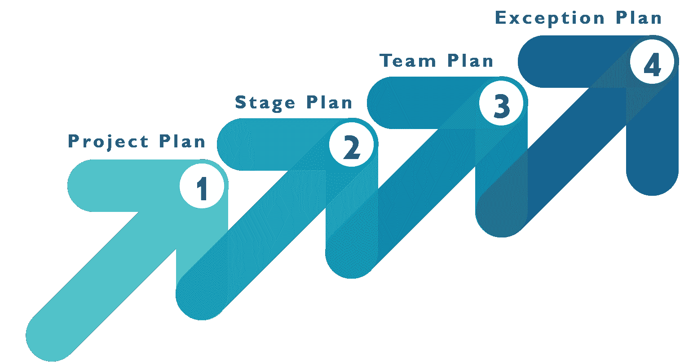

# 2023 年你需要知道的 50 个 PRINCE2 面试问题

> 原文：<https://www.edureka.co/blog/interview-questions/prince2-interview-questions/>

在今天的市场上，获得一份高质量的工作是一项相当具有挑战性的任务，尤其是如果你处于职业生涯的中级水平。在这种时候，拥有像 PRINCE2 这样的专业证书肯定会派上用场，而且会让你比没有证书的人更有优势。 [PRINCE2 认证](https://www.edureka.co/prince2-foundation-and-practitioner-certification-training)作为你成功管理任何复杂项目的技能、知识和信心的证明。但是仅有认证是不够的。你需要为面试做好准备，也要为面试扫清障碍。为了帮助你，我列出了 50 个最常见的面试问题，帮助你了解面试中会问什么样的问题，一定会帮你顺利过关。

## **PRINCE2 面试问题**

## **1。什么是 PRINCE2 认证？**

PRINCE2 认证是项目管理专业人士最青睐的认证之一。这里，**prince 2**代表**PR**objects**IN**Ccontrolled**E**n environments。PRINCE2 被认为是项目管理的最佳实践框架。它帮助经理在指定的预算内按时交付项目。使用 PRINCE2 方法开发的项目通常从详细而全面的计划开始。它为项目提供了一个适当的结构，每个阶段都有明确的开始、中间和结束。它更侧重于交付产品，而不是开展活动。一旦项目完成，所有的东西都被整齐地包装起来，所有的零碎东西都被处理好。

## **2。你对“项目”的理解是什么？**

项目是为了生产独特的产品或解决方案而进行的临时性努力。换句话说，一个项目有一个明确的开始和结束，最终产品必须是特定于项目的。一个没有这些属性的项目可能对我们的组织有害，因为它会消耗我们的时间、空间和其他资源。

## **3。PRINCE2 的 7 大主题是什么？**

以下是 7 个主题:

1.  商业案例
2.  组织
3.  质量
4.  风险
5.  规划
6.  变化
7.  进步

## **4。PRINCE2 的 7 个流程是什么？**

以下是 7 个流程:

1.  启动项目(SU)
2.  启动项目(IP)
3.  指导一个项目
4.  管理产品交付
5.  控制舞台(CS)
6.  管理阶段边界(SB)
7.  关闭项目(CP)

## **5。PRINCE2 的 7 个原则是什么？**

以下是 7 项原则:

1.  商业理由
2.  从经验中学习
3.  定义的角色和职责
4.  分阶段管理
5.  按例外管理
6.  专注于产品
7.  根据项目量身定做

## **6。列出****prince 2T5**认证的关键特性。****

下面我列出了 PRINCE2 认证的主要特点:

*   主要焦点是业务合理性
*   为项目管理团队清晰定义的组织结构
*   规划方法主要基于产品
*   它更强调将项目划分为可管理和可控制的阶段
*   有助于保持项目工作的一致性
*   增强项目模块的可重用性
*   灵活性可以应用于适合项目的任何级别
*   被项目管理专业人员广泛组织和理解
*   被认为是项目管理的一个非常有价值的诊断工具

## **7。指导一个项目有哪些不同的步骤？**

指导项目涉及各种活动，例如:

*   支持一个项目
*   接受结果或最终结果
*   提供管理层的批准

## **8。PRINCE2 方法中用于存储和报告项目相关数据的各种类型的文档是什么？**

下面我列出了 PRINCE2 方法中使用的各种类型的文档:

*   **业务案例:**它包含了为什么需要这个项目以及它对用户和业务的预期好处的详细描述。
*   **风险登记簿:**包含风险和机会的概率和潜在影响的列表。
*   **质量记录:**它包含了各种质量检查的运行日志，以确保交付物满足客户的期望。
*   **问题登记簿:**它保存了项目团队成员的问题和关注的列表。
*   **经验日志:**包含经验教训的笔记，可用于下一个工作阶段或未来项目。
*   **日志:**是由项目经理写的一种日志，用来汇报各项活动和进度。

## **9。在 PRINCE2 方法论中定义“计划”。**

计划通过强调计划范围所需的主要产品、活动和资源，提供了说明如何以及何时实现目标的时间表。简单来说，任何项目的计划都定义了以下内容:

*   风险、资源、沟通
*   范围、预算、进度、质量

## 10。在 **PRINCE2 方法论** **中，一个计划的各个层次是什么？**

以下是计划的 4 个级别:

1.  **项目计划:**项目计划为业务案例提供计划成本，也用于确定管理阶段以及项目中的其他主要控制点。项目委员会将该计划作为监控项目进展的基准。
2.  **阶段计划:**阶段计划涵盖特定阶段的各种产品、资源、活动和控制，用作监控阶段进度的基线。
3.  团队计划:团队计划是可选的，您不必遵循与项目计划或阶段计划相同的构成。因此，如果你使用团队计划，它将包括一个简单的时间表，附在分配给团队经理的工作包之后。
4.  **例外计划:**通常创建例外计划是为了显示在项目或阶段容差出现偏差的情况下，项目阶段将如何恢复。

## 

你甚至可以通过查看 ITIL 的详细情况。

## PRINCE2 面试问题

## **11。列出计划中涉及的各个步骤。**

规划中涉及的步骤有:

*   设计计划
*   定义产品
*   确定活动和依赖关系
*   准备评估
*   准备时间表
*   文档计划
*   识别风险

## **12。你能说出 PRINCE2 方法论提供的进度控制吗？**

以下是 PRINCE2 方法中的进度控制:

*   事件驱动
*   时间驱动

## 13。你对导演一个项目(DP)有什么理解？

指导项目是 PRINCE2 方法中的 7 个过程之一，它有助于项目委员会对项目的成功负责。它有助于项目经理做出关键决策和行使全面控制，同时委派项目的日常管理。

## **14。指导一个项目的各种目标是什么？**

以下是指导项目流程的目标，旨在确保:

*   它拥有启动项目的权限
*   它还有权交付项目的可交付成果
*   它为整个项目生命周期中的项目管理提供了更好的指导和控制
*   项目中提供了一个结构合理的公司或项目管理界面
*   拥有关闭项目的权力
*   项目后效益计划也在这一过程中得到管理和审查

## 15。在 **PRINCE2 方法论** **的哪个过程中提出了批准下一阶段计划的请求？**

在管理阶段边界流程中，准备批准下一阶段计划的请求。

## 16。解释质量计划和质量控制。

PRINCE2 方法中的质量规划确定项目质量要求的过程，如决定使产品符合目的所需的属性，并计划如何实现该产品。另一方面，质量控制是执行计划和进行质量测试以确保产品满足预期要求的过程。

## **17。在 PRINCE2 方法中，哪个文件用于记录产品批准和交付的计划日期和实际日期？**

产品批准和移交的计划和实际日期包含在产品清单文件中。

18。为什么 7 项原则在 **PRINCE2** **项目管理方法论中很重要？**

在 PRINCE2 方法中，原则是指项目管理从业者必须始终遵循的概念。这些原则是基于项目经理过去的成功经验而制定的。所有这些想法和概念都被过滤和压缩成一套日常活动和行为。因此，遵循这些原则将有助于项目的轻松管理和执行，并确保其成功。

## **19。哪个(些)部门负责在** **PRINCE2 方法论** **中建立项目容差？**

以下是负责 PRINCE2 方法的各个部门:

*   项目支持
*   项目委员会
*   项目管理
*   客户支持

## 20。使用哪种流程，可以在开发产品的同时，轻松地将非 **PRINCE2** **实践整合到一个****prince 2****项目环境中？**

PRINCE2 方法的 7 个过程之一称为管理产品交付，负责在开发产品时将非 PRINCE2 实践集成到 PRINCE2 项目环境中。

## **21。区分避免威胁和减少威胁？**

| **避免威胁** | **减少威胁** |
| 这基本上是一个简单的过程，在这个过程中，项目被改变以防止风险的发生。 | 这基本上是降低风险概率及其影响的尝试。避免风险可能是昂贵的，因此，大多数项目经理寻求降低风险的方法。 |

## **22。列出各种类型的项目？**

以下是项目的类型:

*   义务的
*   不以盈利为目的
*   外部项目
*   不断发展的需求
*   多组织项目

## **23。PRINCE2 提供的各种交付品有哪些？**

以下是 PRINCE2 可交付成果:

*   商业案例
*   阶段结束报告
*   工程计划
*   问题日志
*   word 包
*   风险管理计划

## **24。谁负责项目启动的授权？**

组织内的项目委员会授权项目启动。

## **25。为什么一个项目要分成几个阶段？**

将一个项目分成多个阶段有助于项目经理将整个项目活动分解成易于管理的小块。这为项目提供了更好的控制和执行。此外，通过将项目分成几个阶段，类似的工作可以组合在一起，资金和资源可以更好地分配到每个阶段。这反过来将提高效率，减少不必要的金钱和资源浪费。此外，通过这种方法，响应客户需求变得更加容易，并增强了项目的敏捷性。

## **26。哪个文件用于定义** **PRINCE2 方法论** **中项目的验收标准和作用？**

项目产品描述用于定义项目的验收标准和角色。该文件是在项目启动过程中创建的，并在项目结束过程中使用。该文档有助于验证项目是否符合客户期望。

## **27。在一个** **PRINCE2** **基础项目的哪个过程中，会产生一个检查点报告？**

在管理产品交付过程中，通常会生成一份检查点报告。这个过程负责管理和控制项目经理和团队经理之间的工作，通过设置一些关于项目产品的接受、执行和交付的正式协议。

## **28。质量评审技术的三个步骤是什么？**

以下是质量评审技术中涉及的三个步骤:

*   **准备:**这是在评审会议之前完成的，以讨论项目中可能错误且需要更新的内容。
*   **回顾会议:**在此会议中，提出并讨论各种问题，以确定故障或问题区域。然后制定一个行动计划来纠正这些错误。
*   **跟进:**这样做是为了确保所有的错误或问题区域都得到解决，最终产品可以交付给客户。

## **29。你所理解的配置管理** **王子 2 方法论** **？**

PRINCE2 中的配置管理是技术和管理活动，主要集中于在最终产品的整个生命周期中创建、维护和控制配置的更改。配置项只是受配置管理的主要实体。这个实体可以是要发布给客户的一个产品或一组产品的简单组件。

## 三十岁。列举一些在 PRINCE2 项目中实施的风险策略。

下面我列出了 PRINCE2 中使用的风险策略:

*   风险承受能力
*   风险偏好
*   正在进行的活动
*   回避，寻求，中立

## **PRINCE2 面试问题**

## 31。哪个 **王子 2** **主题解决了不同项目计划的持续可行性？**

PRINCE2 方法的最后一个主题，即进度，负责解决不同项目计划的持续可行性。

## 32。区分启动项目过程和启动项目过程？

| **启动一个项目** | **启动项目** |
| 这是收集信息的初始过程，以便快速决定是否启动项目 | 这是启动项目流程后执行的第二个流程。在这个过程中，文档在项目启动时被管理，并且进一步地，项目的治理被定义 |

## 33。 **PRINCE2** **的使用方法是什么？**

PRINCE2 整合了不同的方法，有助于增加项目的灵活性，从而使其更具响应性。它也有助于决定项目团队和分配他们的职责。PRINCE2 方法论得到了一套帮助你完成工作的过程、主题和原则。使用这种方法，信息收集也变得容易和有效。

## 34。谁被认为是 PRINCE2 项目的主要利益相关者？

以下是 PRINCE2 项目的主要利益相关方:

*   用户
*   供应商
*   商业赞助商

## 35。区分风险、质量和问题登记簿。

| **风险登记簿** | **质量登记** | **发行登记簿** |
| 这尤其用于控制可能对项目目标产生负面影响的风险。 | 这包括所有计划的质量活动和涉及的人员及其日期的细节 | 这包含一套关于项目成员提出的变更请求、投诉、关注和问题的说明 |

## 36。在哪个过程中风险管理战略创造了 **PRINCE2** **方法论？**

在启动 PRINCE2 方法的项目过程中，会创建风险管理策略。

## 37。谁决定了 **PRINCE2** **中的变更权限和变更预算？**

在 Prince2 中，主管专门负责确定变更权限和变更预算活动。

## 38。工作包的状态在哪个过程中被评审？

在控制阶段过程中，审查工作包的状态。

## 39。谁负责维护质量登记簿？

在基于 PRINCE2 的项目中，通常，项目支持负责维护质量登记簿。

## 40。区分 **PRINCE2** **中的变更请求、不合规格和问题或顾虑。**

| **变更请求** | **不合格** | **问题/顾虑** |
| 变更请求是客户为增加或改变项目范围或产品质量而提出的请求。客户必须为提出这一请求付费。 | 这是一个供应商犯错的过程，要么是没有在到期日交付产品，要么是没有达到规定的质量标准。 | 项目管理中的问题或顾虑可能会使项目偏离轨道。 |

## 41。PRINCE2 中定义了多少个产品，分别是什么？

在 **PRINCE2** 中定义了 26 种产品，我列出如下:

1.  福利审查计划
2.  商业案例
3.  检查点报告
4.  沟通管理策略
5.  配置项目记录
6.  配置管理策略
7.  每日日志
8.  项目结束报告
9.  末期报告
10.  例外报告
11.  突出显示报告
12.  发行登记簿
13.  问题报告
14.  课程日志
15.  课程报告
16.  计划–项目、阶段和团队
17.  产品说明
18.  产品状态帐户
19.  项目简介
20.  项目启动文件
21.  项目产品描述
22.  质量管理战略
23.  质量登记簿
24.  风险管理策略
25.  风险登记册
26.  word 包

## 41。哪个过程可以不遵循关闭项目(CP) 而进行？

无需遵循 PRINCE2 方法，即可轻松管理产品交付流程。

## **42。哪个角色负责根据商定的公差确认阶段和项目进度？**

项目保证部通常负责根据商定的公差确认阶段和项目进度。

## **43。在****prince 2方法论中，关闭项目(CP)流程的目标是什么？**

以下是项目收尾流程的各种目标:

*   验证用户对项目可交付成果的批准
*   确保产品交付和项目结束后的产品支持
*   通过将实际项目与基准文档进行比较，评审项目的项目绩效
*   评估已经获得的收益，然后计划项目完成后将获得的收益的评审
*   解决项目中的未决问题和风险，然后根据建议执行后续行动。

## **44。谁负责创建产品状态帐户？**

项目支持负责创建产品状态账户 PRINCE2 方法。

## **45。列出管理阶段边界所涉及的各种活动。**

以下是该流程中涉及的活动:

*   规划下一阶段
*   更新项目计划和业务案例
*   报告阶段结束
*   制定例外计划

## **46。PRINCE2 的 4 个综合要素是什么？**

PRINCE2 由以下四个综合要素组成:

1.  原则
2.  主题
3.  流程
4.  裁剪方法以适应项目环境的需求

## **47。你对** **PRINCE2 中的剪裁有什么理解？**

裁剪意味着通过确保有适当数量的计划、控制、治理以及过程和主题的使用，在手头的任何项目中适当地使用 PRINCE2 方法。

## **48。哪个过程负责触发交付项目的请求？**

启动项目流程负责触发在 PRINCE2 方法中交付项目的请求。

## 49。控制一个阶段，管理产品交付和管理一个阶段边界有什么区别？

| **控制载物台** | **管理产品交付** | **管理阶段边界** |
| 控制阶段是通过执行三个主要功能来管理项目日常工作的过程:

1.  给团队经理分配工作
2.  监控和报告交付情况
3.  采取纠正措施并控制计划

 | 管理产品交付是与控制阶段过程相联系的过程。在这里，团队经理负责产品交付，报告进度并将完成的工作返回给项目经理。 | 管理阶段边界是每次阶段接近其结束时执行的过程。在项目的这一点上，项目经理需要回顾当前阶段已完成的工作，评估未完成的任务，为下一阶段制定计划，并更详细地确定下一阶段的产品、成本和时间。 |

## 50。**prince 2方法论**中的商业案例是什么？****

PRINCE2 方法中的业务案例可以:

*   重新验证项目
*   启动项目
*   归企业所有

这就把我们带到了这篇 PRINCE2 面试问题文章的结尾。如果你觉得这篇文章相关，可以看看 Edureka 的 [**PRINCE2 培训课程**](https://www.edureka.co/prince2-foundation-and-practitioner-certification-training) ，edu reka 是一家值得信赖的在线学习公司，在全球拥有超过 25 万名满意的学习者。

*有问题吗？请在这个王子 2面试问题的评论区提出来，我们会给你回复。或者，你可以参观在海德拉巴的 [PRINCE2 培训](https://www.edureka.co/prince2-foundation-and-practitioner-certification-training-hyderabad)寻求专家指导&民俗社区。*