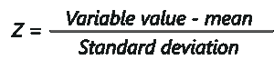
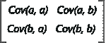

# 关于主成分分析(PCA)你需要知道的

> 原文：<https://www.edureka.co/blog/principal-component-analysis/>

随着[机器学习](https://www.edureka.co/blog/what-is-machine-learning/)和[人工智能](https://www.edureka.co/blog/artificial-intelligence-with-python/)领域的进步，理解这些技术背后的基本原理变得至关重要。这篇关于主成分分析的博客将帮助你理解降维背后的概念，以及如何用它来处理高维数据。

要获得人工智能和机器学习的深入知识，可以报名参加 Edureka 提供的全天候支持和终身访问的直播 [***机器学习工程师硕士项目***](https://www.edureka.co/masters-program/machine-learning-engineer-training) 。

以下是将在本博客中涉及的主题列表:

## **需要主成分分析(PCA)**

当为训练机器提供的数据集庞大而简洁时，机器学习通常会产生奇迹。通常拥有大量的数据可以让我们建立更好的预测模型，因为我们有更多的数据来训练机器。然而，使用大型数据集有其自身的缺陷。最大的陷阱是维数灾难。

事实证明，在大规模数据集中，可能存在大量不一致的特征或数据集中的大量冗余特征，这只会增加计算时间，使数据处理和 EDA 更加复杂。

为了摆脱“维数灾难”,引入了一种叫做降维的过程。降维技术可以用来过滤训练所需的有限数量的重要特征，这就是 PCA 的用武之地。

## **什么是主成分分析(PCA)？**

*主成分分析(PCA)是一种降维技术，使您能够识别数据集中的相关性和模式，以便将其转换为维度显著降低的数据集，而不会丢失任何重要信息。*

PCA 背后的主要思想是找出数据集中各种特征之间的模式和相关性。在发现不同变量之间的强相关性时，最终决定以仍然保留重要数据的方式减少数据的维度。

在解决涉及使用高维数据集的复杂数据驱动问题时，这样一个过程是非常必要的。PCA 可以通过一系列步骤实现。让我们讨论整个端到端的过程。

## **逐步计算主成分分析**

使用 PCA 进行降维需要遵循以下步骤:

1.  数据的标准化
2.  计算协方差矩阵
3.  计算特征向量和特征值
4.  计算主成分
5.  减少数据集的维度

让我们详细讨论每个步骤:

### **第一步:数据标准化**

如果你熟悉数据分析和处理，你就会知道错过标准化可能会导致有偏见的结果。标准化就是对数据进行缩放，使所有变量及其值都在一个相似的范围内。

考虑一个例子，假设我们的数据集中有 2 个变量，一个变量的值在 10-100 之间，另一个变量的值在 1000-5000 之间。在这种情况下，使用这些预测变量计算的输出显然会有偏差，因为范围较大的变量对结果的影响更明显。

因此，将数据标准化到可比较的范围内是非常重要的。标准化是通过从平均值中减去数据中的每个值，然后除以数据集中的总偏差来实现的。

可以这样计算:

完成这一步后，数据中的所有变量将按照标准和可比的尺度进行缩放。

### **第二步:计算协方差矩阵**

如前所述，PCA 有助于识别数据集中特征之间的相关性和依赖性。协方差矩阵表示数据集中不同变量之间的相关性。识别高度相关的变量至关重要，因为它们包含有偏差的和冗余的信息，这会降低模型的整体性能。

数学上，协方差矩阵是一个 p × p 矩阵，其中 p 代表数据集的维数。矩阵中的每一项代表相应变量的协方差。

考虑这样一种情况，我们有一个包含变量 a 和 b 的二维数据集，协方差矩阵是一个 2×2 矩阵，如下所示:

在上图矩阵中:

*   Cov(a，a)表示变量与其自身的协方差，它只不过是变量‘a’的方差
*   Cov(a，b)表示变量‘a’相对于变量‘b’的协方差。因为协方差是可交换的，Cov(a，b) = Cov(b，a)

以下是协方差矩阵的要点:

*   协方差值表示两个变量相互之间的相关程度
*   如果协方差值为负，则表示各个变量彼此成间接比例
*   正协方差表示各个变量彼此成正比

简单的数学，不是吗？现在让我们继续，看看 PCA 的下一步。

### **步骤 3:计算特征向量和特征值**

特征向量和特征值是数学构造，必须从协方差矩阵计算，以确定数据集的主要成分。

但是首先，让我们了解更多关于主成分的知识

### 什么是主成分？

简单地说，主成分是从初始变量集中获得的新变量集。主成分是以这样一种方式计算的，即新获得的变量是高度重要的，并且是相互独立的。主成分压缩并拥有分散在初始变量中的大部分有用信息。

如果你的数据集是 5 维的，那么计算 5 个主成分，这样，第一个主成分存储最大可能的信息，第二个存储剩余的最大信息，以此类推，你明白了。

那么，特征向量在整个过程中处于什么位置呢？

假设你们对特征向量和特征值都有基本的了解，我们知道这两个代数公式总是成对计算的，也就是说，每个特征向量都有一个特征值。数据中的维数决定了需要计算的特征向量的数量。

考虑一个 2 维数据集，为其计算 2 个特征向量(及其各自的特征值)。特征向量背后的思想是使用协方差矩阵来理解数据中哪里的方差最大。由于数据中的更多方差表示关于数据的更多信息，因此使用特征向量来识别和计算主成分。

另一方面，特征值简单地表示各个特征向量的标量。因此，特征向量和特征值将计算数据集的主成分。

### **步骤 4:计算主成分**

一旦我们计算了特征向量和特征值，我们要做的就是按降序排列它们，其中具有最高特征值的特征向量是最重要的，因此形成了第一个主分量。因此，为了减少数据的维数，可以去除较不重要的主要成分。

计算主成分的最后一步是形成一个称为特征矩阵的矩阵，该矩阵包含所有重要的数据变量，这些变量拥有关于数据的最大信息。

### **第五步:减少数据集的维数**

执行 PCA 的最后一步是用代表数据集最大和最重要信息的最终主成分重新排列原始数据。为了用新形成的主成分替换原始数据轴，你只需将原始数据集的转置与获得的特征向量的转置相乘。

这就是整个 PCA 过程背后的理论。是时候动手了，通过使用真实的数据集来执行所有这些步骤。

## **使用 Python 的主成分分析**

在本节中，我们将使用 Python 执行 PCA。如果您不熟悉 Python 编程语言，请阅读这些博客:

1.  [Python 教程——学习 Python 编程的完整指南](https://www.edureka.co/blog/python-tutorial/)
2.  [Python 编程语言——Python 基础入门](https://www.edureka.co/blog/python-programming-language)
3.  [Python 函数初学者指南](https://www.edureka.co/blog/python-functions)
4.  [用于数据科学的 Python](https://www.edureka.co/blog/learn-python-for-data-science/)

**问题陈述:**进行逐步主成分分析，以降低数据集的维数。

**数据集描述:**电影评级数据集，包含来自 700 多个用户的大约 9000 部电影(特征)的评级。

**逻辑:**通过寻找数据中最显著的特征来执行 PCA。PCA 将按照上面定义的步骤进行。

我们开始吧！

**第一步:导入需要的包**

```

import pandas as pd
import numpy as np
from sklearn.preprocessing import StandardScaler
from matplotlib import*
import matplotlib.pyplot as plt
from matplotlib.cm import register_cmap
from scipy import stats
from sklearn.decomposition import PCA as sklearnPCA
import seaborn

```

**第二步:导入数据集**

```

#Load movie names and movie ratings
movies = pd.read_csv('C:UsersNeelTempDesktopPCA DATAmovies.csv')
ratings = pd.read_csv('C:UsersNeelTempDesktopPCA DATAratings.csv')
ratings.drop(['timestamp'], axis=1, inplace=True)

```

**第三步:格式化数据**

```

def replace_name(x):
return movies[movies['movieId']==x].title.values[0]
ratings.movieId = ratings.movieId.map(replace_name)
M = ratings.pivot_table(index=['userId'], columns=['movieId'], values='rating')
m = M.shape
df1 = M.replace(np.nan, 0, regex=True)

```

**第四步:标准化**

在下面的代码行中，我们使用 sklearn 包提供的 StandardScalar()函数，以便在可比较的范围内缩放数据集。如前所述，需要标准化来防止最终结果中的偏差。

```

X_std = StandardScaler().fit_transform(df1)

```

**步骤 5:计算协方差矩阵**

如前所述，协方差矩阵表示数据集中不同要素之间的相关性。识别高度相关的变量至关重要，因为它们包含有偏差的和冗余的信息，这会降低模型的整体性能。以下代码片段计算数据的协方差矩阵:

```

mean_vec = np.mean(X_std, axis=0)
cov_mat = (X_std - mean_vec).T.dot((X_std - mean_vec)) / (X_std.shape[0]-1)
print('Covariance matrix n%s' %cov_mat)

Covariance matrix
[[ 1.0013947 -0.00276421 -0.00195661 ... -0.00858289 -0.00321221
-0.01055463]
[-0.00276421 1.0013947 -0.00197311 ... 0.14004611 -0.0032393
-0.01064364]
[-0.00195661 -0.00197311 1.0013947 ... -0.00612653 -0.0022929
-0.00753398]
...
[-0.00858289 0.14004611 -0.00612653 ... 1.0013947 0.02888777
0.14005644]
[-0.00321221 -0.0032393 -0.0022929 ... 0.02888777 1.0013947
0.01676203]
[-0.01055463 -0.01064364 -0.00753398 ... 0.14005644 0.01676203
1.0013947 ]]

```

**步骤 6:计算特征向量和特征值**

在这个步骤中，计算特征向量和特征值，它们基本上计算数据集的主分量。

```

#Calculating eigenvectors and eigenvalues on covariance matrix
cov_mat = np.cov(X_std.T)
eig_vals, eig_vecs = np.linalg.eig(cov_mat)
print('Eigenvectors n%s' %eig_vecs)
print('nEigenvalues n%s' %eig_vals)

Eigenvectors
[[-1.34830861e-04+0.j 5.76715196e-04+0.j 4.83014783e-05+0.j ...
5.02355418e-14+0.j 6.48472777e-12+0.j 6.90776605e-13+0.j]
[ 5.61303451e-04+0.j -1.11493526e-02+0.j 8.85798170e-03+0.j ...
-2.38204858e-11+0.j -6.11345049e-11+0.j -1.39454110e-12+0.j]
[ 4.58686517e-04+0.j -2.39083484e-03+0.j 6.58309436e-04+0.j ...
-7.00290160e-12+0.j -5.53245120e-12+0.j 3.35918400e-13+0.j]
...
[ 5.22202072e-03+0.j -5.49944367e-03+0.j 5.16164779e-03+0.j ...
2.53271844e-10+0.j 9.69246536e-10+0.j 5.86126443e-11+0.j]
[ 8.97514078e-04+0.j -1.14918748e-02+0.j 9.41277803e-03+0.j ...
-3.90405498e-10+0.j -7.88691586e-10+0.j -2.80604702e-11+0.j]
[ 4.36362199e-03+0.j -7.90241494e-03+0.j -7.48537922e-03+0.j ...
-6.38353830e-10+0.j -6.47370973e-10+0.j 1.41147483e-13+0.j]]

Eigenvalues
[ 1.54166656e+03+0.j 4.23920460e+02+0.j 3.19074475e+02+0.j ...
8.84301723e-64+0.j 1.48644623e-64+0.j -3.46531190e-65+0.j]

```

**步骤 7:计算特征向量**

在这一步，我们按照降序重新排列特征值。这以降序表示主要成分的重要性:

```

# Visually confirm that the list is correctly sorted by decreasing eigenvalues
eig_pairs = [(np.abs(eig_vals[i]), eig_vecs[:,i]) for i in range(len(eig_vals))]
print('Eigenvalues in descending order:')
for i in eig_pairs:
print(i[0])

Eigenvalues in descending order:
1541.6665576008295
423.92045998539083
319.07447507743535
279.33035758081536
251.63844082955103
218.62439973216058
154.61586911307694
138.60396745179094
137.6669785626203
119.37014654115806
115.2795566625854
105.40594030056845
97.84201186745533
96.72012660587329
93.39647211318346
87.7491937345281
87.54664687999116
85.93371257360843
72.85051428001277
70.37154679336622
64.45310203297905
63.78603164551922
62.11260590665646
60.080661628776205
57.67255079811343
56.490104252992744
55.48183563193681
53.78161965096411

....

```

**步骤 8:使用 PCA()函数降低数据集的维数**

下面的代码片段使用 sklearn 包提供的预定义 PCA()函数来转换数据。n_components 参数表示用于拟合数据的主成分的数量:

```

pca = PCA(n_components=2)
pca.fit_transform(df1)
print(pca.explained_variance_ratio_)

[0.13379809 0.03977444]

```

输出显示，PC1 和 PC2 约占数据集差异的 14%。

**步骤 9:根据主成分投影方差**

为了深入了解不同数量的主成分的数据方差，让我们绘制一个 scree 图。在统计学中，scree 图表示与每个主成分相关的方差:

```

pca = PCA().fit(X_std)
plt.plot(np.cumsum(pca.explained_variance_ratio_))
plt.xlabel('number of components')
plt.ylabel('cumulative explained variance')
plt.show()

```

scree 图清楚地表明前 500 个主成分包含数据中的最大信息(方差)。请注意，初始数据集大约有 9000 个特征，现在可以缩小到只有 500 个。因此，您现在可以轻松地对数据进行进一步的分析，因为多余的或无关紧要的变量已经排除了。这就是降维的力量。

既然您已经知道了主成分分析背后的数学原理，我相信您一定很想了解更多。这里有一个博客列表，可以帮助你开始了解其他统计学概念:

1.  [数据科学数学和统计学完全指南](https://www.edureka.co/blog/math-and-statistics-for-data-science/)
2.  [关于统计和概率你需要知道的一切](https://www.edureka.co/blog/statistics-and-probability/)
3.  [举例介绍马尔可夫链——用 Python 实现马尔可夫链](https://www.edureka.co/blog/introduction-to-markov-chains/)
4.  [如何用 Python 实现贝叶斯网络？–贝叶斯网络举例说明](https://www.edureka.co/blog/bayesian-networks/)

说到这里，我们就到此为止了。如果你对这个话题有任何疑问，请在下面留下评论，我们会尽快回复你。

如果你希望报名参加人工智能和机器学习的完整课程，Edureka 有一个专门策划的 ***[机器学习工程师硕士项目](https://www.edureka.co/masters-program/machine-learning-engineer-training)*** ，它将使你精通监督学习、非监督学习和自然语言处理等技术。它包括人工智能&机器学习方面的最新进展和技术方法的培训，如深度学习、图形模型和强化学习。