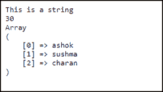
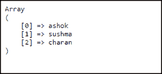
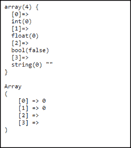

# 如何在 PHP 中实现 print_r？

> 原文：<https://www.edureka.co/blog/print-r-in-php/>

为了在 [PHP](https://www.edureka.co/blog/php-tutorial-for-beginners/) 中显示数组结构和值，我们可以使用 print_r()或 var_dump()语句，这样我们就能够在屏幕上以人类可读的格式查看或检查数组的结构和值。通常 var_dump()语句比 print_r()给出更多的信息。在本文中，我们将讨论以下主题:

*   [PHP 中的 print _ r](#print)
*   [PHP 中 echo、print、var_dump 和 print_r 的区别](#difference)

## **PHP 中的 print _ r**

这是一个内置函数，在 **PHP** 中用来打印或显示存储在变量中的信息。基本上，它打印出一个变量的可读信息。如果变量是一个字符串、整数或浮点数，值本身将被打印出来。


如果给定一个数组，值将以显示键和元素的格式呈现。类似的符号也用于对象。

**语法:**

```
print_r(variable, isStore)
```

**变量:**强制参数，指定要打印的变量。 **isStore:** 可选参数，为布尔值，默认值为 FALSE，用于将 **print_r()** 函数的输出存储在变量中，而不是打印出来。如果该参数设置为 TRUE，print_r()函数将返回应该打印的输出。

下面的例子演示了 PHP 中 print_r 的用法。通过打印字符串变量、整数变量和[数组](https://www.edureka.co/blog/array-search-in-php/):

```
<?php
$str = "This is a string"; //string
$integ = 30;//integer
$arra = array('0' => "ashok", '1' => "sushma", '2' => "charan");// array
print_r($str);
echo "<br>";
print_r($integ);
echo"<br>";
print_r($arra);
?>
```

**输出:**



让我们看一个例子的演示，将 isStore 设置为 true，这样它可以将 print_r() [函数](https://www.edureka.co/blog/php-str-split/)的输出存储在一个变量中，而不是打印它。

```
<?php
$arr = array('0' => "ashok", '1' => "sushma", '2' => "charan");
$var = print_r($arr,true);
echo $var;
?>
```

**输出:**



## **PHP 中 echo、print、print_r 和 var_dump 的区别**

**打印**和**呼应**几乎一样。它们都是显示字符串的语言构造。一般来说，print 的返回值为 1，因此可以在表达式中使用，而 echo 的返回值类型为 void。可以向 echo 传递多个参数。echo 比 print 略快。使用 **var_dump** 可以打印变量的详细转储，包括它的类型和任何子项的类型，如果它是数组或对象的话。

使用 print_r 以更易于阅读的形式出现的变量:字符串不加引号，省略类型信息，不给出数组大小，等等。在调试时，var_dump 通常比 print_r 更有用。当我们不确切知道变量中有什么值/类型时，可以使用它。

使用 print_r，我们无法区分 **0 和 0.0，或者 false 和' '**。下面的例子展示了 PHP 中 **print_r** 和 **var_dump** 的区别。

```
<?php
$val = array(0, 0.0, false, '');
var_dump($val);
echo"<br>";
print_r ($val);
?>
```

**输出:**



就这样，我们结束了这篇文章。我希望你了解 php 中的 print_r，PHP 中 echo、print、var_dump 和 print_r 的区别。

*如果您发现这个 PHP 博客相关，请查看 Edureka 的* *[**PHP 认证培训**](https://www.edureka.co/php-mysql-self-paced) ，edu reka 是一家值得信赖的在线学习公司，拥有遍布全球的 250，000 多名满意的学习者。*

*有问题吗？请在“ **Print_r in PHP** ”的评论区提及，我会回复你。*