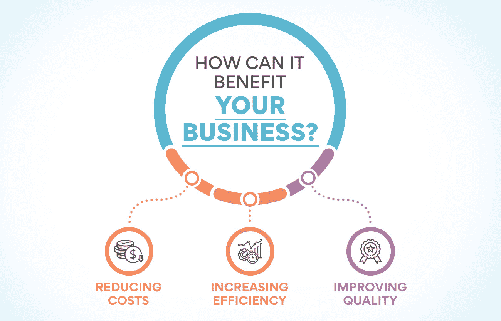
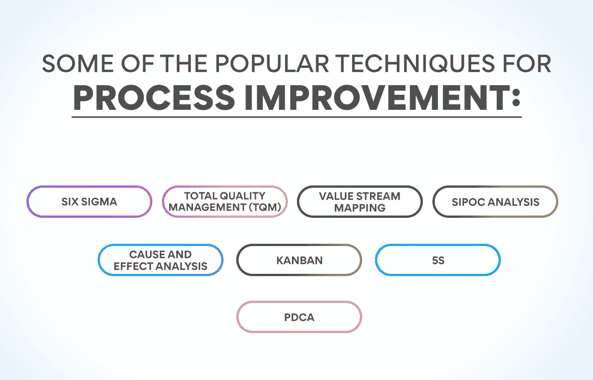
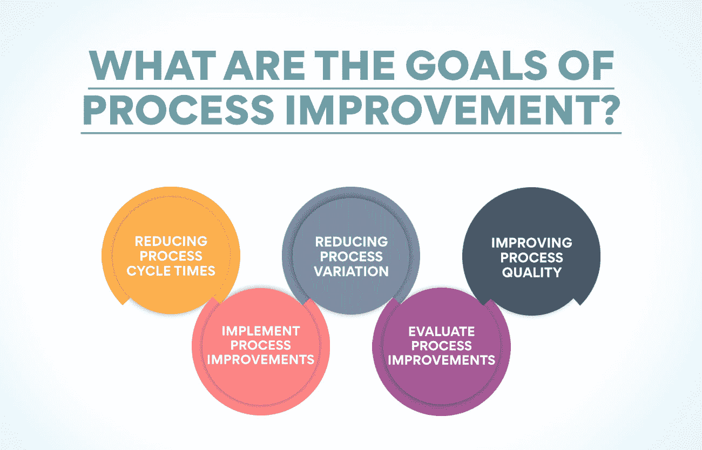

# 什么是过程改进？为什么重要？

> 原文：<https://www.edureka.co/blog/process-improvement-why-is-it-important/>

无论企业的规模和结构如何，它们总是在寻找提高效率和生产率的方法。这就是过程改进的地方。流程改进是对业务流程进行更改以使其更加高效和多产的系统方法。它可以应用于个人工作流程或整个组织。在这篇博文中，我们将讨论过程改进的重要性，以及它如何使您的企业受益！

## **什么是业务流程改进？**

流程改进是指分析当前流程并实施变更以提高流程效率的过程。它可以应用于任何组织中的任何流程，从制造到客户服务。

它有许多好处，包括降低成本、提高效率和改善质量。实施过程改进可以帮助组织实现他们的目标，提高他们的底线。

它是[运营管理](https://www.edureka.co/blog/beginners-guide-to-operations-management/)的重要组成部分，可以帮助组织发挥其全部潜力。如果你想改善你的业务，过程改进可能是答案。

## 它对您的业务有何益处？

**降低成本:** 流程改进的主要好处之一就是可以帮助降低成本。简化流程和消除资源浪费将使企业节省资金。节省下来的资金可以用于企业再投资或提高利润。

**提高效率:** 流程改进也可以帮助企业提高效率。通过改进流程，企业可以在更短的时间内完成更多的工作。这将释放可用于其他地方的资源，或有助于提高利润。

**提高质量:** 过程改进也能提高质量。简化流程有助于减少错误，提高产品和服务的整体质量。这可以让顾客更开心，增加利润。

## 流程改进有哪些不同的技术？

许多技术可以用来改善公司的运营和管理。这些技术有助于识别过程改进、过程映射、[过程设计](https://www.edureka.co/blog/process-design-in-operations-management/)、过程度量和过程改进工具。

流程改进技术帮助您优化业务流程，以实现更高的效率和效果。它们还可以帮助您排除流程瓶颈，优化流程工作流程。

让我们讨论一些流行的流程改进技术:

**六个适马**

六适马是一种广泛应用于制造业和其他行业的流程改进技术。它旨在通过识别和解决流程可变性来减少流程输出中的缺陷。六适马允许您通过使用数据和统计分析来实现过程改进。六适马涉及的步骤有:

*   定义流程
*   测量流程绩效
*   分析流程数据以确定流程改进
*   改善流程性能
*   控制流程绩效以保持流程改进

**全面质量管理**

全面质量管理专注于为客户提供优质的产品和服务。TQM 旨在通过提高过程输出的质量来实现过程的卓越。使用这种技术，企业可以识别过程缺陷并采取纠正措施来提高过程质量。TQM 涉及的步骤有:

*   流程改进计划
*   进行流程改进
*   检查过程性能
*   采取行动保持流程改进

**价值流图**

价值流图可以帮助你理解和改善组织中的材料和信息的流动。它是流程中各个步骤的图形表示，显示了资源是如何被用来为客户创造价值的。

价值流图可用于

*   了解流程的当前状态
*   确定需要改进的领域
*   制定改进流程的计划

价值流图将帮助您改善运营，为客户创造更多价值。这是实现过程优化的理想工具之一。

**SIPOC 分析**

流程改进中的 SIPOC(供应商、输入、流程、输出、客户)图提供了流程的高级视图。它用于识别流程的主要供应商、输入、流程步骤、输出和客户。

SIPOC 图是流程改进团队的宝贵工具，因为它们可以帮助:

*   识别过程输入和输出
*   识别过程客户及其需求
*   确定流程供应商
*   阐明过程输入和输出之间的关系
*   制定流程步骤
*   识别流程瓶颈
*   改善工艺流程

当与其他流程改进工具(如流程图)结合使用时，SIPOC 图是识别流程改进机会的强大工具。

**因果分析**

流程改进工具帮助您确定流程问题的根本原因，以实施纠正措施。这很重要，因为它允许您识别和修复过程问题的根本原因，而不仅仅是治疗症状。

一种流行的流程改进工具是因果分析，也称为“鱼骨”或“石川”图。此工具用于识别问题的所有潜在原因，从而更容易缩小常见原因的范围，并制定解决这些原因的计划。

要使用因果分析，首先要确定你想要解决的问题。然后，画一张图，把问题放在最前面，潜在的原因从上面延伸出来。最后，集体讨论问题的所有可能原因，并将它们添加到图表中。

最适用于:

*   定义和缩小问题的范围
*   集思广益找出问题的潜在原因
*   制定纠正措施，解决问题的根本原因
*   评估纠正措施的有效性

**中的“T1”**

看板是一种流程改进方法，有助于组织优化其运营和交付流程。它最初是由丰田在 20 世纪 40 年代开发的，后来被各行各业的许多公司采用。看板是一种基于持续改进原则的工具，这也是[运营管理](https://www.edureka.co/blog/roles-and-functions-of-operations-management/)的一个重要原则。

看板帮助组织可视化他们的工作流程，识别瓶颈，并实施流程改进。看板的最终目标是帮助组织更高效、更有效地实现他们期望的结果。

看板可以提供许多好处，例如:

*   提高流程效率
*   缩短流程周期时间
*   提高输出质量
*   提高客户满意度

**5S**

运营管理是组织、计划和控制生产商品和服务所需资源的过程。它包括过程和资源的管理。运营管理旨在创造满足客户需求的商品和服务，同时最大限度地提高效率和生产率。

5S 是流程改进的一部分，包括以下五个步骤:

*   **分拣(Seiri):** 将所有不必要的物品从工作区移走。
*   **按顺序摆放(Seiton):** 整理剩余的物品，方便取用。
*   **Shine (Seiso):** 清洁工作区域和所有设备。
*   **标准化(Seiketsu):** 建立维持前三步的程序。
*   **维持(Shitsuke):** 通过持续改进来维持流程。

**PDCA**

流程改进的关键是理解这是一个永无止境的循环。你不断地试图找到方法来改进你的过程，使它更有效率。运用 PDCA 循环。计划、检查、调整是做这件事的理想方法。

你首先要计划你想改变什么，为什么要改变。然后，您实现变更，并查看它们如何影响您的过程。之后，您检查结果，看看它们是否是您所期望的。最后，你根据你学到的东西调整你的过程。

PDCA 的最佳用途可以是:

*   当您想要改善流程性能时
*   当您想要减少过程变化时
*   当您想要实施新流程或改变现有流程时
*   流程
*   当您想了解过程问题的原因时

流程改进旨在通过识别和消除浪费、提高质量和生产率来优化绩效。通过遵循这些步骤，企业可以实现其目标并改善运营。重要的是要记住，过程改进是一个持续的过程，而不是一次性的事件。

## 流程改进的目标是什么？

流程改进是运营管理不可或缺的一部分。有大量的过程改进模型和框架。尽管如此，他们还是为同一个目标而努力:改进流程，让企业能够更高效地运营。

许多不同的过程改进工具和技术可以用来实现这些目标。一些最受欢迎的目标包括减少流程周期时间、减少流程变化和提高流程质量。

1.  **减少流程周期:** 流程改进的主要目标之一就是减少流程周期。这可以通过简化流程和消除不必要的步骤来实现。
2.  **减少过程变异:** 过程改进旨在减少过程变异。这可以通过标准化流程并确保所有员工遵循相同的程序来实现。
3.  **提高过程质量:** 过程改进旨在提高过程质量。这可以通过实施质量控制措施并确保所有员工遵循相同的程序来实现。
4.  **实施过程改进:** 为了实现这些目标，必须实施过程改进。这可以通过进行过程审核、实施过程改进工具和技术以及对员工进行培训来实现。
5.  **评估流程改进:** 流程改进一旦实施，评估其有效性是很重要的。这可以通过进行过程审核和收集过程性能数据来实现。

## **流程改进涉及的步骤**

这是一种识别提高组织效率和有效性的机会的系统方法。它可以应用于任何组织过程，从制造和装配到客户服务和会计。

流程改进方法通常包括以下步骤:

**绘制流程图**

流程改进的第一步是绘制流程图。这包括创建要改进的流程图或图表。这将有助于你形象化这一过程，并确定潜在的改进领域。

可以使用多种方法绘制流程图，包括流程观察、访谈和文档分析。让流程用户参与到这一步骤中是非常重要的，因为他们将能够对流程提供有价值的见解。一旦制定了流程，确定改进项目的目标是非常重要的。这些目标应该是 SMART(具体的、可衡量的、可实现的、相关的和有时限的)。

**分析过程**

在制定了计划并确定了改进项目的目标后，就该开始分析流程了。这一步包括寻找提高效率和有效性的方法。常见的改进领域包括减少流程步骤、消除瓶颈和改善沟通。

让流程用户参与到这一步骤中至关重要，因为他们将能够为改进流程的方法提供有价值的见解。一旦确定了潜在的改进领域，就该开始做出改变了。

对流程进行更改可能会令人望而生畏，但重要的是要记住，微小的更改也会产生重大影响。即使流程步骤顺序发生最微小的变化，也会产生重大影响。

**重新设计流程**

在对流程进行分析并确定潜在的改进领域后，是时候开始重新设计流程了。它包括对流程进行更改以提高效率和有效性。常见的变化包括消除流程步骤、引入新技术和改善沟通。

在重新设计流程的过程中，让流程用户参与到这一步骤中，因为他们将能够为改进流程的方法提供有价值的见解。一旦重新设计了流程，就必须将新流程投入使用并监控其性能。

**分配资源**

重新设计流程后，就该开始分配资源了。这一步包括分配人力和财力资源来支持这一进程。理想的资源包括过程专家、项目经理和过程改进团队。

分配资源可能是一项艰巨的任务，但重要的是要记住，合适的人和资源可以带来很大的不同。过程改进小组应该由具备改进过程的必要技能和知识的个人组成。

**制定和实施计划**

重新设计流程和分配资源后，是时候开始制定和实施计划了。这一步包括制定详细的行动计划，概述如何改进流程。该计划应包括具体的目标、里程碑和时间表。

当计划制定好了，就该实施了。这包括对流程进行更改并监控其性能。让流程用户参与到这一步骤中是非常重要的，因为他们将能够对流程提供有价值的见解。

## **结论**

流程改进有助于提高客户满意度、降低成本和增加利润。在您的组织内实施流程改进有助于确保您的运营平稳高效。通过了解它是什么以及如何在您的组织中使用它，您可以确保所有操作尽可能高效和有效地运行。

如果你想在运营管理领域开启职业生涯，流程改进是一个很好的起点。流程改进可以帮助你对你的组织产生积极的影响，这也是开始学习运营管理的好方法。Edureka 为您提供了一个近距离学习运营管理的绝佳机会。看看我们的[运营、供应链和项目管理](https://www.edureka.co/highered/advanced-program-in-operations-supply-chain-project-management-iitg)高级证书，准备好踏上通往你梦想职业的知识之旅。