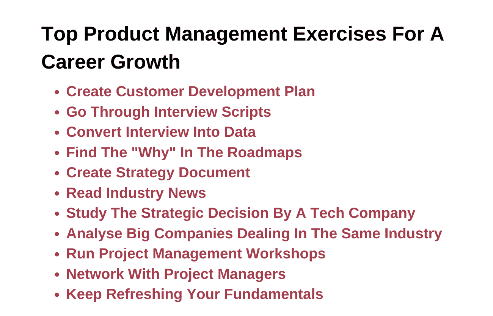

# 职业发展的顶级产品管理练习

> 原文：<https://www.edureka.co/blog/product-management-exercises/>

出于几个原因，练习对于[产品管理](https://www.edureka.co/blog/product-management/)来说是必不可少的。首先，练习有助于产品经理更好地了解他们的产品和市场。通过了解他们的产品和市场，产品经理可以制定战略和计划来更有效地发展他们的业务。

其次，锻炼有助于产品经理磨练技能，成为更好的领导者。随着产品经理面临更多的挑战和机遇，他们必须提高自己的技能才能不断取得成功。练习为产品经理提供了一种练习和提高技能的结构化方法。

最后，练习有助于产品经理与其他组织成员建立关系。由于产品经理与整个公司的不同团队合作，他们需要与这些团队建立牢固的关系才能取得成功。练习让[产品经理](https://www.edureka.co/blog/product-manager)与其他组织成员互动并建立这些关系。

## **职业发展的顶级产品管理练习**

**产品管理练习:创建客户发展计划**

如果你想获得产品经理的职业发展，你必须制定一个客户发展计划。该计划将帮助您评估和了解客户的需求，以及您的产品如何满足这些需求。它还可以让您跟踪您在满足客户需求方面的进展，并确定您需要继续改进的领域。

制定客户发展计划既简单又容易。您可以使用以下步骤开始:

1.  **明确你的目标市场:** 谁是潜在客户？你的产品能满足他们的哪些需求？
2.  研究你的竞争对手: 还有谁在提供迎合你目标市场的产品或服务？他们的优缺点是什么？
3.  **提出关于客户行为的假设:** 你认为你的目标客户的动机是什么？他们会如何使用你的产品？
4.  **通过客户访谈来检验你的假设:** 与潜在客户交谈，询问他们的需求以及他们会如何使用你的产品。问一些后续问题，更深入地探究他们的思维过程。
5.  **分析你的发现并调整你的计划:** 根据你从客户访谈中了解到的情况，修改你的产品开发和营销计划。

通过遵循这些步骤，你可以制定一个客户发展计划，帮助你实现产品经理的职业发展。

## **浏览面试脚本**

假设你指的是工作面试脚本，目标是确保你尽可能为面试做好准备。这意味着熟悉将要被问到的问题，并思考你将如何回答这些问题。

这件事有不同的解决方法。一种是在网上搜索面试问题，然后练习大声回答。另一种方法是与朋友或家人进行角色扮演，他们扮演面试官，根据剧本向你提问。

无论你选择哪种方式，你都必须在面试前花些时间准备。这对于获得这份工作至关重要！

## **产品管理练习:将访谈转化为数据**

作为产品经理，你必须制定公司产品线的战略并执行。要在这个职位上取得成功，你必须能够将客户的反馈转化为可操作的数据。

本练习将帮助你练习将面试数据转化为可操作的见解。

1.  安排客户访谈。
2.  进行访谈并做笔记。
3.  识别数据中的主题和模式。
4.  将数据转化为可操作的见解。

产品经理必须寻找改进产品的方法，其中一个方法就是将采访数据转化为有用的信息。这些数据可以帮助他们了解他们的客户如何使用和感受他们的产品，他们希望看到添加或更改哪些功能，以及任何其他可用于改进的反馈。

为了获得这种有价值的反馈，产品经理需要能够有效地采访他们的客户。这意味着要问正确的问题来引出诚实和有益的回答。让人们在面试中敞开心扉可能很复杂，但是你可以做一些事情来鼓励他们

1.  确保你创造了一个舒适的环境-让对方知道他们可以自由坦率地说话，不做任何评判。
2.  **做一个积极的倾听者——**不要打断或推进你的议程；试着理解这个人在说什么。
3.  **提出后续问题—**根据给出的初步答案，深入探究感兴趣的领域。
4.  做笔记-这将有助于你日后记住谈话要点。

一旦你进行了访谈，就该将数据转化为可操作的见解了。这可以通过识别你收到的回复中的主题和模式来实现。例如，如果多人提到同一个问题或请求，这应该进一步考虑。

一旦你确定了关键主题，是时候开始将它们转化为可用于改进产品的切实见解了。这可能包括对客户痛点的潜在解决方案进行头脑风暴，提出新功能或重新设计现有功能，或者任何有助于使您的产品更令人愉快和成功的事情。

产品经理需要能够获得客户的反馈，并将其转化为有用的数据，用于改进他们的产品。这个练习将帮助你练习这个重要的技能。

**也读作:[新时代产品开发过程的 7 个动态阶段](https://www.edureka.co/blog/product-development/)**

## **在路线图中找到“为什么”**

在路线图中找到“为什么”

作为产品经理，维护产品路线图是你的工作。本文档是对您产品的目标和目的的高层次概述，定期更新非常重要。

然而，理解路线图背后的“为什么”也很重要。换句话说，每个目标和目的的动机是什么？为什么要开发这种产品？

回答这些问题有助于您更好地确定产品路线图的优先级并进行管理。它还可以帮助你让你的团队与公司的整体目标保持一致。

产品经理需要在他们的路线图中找到“为什么”有很多原因。最重要的原因是，这使他们能够更好地将产品目标与公司的整体战略相结合。通过了解产品目标背后的“为什么”,产品经理可以确保他们正在努力实现公司的目标。

在你的路线图中找到“为什么”很重要的另一个原因是，它可以帮助你更好地了解客户的需求。通过了解客户行为背后的动机，你可以更有效地创造他们会喜欢的产品和功能。此外，通过不断地问自己“为什么”，你将能够在早期发现潜在的问题，并避免在将来犯代价高昂的错误。

最终，对于任何想要成功的产品经理来说，找到路线图中的“为什么”是至关重要的。它让您能够专注于重要的事情，同时还能洞察客户的行为。所以下次你在制定路线图时，确保在每一步都问自己“为什么”!

## **产品管理练习:创建战略文档**

为了创建一个有效的产品管理战略，你需要记录你的目标、目的和方法。这将有助于你向组织中的其他人传达你的计划，并确保每个人都遵循相同的目标。战略文件也将帮助你跟踪你的进展，并根据需要做出调整。

您的战略文件中应包含一些关键要素:

*   你对产品的总体设想。你希望实现什么？
*   你对产品的具体目标。你的目标是什么？
*   你的产品管理方法。你将如何实现你的愿景和目标？
*   实现愿景和目标的可用资源。你有多少预算？你有什么队伍？
*   你的[产品管理战略](https://www.edureka.co/blog/product-strategy/)的时间表。你希望什么时候实现你的目标？

## **阅读行业新闻**

作为产品经理，跟上最新的行业新闻很重要。这将有助于您识别产品的新趋势、技术和机会。

有几种不同的方式来了解最新的行业新闻:

1.  订阅相关的时事通讯和杂志。
2.  在社交媒体上关注关键影响者和思想领袖。
3.  参加会议和社交活动。
4.  阅读受人尊敬的博客帖子和文章。

通过了解最新的行业新闻，你可以在市场中成功定位你的产品。

## **研究一家科技公司的战略决策**

为了做出好的决策，产品经理需要了解公司的战略。一家科技公司的战略围绕着三件事:它的产品、它的人员和它的市场。

科技公司的产品是其业务的核心。它们必须设计精良，满足市场需求。该公司的员工是其最有价值的资产。他们必须有技能和动力去创造和交付伟大的产品。

科技公司服务的市场在不断变化。为了取得成功，公司必须不断调整其产品和业务模式，以保持竞争优势。

为了做出好的战略决策，产品经理需要深入了解公司业务的所有三个方面。

## **产品管理练习:分析同行业的大公司**

在分析同行业的大公司时，有一些事情需要记住。首先是研究公司的整体财务健康状况。

查看公司的竞争格局也很重要。他们的主要竞争对手是谁？他们的优缺点是什么？该公司与他们相比如何？

最后，你应该看看公司的产品和服务。他们在卖什么？他们的产品与竞争对手相比如何？客户对他们有什么看法？

所有这些信息会让你更好地了解公司在行业中的地位。在此基础上，你可以开始对他们如何改进提出建议。

## **举办项目管理研讨会**

产品经理应该不断寻找提高技能和发展职业的方法。做到这一点的方法之一是定期参加项目管理研讨会。

在这些研讨会上，产品经理可以学习管理项目的新技术和最佳实践。他们还可以与其他产品经理交流，学习他们的经验。

参加项目管理研讨会是产品经理了解该领域最新趋势和发展的好方法。这也是一个向专家学习和从同行那里获得建议的绝佳机会。

**也可阅读:[产品生命周期的阶段和例子有哪些？](https://www.edureka.co/blog/product-lifecycle/)**

## **产品管理练习:与项目经理交流**

作为一名产品经理，与其他项目经理交流以学习不同的方法和工具来帮助改进你的过程是很重要的。通过参加聚会或加入在线社区，你可以从该领域的其他专业人士那里获得有价值的见解。

此外，人际关系网让你可以与他人分享你的专业知识和经验。通过帮助他人在职业生涯中成长，你也可以扩大你的职业网络，建立有价值的关系。

## **不断刷新你的基本面**

如果你想保持敏锐的产品管理技能，重要的是不断更新你的基础知识。这里有一些你可以做的顶级练习，以确保你总是处于游戏的顶端:

*   阅读最新的产品管理新闻和趋势。在这个领域总有东西要学，所以确保你跟上最新的发展。
*   参加一两门产品管理课程。这将帮助你温习技能，学习自你上次参加课程以来出现的任何新东西。
*   加入产品管理社区。有很多在线论坛和小组，产品经理可以在那里联系和分享想法。这是了解产品管理领域最新动态的绝佳方式。
*   参加关于产品管理的会议或研讨会。这些活动对于建立关系网和了解最新的产品和趋势是非常好的。
*   跟上你的阅读进度。有很多关于产品管理的好书，所以一定要阅读这个领域的最新信息。

## **结论**

产品管理练习是学习新技能和提升职业前景的绝佳方法。然而，根据你的需求和目标选择正确的运动是至关重要的。由于有不同的选项可用，确定从哪里开始会很有挑战性。这些练习旨在帮助您提高产品管理方面的知识和技能。关于产品管理，你需要学习的还有很多，我们有适合你的课程。[查看我们的产品管理高级管理人员证书](https://www.edureka.co/highered/advanced-executive-program-in-product-management-iitg)来提升你的技能或以新人的身份开始你的职业生涯

## **更多信息:**

[创建成功上市战略的步骤](https://www.edureka.co/blog/go-to-market-strategy/)

[每个 PM 都必须知道的产品管理框架](https://www.edureka.co/blog/product-management-frameworks)

[产品管理学习-关键领域](https://www.edureka.co/blog/product-management-learning)

[11 个重要的产品管理指标和 KPI](https://www.edureka.co/blog/product-management-metrics)