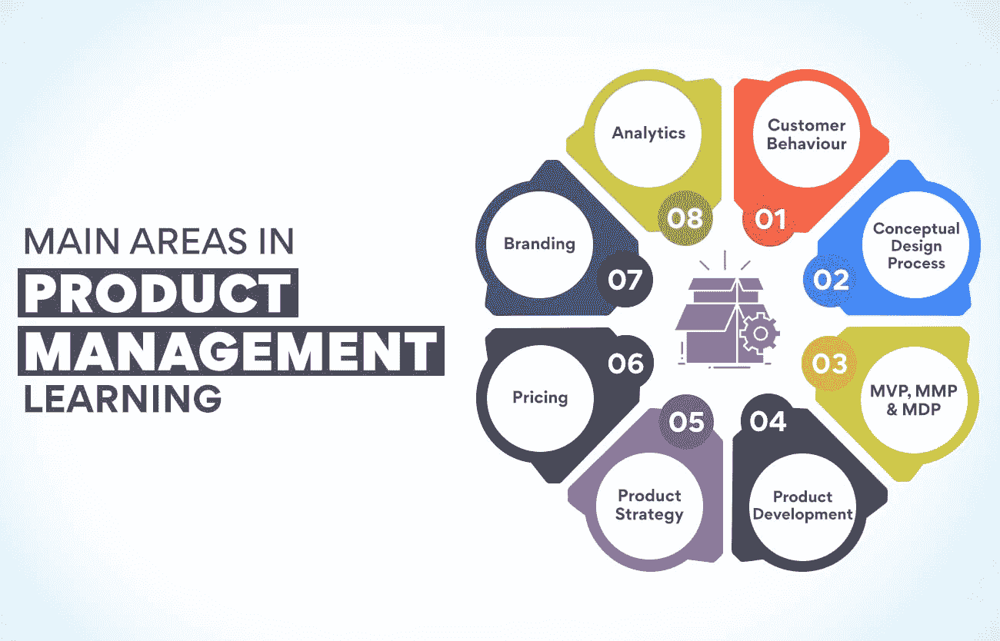

# 产品管理学习-关键领域

> 原文：<https://www.edureka.co/blog/product-management-learning>

你是一名在公司工作的毕业生吗？你想知道该学什么专业吗？现在有各种各样的领域可供选择，网上学习对每个人来说都变得非常容易。但是有些职业比其他职业有更好的发展和职业前景。组织必须推出能让顾客兴奋的产品，并帮助公司获得更高的收入。这就是产品管理的重要性。要成为这个领域的领导者，你必须在一个好的机构完成产品管理学习。

在我们开始学习本课程之前，有必要了解什么是产品管理以及项目经理在公司中扮演的角色。

**什么是产品管理？**

简单来说，产品管理就是在产品的整个生命周期中创建、发布和管理产品。这项工作从确定客户需求以及公司如何满足他们开始。从这个阶段开始，产品经理的工作就是研究并找出他们如何创造一个独特的项目来吸引顾客。这些专业人员决定他们必须包括什么特征，以及商品必须如何在市场中定位。他们还决定公司必须瞄准的客户群。所有这些构成了产品管理学习的一部分。

产品经理的工作不仅仅是确定需求和创造产品。他们还必须决定产品的设计、包装和价格。这些因素极大地影响了顾客对产品的接受程度。他们还必须收集有关竞争对手及其营销技巧的信息。产品管理不仅仅是创建和发布产品。组织必须在它们的整个生命周期中管理它们，以确保公司获得期望的收入。产品管理学习课程教授产品经理的所有职能。

为了全面了解产品管理及其在公司中的作用，请参加我们提供的[产品管理高级管理人员证书课程](https://www.edureka.co/highered/advanced-executive-program-in-product-management-iitg)。请访问我们的网站，了解有关该计划的更多信息。

**产品管理学习的主要领域**

**客户行为**

了解是什么让顾客购买特定产品对产品管理非常重要。如果你不知道为什么有人会买你竞争对手的产品，你就永远无法创造出让顾客兴奋的东西。各种因素促使人们做出购买决定。他们的个人需求或偏好并不总是促使他们买东西的原因。社会压力也是一个重要因素。他们的朋友和亲戚在很大程度上影响了品牌的选择。正因为如此，顾客行为研究是产品管理学习的重要组成部分。

影响顾客的重要因素之一是营销。有效的广告可以迫使顾客尝试一种新产品。这意味着产品经理必须与营销团队协调，并创造强有力的沟通，使人们购买产品。购买力是使个人决定购买品牌的另一个强大因素。这就是为什么定价是一个重要因素。有必要对产品进行定价，使目标客户群能够负担得起。您还将在产品管理学习课程中了解定价。

**概念设计流程**

产品设计是特定品牌成功的最重要因素之一。尽管已经有很多数字音乐播放器，包括那些由世界著名公司制造的，iPod 还是超越了所有这些播放器，成为了这个领域的领导者。原因是乔布斯没有走任何捷径，坚持走概念设计流程。该公司花了相当大的努力来找出人们想要什么样的数字音乐播放器，并将其纳入设计中。

在概念设计过程中，开发了大量的产品设计。然后将这些与要求的规格进行比较。还研究了哪些设计可以完全解决产品试图解决的问题。每种设计都将针对产品要求实现不同的性能水平。在分析了哪种产品需求对吸引顾客最重要之后，才做出最终选择。在这个阶段，大多数产品的成功是确定的。这就是为什么这是作为产品管理学习的一个重要组成部分来教授的。

**也读:[产品管理:初学者指南](https://www.edureka.co/blog/product-management/)**

**MVP，MMP&MDP**

一个产品诞生于一个想法。这个旅程充满了挑战。两个最重要的挑战是财务和用户接受度。这就是为什么许多公司选择在开发成熟产品之前先做一个 MVP。MVP 是最小可行产品的缩写，它将包含满足客户需求的所有基本特性。但它不会具备该公司计划包含的所有功能。它有助于公司了解他们是否为目标受众制造了正确的产品。产品管理学习课程详细讲授 MVP。

另一个重要的产品阶段是 MMP。它代表最低可销售产品。它比 MVP 高一步，拥有所有的功能。该产品将满足您客户的所有需求，并已准备好进行大规模营销。MMP 还将向企业交付可量化的价值。但这可能不足以激发顾客尝试该产品。在让新用户尝试该项目时，需要有一个令人惊叹的因素。这包括在 MDP 或最小愉悦产品中。

**产品开发**

产品开发包括从产生创意到商业化的所有步骤。产品始于对客户需求的理解。产品经理是这个过程中最重要的人物。这些专业人员必须分析客户需求以及公司生产该产品的能力。下一步是根据产品要解决的问题来定义产品。在这个阶段，团队最终确定产品的营销和商业策略。在产品管理学习课程中，有抱负的产品经理可以学习产品开发。

在产品开发的原型阶段，设计被最终确定，最小可行的产品被创建。可行性分析也在这一步完成，不同任务的正确时间表最终确定。产品管理团队还会分析可能会延迟产品生产的风险。然后基于 MVP 进行初始设计。最终确定供应商，并收集利益相关方的反馈。PMs 将对产品进行各种测试，然后准备在市场上进行商业发布。

您可以在我们在线举办的[产品管理高级主管证书课程](https://www.edureka.co/highered/advanced-executive-program-in-product-management-iitg)中详细了解产品开发。访问我们的门户网站会让你对课程细节和教学大纲有更多的了解。

**产品策略**

产品管理学习课程将教你产品战略对一个产品的成功非常重要。它是一个组织希望从产品中实现什么以及如何实现的计划。产品策略还概述了客户角色以及他们将如何从中受益。战略中还定义了产品生命周期的完整计划。它帮助产品创造者理解它将如何帮助公司实现其总体业务目标。它还为营销团队提供了清晰度。

一旦产品创意被认可，团队就该付诸行动了。产品战略将有助于以更好的方式绘制路线图。这将有助于理解哪些任务必须优先处理。没有它，许多公司发现自己滥用了时间和其他宝贵的资源。大多数时候，产品发布不会按计划进行。可能会有许多变化，产品经理必须能够相应地改变他们的优先级。产品管理学习课程告诉我们，拥有产品战略有助于做出调整计划的明智决策。

**也读:[产品管理框架每个 PM 都必须知道](https://www.edureka.co/blog/product-management-frameworks)**

**定价**

任何企业的主要目标都是盈利，而盈利来自于产品的价格。它必须考虑各种费用，如工资、营销费用、原材料成本等。，在确定产品价格时。公司还必须决定他们的政策是利润最大化还是增加销售。固定较高的价格可能会减少销售，但反映了更高的产品质量。有一个经济的价格可以获得更高的市场份额。定价是所有 [产品管理](https://www.edureka.co/blog/how-to-become-a-better-product-manager-top-10-tips/)学习课程中教授的重要科目。

市场对这种产品的需求也决定了公司可以确定的价格。如果产品需求量大，就有可能定一个较高的价格。但是，如果市场上有许多类似的产品，那么该组织将不得不确定一个有助于打入市场的价格。竞争是定价时要考虑的另一个因素。产品管理学习课程教授许多公司根据市场竞争来定价。

**烙印**

品牌是在产品中创造可识别特征的过程，这将有助于消费者将自己与贵公司联系起来。这有助于客户认可你的产品，让你比竞争对手更有优势。它让买家毫不犹豫地选择你的产品。品牌包括品牌名称、标志、标语、设计和信息。所有这些必须是独一无二的，对品牌下的所有产品都是一样的。它也指客户在与你的产品或公司互动时的体验。我们将在产品管理学习课程中详细了解这一点。

拥有强大的品牌会让顾客选择你的产品，而不是其他品牌形象不那么强大的产品。人们总是在寻找他们容易识别的产品。品牌有助于人们熟悉你的产品。品牌信息将传达公司的愿景和使命。产品的视觉识别将有助于顾客容易地联想到公司所代表的东西。今天的消费者希望能够认同这个品牌。强大的品牌有助于这一点，并确保持续的忠诚度。

**分析学**

[产品管理](https://www.edureka.co/blog/product-management/)学习课程告诉你，数据是当今商业中最重要的工具之一。数据驱动的公司更有可能做出正确的决策。在这样的公司里，没有猜测或直觉的余地。如今，成功的产品经理利用数据做出明智的决策。当这样的项目经理想出一个产品特性的想法时，他们很少会直接向领导层推销。他们挖掘可用的数据来证明他们的想法是正确的。

用户数据是产品经理必须首先收集和分析的最重要的信息。除非你很了解消费者，否则不可能拿出合适的产品。产品数据是下一个重要的方面。了解商品的哪些特征会促使顾客购买该产品非常重要。关于市场的信息同样重要。并非所有市场都表现相似。这取决于许多因素，包括那里存在的竞争。人们将在在线产品管理学习课程中详细学习分析。

对于一个有抱负的产品经理来说，了解以上所有话题是至关重要的。除此之外，你还必须知道你在一个产品的创造和成长中的角色。课程[产品管理高级执行官证书](https://www.edureka.co/highered/advanced-executive-program-in-product-management-iitg)将教你所有你需要知道的关于你作为项目经理的责任和挑战的事情。请访问我们的网站，了解您将在课程中学到什么。

**总结**

随着竞争越来越激烈，越来越多的企业意识到为每种产品配备一名产品经理的重要性。如果组织想要吸引顾客，他们必须拿出独特的产品。只有经历过良好的产品管理学习课程的项目经理才能做到这一点。参加这样的课程是获得竞争优势、让自己对雇主更有吸引力的最佳方式。

更多信息:

[产品变化的原因是什么？原因&原因](https://www.edureka.co/blog/what-are-the-reasons-of-variations-in-product-causes-reasons/)

[什么是产品流程矩阵？](https://www.edureka.co/blog/what-is-the-product-process-matrix/)

[什么是产品规划，是怎么做的？](https://www.edureka.co/blog/what-is-product-planning-and-how-is-it-done/)

[制定优秀产品战略的指南](https://www.edureka.co/blog/how-to-formulate-an-excellent-product-strategy/)

[新时代产品开发过程的 7 个动态阶段](https://www.edureka.co/blog/dynamic-stages-of-the-new-age-product-development-process/)