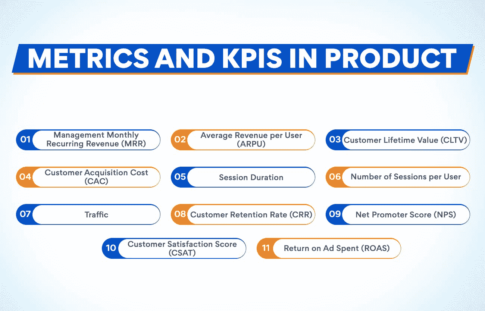

# 11 个重要的产品管理指标和 KPI

> 原文：<https://www.edureka.co/blog/product-management-metrics>

产品管理是一种战略性地监督[产品生命周期](https://www.edureka.co/blog/what-are-the-stages-and-examples-of-a-product-lifecycle/)的每个阶段的方法，该生命周期从研发开始，最终导致测试和定位，以创造技术上可行的产品，满足用户的需求和业务的目标。产品管理是一个跨学科的职能:高效的产品管理涉及与企业利益相关者、C 级高管以及销售和营销部门的多学科沟通。但是产品经理必须跟踪他们的产品在市场上的健康状况和地位。经理们可以在产品管理指标的帮助下实现这种跟踪。

## **什么是产品管理指标？**

指标是一种定量测量，允许公司确定和跟踪业务活动或产品的成功。营销人员、利益相关者和产品管理团队使用产品管理指标来设定目标、发现问题并做出合理的决策。今天，衡量标准的主要问题不是如何衡量它们——Google Analytics 本身就是一个评估和预测成功的有用工具。It 部门决定使用一些关键指标来跟踪和处理发现的数据，而不是浪费时间来跟踪数据。

根据公司的目标——吸引新的消费群体、提高用户的受欢迎程度、获得新元素的创意——产品管理团队需要确定正确的指标。KPI 是构建产品路线图的关键点之一，它们使产品经理能够评估参与度、消费者体验、功能使用和商业成功。但是在我们深入研究产品经理应该使用哪些重要的产品管理指标之前，让我们先了解一下 KPI 是什么，它们的重要性是什么。

## **KPI 及其在产品管理团队中的重要性**

与其他公司的团队一样，在产品管理团队中，关键绩效指标(KPI)被用来指导决策、形成明确的目标、庆祝成功以及确定问题和风险。产品管理团队中 KPI 的缺失会导致对进度的错误理解，难以评估当前和过去的工作并从中学习，以及在进度偏离轨道时无法区分各种活动流的优先级。

通常由产品经理来决定这些 KPI，依靠他们认为最关键的指标来跟踪和报告。最终，产品 KPI 是衡量(和升级)产品和[产品管理操作](https://www.edureka.co/blog/product-management-frameworks)成功的基础。产品经理的 KPI 可以涵盖一系列广泛的主题，这很大程度上取决于产品的本质和公司采用的方法。

例如，假设他们更重视产品开发。在这种情况下，KPI 可能会严重依赖于产品的结构和生产。然而，如果团队还希望确定消费者影响，KPI 可以包含更多的使用和消费者行为。最终，作为产品团队的领导者，他们必须对重要的 KPI 做出判断，但这应该主要由公司的顶层目标驱动。

你具备在最佳管理公司担任产品经理的素质吗？但是感觉自己缺少一些技能？查看我们的[产品管理高级执行官证书](https://www.edureka.co/highered/advanced-executive-program-in-product-management-iitg)，提升自己的技能，进入这个巨大而辉煌的产品管理领域。

我们编制了一份最重要的产品管理指标和关键绩效指标的清单，以帮助理解每项指标迎合并帮助产品管理团队的产品管理领域。

## **产品管理中的指标和 KPIs】**

*   **每月经常性收入(MRR)**

每月经常性收入衡量公司每月的预期收入流。该指标的主要目标是跟踪不同价格和优惠的各种订阅包或条款的绩效。这种类型的工具最适合软件即服务(SaaS)公司或那些通过提供订阅服务获得收入的公司。这些销售活动不同于一次性交易，因为它们是稳定的，更容易预测。

MRR 使产品经理能够评估每月收入的增长或下降，并评估企业的财务健康状况。MRR 的公式是:

**MRR =月初收入+新消费者收入+升级消费者收入变化-降级消费者收入变化-流失消费者收入**

也可以将 MRR 乘以 12 来计算年度经常性收入(ARR)。这可能有助于公司提前做好准备。它还可以为公司提供关于公司未来的细节，成员可以将这些细节传递给利益相关者。

*   **每用户平均收入(ARPU)**

每个用户的平均收入是一个组织可以从单个消费者身上预测到的金额。对于 SaaS 公司来说，这是衡量新战略、价格调整或新订阅计划结果的一个很好的方法。如果产品管理团队对不同的子群体进行分析，他们就能分析出哪些消费者群体最有价值。这可以向投资者表明盈利水平，指导投资决策，保证公司的财务稳定。

产品经理可以使用给定期间的平均或总收入来计算公司的 ARPU，就像 MRR 和用户账户总数一样。下面是 ARPU 的公式:

**ARPU = MRR /用户账户总数**

*   **客户终身价值(CLTV)**

客户终身价值是一个受欢迎的衡量标准，用来衡量企业从消费者那里获得的长期预期收入。客户“生命周期”指的是消费者支持一项业务所花费的平均时间。“价值”是指消费者说明的货币价值或利润。CLTV 是一个很好的方法来实现财务预测和准备公司的经济稳定性。它还可以帮助从投资者那里获得资金。

此外，CLTV 向产品经理汇报他们可以花多少钱来吸引和留住消费者。这包括与销售线索生成、保留和营销技巧相关的费用。他们希望确保他们花费的金额与他们获得的投资回报成比例。为了计算 CLTV，计算出公司的平均消费者寿命和每个用户的平均收入。这是 CLTV 的公式:

## **CLTV =每用户平均收入 x 平均客户生命周期**

*   **客户获取成本(CAC)**

获客成本是吸引和获得一个新消费者的成本。这包括产生销售线索和将候选人转化为付费消费者所需的资源、时间、精力和金钱。客户获取成本可能具备:

1.  营销材料成本
2.  赞助费
3.  营销软件成本
4.  营销和销售人员的工资

公司通常将 CLTV 与 CAC 一起衡量，以计算新消费者的总可能价值。CAC 使管理者能够确认他们在获得消费者上花费了合理的金额，并且消费者带来了足够的收入来证明支出是合理的。否则，企业可能需要重新思考营销或定价技巧。CAC 的公式如下:

**CAC =一段时间内的营销和销售费用/这段时间内获得的消费者总数**

加入我们的产品管理高级执行官证书课程，学习产品营销分析的工具和技术，提升自己的技能，成为一名出色的产品经理。

*   **会话持续时间**

会话持续时间是指用户在网站上进行各种互动的时间。这种度量是跟踪数字产品使用技术的一个组成部分。虽然它不估计收入，但它衡量消费者参与度，这对收入有重大影响。消费者与公司网站和数字内容互动越多，他们就越有可能购买产品。在线工具可以为潜在消费者提供关于企业产品、价值观和使命的有用信息。

更长的会话持续时间是有用的，因为它们代表了消费者对网站的兴趣。用户互动反映了营销工作的有效性，并能带来品牌忠诚度。像这样以消费者为中心的指标是改善和提升财务成功的好方法。下面是衡量一个公司会话持续时间的公式:

**平均会话持续时间=用户在产品上花费的总时间/用户数量**

*   **每个用户的会话数量**

像会话持续时间一样，每个用户的会话数量指标可以评估用户再次访问网站的频率。如果用户非常频繁地登陆某个网站，这可以表明他们对该产品或公司感兴趣。领导者通过跟踪用户的登录次数来计算。他们还可以比较不同组之间每个用户的会话数，以找到他们的目标受众。

*   **交通**

流量是发现和访问网站的人数。它可以是自然产生的、有机产生的或付费产生的，因为企业为广告时段或赞助内容付费。流量通常是人们希望更多地了解一个公司，他们可能会购买产品或服务。这是一个计算你的网站营销影响力的绝佳指标。

*   **客户保持率(CRR)**

客户保留率是消费者继续支持一家公司的百分比。对于公司来说，专注于当前的消费者通常是一种更有利可图的投资，因为他们已经投入了金钱、时间和精力来实现这些目标。此外，现有客户自然更有可能尝试新功能、提供反馈或升级计划。专注于留住这些客户对一家公司来说可能更有实际的财务意义。下面是 CRR 公式:

**CRR = [(期末客户-新客户)/期初客户] x 100**

*   **【净推介值】**

净推广者得分涉及可能推荐产品的消费者、支持者和不喜欢它的人、反对者的数量。NPS 的增加会带来发展，了解有多少人在贬低可以预先警告公司消费者体验中的问题。该指标反映了产品特性的受欢迎程度。这可能会鼓励产品团队为新功能或更好的 UX 设计开发创意。下面是公式:

**NPS =推动者的百分比–反对者的百分比**

*   **客户满意度得分(CSAT)**

顾客满意度得分是指消费者喜欢某个产品或服务特性的能力。一般是 1-5 或者 1-10，商家可以通过进行消费者满意度调查来发现。这可以帮助员工和领导了解他们是否可以升级他们的措施，以创造更有前景的消费者体验。它还使领导者能够决定是否要对消费者满意度进行更详细的定性调查。这里是阿韦尔盖·CSAT 公式

**CSAT =总分/受访者总数**

*   **广告支出回报(ROAS)**

广告支出回报是一项追踪企业促销活动收入的指标。这是一种投资回报率(ROI ),它计算的是你在销售和市场营销相关活动上花费的精力、时间和金钱所获得的利润。这种衡量是决定公司是否有效地分配资源和资金给广告部的一种极好的方式。下面是公式:

**ROAS =转化价值/广告成本**

## **结论**

最大化的产品经理只关注产品特性，而忽略了其他许多同样需要关注的指标。意识到你的消费者在测试阶段想要别的东西，这不是一个有利的情况。你越专注于你的产品，任何公司的成功率就越高。利用上述产品管理指标和 KPI，任何产品管理团队都可以掌握产品质量、业务表现、消费者满意度、消费者使用情况等。这是运转良好的商业机器的基础。

我们的产品管理高级管理人员证书有助于您了解产品管理的各个方面。如果你想在这个领域找到一份成功的职业，你必须选择这门课程。即使是在职的专业人士也可以注册灵活的课程表和在线课程。