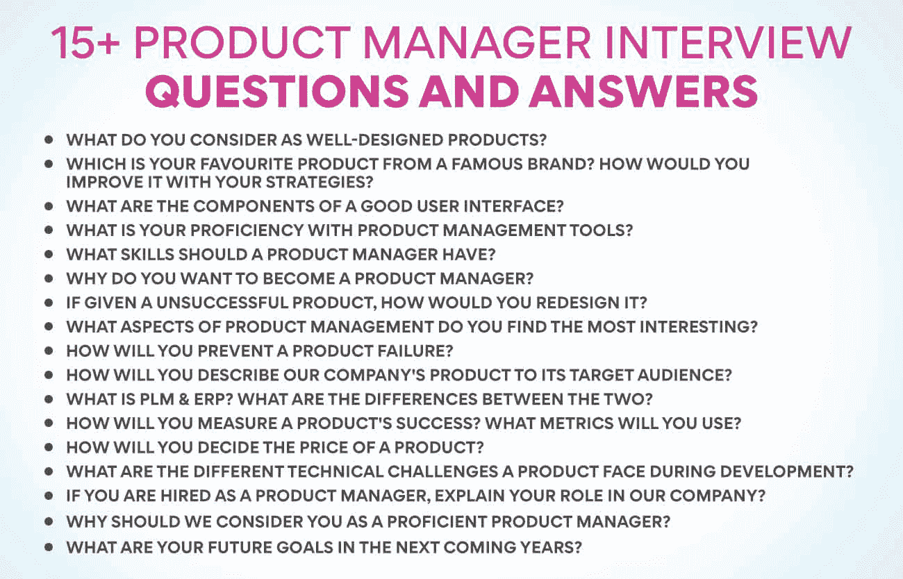

# 16 大产品经理面试问答

> 原文：<https://www.edureka.co/blog/product-manager-interview-questions/>

产品经理面试问题:作为产品经理，你会照看一个产品或产品的开发和成功。你需要有很强的解决问题的能力，并且能够战略性地思考，以确保你的产品满足目标市场的需求。在产品经理职位的面试中，你可能会被问到一些关于你管理产品的经验以及你战略性思考和解决问题的能力的问题。

我们的产品管理高级执行官证书旨在为您在[产品管理](https://www.edureka.co/blog/product-management/)的辉煌职业生涯做准备。

为了帮助你准备这类问题，这里有一些范例问题和回答这些问题的技巧。

## **16 强产品经理面试问答**

## 你认为什么是设计良好的产品？

一个设计良好的产品在满足用户需求的同时，还要具有视觉吸引力和易用性。一个好的设计对任何产品来说都是至关重要的，因为它可以区分一个成功的上市和一个失败。

当面试[产品经理](https://www.edureka.co/blog/product-manager)的职位时，你可能会被问到对优秀设计的看法。这个问题可以让面试官判断你的品味，看看你的价值观是否与公司一致。

为了很好地回答这个问题，你应该首先给出一个你认为是设计良好的产品的简要定义。然后，您可以提供一些符合此标准的产品示例。最后，解释一下为什么你认为好的设计对产品是必不可少的。

## 你最喜欢哪个著名品牌的产品？你会如何用你的策略来改善它？

你可以从一个著名品牌中挑选一种产品；苹果 iPhone。iPhone 是一款伟大的产品，拥有许多功能，并且总是随着新的更新而改进。然而，我们有办法用我们的策略来改善它。

首先，你可以努力让电池寿命更长。对 iPhone 的主要不满之一是电池持续时间不够长。你可以专注于确保电池持续更长时间，这样人们就可以长时间使用他们的手机，而不用担心充电。

专注于让手机更耐用。许多人的 iPhones 都有一个问题:容易坏。我们将努力使手机更耐用，以承受跌落和其他事故。

最后，考虑让每个人都能买得起手机。iPhone 是一款很棒的产品，但只有部分人买得起。所以，你可以让它更实惠，这样每个人都可以享受它的功能。

## **ProductManager 面试问题:一个好的用户界面有哪些组成部分？**

示例性用户界面的组成部分是直观的设计、易于使用的控件和一致的布局。

直观的设计意味着用户界面易于导航且全面。一致的布局意味着界面易于理解，并且在不同的设备上保持一致。易于使用的控件允许用户轻松导航界面和执行任务。

**也读:[什么是产品管理？](https://www.edureka.co/blog/what-is-product-management/)**

## **您对产品管理工具的熟练程度如何？**

作为产品经理，你必须精通各种工具和技术。以下是一些常见的产品管理工具，以及如何展示您对它们的熟练程度:

项目管理工具: 你将作为产品经理管理复杂的项目。你应该表明你精通使用项目管理工具，如吉拉或特雷罗。

**产品路线图工具:** 产品路线图是规划和跟踪产品进度的关键工具。你应该表明你知道如何使用流行的路线图工具，如啊哈！或产品计划。

**客户反馈工具:** 作为产品经理，你必须收集和跟踪客户的反馈。您应该熟悉流行的客户反馈工具，如 UserVoice 或 Intercom。

**数据分析工具:** 作为产品经理，你必须分析数据，为你的决策提供依据。要熟练使用 Excel 或 Tableau 等数据分析工具。

## **产品经理应该具备哪些技能？**

产品经理应该具备各种技能，才能在自己的岗位上取得成功。你应该能够与不同的团队和利益相关者有效沟通，理解产品数据和分析，并对产品有战略眼光。

此外，产品经理应该有很强的项目管理技能，以保证开发过程的顺利进行。你还应该能够处理客户的反馈，创造用户友好的产品设计。

## **你为什么想成为产品经理？**

你可以想出一些你想成为产品经理的关键原因:

1.  作为产品经理，你将从头到尾负责开发和管理产品。它会让你在很大程度上控制产品的方向和营销方式。
2.  产品经理经常与其他部门紧密合作，例如工程、销售和市场营销。它可以让你与其他专业人士建立牢固的关系，并了解他们各自的行业。
3.  成为产品经理是推进你职业生涯的一个好方法。

产品经理通常被视为组织内的领导者，受到高度尊重。

## 如果给你一个不成功的产品，你会如何重新设计它？

如果给你一个不成功的产品，你会如何重新设计？

这可能是一个困难的问题，因为它取决于产品的具体情况和失败的原因。然而，这里有一些关于如何重新设计一个不成功的产品的通用技巧:

1.  确定产品失败的原因。在重新设计中避免犯同样的错误是至关重要的。
2.  简化产品。简化它，使它更容易使用和理解。
3.  改善用户体验。确保用户对重新设计的产品有积极的体验。
4.  关注核心功能。不要试图在重新设计上做太多——专注于改进产品的核心功能。
5.  发射前进行广泛测试。确保在推出重新设计的产品之前对其进行彻底测试，以避免再次失败。

## **产品经理面试问题:你觉得产品管理的哪些方面最有趣？**

产品管理的很多方面都可能令人兴奋，这取决于你对什么感兴趣。对于一些人来说，最令人兴奋的部分可能是构思过程和开发新产品的想法。其他人可能会发现[战略规划](https://www.edureka.co/blog/product-planning/)和路线图方面更令人兴奋，而其他人可能会喜欢更实际的产品开发和执行方面。

我发现产品管理的各个方面都以这样或那样的方式令人兴奋。我很欣赏提出创新想法的挑战，但我也很高兴看到这些想法通过成功的执行变成了现实。对我来说，最棒的部分可能是一种满足感，这种满足感来自于知道我在将一种人们会喜欢和使用的伟大产品推向市场方面发挥了重要作用。

## 您将如何防止产品故障？

防止产品故障可能很复杂，但有一些步骤可以降低产品故障的几率:

1.  确保你清楚地了解你的目标市场，以及他们想要从像你这样的产品中得到什么。
2.  彻底做好你的研发工作，为你的产品打下良好的基础。
3.  为产品上市制定详细的计划，并在产品上市后跟踪其进展。
4.  必要时，随时准备根据客户反馈或市场变化进行调整。

通过采取这些预防措施，您可以帮助提高产品的成功几率。

## 你将如何向目标受众描述我们公司的产品？

你必须为你的产品定义愿景和[策略，并确保它满足目标受众的需求。要做到这一点，你必须对你的产品及其功能有深刻的理解，并了解你的目标市场。](https://www.edureka.co/blog/product-strategy/)

当向目标受众描述你的产品时，简明扼要是必要的。你应该避免使用技术术语或者对你的听众的知识水平做出假设。相反，你应该专注于解释你的产品是做什么的，以及它有什么好处。

也一定要突出任何独特的卖点或差异，让你的产品从竞争对手中脱颖而出。最终，你的目标应该是传达为什么有人想使用你的产品而不是其他选择。

## 什么是 PLM & ERP？两者有什么区别？

[产品生命周期](https://www.edureka.co/blog/product-lifecycle/)管理(PLM)和企业资源规划(ERP)都是旨在帮助企业管理数据和流程的软件系统。然而，有一些关键的区别。

从构思到退役，PLM 专注于管理与[产品开发](https://www.edureka.co/blog/product-development/)相关的数据和流程。它包括管理产品需求、设计文档和制造数据。另一方面，ERP 是一个更广泛的系统，旨在涵盖企业运营的所有方面，从财务到库存管理到人力资源。

虽然 PLM 和 ERP 可以分开使用，但它们通常会集成在一起，以提供公司数据和运营的完整视图。当一起使用时，PLM 可以提供关于产品开发历史的详细信息，而 ERP 可以洞察该产品在市场上的表现。

**也可理解为:[产品变化的原因是什么？原因&原因](https://www.edureka.co/blog/what-are-the-reasons-of-variations-in-product-causes-reasons/)原因**

## 你将如何衡量一个产品的成功？您将使用什么指标？

作为产品经理，你将确保你所负责的产品取得成功。这意味着你需要清楚地了解每个产品的成功是什么样的，以及你将使用什么标准来衡量它。

有多种指标可以用来衡量产品的成功，具体使用哪种指标取决于产品的性质和你的目标。然而，一些用于衡量产品成功的常用指标包括销售数字、客户满意度、参与度和保留率。

要在面试中回答这个问题，最重要的是能够清楚地说明你所负责的产品的成功是什么样的，以及你会用哪些指标来衡量它。务必解释这些指标将如何帮助您跟踪产品是否实现其目标并推动业务价值。

## 产品经理面试问题:你将如何决定产品的价格？

产品的价格由几个因素决定，包括材料成本、劳动力、运输成本以及任何适用的税收或关税。价格还需要覆盖公司的管理费用和利润。

在给产品定价时，公司需要考虑竞争情况和顾客愿意支付的价格。他们还需要了解影响定价的政府法规。

确定产品合适价格的最好方法是进行市场调查。这可以通过调查、焦点小组和客户访谈来完成。通过了解客户想要什么以及他们愿意支付多少钱，公司可以设定价格，在为客户提供价值的同时实现利润最大化。

## 产品在开发过程中面临哪些不同的技术挑战？

一个产品在开发过程中会面临无数的技术挑战。根据产品的不同，这些挑战可能从简单到极其复杂。

副产品在开发过程中面临的一些最常见的技术挑战包括:

1.  确保兼容各种设备和操作系统。
2.  开发强大且用户友好的功能。
3.  优化性能和稳定性。
4.  管理数据存储和安全。

## 如果你被聘为产品经理，请说明你在我们公司的角色。

如果你被聘为产品经理，你在公司的角色将是监督新产品的开发和发布。你必须与工程师和设计师团队合作，确保新产品满足客户需求并按时发布。您还将管理产品路线图，与利益相关者沟通，并确保产品组合与公司战略保持一致。

## 为什么我们应该认为你是一名出色的产品经理？

产品经理负责产品的战略愿景和方向。他们与跨职能团队合作，将产品推向市场并确保其成功。

作为一名未来的产品经理，你应该展示出你对如何在这个职位上取得成功的理解。当考虑你的职位时，雇主会想知道你是否具备有效完成工作所需的技能和经验。

雇主在产品经理身上寻找的一些关键品质包括如下:

*   强大的战略思维能力
*   开发和清晰表达产品愿景的能力
*   卓越的项目管理能力
*   对市场和竞争格局的深刻理解
*   出色的沟通和人际交往能力
*   影响他人和建立共识的能力

如果你能展示出你拥有这些品质，你就能给雇主留下深刻印象，并获得一份优秀产品经理的工作。

## 产品经理面试问题:你未来几年的目标是什么？

作为一名产品经理，你未来的目标应该是与你的团队建立牢固的关系，开发创新的产品和策略，并交付成果。

在接下来的几年里，你应该巩固你作为团队关键人物的地位，为团队的成功做出贡献，并进一步发展你的技能。你还应该继续与公司的其他利益相关者建立牢固的关系，例如营销、销售和工程。最后，你应该专注于交付满足或超过客户期望的结果。

## **结论**

产品经理面试可能会令人望而生畏，但也不尽然。通过提前准备并知道如何回答常见问题，你可以为自己的成功做好准备。我们的产品经理面试问题列表及其答案将帮助您开始准备。祝你好运！

【to】别忘了查看我们的[产品管理高级管理人员证书](https://www.edureka.co/highered/advanced-executive-program-in-product-management-iitg)，这将带你更接近你的梦想，成为一名成功的产品经理。

## **更多信息:**

[每个 PM 都必须知道的产品管理框架](https://www.edureka.co/blog/product-management-frameworks)

[产品管理学习-关键领域](https://www.edureka.co/blog/product-management-learning)

[11 个重要的产品管理指标和 KPI](https://www.edureka.co/blog/product-management-metrics)

[什么是产品管理课程？为什么它们至关重要？](https://www.edureka.co/blog/product-management-courses)