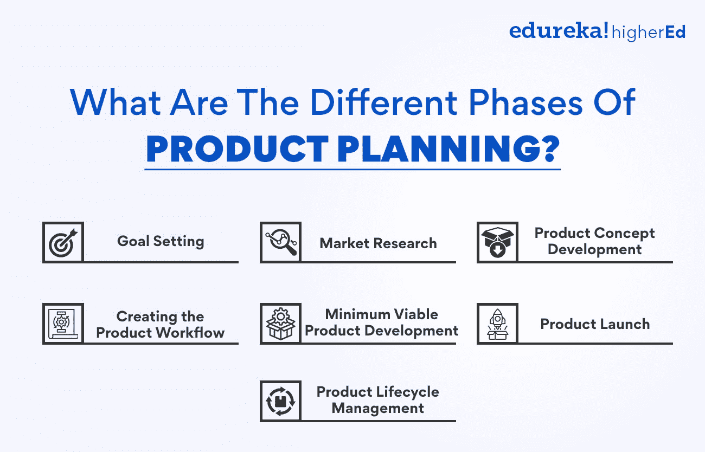
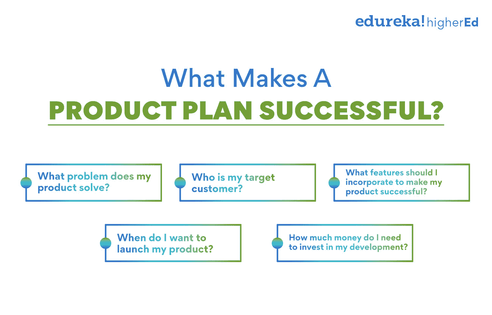

# 什么是产品策划，是怎么做的？

> 原文：<https://www.edureka.co/blog/product-planning/>

没有高效的规划，你如何打造一款产品？事实上，缺乏适当的规划会使你的产品的增长陷入低谷。产品规划是[产品管理](https://www.edureka.co/blog/product-management/)不可或缺的片段。它允许产品经理为他们的产品创建一个路线图，并确保所有的利益相关者都在同一页上。

通过考虑市场机会、客户需求和技术可行性来完成产品规划。这篇博文将更详细地讨论产品规划，以更好地理解如何创建一个产品规划，为产品成功铺平道路。

## **产品规划对产品成功的意义**

产品规划是产品发布和成功的关键，因为它能让你后退一步，放眼全局。它可以帮助您确定构建什么特性以及何时创建它们的优先级。此外，它还允许您跟踪进度和衡量成功。

**创建产品路线图**

产品计划通常是指导整个上市计划的产品路线图。路线图概述了您想要构建的功能，以及它们如何融入整体[产品战略](https://www.edureka.co/blog/product-strategy/)。

**让所有人都在同一页上**

它有助于让每个人都知道需要在什么时候建造什么。这在有许多利益相关者参与的产品开发团队中尤其重要。

**优先考虑特征**

规划使你能够根据业务目标和用户需求对功能进行优先排序。这有助于确保产品以正确的顺序用正确的功能构建，并到达目标受众。

**衡量成功**

优秀的规划可以通过跟踪产品路线图的进展来帮助衡量成功。这使你能够发现什么对你的产品有利，什么需要改进。

没有一个优秀的产品计划，产品开发可能是一个混乱无序的过程。产品规划过程是创造成功产品的第一步。

如果你正在开发一个新产品，或者即使你只是想改进现有产品，产品规划和开发都是必不可少的。通过为你的产品制定一个计划，从长远来看，你可以为自己节省大量的时间和精力。正如他们所说，“一个计划好的产品是一个半成品。”

**也读:[品牌管理 v/s 产品管理:了解关键差异](https://www.edureka.co/blog/brand-and-product-management/)**

## **产品规划和上市策略的区别**

产品计划是创建产品路线图的过程，该路线图概述了产品的特性、功能和时间表。产品规划通常包括市场分析、产品开发和产品管理。

[走向市场战略](https://www.edureka.co/blog/go-to-market-strategy/)是计划和执行产品发布的过程。走向市场战略通常包括产品规划，并包含销售、营销和渠道战略。

产品计划是走向市场战略的重要组成部分，但这两个术语不能互换。产品规划侧重于产品本身，而走向市场战略侧重于产品如何在市场上呈现和销售。

## **产品规划是一个连续的过程**

产品规划是一个持续的过程，应该根据需求重新审视和调整。这个产品路线图是一个动态文档，会随着产品的发展而变化。产品经理必须能够适应变化，并在必要时进行调整。

产品规划过程总是从一个想法开始。这可以来自任何地方，但是产品开发团队通常会生成它。想法提出后，必须经过审查，看它是否可行。这是通过创建产品需求文档(PRD)来完成的。PRD 概述了产品将解决的问题、目标市场、建议的解决方案等等。

一旦 PRD 获得批准，就该开始构建产品了。这是 产品路线图开始实施的时候。产品路线图 是产品的高级视图，概述了产品的特性和开发时间表。需要注意的是，产品路线图 并不是一成不变的，可以根据需要进行更改。

随着产品的开发，[产品经理](https://www.edureka.co/blog/product-manager)必须继续与所有利益相关者沟通。这包括开发团队、销售团队、营销团队和客户。产品经理负责确保每个人都知道产品的发展，并且产品是根据产品路线图开发的。

一旦产品开发并发布，产品规划流程 将重新开始。这是因为产品规划是一个持续的过程，永远不能停止，只能根据需求进行改进。

## 产品规划有哪些不同的阶段？

这是为产品制定计划的过程。这个计划包括产品的目标、市场调研、目标受众等等。产品计划的不同阶段如下:

**目标设定**

在这个阶段，产品团队为产品设定目标。这些目标可以是任何东西，从增加销售到提高客户满意度。必须提前设定目标，以确保产品规划流程 有重点、有条不紊。

目标设定过程需要:

*   分析产品现状
*   为产品设定目标
*   制定实现这些目标的计划

一旦你分析了所有这些因素，你就可以设定你的产品目标。确保这些目标是现实的和可实现的，这样你的团队才能在整个计划过程中保持动力。

**市场调查**

目标设定后，下一阶段是进行市场调查。这项研究有助于团队了解目标受众的需求以及他们在产品中寻找什么。这也有助于识别任何潜在的竞争对手。

市场调查对于 计划 来说是必不可少的，因为它提供了有助于形成产品目标的见解。研究应该在计划过程的开始进行，以指导整个团队。

**产品概念开发**

产品概念是产品的基础。这是产品是什么，它做什么。在进行任何其他计划之前，产品概念必须得到很好的发展。

开发一个产品概念，你需要:

*   了解目标受众
*   研究竞争
*   确定产品将做什么
*   提出独特的销售主张

一旦你有了清晰的产品概念，你就可以进入下一个产品规划阶段。

**也可理解为:[产品变化的原因是什么？原因&原因](https://www.edureka.co/blog/what-are-the-reasons-of-variations-in-product-causes-reasons/)原因**

**创建产品工作流程**

产品工作流程是产品计划的高级概述。它包括产品的所有目标、里程碑和可交付成果。路线图记录了[产品开发](https://www.edureka.co/blog/dynamic-stages-of-the-new-age-product-development-process/)过程，并确保每个人都在同一页上。

创建产品路线图需要:

*   设定产品目标
*   确定里程碑
*   概述交付成果
*   创建时间线

产品工作流程是产品计划的重要组成部分，因为它提供了必须完成的任务和时间的清晰概要。随着规划过程的发展，保持工作流程的更新是至关重要的。

**最小可行产品开发**

最小可行产品(MVP)是具有基本特征的产品。它用于与目标受众一起测试产品概念。MVP 应该在任何其他产品计划完成之前开发。

要开发 MVP，您需要:

*   确定产品的核心特性
*   简化产品
*   关注用户体验

MVP 是产品规划的重要部分，因为它允许你以最小的风险测试产品概念。保持 MVP 的简单是至关重要的，这样它就可以很容易地被测试和改进。

**产品发布会**

产品发布是产品规划的最后阶段。这是产品向公众公开的时候。产品发布应该经过周密的计划和执行，以确保产品的成功。

要计划一次成功的产品发布，你需要:

*   制定营销计划
*   制定走向市场战略
*   创建产品发布清单

产品发布是产品规划中最关键的部分。为确保产品成功，仔细计划和执行发布是至关重要的。

**产品生命周期管理**

产品生命周期管理(PLM)是从开始到报废管理产品的过程。PLM 包括产品计划、开发和发布的所有方面。制定清晰的 PLM 战略以确保产品成功至关重要。

要制定 PLM 战略，你需要:

*   了解[产品生命周期](https://www.edureka.co/blog/product-lifecycle/)
*   确定产品开发的关键阶段
*   确定每个阶段需要的资源

PLM 确保产品的各个方面都得到有效管理，从而使产品获得成功。

如果你也想[了解产品规划的本质](https://www.edureka.co/blog/product-management-learning)，请仔细看看我们的产品管理高级管理人员证书，它能让你深入了解产品管理。

## **制定成功产品计划的智能提示**

产品规划对任何企业都是至关重要的，但它经常被忽视或执行不力。产品计划包括弄清楚提供什么产品或服务，如何生产和营销，以及设定什么价位。这是将任何产品或服务推向市场的关键一步，然而许多企业并没有给予它应有的重视。

以下是产品规划时必须牢记的几个关键点:

首先，你需要了解你的目标市场。你卖给谁？你的产品解决了什么问题和顾虑？他们的痛点是什么？做广泛的市场调查对制定一个成功的产品计划至关重要。这将使你为产品开发和营销做好准备。

接下来，你需要创建一个产品路线图。本文档概述了将您的产品或服务推向市场的步骤。它应该包括时间表、里程碑和可交付成果。创建产品路线图将有助于保持您的进度，并确保参与产品开发过程的每个人都在同一页面上。

利用优先排序框架来帮助你专注于正确的产品特性。这将确保您的产品首先推出最重要的元素，随后的版本包括符合客户需求的附加功能。

最后，你必须为你的产品或服务设定一个价位。这可能很棘手，因为你要确保自己不会因为定价过高而被挤出市场。同时，你不希望低估你的产品或服务。研究和了解你的目标市场的购买力将有助于你设定一个有竞争力的价格点。

## 什么使产品计划成功？

一个成功的产品计划必须清晰、简明、易懂。它应该概述产品的特点、优点和目标。产品计划还应该包括产品何时上市以及如何营销的时间表。

制定产品计划是将新产品推向市场的第一步。在开始产品规划之前，清楚地了解你想用你的产品实现什么是很重要的。如果你不确定你的产品目标是什么，问自己这些问题:

*   我的产品解决了什么问题？
*   谁是我的目标客户？
*   为了让我的产品成功，我应该融入哪些特性？
*   我想什么时候推出我的产品？
*   我需要为我的发展投资多少钱？

一旦你找到了这些问题的答案，你就可以开始制定你的产品计划了。首先，为你想要实现的每个目标制定一个时间表。然后，开始充实你的产品的细节，包括它将包括什么功能和它将如何营销。一定要为你的产品开发和营销工作做好预算。

如果你想确保你的产品计划成功，获得他人的反馈是至关重要的。询问朋友、家人和潜在客户对你的产品想法的看法。在你开始投入时间和金钱开发你的产品之前，利用这个反馈来微调你的产品计划。

制定产品计划是将新产品推向市场的第一步。通过花时间制定一个深思熟虑的产品计划，你可以增加成功的机会，避免代价高昂的错误。如果你需要帮助创建一个产品计划，考虑与产品规划和开发 顾问合作。

有关产品开发和管理的更多信息，请查看我们的[产品管理高级执行官证书](https://www.edureka.co/highered/advanced-executive-program-in-product-management-iitg?)，该证书涵盖产品战略、产品路线图、产品开发流程等。

## **更多信息:**

[什么是产品管理？](https://www.edureka.co/blog/what-is-product-management/)

[每个 PM 都必须知道的产品管理框架](https://www.edureka.co/blog/product-management-frameworks)

[11 个重要的产品管理指标和 KPI](https://www.edureka.co/blog/product-management-metrics)

[什么是产品？含义、示例、定义和特征](https://www.edureka.co/blog/product)