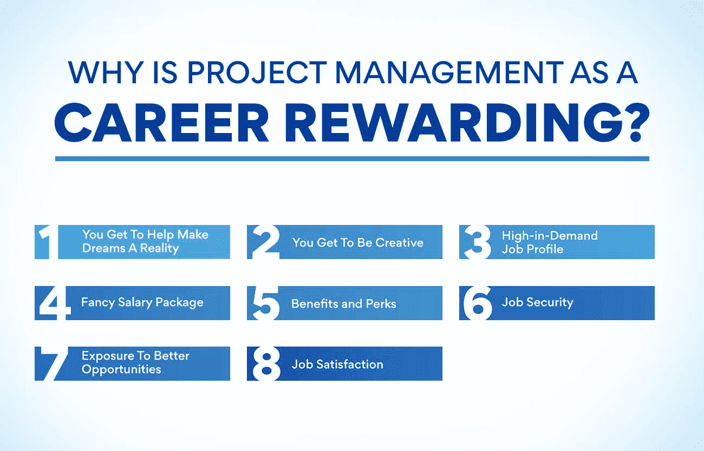
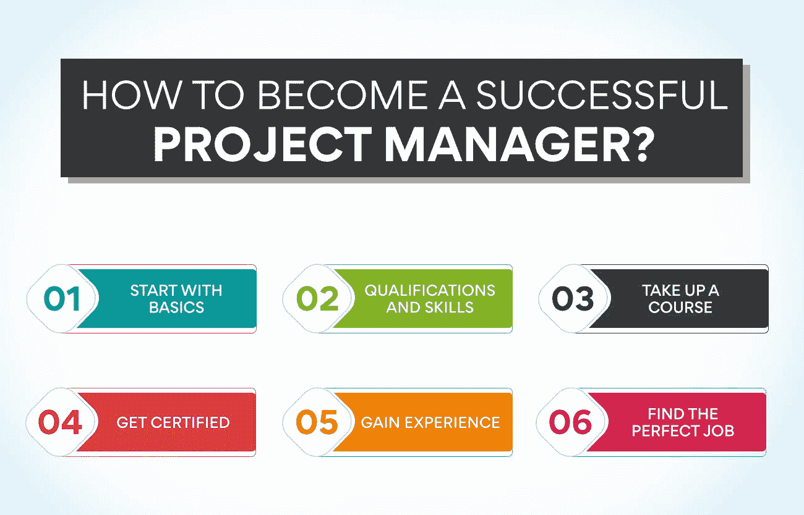

# 把项目管理当成职业？你需要知道的一切

> 原文：<https://www.edureka.co/blog/project-management-as-a-career>

如果你正在考虑将项目管理作为职业，你就在正确的轨道上！项目管理是世界上发展最快、需求量最大的职业之一。对于那些希望对自己的工作生活有更多控制权的人来说，这是一份完美的职业。这篇博文将讨论你需要知道的关于项目管理职业的一切。我们将涵盖教育要求、工作前景和工资信息。你准备好学习更多关于项目管理职业的知识了吗？继续读！

## 项目管理在印度是一个蓬勃发展的领域吗？

项目管理是印度最受欢迎的职业之一，技能短缺预计只会增加。到 2027 年，预计全球将有 2200 万个项目管理职位空缺。

项目管理领域在印度发展迅速。这可以归功于该国蓬勃发展的经济和不断增加的基础设施项目。随着政府对“印度制造”等倡议的关注，需要能够接手这些大型项目并完成它们的项目经理。

此外，由于数字化和全球化的兴起，项目管理领域也在不断发展。随着越来越多的公司在全球拓展业务，需要擅长管理跨文化团队和项目的项目经理。

此外，疫情迫使许多企业重新评估他们在 T2 的业务。特别是，他们被迫适应远程工作的新现实。

这意味着更需要能够监督远程团队并确保所有工作都按照所有标准完成的项目经理。项目管理繁荣的另一个原因是敏捷工作方法越来越受欢迎。敏捷项目管理是一种灵活且适应性强的项目管理方法，在当今不断变化的商业环境中被证明是成功的。

随着越来越多的企业采用敏捷方法，对有这方面经验的项目经理的需求也在增加。如果你正在考虑将项目管理作为你的职业，现在是行动的最佳时机。

进入项目管理行业从来没有好时机。有了正确的技能和经验，你可以在这个令人兴奋的快节奏的行业中获得一份高薪和有回报的工作。

所以，如果你正在考虑将项目管理作为职业，那么这是一个你应该考虑的领域。有大量的机会，对项目经理的需求在未来只会增长。

## 为什么项目管理作为一种职业是有益的？

当谈到项目管理时，有许多不同的职责伴随着这个角色。你不仅要确保项目及时完成，还要确保它满足[利益相关者](https://www.edureka.co/blog/stakeholder-engagement)的期望。

虽然这可能感觉压力很大，但项目管理可能是一份令人满意的职业。以下是一些原因:

**你可以帮助梦想成真**

作为项目经理，你的主要职责之一就是帮助实现项目愿景。这意味着与一个由高技能人员组成的团队合作，以使项目取得成果。您将确保项目保持在正轨上，并且所有目标都得以实现。每天都会有新的梦想，你会用你的[项目管理](https://www.edureka.co/blog/project-management-fundamentals)技能把它变成现实。无论项目规模大小，项目经理在项目的成败中起着举足轻重的作用。你将永远是某件真正非凡的事情不可或缺的一部分。

**你开始变得有创造力**

虽然项目管理看起来不像是一个创造性的领域，但它需要大量的创造力。毕竟，你有责任想出新的方法在限制内完成项目目标。这意味着你必须能够跳出思维定势，为问题带来有利可图的解决方案。

在项目管理中，你还需要能够向利益相关者推销你的想法。你必须以一种令人信服和鼓舞人心的方式阐明你的愿景。如果你能做到这一点，你将获得对你的[项目计划](https://www.edureka.co/blog/project-planning)的认可，这对于成功的项目交付是至关重要的。

**热门职位简介**

企业比以往任何时候都更需要项目经理来确保他们的运营顺利进行。项目经理的任务是从头到尾规划、执行和监控项目。项目经理在各行各业都有巨大的需求，对于那些对项目管理感兴趣的人来说，这是一个极好的职业选择。根据项目管理研究所的数据，项目管理是增长最快的职业之一，预计到 2027 年将增长 33%。

**同时阅读[项目管理流程和阶段说明！](https://www.edureka.co/blog/project-management-processes-and-phases-explained/)**

**优厚的薪资待遇**

无论你在哪个领域，项目管理总是抢手的工作，薪水也很高。在美国，项目经理的平均年薪约为 9 万美元。在英国，项目经理的平均收入为 4.5 万英镑。同样，印度的项目经理也有不错的薪酬待遇。印度项目经理的平均工资是卢比。每年 60-260 万卢比，取决于他们的经验和技能。随着你步步高升，项目管理成为了收入最高的工作之一。

**福利和津贴**

除了高薪之外，项目经理通常还享有一些福利和津贴。这些包括健康保险、带薪休假和退休储蓄计划。一些项目经理也根据他们项目的成功获得奖金。例如，如果项目成功交付或超出客户的预期，项目经理可能会获得奖金。提供的一些常见优势有:

*   **401(k)计划:** 许多项目经理都有机会参加 401(k)计划。这是许多雇主提供的退休储蓄计划。
*   健康保险: 项目经理通常有权使用健康保险计划。它可以包括医疗、牙科和视力保险。
*   带薪休假 项目经理通常会获得带薪休假，包括假期、病假和事假。
*   奖金: 一些项目经理根据他们项目的成功获得奖金。每个公司都有不同种类的奖金。

**工作保障**

没有其他管理工作能像项目管理那样给你带来稳定和欣赏。在任何项目中，项目经理都是负责项目成败的关键人物。公司总是需要项目经理来确保他们的项目按时完成，符合指导方针和规范。对于永恒来说，将会需要无论在什么情况下都能完成工作的项目经理。

**接触更好的机会**

将项目管理作为职业会给你带来很多更好的机会。例如，你将与不同的团队和不同背景的人一起工作。它将帮助你更好地理解商业世界以及项目管理如何影响商业的各个方面。此外，你将能够学到有益于你职业生涯的新技能和知识。你将参与不同类型的项目。这会让你发展出更全面的技能，为你的未来服务。

**工作满意度**

项目经理的工作很有挑战性，也很令人满意。项目管理是一个越来越受欢迎的职业，项目经理的需求量很大。如果你喜欢接受挑战和从事各种工作，项目管理可能是你的职业。项目管理对许多人来说是一个极好的职业选择，有充足的福利和工作满意度。不管是什么行业，你总是会和不同的团队和人一起工作，这既令人兴奋又富有挑战性。然而，完成一个项目所带来的成就感和自豪感是值得的。

## **如何成为一名成功的项目经理？**

“以项目管理为职业”是最近互联网上的热门关键词。人们搜索它是因为他们想知道你如何成为一名项目经理，或者项目管理是怎么回事。有很多关于项目管理的信息，但是很难找到正确的信息。我们已经创建了一个路线图来帮助您了解项目管理以及如何成为一名成功的项目经理。

**从基础开始**

当你是项目管理的新手时，从基础做起是必不可少的。你必须了解项目管理的基本原理及其所涉及的内容。您还需要了解不同的项目管理方法，以及如何将它们应用到您的项目中。一旦你很好地理解了基础知识，你就可以进入更高级的话题了。

**资格和技能**

要想胜任大多数项目经理的职位，你至少需要项目管理、商业或相关领域的学士学位。很多用人单位也更希望你有硕士以上学历。你还需要有很强的项目管理技能和优秀的沟通、组织和领导技能。

参加一门课程

如今有许多项目管理课程可供选择。这些课程将让你更接近项目管理的基础，以及如何将它们应用到你的项目中。您还将了解不同的项目管理方法，以及如何在您的项目中使用它们。要成为一名成功的项目经理，你应该参加一门课程。

**获得认证**

一旦你完成了项目管理课程，你就可以获得项目管理学院(PMI)的认证。要获得认证，你必须通过考试，并满足特定的经验要求。有不同的项目管理认证，如项目管理专家和项目管理认证助理。每个证书都有不同的要求，所以在决定追求哪一个之前检查要求。

**获得经验**

如果你没有太多的专业工作经验，找到项目管理经验会很困难。幸运的是，有一些事情可以获得你需要的经验。获得项目管理经验的一个方法是在你目前的工作岗位上志愿参加项目。这将给你一个机会来测试你的项目管理技能，看看这是否是你感兴趣的事情。

另一个获得经验的方法是做兼职项目。这些可以是任何事情，从管理一个小事件到在你孩子的学校组织一个小组项目。接受小项目会让你磨练你的项目管理技能。

**也读:[什么是项目生命周期？](https://www.edureka.co/blog/project-lifecycle)知无不言**

**找到完美的工作**

凭借出色的项目管理经验，你可以胜任各种不同类型的项目经理角色。

项目经理是任何项目的关键驱动力。他/她负责确保项目在预算内完成并达到要求的标准。你可以在 Indeed 或 LinkedIn 等招聘网站上搜索你所在地区的项目经理职位。

项目管理职位在很多行业都有，包括建筑、IT、医疗保健和零售。无论你选择什么行业，都可能有一个项目经理的角色非常适合你。

## **底线**

随着项目环境的不断变化，项目经理的角色对于确保项目目标的成功完成至关重要。如果你正在考虑把项目管理作为职业，知道这既令人满意又富有挑战性。关键是要跟上最新的项目管理趋势和最佳实践。有了正确的技能和态度，你就能成为推动项目成功的项目经理。

如果你想在一个有洞察力的水平上开始你的职业生涯，考虑我们的[运营、供应链和项目管理](https://www.edureka.co/highered/advanced-program-in-operations-supply-chain-project-management-iitg)高级证书，它给你一个从启动到结束的项目管理及其在各个行业的应用的详细概述。您还将发展项目经理必备的项目管理技能。所以，做好准备，在坚实的基础上开始你的项目管理职业旅程吧！

## **更多信息:**

[了解项目选择及其重要性](https://www.edureka.co/blog/project-selection)

为什么预防性维护工具对项目成功至关重要？

[主要项目管理活动——你必须知道的](https://www.edureka.co/blog/project-management-activities)

[印度项目经理薪资:2022 洞察](https://www.edureka.co/blog/project-manager-salary-in-india)