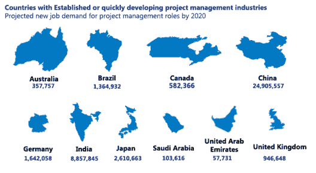
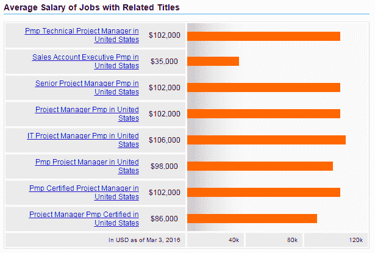
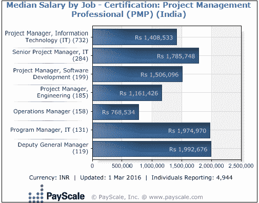

# 项目管理职业道路:获得 PMP 认证的顶级项目管理工作

> 原文：<https://www.edureka.co/blog/project-management-career-path-bag-top-project-management-jobs>

据《环球知识》报道，PMP 被誉为 2016 年全球薪酬第五高的认证，并继续其长达十年的增长轨迹。根据项目管理研究所的《2013 年项目管理人才缺口报告》，2010 年至 2020 年，全球经济将在七个项目密集型行业创造 1570 万个新的项目管理职位。项目管理职业道路从来没有看起来更有前途！

项目管理认证是值得的成本和努力。无论你是想转换职业，想在目前的项目管理工作中表现得更好，还是想与众不同，PMP 都可以帮助你实现职业发展和成功！PMP 还为您提供标准化项目管理最佳实践的专有技术，帮助您成为更优秀的项目经理，为组织增加真正的价值。在这篇博文中，我们来讨论一下获得 PMP 认证的好处以及 PMP 认证专家可以获得的职业机会。

## 项目管理职业道路

项目管理研究所(PMI)估计，2016-17 年印度需要 500，000 名新项目经理。此外，全球平均增长 12%(来源:普华永道调查)，PMP 认证是一个明智的职业发展举措，为更快的职业发展铺平了道路。PMP 认证的最大优势无疑是它提供的竞争优势。通过在企业竞争中脱颖而出，你的 PMP 证书将帮助你进入顶级组织，其中许多组织只雇用 PMP 认证的项目经理。这里有一些统计数据，可以让你清楚地了解等待你的项目管理职业机会。

*   总部设在美国的 PMI 在过去十年中成员数量增加了十倍。
*   PMI 估计，2016-17 年印度至少需要 500，000 名项目经理，今年将超过 200，000 名项目经理。
*   根据 PMI 的数据，这十年印度创造了大约 400 万个项目管理职位，到 2020 年 PMP 的就业率将增长 60%。

这是一个到 2020 年对项目管理专业人员需求的图表。资料来源:www.pmi.org

你可以在这个博客中找到为什么公司更喜欢雇佣 PMP 认证的项目经理。

## 项目经理工资

获得 PMP 认证是值得的——真的！PMP 证书使你能够获得比非认证项目经理更高的薪酬，也比大多数认证项目经理更高的薪水。

根据项目管理人才缺口报告，美国项目经理的平均工资为 108，000 美元，金融、建筑和医疗保健行业的需求最高。下面是一张 Indeed.com 图表，描述了美国 PMP 认证项目经理的平均工资。

印度紧随其后的是热门行业，如 IT、建筑、医疗保健、石油和天然气，根据 PMI 的数据，项目从业者的工资中位数为 27，052 美元。下面的图表来自 Payscale.com，描述了印度按职位划分的工资中位数。

## 项目经理必备技能

PMI 将项目经理描述为“变革推动者”，并且“他们组织有序，充满激情，以目标为导向，了解项目的共同点，以及他们在组织如何成功、学习和变革中的战略作用。”PMI 接着说，理想的项目经理将“适应动态环境中的变化和复杂性”，并且他/她将培养在项目的所有利益相关者之间发展信任和沟通所需的人际技能。

除了这些特征，一些有用的技能是:

*   理解组织的政治文化和原则的能力
*   战略性思考和行动的能力
*   有建筑主导的项目管理经验

## 项目经理的职责

项目经理应该承担的一些工作角色有:

*   规划项目、项目范围和目标
*   为项目配备人员并确保资源可用性
*   协调内部和外部资源
*   执行项目
*   控制项目，管理范围、成本、期限等的变更
*   监控项目并向管理层和客户汇报
*   风险管理
*   客户关系管理

对 PMP 认证项目经理的需求很高，范围不限于任何一个行业。世界各国都在迅速发展项目管理行业，需要熟练的 PMP 认证经理。因此，一直需要有能力监督项目的规划、顺利执行和顺利结束的人。根据 PMI 的数据，中国引领着对项目经理的需求，印度、墨西哥、尼日利亚、英国和美国的预测都很乐观。你可以在这个博客中了解更多关于 PMP 不同行业中不断增长的就业机会。

成为 PMP 认证项目经理的最佳时机。项目经理的 [职业前景](https://www.edureka.co/blog/career-prospects-with-pmp-certification/ "Career prospects with PMP certification") 是无限的，PMP 更是如此。立即获得认证，充分利用项目管理职业机会！

*Edureka 是 PMI 的代表。Edureka 凭借其由行业知名从业者支持的创新课程，已经帮助超过 250，000 名专业人士通过 80 多门专门设计的课程提升了他们的技能。自 2011 年成立以来，已在 Edureka 平台上提供了超过 50，000 小时的课程。了解 Edureka 的 PMP 备考课程，请访问[https://www.edureka.co/pmp](https://www.edureka.co/pmp "Get started with PMP exam preparation")*

有问题要问我们吗？请在评论区提及它们，我们将会回复您。

**相关帖子:**

[PMP 考试准备入门](https://www.edureka.co/pmp "Get started with PMP exam preparation")

[30 强项目管理面试试题](https://www.edureka.co/blog/interview-questions/top-30-project-management-interview-questions-2016/ "project management interview questions")

[如何在您的组织中设立 PMO](https://www.edureka.co/blog/how-to-set-up-a-project-management-office-in-your-organization "How to set up a PMO in your organization")