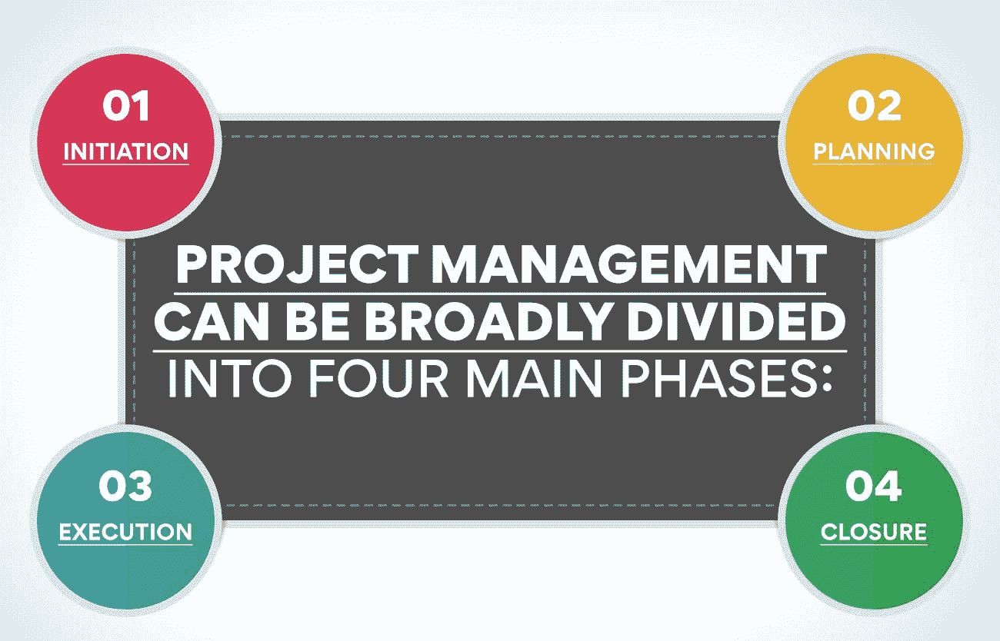
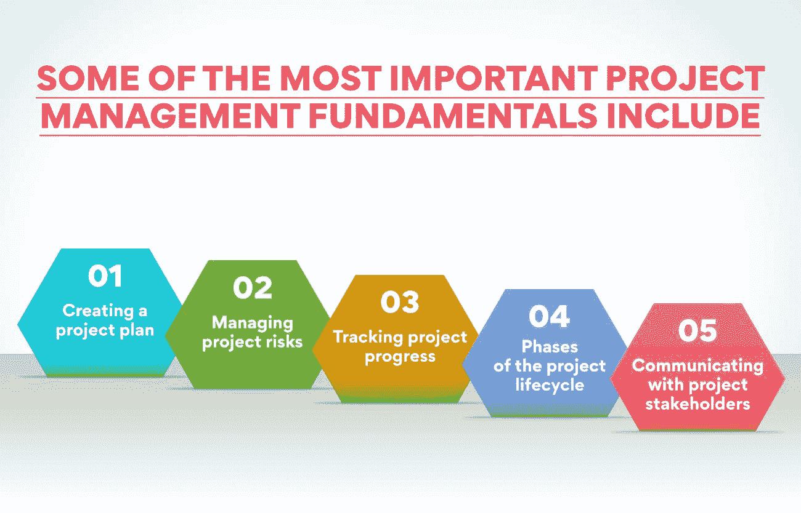

# 项目管理基础讲解

> 原文：<https://www.edureka.co/blog/project-management-fundamentals>

没有项目管理，企业的高效运作是不可想象的，因为它是任何组织的重要组成部分。这是一个用于确保正确实现所有项目目标和目的的过程。它包括从开始到结束的计划、组织和监督项目。无论你是为你的公司还是为客户做项目，理解项目管理的基本原理是很重要的。在这篇博文中，我们将讨论有效管理项目需要知道的关键概念！

## **项目管理:详细概述**

项目管理是根据商定的标准，采用方法、流程、知识、技能和经验来实现特定的项目目标。这是为了创造一种独特的产品或服务而进行的临时性努力。项目经理的职责范围很广，包括但不限于制定项目计划、获取项目资源、管理项目风险和监控项目进度。他们必须身兼数职，掌握多种技能才能获得成功。

项目管理通常被认为是项目管理或项目组合管理的同义词。项目管理负责对多个项目进行分组，以实现战略目标。项目组合管理负责选择一个组织承担的项目并对其进行优先级排序。

项目管理是一个相对较新的领域，因此，没有一个普遍接受的定义。根据项目管理协会(PMI)的定义，项目管理是“技能、工具、知识和技术在项目活动中的应用，以满足项目需求。”

然而，项目管理可以大致分为四个主要阶段:

*   启动
*   策划
*   执行
*   关闭

这些阶段被进一步划分为一系列项目管理过程组:

*   项目集成管理
*   项目范围管理
*   项目时间管理
*   项目成本管理
*   项目质量管理
*   项目人力资源管理
*   项目沟通管理
*   项目风险管理

如果不了解项目管理的基本原理，所有这些项目管理阶段和小组都是不完整的，因为它们都源于项目管理。

点燃你的好奇心，了解更多关于项目管理的知识，并通过[运营、供应链和项目管理高级证书为自己进入职业世界做好准备。](https://www.edureka.co/highered/advanced-program-in-operations-supply-chain-project-management-iitg)现在在你舒适的环境中学习，不要让你繁忙的日程妨碍你的学习。您可以积累领域专业知识，并获得基于实践的学习方法，使事情变得简单。

## **项目管理基础**

项目管理是一个可以应用于任何类型项目的过程，无论是开发软件、建造房屋还是策划活动。项目管理的基础包括项目从开始到完成并取得成功的每一个过程。

一些最重要的项目管理基础包括:

确定项目范围

*   创建项目计划
*   管理项目风险
*   跟踪项目进展
*   项目生命周期的各个阶段
*   与项目干系人沟通

无论你是想从事项目管理，还是已经在这个领域工作，对这些概念有一个深刻的理解是很重要的。通过理解项目管理的基本原理，你将会走向成功。让我们详细讨论这些基础，它们被认为是项目管理的基石。

**了解项目并定义其范围**

项目管理的第一步是了解什么是项目。项目是一种临时性的努力，有明确的开始和结束，以创造独特的产品、服务或结果。

项目的目标是项目试图实现的目标。项目经理必须清楚地了解他们想要达到的目标。它需要定义项目的目标和范围。

另一方面，项目范围是对项目包括和不包括的内容的描述。定义范围有助于项目经理理解项目的界限，并使创建项目计划变得更加容易。

***例如:***

假设你正在计划一个新的送餐软件。在这种情况下，项目的目标可能是创建用户友好和高效的软件。项目的范围将包括开发软件所需的一切，例如研究、设计和编码。

它还会排除任何对项目不重要的东西，比如为软件创建一个营销活动。定义项目的范围是项目管理不可或缺的一部分，因为它有助于项目经理理解要实现项目的目标必须做些什么。

**制定全面的项目计划**

项目计划是你的项目管理系统的基础。它应该包括项目的所有方面，从最初的计划阶段到完成。您的项目计划应该全面且组织有序，以便轻松跟踪项目进度并识别潜在问题。

设定现实的目标和里程碑是项目计划中最重要的方面之一。如果你设定了不切实际的目标，你很可能会发现自己落后于计划并且超出预算。同样，如果你放置了太多的里程碑，你的项目将会陷入细节中，并且你将会错过大图。

项目计划的另一个重要方面是制定一个现实的预算。如果你没有为你的项目做好充分的预算，你会发现你自己正在努力寻找资金来保持项目的正常进行。

通过创建一个全面的项目计划，你将从一开始就为项目的成功做好准备。一个计划会让你知道需要做什么，什么时候应该完成，以及要花多少钱。

***例如:***

从头开始一个项目时，项目计划是你的圣经。它应该包括从最初的计划阶段到项目完成的一切。确保包括里程碑、现实的目标和详细的预算。一个全面的项目计划总是会让你的项目走向成功。

如果你正在进行一个项目，制定项目计划仍然很重要。这将有助于您跟踪项目的进展，并识别过程中的任何潜在问题。

**检测和管理相关风险**

任何规模或类型的项目都包含一些风险。项目经理必须意识到项目中涉及的所有风险，并且应该有应对这些风险的计划。他还应该不断地监控项目，以识别任何可能出现的新风险。

项目管理不仅仅是在预算内按时完成项目。它还确保项目安全、无事故地完成。因此，项目经理必须充分了解健康和安全法规。

在正确的时间发现风险并采取纠正措施是项目经理最基本的技能之一。管理风险需要项目经理使用各种项目风险管理工具和技术。一些流行的项目管理风险控制技术有:

*   识别每个项目风险的概率和影响。
*   草拟一份应对项目风险的应急计划。
*   进行定期的项目评审，以识别任何新的风险。
*   与所有项目干系人就项目风险进行沟通。

为了有效地管理项目中的风险，项目经理必须熟悉所有这些项目风险管理技术。

***例如:***

项目管理涉及的风险之一是范围蔓延。如果在项目开始时没有正确定义项目范围，就会出现这种情况。为了避免范围蔓延，项目经理必须从一开始就清楚地了解项目需求，并且只有在所有项目干系人都同意的情况下才能对项目范围进行更改。随着项目的进展，新的需求会添加到项目中，这会增加项目成本和时间表。

**跟踪项目进度**

项目管理的基础之一是跟踪项目进度。它包括根据里程碑和目标监控和记录项目的进展。它允许项目经理识别任何潜在的问题或延迟，并采取相应的纠正措施。

一些常用的技术被用来跟踪项目进度，比如甘特图和挣值分析。跟踪进展还将帮助项目经理评估项目是否在实现其目标的轨道上。这些信息可用于对项目计划进行必要的调整。

甘特图是一个项目管理工具，它允许项目经理及时跟踪他们项目的进展。它实际上是一个条形图，显示每个项目任务的开始和结束日期。甘特图有助于识别项目时间表中任何潜在的延迟。

挣值分析是另一种用于跟踪项目进度的技术。这种方法将项目的实际成本和进度绩效与其计划值进行比较。挣值分析可用于识别任何成本或进度超支。

***例如:***

假设你有一个持续六个月的项目。您可以创建一个甘特图，显示项目的开始和结束日期，以及每个项目里程碑的日期。这些细节将用于跟踪项目的进展，并识别任何潜在的延误。

**了解项目生命周期的各个阶段**

项目经理使用项目生命周期框架来计划、跟踪和控制他们的项目。项目生命周期由四个阶段组成:启动、计划、执行和结束。

在初始阶段，项目经理定义项目的目的和目标，并创建项目章程。这是一份概述项目范围、时间表和预算的文件。

在计划阶段，项目经理制定项目计划。项目计划是概述项目任务、里程碑和资源的文档。

在执行阶段，项目经理执行项目计划。他们跟踪和监控项目的进展，并根据需要更改项目计划。

在收尾阶段，项目经理结束项目。他们进行项目评审以评估项目的成功并创建报告。项目报告是总结项目结果的文件。

项目管理是一个复杂的过程，但是理解项目的生命周期是一个很好的起点。通过了解项目生命周期的四个阶段，您可以更好地计划、执行和跟踪您的项目。

***例如:***

当你开始一个项目时，比如开发新软件，你首先需要想出一个主意和项目范围。这是初始阶段。如果项目被批准，你将需要制定一个包括所有里程碑的项目计划。项目计划获得批准后，您就可以开始项目工作了，这是执行阶段。最后，当项目完成时，您需要关闭项目并进行项目评审。

**与利益相关者良好沟通**

项目经理最重要的职责之一是让所有项目干系人了解项目的进展。它包括项目发起人、客户和项目团队成员。通过让每个人都了解最新的项目进展，项目经理可以避免因沟通不畅而产生的潜在问题。

项目经理还应该与所有项目利益相关者建立良好的工作关系。这将更容易获得项目决策的支持，并确保每个人都朝着同一个目标努力。利益相关者更有可能支持他们感兴趣的项目，所以项目经理需要培养这些关系。

## **结论**

## 好了，你知道了！成为一名成功的项目经理需要知道的项目管理基础知识。当然，项目管理不仅仅是这些基础知识，但是如果你能掌握这些概念，你就能走向成功。

现在你已经知道了项目管理的基本原理，是时候将它们付诸实践了，所以走出去开始管理一些项目吧！而且，如果您需要复习这些概念，请务必回来查看。

无论是项目管理垂直领域的新手还是经验丰富的专家，我们都为每个人准备了一些令人兴奋和有见地的东西。查看我们在运营、供应链和项目管理方面的综合[高级证书，在这里您可以通过实践学习并积累领域专业知识。按照你的步伐学习，让你的技能在行业内创造奇迹。请立即查看课程。](https://www.edureka.co/highered/advanced-program-in-operations-supply-chain-project-management-iitg)