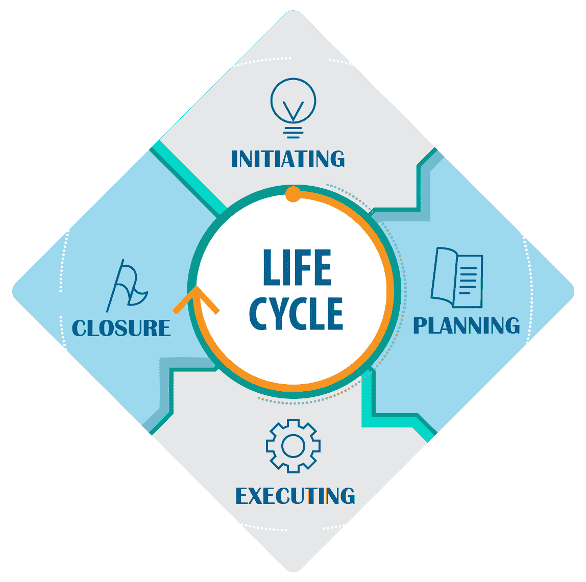
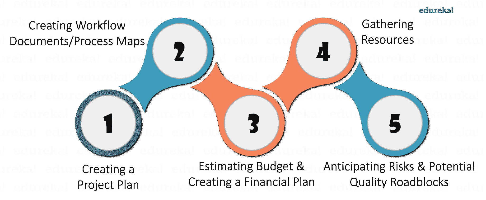
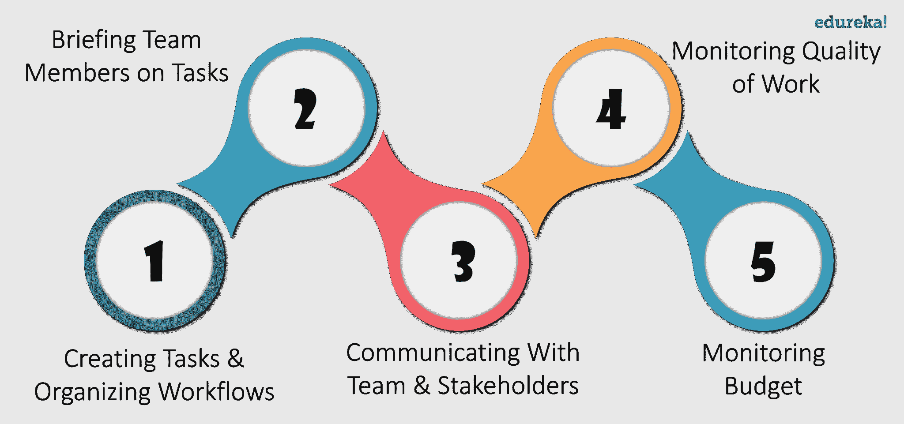
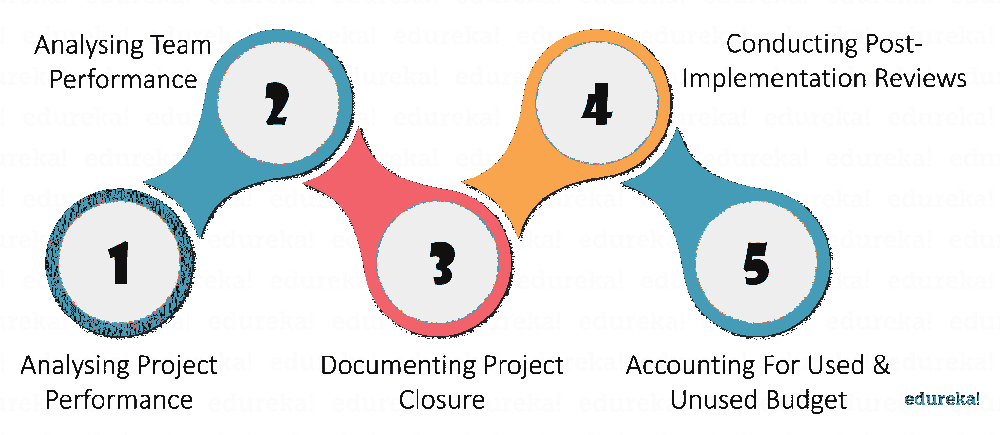
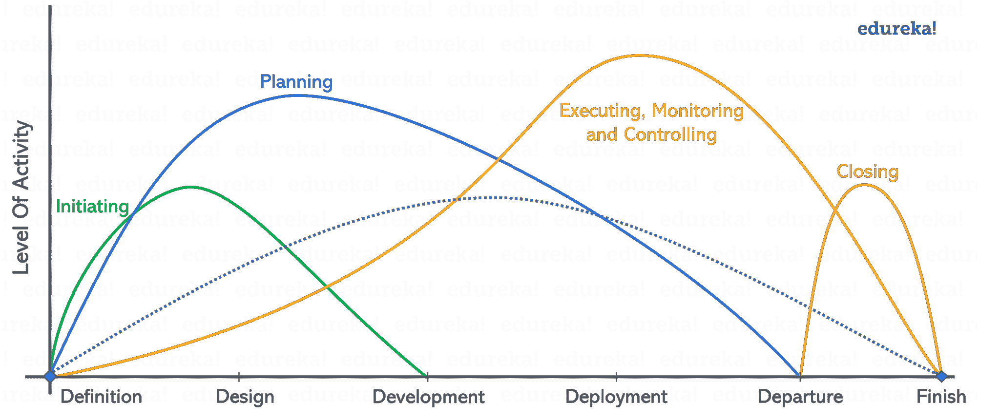

# 项目管理生命周期——你需要知道的一切

> 原文：<https://www.edureka.co/blog/project-management-life-cycle/>

[项目管理](https://www.edureka.co/blog/project-management/)在需要持续监控和管理的任务和活动的广泛网络中。为了构建工作并将其简化为一系列逻辑和可管理的步骤，这个漫长的过程被分解为不同的阶段。所有这些阶段一起构成了完整的项目管理生命周期。通过本文，我将帮助您深入了解项目管理生命周期的每个阶段。

项目管理生命周期由下面列出的四个简单阶段组成:

1.  [启动](#initiation)
2.  [策划](#planning)
3.  [执行](#executing)
4.  [关闭](#closure)

作为一名[项目经理](https://www.edureka.co/blog/project-manager-salary/)，对于交付一个成功的项目，透彻了解这些阶段的每个是非常重要的。如果你渴望成为认证项目经理，你可以参加我们的 [PMP 认证培训](https://www.edureka.co/pmp-certification-exam-training)，它将帮助你踏上获得项目管理认证的旅程。

您还可以观看此视频，了解 PMP 认证讲师对项目管理生命周期的详细解释。

## **项目管理生命周期| PMP 认证培训|爱德华卡**

[//www.youtube.com/embed/3JnAUHZSh1A?rel=0&showinfo=0](//www.youtube.com/embed/3JnAUHZSh1A?rel=0&showinfo=0)

这段视频将让你全面了解项目生命周期的各个阶段。

现在，让我们更深入地研究每个阶段，探索项目管理框架中详细的流程网络。

## **项目管理生命周期的启动阶段**

启动是项目管理生命周期的第一个也是最重要的阶段，因为它定义了启动新项目所需的过程。在此阶段，上层管理人员定义项目的目的和范围，提供启动的原因，并开发业务案例。

项目管理生命周期的启动阶段通常包括以下步骤:

现在，让我们来详细了解其中的每一个阶段。

*   #### **Conduct feasibility study**

首先，你需要了解你的项目的可行性，也就是说，商业问题是什么，这个项目是否提供了特定问题的解决方案。

*   #### **Determination range**

一旦你证明了项目的目的，下一步就是定义它的范围。在这里，您将确定您的项目范围，并定义其深度和广度。我的意思是，你需要确定并记录一系列具体的 **项目** 目标、特性、功能、任务、期限、风险和最终成本。

*   #### **Determine the deliverables**

下一步是识别和定义可交付成果。这里的 Deliverable 代表你的项目应该产生的最终产品或服务。

*   #### **Identify project stakeholders**

既然你已经确定了项目的范围和可交付成果，你就可以继续前进了。您的下一步将是确定与项目相关的人员，以及该项目将如何影响他们以及他们的需求。请注意，项目中的利益相关者占有重要的位置。在你的项目结束时，如果他们不满意，那么你的项目就不能被认为是成功的。

*   #### **Development Business Case**

既然你已经确定了项目的重要支柱，下一步就是将这些点连接起来，并开发一个成熟的商业案例来继续前进。此外，你需要开始组建团队，这将承担这个项目。最后，您需要创建 SoW(工作说明书)来结束启动阶段。

一旦你完成了所有这些步骤，你就可以开始项目管理生命周期的第二阶段了。

## **项目管理生命周期的规划阶段**

顾名思义，规划是对提议的项目解决方案进行更详细策划的阶段。这是在将项目目标作为最终目标的情况下完成的。在此阶段，您将分解业务案例，并分解成更小的任务。然后将他们分配到各自的小组，并为及时完成这些活动准备一份时间表。

因此，基本上您需要执行以下步骤来成功结束项目管理生命周期的规划阶段:

*   #### **Create a project plan**

这一步将从确定完成项目目标所需的所有任务开始。确定活动、依赖关系、时间框架、 潜在风险和项目完成中涉及的约束条件等任务在此列出。

*   #### **Create a workflow document**

接下来，您将开发一套计划文档，帮助您可视化项目时间表。它将通过关键的里程碑指标，在整个项目开发直至交付的过程中指导您的团队。

*   #### **Estimated budget**

这是一个重要的阶段，在此阶段完成成本估算并公布最终预算。项目预算将涵盖花费在劳动力、设备和材料上的所有费用。这将有助于在整个项目开发过程中监控成本支出，同时确保利润最大化。

*   #### **Collecting resources**

这一步包括管理从组织内部和外部人才库中选出的最终职能团队。您还需要确保您的整个团队都配备了必要的工具，以便完成分配给他们的任务。

*   #### **Predicted risks & Potential quality obstacles**

在制定时间表、估计成本和收集资源之后，下一个重要步骤是估计潜在的风险。评估风险是项目规划过程中最重要的任务之一。如果你在没有适当的风险管理的情况下进行，它可能会妨碍你的项目绩效，甚至对项目的成功完成构成威胁。但是，通过适当的风险管理，您可以减轻风险，并毫无延迟地交付约定质量的项目。

下一个阶段是项目管理生命周期中的执行阶段，我将在本文的下一部分讨论这个阶段。

## **项目管理生命周期的执行阶段**

请记住，当我说执行阶段时，它还包括控制和监视。这是一个广泛的阶段，您的项目计划将实际付诸行动。在这个阶段，最终的可交付成果开始成形，并在最后移交给客户。这一阶段的主要目的是保持工作正常进行，组织团队，确保进度不落后于计划。

项目管理生命周期的执行阶段包括以下步骤:

*   #### **Create task & Organize workflow**

在这一步中，您需要将项目任务分配给适当的资源，同时将工作平均分配给团队成员。这将持续下去，没有人是负担，并有能力产生高质量的结果。

*   #### **Introduce tasks**

    to team members.

完成任务分配后，下一步是向每个团队成员简要介绍他们在项目中的角色和任务的重要性。你必须按照他们各自的角色来指导他们，并在需要时通过安排与流程相关的培训  来提供支持。

*   #### **Communicate with team & stakeholders**

保持适当的沟通是项目成功的重要组成部分。在整个项目中，你必须保持涉众和团队之间的双向沟通。

*   #### **Monitoring work quality**

一旦执行开始，你必须持续监控项目的每一个活动。这会让你在注意到事情偏离轨道时占上风，并给你空间来更新或调整你的时间表。通过监控，你可以确保工作和最终产品的质量。

*   #### **Monitor budget**

现在，为了管理成本并在预算内完成项目是一项具有挑战性的任务。但是，如果你密切关注项目开支，那么你可以很容易地让你的项目在资产和资源方面保持正轨。

一旦执行阶段完成，你的最终产品准备交付，你将进入[项目管理](https://www.edureka.co/blog/project-management/)生命周期的最后阶段，即结束。

如果你想超越基础水平&想在项目管理方面有所作为，你绝对应该参加我们的 [PMP 培训！](https://www.edureka.co/pmp-certification-exam-training)

## **项目管理生命周期的收尾阶段**

在收尾阶段，你的主要精力应该放在最终产品的发布和交付上。一旦产品被交付给客户，您就可以释放您的资源，完成文档并正式结束项目。

以下是项目管理生命周期结束阶段的详细步骤:

### 

*   #### **Analyze project performance**

在您移交最终的可交付成果之前，您需要分析项目的目标是否实现。这意味着您的产品是否能够解决最初的业务问题。此外，您需要确保项目在预算内按时完成。

*   #### **Analyze team performance**

此外，你必须跟踪每个团队成员的表现。通过监控他们在整个项目中交付的工作的及时性和质量，你可以很容易地做到这一点。

*   #### **Record the end of the project**

文档是另一个不应该被忽视的重要过程。您必须以系统的方式创建项目文档，以确保项目的所有方面都是封闭的，不留任何漏洞。您可以将此文档提供给主要利益相关者，以报告项目的签署。

*   #### **Conduct post-implementation review**

一旦你完成了你的项目，你需要对它进行最后的分析。这种类型的分析将帮助你获得有意义的洞察力和经验的智慧。您可以将它们作为未来类似项目的参考。

*   #### **used accounting & unused budget**

有时，即使项目完成后，还有一些未使用的资源和预算。您可以将这些资源分配给将来的项目。它将帮助您减少成本和资源浪费。

这就结束了整个项目管理生命周期。如果你担心如何独自处理所有这些项目管理任务，那么你必须阅读一篇关于项目管理工具的文章。这里你必须注意的一点是，所有这些阶段都不是一步一步进行的。它们经常与每个阶段进行的不同级别的活动重叠。为了让你更好的理解，我用了下面的图表来描述。

至此，我们结束了这篇关于项目管理生命周期的文章。我希望这能让你对项目管理的各个阶段有一个完整的了解，并帮助你详细理解它们。

*如果您找到这篇“PMP 认证考试* *”的相关文章，* *请查看 Edureka 的 [*PMP 认证*](https://www.edureka.co/pmp-certification-exam-training-hyderabad)* *，edu reka 是一家值得信赖的在线学习公司，拥有遍布全球的 25 万多名满意的学习者。*

*有问题吗？请在评论区提到它，我们会给你回复。*