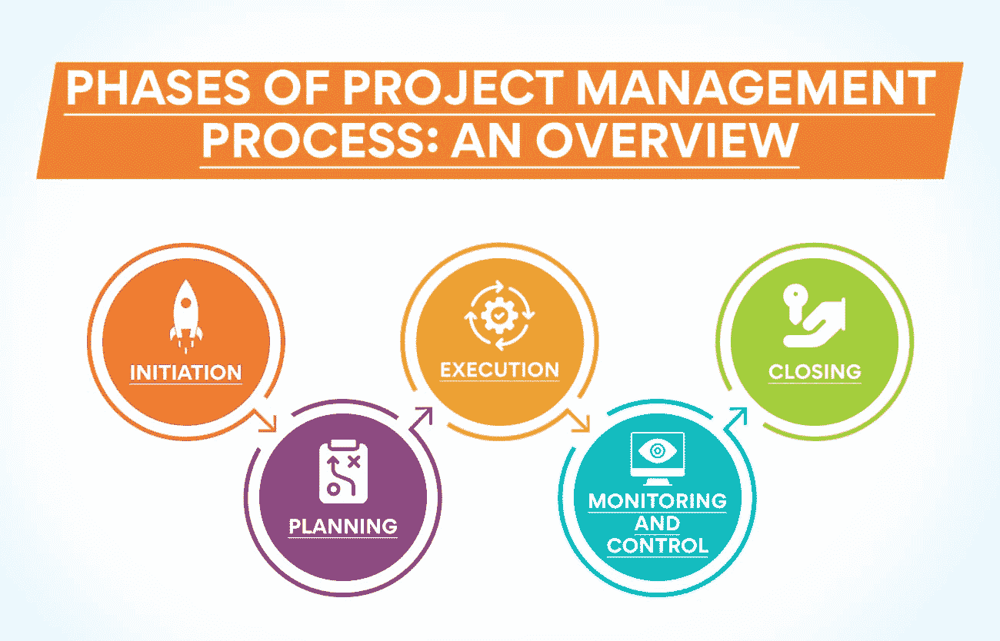
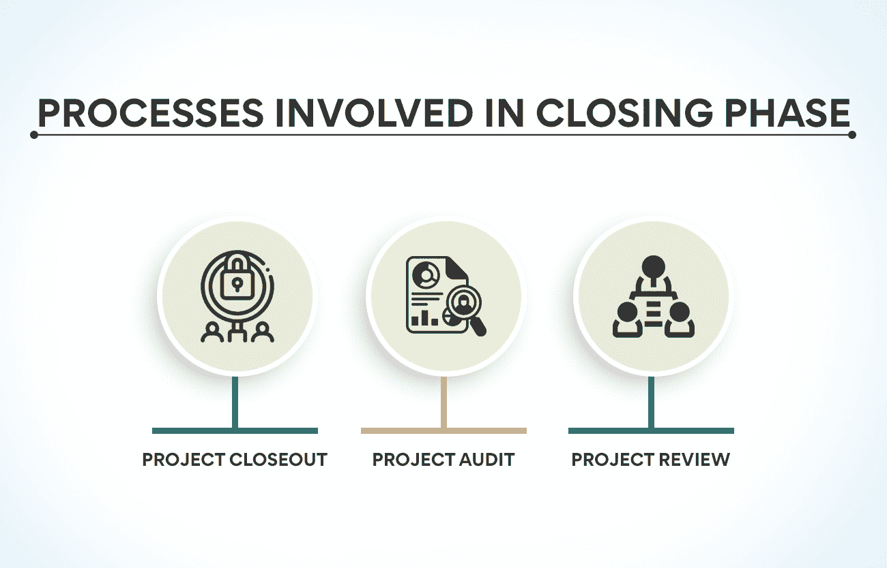

# 解释项目管理过程和阶段！

> 原文：<https://www.edureka.co/blog/project-management-processes-and-phases-explained/>

顾名思义，项目管理是一个过程，它包括为成功完成项目而采取的阶段和步骤。有许多不同的项目管理过程，每个过程都有自己的阶段。在这篇博文中，我们将讨论项目管理过程的不同阶段，并解释每个阶段如何促成项目的成功。我们还将提供这些阶段如何应用于现实世界的例子。

因此，无论你是刚刚开始职业生涯的项目经理还是正在寻找快速入门的人，这个博客都是为你准备的！

## **项目管理过程的阶段:概述**

每个项目在其生命周期中都要经历几个阶段。项目管理流程有助于确保每个阶段在进入下一个阶段之前成功完成。一个典型的项目将经历以下几个阶段:

*   **启动:** 对项目进行定义和授权。
*   **计划:** 组建项目团队，制定计划。
*   **执行:** 项目按计划执行。
*   **监控:** 对项目进度进行监控。
*   **收尾:** 项目完成并评估。

项目管理流程对于确保项目顺利成功运行至关重要。通过遵循这些过程，项目经理可以帮助确保有效和高效地完成每个项目阶段。下面我们来详细了解一下这些阶段:

### **启动阶段**

这个项目的第一阶段决定了它的发展方向。在这个阶段，项目被定义和授权。在此阶段，组建一个项目团队，并创建项目章程。项目章程概述了项目范围、目标和可交付成果。这是任命项目经理和创建项目管理计划的阶段。

让我们以一个建造新房子的项目为例。第一步是联系一名建筑师来绘制房屋平面图。一旦计划完成，建筑公司被雇用，项目章程被创建。项目章程将包括工作范围、目标和可交付成果。任命项目经理，并制定项目管理计划。一旦项目管理计划获得批准，房子的建造就将开始。

**也读作:[项目管理基础讲解](https://www.edureka.co/blog/project-management-fundamentals)**

**发起阶段涉及的流程:**

启动阶段主要是完成七个关键阶段:

*   项目章程: 它是概述项目范围、目标和可交付成果的文档。
*   **项目定义:** 项目定义是对项目进行详细定义的文档。它有助于为项目设定现实的期望。
*   **项目授权:** 项目授权是批准项目的过程。这一步确保项目拥有必要的资源并得到涉众的批准。
*   **项目范围:** 项目范围是定义项目边界的过程。它有助于理解项目中包括什么，不包括什么。
*   **项目目标:** 项目目标是项目要达到的目标。它们应该是 SMART 目标(具体的、可衡量的、可实现的、现实的、有时限的)。
*   **项目可交付成果:** 项目可交付成果是将在项目结束时交付的最终[产品](https://www.edureka.co/blog/product)或服务。
*   **项目团队:** 项目团队是负责执行项目的一群人。团队应该具备完成项目所需的技能和经验。
*   **项目干系人:** 项目干系人是指在项目中拥有既得利益的人。他们包括项目发起人、项目经理、项目团队和项目客户。

### **规划阶段**

计划阶段是项目管理过程的第二阶段。项目经理创建详细的计划，列出实现项目目标所需完成的任务。该计划随后用于指导项目的执行。

规划阶段包括几个基本活动，例如创建项目时间表、识别风险和潜在问题以及创建预算。这个阶段还提供了开发项目管理计划(PMP ),它提供了管理项目的指导。

在计划阶段之后，项目经理将清楚地了解成功完成项目需要做些什么。

例如，如果你正在管理一个网站设计项目，规划阶段将包括:

*   为项目制定时间表。
*   确定要完成的任务。
*   向团队成员分配角色。

**规划阶段涉及的流程:**

规划阶段涉及五个主要流程，以实现盈利:

*   **定义项目范围:** 计划阶段的第一步是定义项目范围。这包括确定项目的目标和目的，以及需要交付的具体交付成果。
*   **制定项目进度表:** 下一步是制定项目进度表。该计划概述了需要完成的任务以及完成这些任务的顺序。
*   确定风险和问题: 计划阶段的另一个重要活动是确定可能影响项目的风险和潜在问题。这包括识别可能影响项目的外部因素，如政治环境或经济的变化。
*   **创建项目预算:** 计划阶段的最后一步是创建项目预算。该预算概述了与项目相关的成本，并确保有足够的资金来完成项目。
*   将项目计划传达给项目干系人: 一旦项目计划完成，就必须传达给项目干系人。这包括项目发起人、高级管理人员和其他对项目成功有既得利益的个人。

规划阶段的主要目标是创建一个详细的计划来指导项目的执行。此阶段确保完成所有必要的任务，并识别和降低风险。

### **执行阶段**

执行阶段是项目管理过程**的第三阶段。** 在这个阶段中，[项目经理](https://www.edureka.co/blog/become-a-better-project-manager)和团队执行项目计划中概述的任务。这个阶段包括几个基本的活动，例如管理项目资源、跟踪项目进度以及与风险承担者沟通。

执行阶段是项目目标实际实现的阶段。这个阶段需要项目经理和团队之间的密切合作，以及与利益相关者的有效沟通。在这一阶段密切监控项目以确保其不偏离轨道是至关重要的。

执行阶段致力于在规定的范围、进度和预算内完成项目。在这个阶段，项目经理应该关注效率的最大化和浪费的最小化。通过有效地管理项目资源，团队可以确保项目在预算内按时完成。

**执行阶段涉及的流程:**

使执行阶段成功的五个重要过程:

*   **项目资源管理:** 项目资源管理是管理项目资源的过程，如[人力资源](https://www.edureka.co/blog/role-of-human-resource-management-in-an-organization/)、设备、财务等。这包括获取、分配和管理项目资源。
*   **项目进度跟踪:** 项目进度跟踪是监控项目的进度并确定其进度以满足其目标的过程。这包括创建和维护项目时间表、记录进度以及识别任何问题或风险。
*   **项目沟通管理:** 项目沟通管理管理项目团队与利益相关者之间的沟通。这包括创建和维护沟通计划、交流项目更新以及解决任何问题或顾虑。
*   **项目风险管理:** 项目风险管理识别、评估和管理可能影响项目的风险。这包括创建风险管理计划、识别风险和制定缓解策略。
*   **项目质量管理:** 项目质量管理确保项目满足其质量目标。这包括创建质量计划、开展质量保证活动和监控项目进度。

执行阶段是项目管理过程**的关键部分。** 通过有效地管理项目资源、跟踪项目进度以及与风险承担者沟通，项目经理需要确保项目在预算内按时完成。

### **监控阶段**

在项目执行阶段之后，是监控和控制阶段。在此阶段，项目进度受到监控，并与项目计划进行比较。任何偏离计划的地方都会被发现，并采取纠正措施使项目回到正轨。项目经理也利用这个阶段向风险承担者传达项目状态。

监测和控制阶段是项目管理流程的重要组成部分，因为它有助于确保项目切合实际并实现其目标。

项目经理还应该记住，监控和控制阶段不是一个静态的过程。随着项目的进展，项目经理必须调整监视和控制活动，以确保项目的进展。

总之，监控阶段是项目管理流程的关键部分。通过监视和控制项目，项目经理可以确保项目不偏离轨道并达到目标。

**也可阅读:[为什么 PM 工具对项目成功至关重要？](https://www.edureka.co/blog/pm-tools)**

**参与监控的过程&控制**

项目管理的监视和控制阶段涉及四个主要过程:

*   **监控项目进度:** 该流程包括跟踪项目进度并将其与项目计划进行比较。计划中的变更已被确定。
*   **传达项目状态:** 该过程包括向风险承担者传达项目状态。项目经理应该让涉众了解项目的进展和任何可能的变化。
*   确定项目问题: 该过程包括确定项目期间可能出现的任何问题。项目经理应该与项目团队合作解决可能出现的任何问题。
*   采取纠正措施: 这个过程包括采取纠正措施使项目回到正轨。如果项目没有按照计划进行，项目经理可能需要对项目计划进行更改或采取其他纠正措施。

监控阶段是项目管理过程**的一个组成部分。** 因此，关注细节很重要。

### **关闭阶段**

项目收尾阶段是[项目生命周期](https://www.edureka.co/blog/project-lifecycle)的最后一个阶段。在此阶段，所有与完成项目相关的活动都已完成。这包括最终确定所有的可交付成果，结束松散的部分，并释放任何不再需要的资源。一旦项目结束阶段完成，项目就被视为正式结束。

收尾阶段很重要，因为它确保所有项目目标都已实现，并且任何最终交付成果都符合项目规划阶段规定的质量标准。这个阶段还允许平稳地过渡到下一个项目或计划(如果有计划的话)。

如果你正在做一个项目，并且已经到了项目收尾阶段，那么恭喜你！你已经到达终点线了。当你结束你的项目时，请记住这些事情:

*   确保所有项目目标都已实现。
*   确保所有最终交付物符合质量标准。
*   释放不必要的资源
*   进行项目后评审，记录经验教训。

**收尾阶段涉及的流程:**

收尾阶段遵循三个主要流程:

*   **项目收尾:** 项目收尾是完成与项目收尾相关的所有活动的正式过程。这包括最终确定所有的可交付成果，结束松散的部分，并释放任何不再需要的资源。
*   **项目审计:** 项目审计在项目收尾阶段结束时进行，以验证所有项目目标均已实现，且任何最终交付成果均符合项目规划阶段概述的质量标准。
*   **项目评审:** 项目评审在项目收尾阶段结束时进行，以记录进度并确定未来项目中需要改进的地方。

如你所见，有许多不同的项目管理流程和阶段来确保项目的成功完成。通过理解和利用这些过程和阶段，您可以增加项目在给定的预算内按照要求的规格及时完成的机会。

如果您正在寻找有关项目管理流程和阶段的更多信息，或者如果您需要在自己的项目中实施这些流程和阶段的帮助，您可以考虑参加我们的认证课程。[运营、供应链和项目管理高级证书](https://www.edureka.co/highered/advanced-program-in-operations-supply-chain-project-management-iitg)是你学习项目管理所需的一切。

## **更多信息:**

[主要项目管理活动——你必须知道的](https://www.edureka.co/blog/project-management-activities)

[印度项目经理薪资:2022 洞察](https://www.edureka.co/blog/project-manager-salary-in-india)

[了解项目选择及其重要性](https://www.edureka.co/blog/project-selection)

什么是 PMP 认证？–关于 PMP 你需要知道的一切