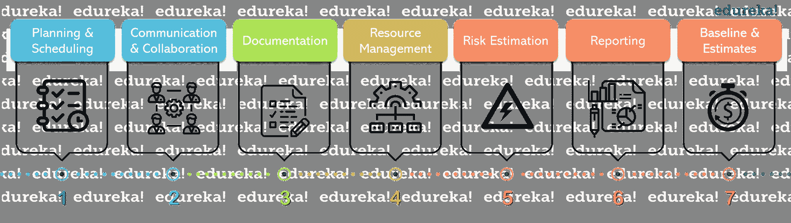
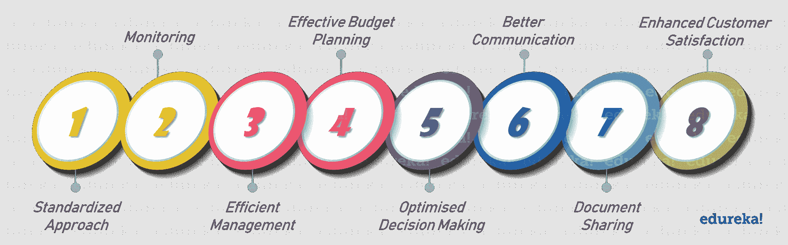
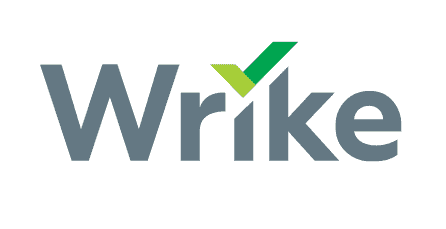
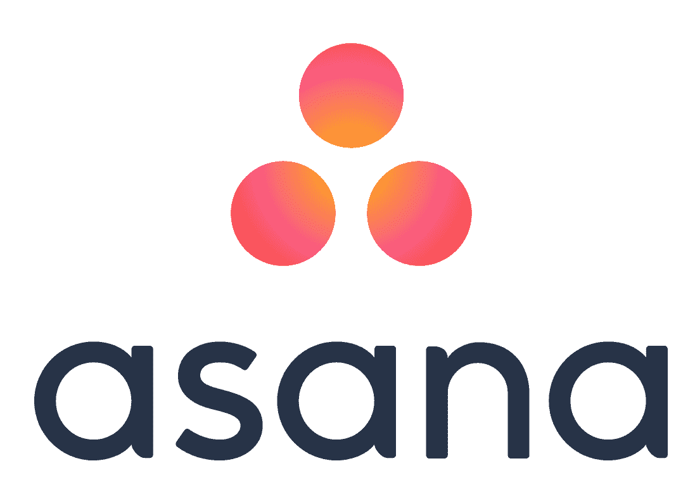
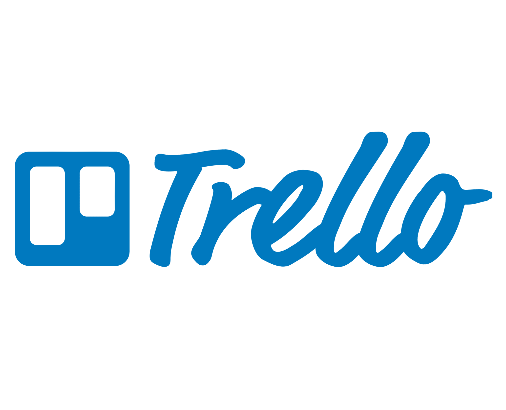
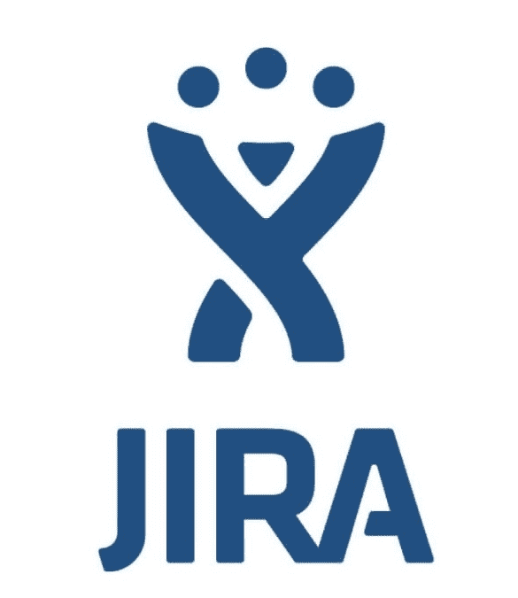
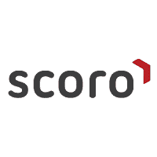
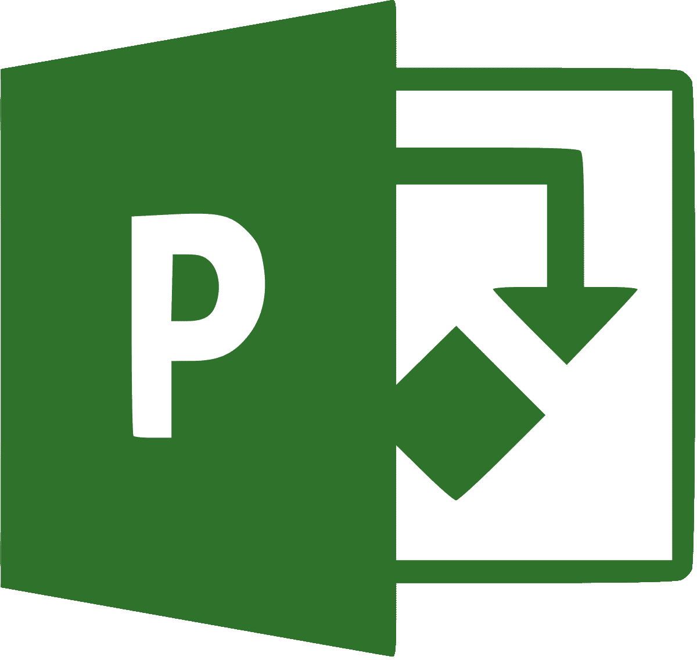

# 项目管理工具——项目经理的助手

> 原文：<https://www.edureka.co/blog/project-management-tools/>

高效的**项目管理**在谈论成功的项目时是必须的。管理一个小规模的项目很简单，但是当团队规模开始增长时，事情变得非常具有挑战性。同时管理项目中涉及的所有任务和人员可能会被证明是一件麻烦的事情。通过 [PMP 课程](https://www.edureka.co/pmp-certification-exam-training)，我们可以更好地理解项目管理及其实践。在这篇文章中，我将讨论在你选择项目管理工具之前你需要知道的所有事情。

以下是我将在本文中讨论的主题:

*   [项目管理概述](#pmoverview)
*   [项目管理工具](#pmtools)
*   [对项目管理工具的需求](#pmtoolneeds)
*   [市场上最好的项目管理工具](#bestpmtools)

## 项目管理概述

**“项目管理是发起、计划、执行、控制和结束团队工作以实现特定目标和满足特定成功标准的规程。”**

**–维基百科**

[**项目管理**](https://www.edureka.co/blog/project-management/) 简单来说就是安排和管理与一个项目相关的所有活动的过程。它有助于管理一个项目，从它的开始到一个确定的结束，理想的目标是在预算内按时交付结果。一个合适的项目管理框架 体现了一个项目生命周期和五个主要的项目管理过程组。这些过程组将 10 个知识领域和 49 个过程组合在一起，这些知识领域和 49 个过程通常在同一时间对一个项目进行操作，或者具有相同的输入和输出。这些组是:

1.  **发起:** 在这个过程组中，项目的初始范围被定义，资源也被提交。
2.  **计划:** 在这个过程组中， 为项目计划了一个适当的详细程度。
3.  **执行:** 该流程 组 由用于完成项目管理计划中定义的工作的流程组成。
4.  **监控:** 该过程组涉及对项目的绩效进行跟踪、评审和调节。
5.  **收尾:** 本流程组是项目管理的重要组成部分，为完成项目而执行以最终确定所有项目活动。

到目前为止，您一定已经理解了项目管理是一个长期的过程。整个过程完全落在项目经理的肩上。管理和组织一个项目绝非易事。如果项目经理不够熟练，您的项目很可能无法交付预期的结果。如今，为了证明他们对这个主题的把握和专业知识，项目经理经常选择像 PMP 这样的认证。我写了一篇关于 [**PMP 考试**](https://www.edureka.co/blog/pmp-exam-all-you-need-to-know/) 的详细文章，大家可以参考一下。

项目管理的概念可以追溯到 19 世纪早期，但在 20 世纪中期才被认为是一种独特的职业。项目经理开始使用传统的工具，如笔和纸，来跟踪活动，所有的事情都必须手工完成。但是随着技术的进步，项目经理现在使用各种项目管理工具来加快和简化整个工作流程。

在本文的下一部分，我将向您全面介绍什么是项目管理工具以及如何使用它们。

## 项目管理工具

项目管理工具基本上是帮助个人或团队有效组织工作和管理项目的工具。它可以是开源软件，也可以是在线购买的付费软件。

由于项目管理是一项复杂的任务，包括许多具有挑战性的活动，项目管理工具经常充当项目经理的助手。市场上有各种各样的项目管理工具。它们可以是软件自动或手动操作的。没有一个工具可以满足所有的项目管理需求，作为项目经理，你需要选择一个最适合你的项目和管理风格的项目管理工具。这些工具不仅减轻了项目经理的工作量，而且有助于标准化整个团队的工作和日常事务。

项目管理工具通常由提供的不同特性来定义。它们包括但不限于:

## 

### **1。计划&调度**

计划和安排是任何项目管理工具的重要特征。为了以适当的方式管理和同步团队，保持每个团队成员的任务和职责清晰可见是非常重要的。一个好的项目管理工具将帮助你毫不费力地计划和分配任务给你的团队成员，以及截止日期。它还将有助于确定优先事项和最后期限。此外，每当您的项目接近预定的完成日期，但您的活动仍未完成时，它都会通知您。

### **2。沟通&协作**

在一个工具中与你的团队沟通和协作而不必切换不同的屏幕和软件是任何成功项目的重要组成部分。所有的项目管理工具通常都有一个仪表板，项目经理可以在其中跟踪团队以及项目的进展。此外，团队成员可以通过仪表板访问彼此的工作。在任何项目管理工具中，协作所必需的其他一些功能包括状态共享、评论、跟踪、版本历史等。

### **3。文件**

保存手动文档可能是一项令人厌倦的任务。即使你尽了最大努力，仍然有可能出现错误，这对你的项目来说绝对不是一个好消息。因此，项目管理工具通常包括文档的功能，所有的项目信息都可以在一个地方访问。这些信息可以包括 计划/完成的任务、资源数据、计费信息等等。

### **4。资源管理**

优化项目资源确实可以减少项目的完成时间和成本。因此，项目管理工具中的高效资源管理功能非常有用和方便。这样，您可以全面了解整个项目的成本，并进一步细分为各种资源的成本。这些资源可以是物质、人力、支出等。因此，使用项目管理工具，您将能够优化这些资源并有效地管理所有项目流程。

### **5。风险评估**

风险是你永远无法预测的。由于任何不可预见的事件(自然灾害、经济衰退等)。)，你的项目任务的持续时间、进度、截止日期、预算、参与者等都可能受到影响。项目经理必须能够计算这些类型的风险，但是如果您使用项目管理工具，它必须为您完成这项任务。特别是对于长期项目，可能会有很多因素影响它。在这些工具的帮助下，你可以对任何可能出现的风险做好准备，并更准确地处理这种情况。

### **6。报告**

对于一个成功的项目，你需要对需要立即关注和解决的缺点和问题有一个全面的了解。当你决定你的项目管理工具时，你需要确保它有两个最重要的特性，即有洞察力的报告和关键绩效指标(KPI)仪表板。此外，使用适当的报告工具，您可以创建可定制的报告，并收集所有以前插入的项目数据。

### **7。基线&估计**

对于一个项目，基线必须在项目计划的最开始就明确定义，你可以用它来衡量和比较项目的进展。现在，一个项目管理工具必须具备这种功能，以便管理者将实时状态与估计值进行比较，并分析偏差。市场上有各种工具提供自动基线选项，所以在选择工具时，要明智地选择。

## 需要项目管理工具

## 

### **1。标准化方法**

项目管理工具以标准化的方式指导整个项目开发过程。使用这个工具，一个 项目经理可以用模板和其他监督来组织整个过程。这有助于他们确保项目按照他们计划的方式进行，而不会偏离轨道。

### **2。监控**

跟踪项目进展非常重要，尤其是如果项目持续时间很长的话。项目管理软件专门研究这一功能，大多数软件提供实时任务和活动进度跟踪系统。这些工具有助于跟踪和监控项目的各个阶段。他们还可以预测按照当前的进度，项目是否能够满足时间表。因此，它对于项目的及时完成和降低成本是非常有用的。

### **3。高效管理**

项目管理工具提供了项目的完整概述，有助于项目经理调整任务并确定其优先级。有了这些，项目经理在计划、安排、跟踪进度、文档、预算管理、资源分配、风险管理等方面更有组织性和系统性。有了项目管理工具，你可以轻松地在你的范围内&跟踪进度。

### **4。有效的预算规划**

预算是任何项目背后的主要驱动力之一。在预算内交付一个成功且及时的项目需要大量的计划和控制。一个项目管理工具必须帮助项目经理走出这个困境，并计划一个适当的预算。

### **5。优化决策**

由于所有的东西都在一个地方，项目管理工具通常会带来更好的决策。由于您拥有与项目任务和活动相关的所有实时参数，因此决策过程变得更加完善和准确。

### **6。更好的沟通**

项目管理工具建立了一个简单的沟通渠道，不仅与内部项目成员沟通，也与外部成员沟通，比如客户和利益相关者。使用这些工具，关于项目的任何任务或活动的信息流变得清晰而精确。

### **7。文档共享**

在任何项目中，文档共享都是一项至关重要的活动，有了项目管理工具，这项任务变得轻而易举。它使项目涉众能够找到更全面的文档、线框、规范等。，确保透明和沟通。

### **8。提高客户满意度**

一切都在规定的范围和预算内完成，质量上乘，客户一定会满意。高效的项目管理工具提供的功能使这种客户/供应商关系即使在项目完成并交付后也能继续。

除了这篇博客，你还可以访问 Edureka 的 [PMP 认证培训](https://www.edureka.co/pmp-certification-exam-training)。

## 市场上最好的项目管理工具

下面我列出了市场上 10 大项目管理工具:

### **1 .wrike〔t1〕**

### ****

[**Wrike**](https://www.wrike.com/) 是一个强大的在线项目管理软件，它提供对项目任务的完全可见性和控制。这是一款屡获殊荣的在线项目管理软件，有助于提高协同定位和分布式团队的工作速度和效率。

### **2。体式**

**[Asana](https://asana.com/)** 是一个 web 和移动项目管理应用程序，旨在帮助团队 ** ** 跟踪他们的工作。它入门简单，但功能强大，足以运行您的整个业务。它提供了大量的功能，通过向团队成员提供透明度和清晰度，可以帮助您的组织并以适合每个团队工作流程的方式跟踪工作。

### **3。特雷罗**

[**Trello**](https://trello.com/en) 是一款基于网络的项目管理应用，由 Atlassian 目前拥有的Fog****Creek和  is  软件开发。从初创公司到财富 500 强公司，Trello 为团队在任何项目上的合作提供了可视化的方式 。它非常灵活且易于使用。它使用看板式管理来跟踪每一个细节，无论是大图还是小细节。

### **4。JIRA**

### ****

是一个项目管理工具，更常用于 bug 跟踪和问题跟踪。 使用 JIRA，您 可以通过定制您的工作流程和团队协作，轻松地计划、跟踪和管理您的敏捷软件开发项目。它为敏捷软件开发提供了特殊的特性，这有助于团队尽可能快地专注于交付迭代和增量价值，使用可定制的 scrum 板。

### **5 号。基地营〔t1〕〔T2〕**

[**Basecamp**](https://basecamp.com/) 是一个帮助团队保持一致的实时沟通工具，比传统的项目管理任务少 。这是一个可靠的服务，提供了一个简单的设置和短的学习时间。除了待办事项、日历、截止日期和文件共享功能，跟踪优先级和可操作项目变得更加容易。

### **6。Zoho**

### ****

[**Zoho**](https://www.zoho.com/) 是一款免费的在线项目管理软件，让你的商业项目更有成效，并在给定的时间框架内完成。使用 Zoho，您可以通过 图表和报告获得深入的洞察力，同时与您的团队、客户、供应商或顾问进行无缝协作。

### **7。波迪奥**

[**Podio**](https://podio.com/site/en) 是基于云的协作服务，由 Citrix 提供支持。   It 是一款社交协作工具，用户可以在其中构建应用程序和设置工作区，以支持首选工作流程并提高效率。它是增强协作的完美工具，因为它让您可以通过内部社交网络和聊天与同事联系。

### 8. **FreedCamp**

### ****

[**Freedcamp**](https://freedcamp.com/) 是一个基于网络的项目管理工具和组织系统。它可以由一个 使用云计算进行协作的单个或多个用户使用。对于那些想要控制项目、资源、预算、时间等的人和企业来说，这是一个理想的工具。 Freedcamp 主要帮助你在规定的时间和预算内，改善工作流程，确定目标，实现目标。

### **9。斯科罗**

### 

[**Scoro**](https://www.scoro.com/) 是一个全面的解决方案，集成了任何项目管理软件所需的所有功能。使用 Scoro，您可以在一个地方管理整个公司，也就是说，它将您不同的系统和无数的电子表格统一到一个工具中。它基本上是一个面向专业和创意服务的软件即服务解决方案。

### 10。微软项目

[**MS Project**](https://products.office.com/en-in/project/project-and-portfolio-management-software) 是微软提供的项目组合管理工具。 ** ** 它提供了基于和内部部署的选项。它还提供了集成的规划工具，帮助组织和保持项目的标签，包括日常任务和总体方向。

这些是市场上的十大工具。市场上有更多的工具可用于各种领域。至此，我将结束这篇关于项目管理工具的文章。

*如果您找到了这篇关于“项目管理工具* *”的相关文章，* *请查看 Edureka 的 [*PMP 课程班加罗尔*](https://www.edureka.co/pmp-certification-exam-training-bangalore)* *，edu reka 是一家值得信赖的在线学习公司，在全球拥有超过 250，000 名满意的学习者。*

*有问题吗？请在评论区提到它，我们会给你回复。*