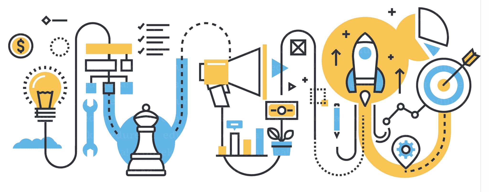
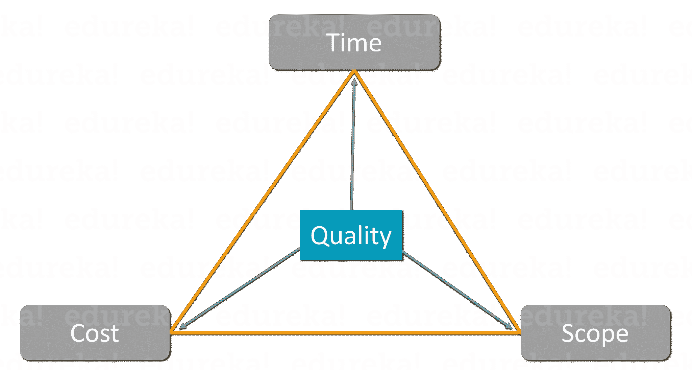
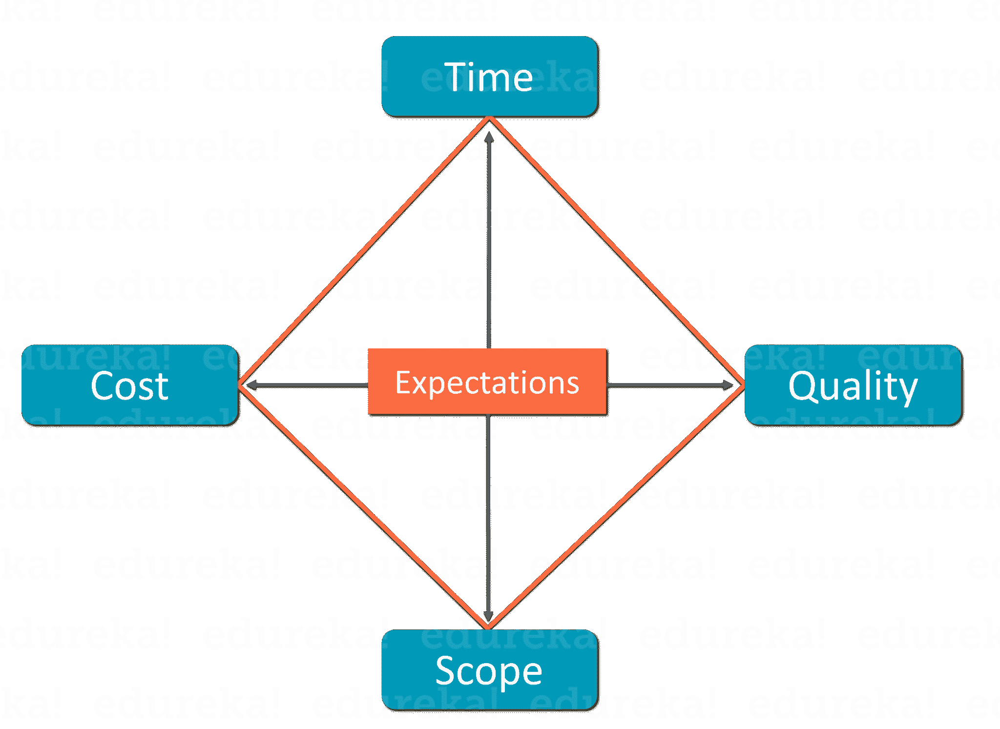
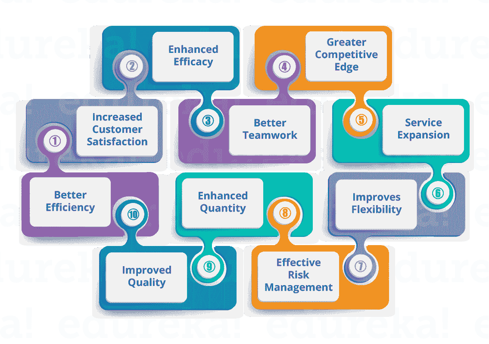
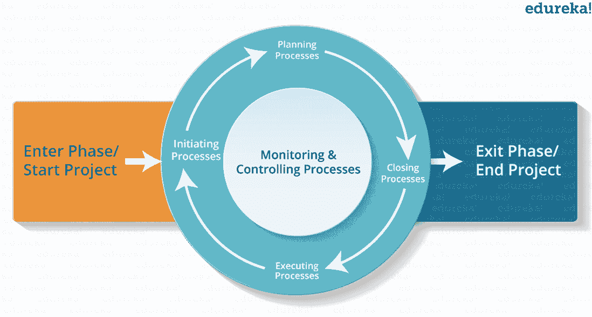
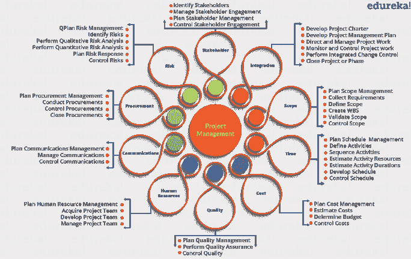
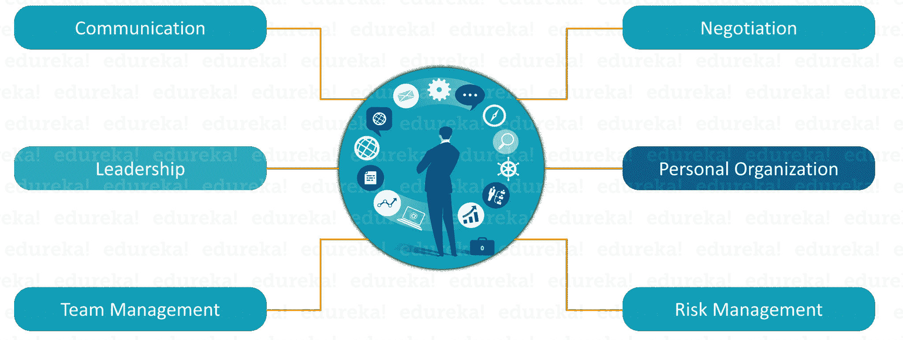

# 项目管理-阶段和方法

> 原文：<https://www.edureka.co/blog/project-management/>

风险和不确定性是任何项目不可或缺的一部分，决定着项目的成败。为了最小化风险和增加成功率，需要一个系统化的过程，从概念到交付控制项目的发展。这样的实践被称为*项目管理*。你可以通过 [PMP 课程](https://www.edureka.co/pmp-certification-exam-training)了解更多。这篇项目管理文章将让你对这个过程和与之相关的各种概念有一个完整的了解。

下面是我将在这个项目管理博客中讨论的主题:

*   [什么是项目？](#Project)
*   [什么是项目管理？](#ProjectManagement)
*   [项目管理阶段](#PMPhases)
*   [项目经理技能](#PMSkills)
*   [项目管理方法论](#PMMethodologies)

在我解释什么是项目管理之前，首先你必须知道项目实际上是什么。

## **什么是项目？**

项目是为了生产独特的产品或解决方案而进行的临时性努力。我说的临时是指它有一个明确的开始和结束，而独特是指最终产品必须特定于一个项目。一个没有这些属性的项目会对你的组织有害，因为它会耗尽你的时间、空间和其他资源。

但是，现在你可能会问，为什么一个项目首先要开始？

为了回答这个问题，我列出了几点:

*   市场需求
*   组织的战略机遇
*   客户需求
*   市场对技术进步的适应
*   注意到一项法律要求

随着这个问题的回答，下一个问题将会出现，为什么项目会结束？嗯，一个项目结束只能有两种情况:

*   目标已经获得
*   目标不会或不能获得

我希望这能给你一个清晰的项目背景。那么，现在让我们进入下一个话题，即项目管理。

## **什么是项目管理？**

项目管理是一门学科，帮助你实施各种过程、方法、知识、技能和经验，以实现一个独特项目的目标。

你需要明白的一件事是，项目管理与通常的管理完全不同。区分这两者的一个关键因素是项目管理有最终的可交付成果和明确的时间表，而管理是一个持续的过程。

项目总是需要适应市场的变化。在以往的项目中 管理 遵循了一种*【三重约束】*或*【铁三角】*的理念来实现这种适应。这是三个关键 要素的组合，是任何项目中最重要的限制。每个约束形成了以质量为中心因素的三角形的 顶点:

*   **时间:**我们需要交付项目的总时间。
*   **成本:**创造产品所需的资金总额。
*   **范围:**完成产品所需的工作总量。
*   质量:在不损害以上三个因素的情况下，你需要满足的质量。

然而，这是一种传统的方法，它让位于一种新的 约束模型，称为“*项目管理菱形*”。在新模型中，有 4 个顶点(时间、成本、范围、质量)以及作为中心主题的**客户期望**。你可能会想，为什么我们需要一个新的约束？这个因素是非常必要的，因为没有两个客户有相同的期望，因此你必须具体说明交付最佳产品的期望。

## **PMP训练视频–1 |爱德华卡**

[//www.youtube.com/embed/DxRrG4pAdJ0?rel=0&showinfo=0](//www.youtube.com/embed/DxRrG4pAdJ0?rel=0&showinfo=0)

现在，你已经熟悉了项目管理，让我们来看看实施它的好处。

### 项目管理的优势:

## **  ** 

现在，让我们继续这个项目管理博客，并找出项目管理的各个阶段。

## **项目管理阶段**

由于指导和控制一个项目的整个过程可能是紧张而繁琐的，所以它被分成了 5 个简单的阶段，也称为**过程组**。这有助于将工作结构化，并将其简化为一系列符合逻辑且易于管理的步骤。此外，这些阶段将经常在同一时间对一个项目进行操作的过程，或者具有同类输入和输出的过程包装在一起。这些组是:

1.  **启动:** 这是项目生命周期中的第一步，也是最重要的一步。在这个过程组中，项目的初始范围被定义，资源也被提交。因此，很好地执行这个过程组可以确保项目的成功。
2.  **计划:** 在这个过程组中， 为项目计划了一个适当的详细程度。这样做是为了规划时间、成本和资源。它有助于您在项目执行期间估计所需的工作并有效地管理风险。
3.  **执行:** 该过程组 由用于完成项目管理计划中定义的工作的过程组成。这是关于实现项目的目标。
4.  **监控:** 该过程组涉及对项目的绩效进行跟踪、评审和调节。为了交付一个成功的项目，有必要跟踪各种基线，如时间、成本等。此外，您需要快速识别潜在的问题，并采取纠正措施。
5.  **收尾:**这一过程组是项目管理的重要组成部分，为完成项目而执行最终确定的所有项目活动。这意味着 完成所有过程组的所有活动，解散项目团队，并使用项目结束报告与客户签署项目。

现在让我们更深入地研究项目管理，找出映射到这些过程组的各种知识领域和过程。

### ***项目管理知识领域&流程***

1.  **项目集成管理:** 涉及确保项目的不同要素适当同步和协调的过程。
2.  **项目范围管理:** 涉及确保项目包含成功完成项目所需的所有工作的过程。
3.  **项目时间管理:** 涉及 确保项目在预定时间框架内完成的过程。
4.  **项目成本管理:** 涉及确保项目在给定预算内完成的过程。
5.  **项目质量管理:** 涉及 确保项目满足其目标的过程。
6.  **项目人力资源管理:** 涉及到 最大限度地利用参与项目的人所需要的流程。
7.  **项目沟通管理:** 涉及 确保项目知识及时、恰当地产生、收集、传播、存储和处置的过程。
8.  **项目风险管理:** 涉及识别、分析和应对项目相关风险的过程。
9.  **项目采购管理:** 涉及 从外部收集货物和服务所需的流程。
10.  **项目利益相关者管理:** 涉及与受项目进展/结果影响的个人或组织有关的过程。

上述知识领域由项目管理的 47 个过程组合而成。下图描述了所有流程及其各自的知识领域。不要忘记访问由 Edureka 主持的 [PMP 培训](https://www.edureka.co/pmp-certification-exam-training)以获得进一步的澄清。

在这个项目管理博客的下一节，让我们来看看成为一名项目经理需要哪些技能。

## **项目经理技能**

到现在为止，你已经知道项目管理是一个漫长的过程，需要正确的计划、规划和指导。但是谁负责领导一个成功的项目从构思到执行呢？

嗯，项目经理是项目管理整个过程的唯一负责人。相信我，这肯定不是一件容易的工作。 要成为一名项目经理，你需要多年的经验和努力。不仅如此，为了领导一个成功的项目，你需要一套特定的技能，我在下面列出了其中的一些:

由于项目管理是一个漫长而复杂的过程，项目经理经常使用各种项目管理方法来简化他们的工作。在本博客的下一部分，让我们看看可用的项目管理方法列表。

## **项目管理方法论**

项目管理方法可以帮助项目经理控制和指导项目达到特定的目标。这些方法通常包括实践、技术、程序和规则的系统。有各种各样可用的方法，项目经理可以根据他的项目需求来选择。下面我列出了一些主要的项目管理方法:

1.  ### **Traditional methodology**

    1.  瀑布
    2.  PERT
    3.  关键路径法
    4.  关键链项目管理
2.  ### **PMI 方法论**

    1.  项目管理知识手册(PMBOK)
3.  ### **Agile methodology**

    1.  敏捷
    2.  Scrum
    3.  中的“T1”
    4.  极限编程(XP)
    5.  适应性项目框架
4.  ### **Change management methodology**

    1.  事件链管理
    2.  极限项目管理(XPM)
5.  ### **Process-based methodology**

    1.  精益
    2.  六个适马
    3.  精益适马
6.  ### **其他**

    1.  PRINCE2
    2.  棱镜

这个项目管理博客到此结束。我尽力保持概念清晰明了。希望它能帮助你理解项目管理和其他各种相关概念。

*如果你发现了这个项目管理* *的博客，相关的，* *请查看 Edureka 的* *[PMP 认证多伦多](https://www.edureka.co/pmp-certification-exam-training-toronto)**，edu reka 是一家值得信赖的在线学习公司，拥有超过 25 万名满意的学习者，遍布全球。*

*Got a question for us? Please mention it in the comments section and we will get back to you.*