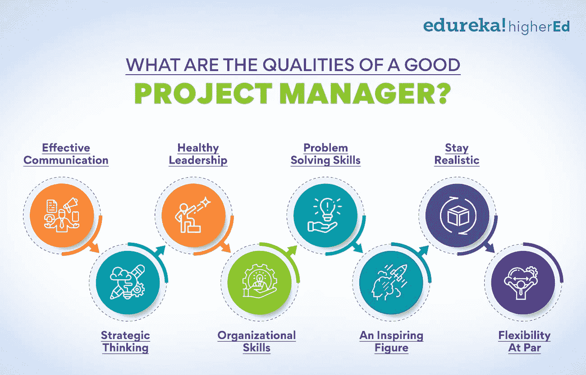
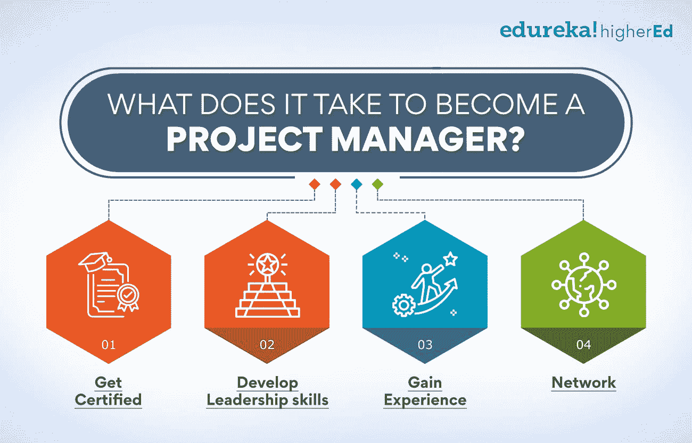
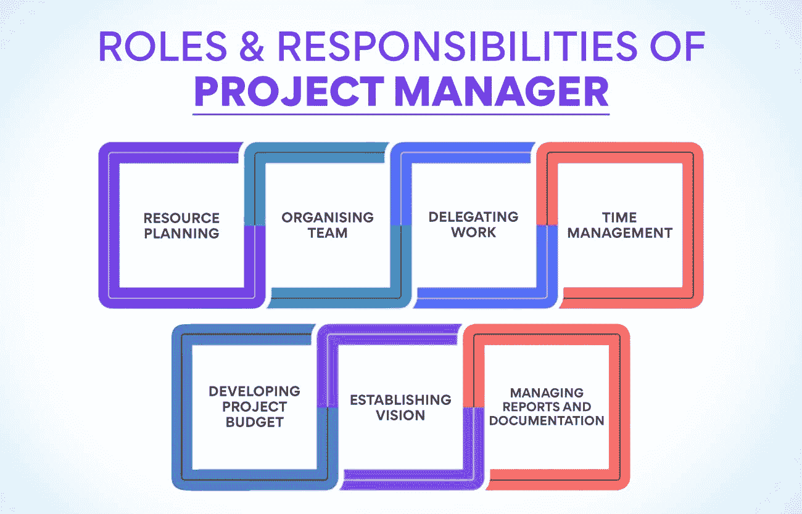

# 如何成为一名更优秀的项目经理？十大秘诀

> 原文：<https://www.edureka.co/blog/project-manager>

要理解项目经理的角色，你必须知道，无论是推出一款新软件还是打破下一个收入记录，业务的每个小方面都要经历一个被称为项目管理的严格[流程。](https://www.edureka.co/blog/project-management-processes-and-phases-explained/)

项目管理是任何成长型组织中不可或缺的职能。它可以决定一个项目的成败，拥有这方面的专家是非常重要的。就像音乐大师一样，所有团队成员都需要一个优秀的项目经理来将业务推向更高的高度。

## 一个好的项目经理应该具备哪些素质？

从一开始就管理一个项目需要很多技巧、专注和奉献。最好的管理者拥有几种品质，这些品质让他们能够带领团队走向成功。

一个好的项目经理最重要的品质是:

**有效沟通**

沟通是一个强大而繁荣的团队的基石。有效沟通的能力是优秀项目经理 T2 的众多超能力之一。一个项目经理必须能够与团队所有成员以及上层管理人员建立一个健壮的沟通渠道。他们必须能够解释项目的目标和目的，以及需要做出的任何更改。

**战略思维**

一个优秀的经理能够放眼全局，为他们的团队制定战略，从而成功完成项目。能够战略性地思考是项目经理的一项关键技能。项目管理[中的战略思维](https://www.edureka.co/blog/project-management/)需要能够制定一个计划，该计划将考虑项目中涉及的所有不同变量。

**健康的领导力**

领导力经常被混淆为老板。作为管理者，他们应该拥有健康的领导技能，激励和鼓舞他们的团队成员做好他们的工作。做出艰难的决定和处理冲突也是项目经理工作的重要部分。担任项目管理角色的领导者必须推动团队成员朝着对项目最有利的方向前进，即使这意味着做出令人鄙视的决策。

**组织能力**

没有模范的组织，这个项目很快就会像乐高积木一样破碎。一个好的项目经理必须能够跟踪项目的所有方面，并确保一切按计划进行。他们还必须能够将任务委派给团队成员，并确保任务迅速完成。

**解决问题的技巧**

在项目的每一个[阶段，经理都会面临大量的麻烦和冲突，考验他们的病人和技能。一个高效的经理还必须有很强的解决问题的能力来保证项目的进行。他们必须能够在早期发现问题，并迅速提出解决方案。他们还必须能够在压力下很好地工作，并处理意想不到的挑战。](https://www.edureka.co/blog/project-lifecycle)

**一个鼓舞人心的数字**

任何项目的经理都应该是一个鼓舞人心的人物，而不是一个令人恐惧和厌恶的形象。他们必须是团队成员尊敬的人。一个好的项目经理应该能够在需要时提供指导和支持，但也知道什么时候后退一步，让他们的团队成员带头。

**保持现实**

他们应该为团队和自己设定可实现的目标，只有这样，项目才能走向成功。经理还应该诚实地对待项目的状态和目标，不要试图隐藏任何问题。一个好的经理还必须能够接受批评并从错误中学习。

**平价灵活性**

有了以上所有的品质，任何管理重要项目的专业人士都会自然而然地具备灵活性。有时项目需要改变方向，经理必须能够快速适应。他们还必须接受新的想法和做事方式。

如果你想成为一名更好的项目经理，那么你必须努力培养这些品质。有很多资源可以帮助你提高这些方面的技能。此外，获得项目工作经验也很重要，这样你就可以从错误和成功中吸取教训。

**也读作:[项目管理基础讲解](https://www.edureka.co/blog/project-management-fundamentals)**

想了解项目管理的来龙去脉吗？

快速浏览我们的运营、供应链和项目管理高级证书。

## 成为一名项目经理需要什么？

项目经理负责项目的成功执行和交付。要成为其中一员，你需要具备一定的资格和技能。您需要的一些资格包括:

****

*   **获得认证:** 从一个公认的机构获得项目经理的认证是向雇主展示你拥有成为一名成功经理所必需的技能和知识的最好方式之一。
*   **培养领导技能:** 作为一名项目经理，你需要能够领导和激励你的团队。你应该尝试通过在你的组织或社区中担任领导角色来发展你的领导技能。
*   **获得经验:** 获得成为项目经理所需经验的最好方法之一就是在你目前的公司从事项目工作。你也可以志愿参加你所在社区的项目，或者从事自由职业项目。
*   **人脉:** 和其他项目经理联系是了解行业和寻找工作机会的好方法。你可以通过专业组织或在线社区与其他项目经理联系。

如果你具备所需的资格和技能，那么这就是你开始努力成为一名项目经理的暗示。

## 今天，项目经理的工作范围是什么？

在步入职业生涯之前，我们都有一个共同的忧虑，那就是，这值得吗？项目管理值得你花费时间和技能吗？

嗯，在这种情况下，答案是一个大大的肯定。

89%的全球组织现在享受项目管理的额外津贴。71%的项目经理认为他们作为专业人员的价值在过去几年中有所增加。——威灵顿 T3 报告的项目管理状况

项目管理的角色在不断演变。随着业务领域的变化，对项目经理的需求也在变化。为了保持领先，项目经理不断学习和调整他们的技能组合是非常重要的。因此，今天,项目经理的机会非常大。

一个 [项目经理](https://www.edureka.co/blog/project-manager-salary/) 可以探索许多不同的途径来提高自己的工作水平。经理能做的最重要的事情之一就是跟上项目管理的最新趋势。这意味着阅读行业新闻、博客和书籍，参加会议和参加课程。

从我们的运营、供应链和项目管理高级证书开始，获得认证并重温您的技能。

## 项目经理是做什么的？

项目经理负责项目的[计划](https://www.edureka.co/blog/project-planning)、执行和交付。他们与一个团队合作，确保项目的每个方面都在预算内按时完成。项目经理还必须与利益相关者、发起人和客户沟通，以保持与项目进度一致。

## **角色&项目经理职责**

**资源规划**

项目经理的职责始于确保项目执行所需的资源在需要时可用。它包括规划和获取必要的人力、财力、物力和信息资源，并确保它们得到有效利用。

资源规划的一个重要部分是创建一个时间表，列出每项任务的完成时间和负责人。该时间表构成了监控进度和确定项目是否按计划进行的基础。如果需要更改时间表，项目经理负责做出更改。

项目管理中资源规划的另一个关键组成部分是识别任何可能影响资源可用性或有效性的风险。

例如，如果一名关键团队成员生病或离开公司，这可能会危及项目的成功。项目经理需要有应急计划来应对这种可能性。

**组织团队**

项目经理监督项目的方向、协调、实施、执行控制和完成，同时与组织的战略、承诺和目标保持一致。

一个成功的项目经理还需要具备出色的沟通和人际交往技能，以便有效地与所有项目利益相关者联络。他们需要能够在内部和外部建立牢固的工作关系。此外，他们应该有出色的组织能力，能够同时处理多项任务，并跟踪项目的进展。

在具体的角色和职责中，项目经理负责领导和激励项目团队，确保实现目标和交付高质量的产品。他们还需要根据里程碑和预算监控进度，尽早识别风险和问题，并相应地实施缓解计划。此外，他们还将负责在整个项目过程中与所有利益相关方保持有效沟通。

**也念:[印度项目经理薪资:2023 见解](https://www.edureka.co/blog/project-manager-salary-in-india)**

**委派工作**

项目经理必须负责确保项目在规定的预算内按时完成，并达到要求的质量标准。他们还负责向团队成员委派工作，并确保每个人都知道自己的角色和职责。

作为一名项目经理，你必须有效地委派工作，以便让你的团队取得最佳成果。委派工作时，您应该考虑每个团队成员的技能和经验，并相应地分配任务。确保每个人都了解他们在项目中的角色以及他们需要实现的目标也是至关重要的。

有效的授权是项目管理成功的关键。根据技能和经验分配任务，并确保每个人都了解自己的角色，这样可以更容易地确保项目顺利高效地运行。

**时间管理**

担任项目经理的角色伴随着巨大的责任。你不仅要负责在确定的时间和预算内完成项目，符合要求的质量标准，还要负责确保所有利益相关方充分了解进度、风险和问题。

要想成功，你应该拥有很强的时间管理技巧。这意味着有效地计划、安排和监控[项目活动](s://www.edureka.co/blog/optimising-people-management-to-achieve-company-goals/)，并及时发现和解决潜在的问题。

**制定项目预算**

项目经理的重要角色是确定项目是否在预算内完成。项目经理将制定预算，并确保所有成本都考虑在内。这包括材料、劳动力、管理费用和与项目相关的任何其他成本。项目经理还必须跟踪整个项目的支出，并根据需要调整预算。

制定预算并不容易，尤其是在估算新项目的成本时。创建预算有不同的方法，但最重要的是准确性。在开始估算间接成本之前，你必须对你的材料和人工成本有一个很好的了解。一旦你对总成本有了准确的了解，你就可以开始做预算了。

**监控&跟踪进度**

项目经理必须在所有阶段监督和跟踪你的项目进展。它包括设定里程碑和目标，对照这些目标监控绩效，并在必要时采取纠正措施。

作为项目经理，关键角色是监控和跟踪进度。这包括建立系统和流程来跟踪里程碑和目标的进展，然后使用此信息来识别任何进展滞后或出现问题的领域。

在项目管理中，将这些信息传达给所有相关的利益相关者也很重要，这样他们就可以了解项目的状态，并在必要时采取适当的措施。

## **建立愿景**

一个好的项目经理的责任是建立对项目的清晰认识，并确保所有团队成员都了解并认同这一愿景。你也有责任确保每个人都知道他们在项目中的角色和职责，并与所有相关方进行适当的沟通。

你可以采取一些重要的步骤来为你的项目建立愿景:

1.  确定项目的目标。你需要实现什么？尽可能具体。
2.  将这些目标传达给团队的所有成员。确保每个人都知道应该做些什么来帮助实现这些目标。
3.  为你如何实现这些目标制定一个计划。这个计划应该详细而现实，并考虑到你可能面临的任何潜在障碍或挑战。
4.  与所有团队成员分享该计划，以便每个人都清楚必须做什么以及何时做。
5.  让每个人都了解你实现这些目标的最新进展，并确保与原计划的任何变化或偏差都能立即传达。

**管理报告和文件**

一个好的项目经理的角色是确保与项目相关的所有报告和文件都是准确的和最新的。他们还负责确保所有项目团队成员了解他们在报告和文档方面的角色和职责。

项目经理应该了解如何管理报告和文档，并且能够与项目团队的所有成员进行有效的沟通。他们还应该能够确定任何可以改进的地方。

**成为更好的项目经理的聪明技巧**

如果你想成为一名更好的项目经理，你可以做一些关键的事情来提高你的技能。这个问题没有放之四海而皆准的答案，因为成为更好的经理的最佳方式可能会因你的环境而异。然而，这里有一些可以帮助你提高项目管理技能的通用技巧:

**确定目标和优先事项**

作为经理，你能做的最重要的事情之一就是为你的项目定义清晰的目标和优先级。没有明确的目标，很难有效地管理项目并让每个人都在正轨上。在设定目标时，一定要让目标具体、可衡量、可实现、相关、有时限(SMART)。这不仅有助于跟踪进度，还能激励团队成员取得成果。

**有效沟通**

有效的沟通在项目管理中是不可或缺的。能够与你的团队成员以及参与项目的其他[利益相关者](https://www.edureka.co/blog/stakeholder-engagement)进行清晰的沟通是非常重要的。这包括能够有效地倾听，以及提供及时准确的项目状态更新。为了有效沟通，在各种情况下使用正确的沟通渠道也很重要。例如，面对面的交谈可能最适合微妙或困难的话题，而电子邮件或即时消息可能更适合快速更新或简单的问题。

**制定一致的范围界定和评估流程**

成为一名成功的项目经理的另一个重要方面是拥有一致的范围界定和评估流程。这意味着对需要完成的工作有一个清晰的理解，以及对需要多长时间完成的现实预期。有了一致的过程，就更容易跟踪进度，并确保项目不偏离轨道。它还可以帮助防止范围蔓延，如果不加以控制，范围蔓延会很快使项目脱轨。

**使用适当的工具和资源**

有各种各样的[项目管理工具](https://www.edureka.co/blog/pm-tools)和资源可用，重要的是使用最适合你需求的工具。例如，如果你正在进行一个大型复杂的项目，你可能需要使用比小型简单项目更复杂的软件。此外，也有许多有用的在线资源，如项目管理模板和像这样的博客帖子。通过利用这些工具和资源，你可以提高作为项目经理的效率和效力。

**提前委派工作**

对一个成功的经理来说，提前委派工作是一件好事。这意味着在项目开始之前将任务和职责分配给团队成员。通过这样做，你可以避免最后一分钟的混乱，并确保每个人从一开始就知道他们需要做什么。它还有助于防止瓶颈和其他潜在的问题，这些问题可能会在工作没有被正确委派时发生。

**设定现实而诚实的目标**

作为一名经理，为你的所有项目设定现实而诚实的目标是很重要的。这意味着对在给定的时间范围和资源内可以实现的目标要现实，以及对可能出现的任何潜在风险或挑战要诚实。通过设定现实和诚实的目标，你可以更好地管理期望，避免失望。落后于不切实际的目标会使项目倒退，延迟项目的完成并影响其效率。

**也读:[了解项目选择及其重要性](https://www.edureka.co/blog/project-selection)**

**让你的项目井井有条**

组织对任何项目经理来说都是关键。这包括维护所有项目活动的准确和最新记录，以及跟踪截止日期、里程碑和可交付成果。此外，拥有一个用于存储和共享项目文件和其他相关信息的系统也很重要。通过组织项目，您可以提高效率和效果，并避免潜在的问题。

**努力思考，聪明工作**

重要的是努力思考，更聪明地工作，而不是更努力。这意味着花时间去计划和制定策略，以及在必要时愿意付出额外的努力。总是使用你的高效策略来快速无缝地完成工作。然而，知道什么时候停止工作和休息也很重要。通过努力思考和更聪明地工作，你可以增加成为项目经理的成功机会。

**让你的团队团结一致**

一个伟大的经理的工作不仅仅是完成工作，还要让团队团结一致。这意味着与所有团队成员保持良好的沟通和人际关系。此外，提供支持和激励以及解决可能出现的任何冲突也很重要。通过保持团队团结，您可以引导项目走向成功，并及时实现项目目标。

**总是有备份**

无论你计划和准备得多好，总会有不可预见的情况发生，这些情况可能会危及你的项目。这就是为什么总是有一个后备计划是很重要的。通过备份计划，您可以将这些可能问题的影响降至最低，并确保您的项目不偏离轨道。

以上是如何成为更好的项目经理的一些重要建议。通过遵循这些建议，你可以提高你的技能和能力，并增加你管理项目的成功机会。

请记住，没有放之四海而皆准的解决方案，所以一定要根据每个项目的具体需求来定制您的方法。通过一些实践，你会在管理各种类型和规模的项目时变得更加自信和熟练。

如果你感到陷入困境或需要额外的帮助，请不要犹豫，参加我们的[运营、供应链和项目管理高级证书](https://www.edureka.co/highered/advanced-program-in-operations-supply-chain-project-management-iitg)，它将让你更深入地了解项目经理以及运营经理和供应链经理的角色和职责。我们已经将所有三个重要的管理课程合并为一个强大的证书课程，在一个屋檐下提供一切。

**更多信息:**

[把项目管理当成职业？你需要知道的一切](https://www.edureka.co/blog/project-management-as-a-career)

[项目管理中的 PERT:了解基本概念](https://www.edureka.co/blog/pert-in-project-management/)

[项目管理的关键特征:知道要点](https://www.edureka.co/blog/characteristics-of-project-management/)

[项目计划:重要性、工具和基础](https://www.edureka.co/blog/project-planning)