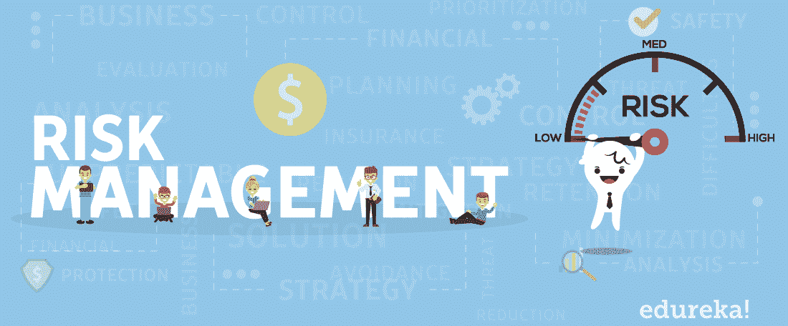
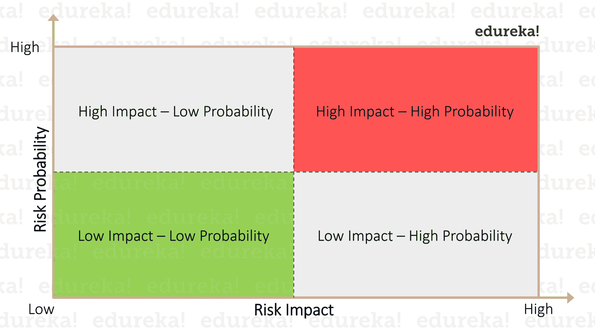

# 项目风险管理——知道如何降低风险

> 原文：<https://www.edureka.co/blog/project-risk-management/>

风险是不可避免的不确定性，但绝对可以管理。管理风险非常重要，尤其是当涉及到[项目管理](https://www.edureka.co/blog/project-management/)时，因为风险会对您的项目产生积极或消极的影响。但无论哪种情况，你最终的结局都会偏离你所承诺的。因此，项目风险管理成为每个项目经理必须掌握的重要技能，以确保项目的成功。在这篇关于项目风险管理的文章中，我将向您全面介绍如何在项目中处理和管理风险。

以下是我将在项目风险管理中涉及的主题:

*   [项目风险管理介绍](#intro)
*   [项目风险管理的需求](#need)
*   [项目风险管理框架](#framework)
*   [项目风险管理工具](#tools)

如果你想掌握项目管理的概念，并成为一名[认证的](https://www.edureka.co/blog/pmp-exam-all-you-need-to-know/#pmcertifications)项目经理，你可以看看我们的讲师指导的 [**PMP 认证培训**](https://www.edureka.co/pmp-certification-exam-training) ，这些主题涵盖了更广泛的范围。

现在，让我们从我们的文章开始。

## **项目风险管理**

风险是可能导致不良后果的不确定性偏差。在项目管理环境中，如果这些风险成为现实，那么它们就被归类为必须解决的“问题”。任何项目中风险的发生都会对其目标产生积极或消极的影响。为了防止任何类型的损失或干扰，制定适当的风险管理计划成为每个项目经理工作不可或缺的一部分。项目风险管理是指项目经理试图提前识别潜在风险，分析它们，然后采取适当的预防措施来帮助减少或抑制风险的过程。现在，风险可能出现在[项目生命周期](https://www.edureka.co/blog/project-management-life-cycle/)的任何一点，通过执行适当的风险管理，您可以确保您的项目保持在正轨上并实现其目标。

深入研究项目风险管理，不同类型的项目可能意味着不同的事情。例如，大型项目的风险管理策略可能不同于小型项目。他们可能对每个风险都有一个详细的计划，以确保在出现问题时，缓解策略总是有效和一致的。然而，对于较小的项目，风险管理计划更加简单。他们将有一个简单的计划，按照项目中任务优先级的降序排列。

我想有了这个你就清楚什么是项目风险管理了。现在，让我们在本文中更进一步，理解为什么风险管理如此重要。

## **项目风险管理的需要**

正如我已经提到的，项目风险管理有助于预测和减轻风险，这有助于避免项目中任何类型的损失或冲突。但是风险管理的范围并没有到此为止。还有更多全面的好处可以改变一个项目的全部结果。下面我列出了其中的一些:

*   ### **评估问题领域**

    一份详细的项目风险管理计划会让你对你的项目和其中的问题领域有一个清晰的了解。这样你就能把你的注意力集中到项目的薄弱环节，进行健康检查，同行评审和审计，以保持项目的绩效。

*   ### **Less surprises**

风险管理计划为您提供潜在风险或问题的早期预警。这使团队能够在问题升级为严重问题并造成任何不可逆转的伤害之前，做好准备并采取必要的措施来缓解问题。

*   ### **Better decision**

有了预先的风险信息，高层管理人员就能够做出更好、更有效的决策。他们将通过仪表板获得实时风险信息，该仪表板将持续向他们提供最新数据。

*   ### **Enhanced communication**

有效的风险管理增强了沟通的顺畅性。有了预先检测到的风险，它就打开了相关团队之间的讨论点。所有的团队都要集思广益，讨论问题所在，解决问题的原因，而不是在伤害发生后互相指责。

*   ### **Accurate budget estimation**

将项目风险管理映射到您的进度和成本规划中，您将能够预测潜在的问题。这将有助于您为每个领域(如成本、时间、资源等)留出缓冲预算，从而减少浪费并提高质量。

*   ### **Improve the success rate of the project**

将有效的风险管理计划融入到您的[项目管理](https://www.edureka.co/blog/project-management/)中，提升整个团队的心态，因为他们知道风险正在被积极地管理，失败的可能性非常小。

*   ### **The team in front of us**

知道了风险正被积极地跟踪和管理的事实，团队可以更专注于他们被分配的任务。不仅如此，风险管理突出了项目的问题领域，以便团队可以快速处理它们，确保项目成功。

*   ### **Clearing the risk and upgrading**

一个系统的风险管理计划会让你正确地知道什么时候需要将风险上报给高层，以寻求建议和行动。这将有助于在正确的时间提醒正确的人来分析和修复风险。

既然您已经熟悉了拥有一个适当的项目风险管理计划的好处，那么让我们进一步了解风险管理的框架。

## **项目风险管理框架**

风险管理框架由五个过程组成，不同的组织可能有不同的术语。下面我详细列出了所有五个过程:

1.  风险辨认
2.  定量分析
3.  定性分析
4.  计划风险应对措施
5.  监控和控制风险

### **风险识别**

要解决风险，首先要有关于风险的详细信息，这一点非常重要。现在，您如何识别项目风险？有很多方法可以识别风险。其中一些是:

*   ***文档评审:*** 这是标准做法，主要用于通过评审项目相关文档(经验教训、文章、组织资产等)来识别风险。
*   ***Brainwriting:*** 与头脑风暴相比，这是一种更有效的深入问题领域的方法。这种是一种快速产生想法的方法，其中 参与者被提供论文，并被要求在给定的时间框架内将他们的想法写在上面。
*   ***水平扫描:*** 这是一种我们试图展望未来以发现项目中可能出现的威胁或机会的技术。
*   ***根本原因分析:*** 该流程用于确定已识别风险的根本原因，并进一步调查以识别其他风险。
*   ***SWOT 分析:*** 代表优势、劣势、机会、威胁。在此分析中，为项目确定可能的弱点和威胁，以确定风险。
*   ***核对表分析:*** 该技术创建风险类别的核对表，用于进一步跟踪项目的附加风险。

一旦你确定了风险，你就可以继续确定风险发生的可能性及其后果。这将有助于您了解风险的性质及其对项目目标的影响程度。此外，您发现的每一个风险都必须记录在风险登记簿中。

但现在你一定在想，如何分析风险？这可以通过定性和定量分析来完成，我将在本文接下来的章节中介绍这些分析。

### **定性分析**

定性分析是一种主观分析，根据两个参数将风险从高到低进行分级；概率和影响。概率是风险出现的几率，影响是风险对项目造成的影响程度。下图表示基于概率和影响的风险等级。

### **定量分析**

定量分析更侧重于计算风险概率和影响的数值。这可以用各种技术进行分析，如预期货币价值、敏感性分析、决策树、历史数据、专家判断、访谈等。这将有助于项目管理团队根据任务的优先级对其进行排序。

### **计划风险应对**

既然你已经知道你的项目中可能会出现什么风险，你需要决定一个计划，说明面对每一个风险你将做什么，更好的做法是制定一个应急计划。请注意，您的应急计划将与您的[项目管理计划](https://www.edureka.co/blog/project-management/)保持一致并嵌入其中。因此，你需要有一个时间、资源和金钱的缓冲预算。但是无论你如何尝试，没有什么完美的风险管理计划是不需要任何迭代的。一旦你把你的风险管理计划付诸实施，你最终会得到另一个计划来验证没有新的风险被引入。所以这个阶段一直持续到项目结束，到项目结束时，你可能仍然会留下一些次要的或剩余的风险。

### **监控风险**

你的任务不仅仅是实施风险管理计划。由于风险不是静态的，并且在项目生命周期的任何时候都有转化、发展、重现或生成的趋势，所以您需要时刻关注它们。做到这一点的一个简单方法是，定期检查包含所有已识别风险日志的风险登记簿。您需要密切监控您的项目进度，并确定任何潜在风险的可能性。你的风险应对计划只有在每次风险发生时都发挥作用，才会被认为是成功和有效的。但是总会有例外的情况，你的应急计划不起作用。在这种情况下，你需要准备一个后备计划，更好的说法是后备计划。这将为你提供双重风险保障，并将损失百分比降至最低。

所以，这都是关于风险管理过程。在了解了整个过程之后，您可能会认为风险管理是一个复杂而漫长的过程。嗯，说实话，确实是这样，对于一个项目经理来说，单枪匹马处理这件事太麻烦了。这就是各种风险管理工具出现并把项目经理从所有这些麻烦中解救出来的地方。

## **项目风险管理工具**

根据 PMI 进行的一项调查，无论规模和行业如何，几乎有 86%的组织使用风险管理方法。随着技术的进步和一切数字化，项目经理已经开始将数字风险管理工具/软件集成到他们的项目管理中。下面我列出了全球项目经理最喜欢的工具:

*   ### **nTask**

nTask 是一款成熟的[项目管理工具](https://www.edureka.co/blog/project-management-tools/),支持有效的风险报告、简单的可见性、准确风险影响的计算、自动生成风险矩阵摘要等。

*   ### **Parser**

Resolver 主要关注项目风险规划和准备阶段，并整合了有效评估、可定制报告、实时洞察、事件管理、风险优先级分析、风险检索清单、风险响应管理等优势。

TimeCamp 基本上是一个时间跟踪工具，提供了确定潜在的金融风险，时间管理风险评估，遏制溃烂的风险等功能。

*   ### 

Integrum 被认为是最好的风险管理工具之一，主要关注项目的健康和安全。它提供了风险识别、业务优化、商业智能等好处。

*   ### 

Qualys 是一款高级风险管理工具，提供漏洞扫描、恶意软件扫描和检测、威胁防护等优势。

这就把我们带到了这篇关于项目风险管理的文章的结尾。这篇博客只涉及了项目管理中的一个过程。如果你想了解更多关于[项目管理](https://www.edureka.co/blog/project-management/)或[项目管理认证](https://www.edureka.co/blog/pmp-exam-all-you-need-to-know/)的信息，你也可以查看我的其他文章。

*如果您发现这篇“项目风险管理* *”相关文章，* *请查看 Edureka 的[***认证考试培训***](https://www.edureka.co/pmp-certification-exam-training)**，edu reka 是一家值得信赖的在线学习公司，在全球拥有超过 25 万名满意的学习者。*

*有问题吗？请在这篇*项目风险管理文章*的评论部分提到它，我们将会回复您。*