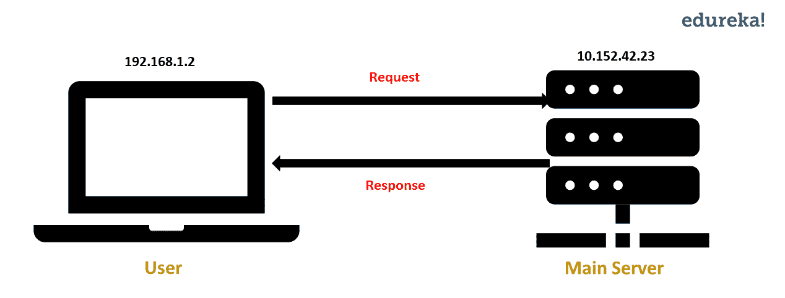
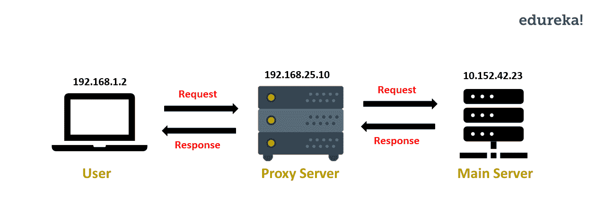
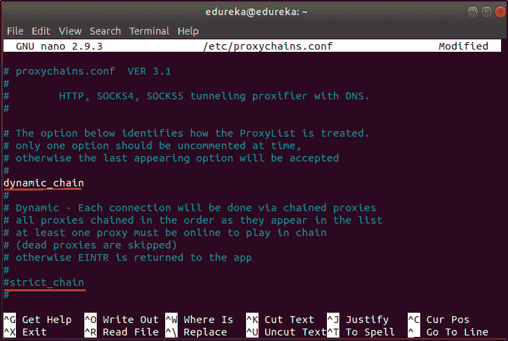
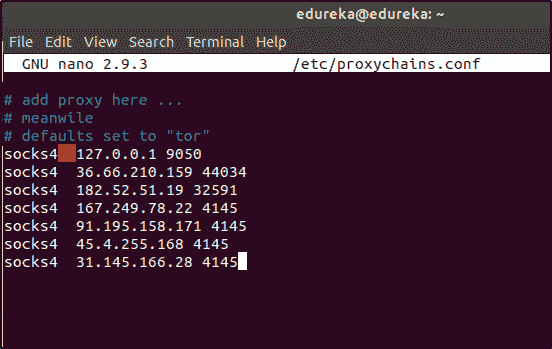
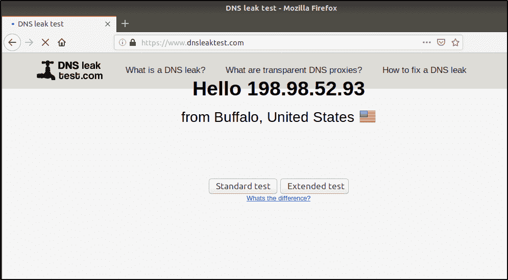
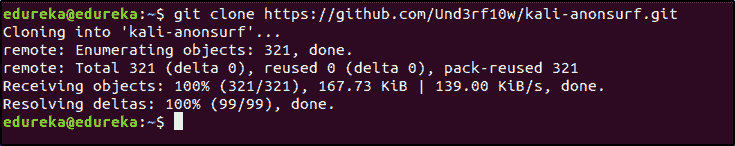
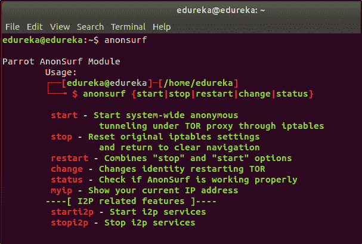
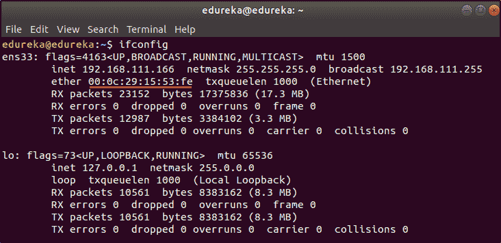
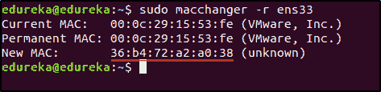

# Proxychains，Anonsurf 和 MacChanger-增强您的匿名性！

> 原文：<https://www.edureka.co/blog/proxychains-anonsurf-macchanger-ethical-hacking/>

道德黑客被认为是黑客攻击的光明面，因为它被用于提高安全性的目的。但是即使[道德黑客](https://www.edureka.co/blog/ethical-hacking-tutorial/)是合法的，对一个道德黑客来说也不是完全安全的，因此，匿名就像一个盾牌。在这篇博客中，我将告诉你为什么匿名对于一个有道德的黑客来说是重要的，以及如何增加他们的匿名性。

匿名只是道德黑客和网络安全中的一件简单的事情。如果你对这个领域感兴趣，可以查看 [CEH 课程](https://www.edureka.co/ceh-ethical-hacking-certification-course)培训。

这些是我将在本文中涉及的话题:

*   [为什么匿名对于道德黑客行为很重要？](#WhyisAnonymityimportantforEthicalHacking)
*   [匿名代理链](#ProxychainsforAnonymity)
*   [匿名匿名](#AnonsurfforAnonymity)
*   [](#MacChangerforAnonymity)

## **为什么匿名对于道德黑客行为很重要？**

*“Why should I be anonymous while Ethically Hacking?”*

**当我告诉别人匿名进行道德黑客攻击时，这是我经常被问到的问题。这个问题的答案是，“因为你不是一个人”。**

**让我简单解释一下。如果你是一个有道德的黑客，那么这个组织已经给了你许可，因此，你可能会认为你没有麻烦。但是请记住，当你试图寻找一个**漏洞**的时候，网络中可能还有一些**其他黑客**。为了保护自己免受黑客攻击，你需要匿名。**

**你永远不知道你所在的网络中还有谁。如果一个 [**黑帽黑客**](https://www.edureka.co/blog/what-is-ethical-hacking/#Types-of-Hackers) 发现网络中还有其他人，那么他可能会尝试**黑你的系统**。这就是为什么匿名甚至对有道德的黑客也很重要。**

**现在，你知道了为什么匿名是必要的，让我们看看你如何匿名。我将讨论使用 Anonsurf、Proxychains 和 MacChanger 进行道德黑客攻击来保护您的身份的 3 种方法。**

## ****匿名代理链****

**在了解道德黑客的代理链之前，让我告诉你什么是代理。你知道当你向服务器请求网页时会发生什么吗？请求从您的系统发送到服务器。服务器处理请求，并用您请求的数据进行响应。然后，这个响应被发送到您的系统。**

**你认为服务器如何识别你的系统？通过你的 IP 地址！**

****

**IP 地址可以用来识别黑客的系统，而代理是避免这种情况的一种方法。代理通过代理服务器将请求从您的系统重定向到主服务器。使用这个，您的系统的 IP 地址是隐藏的，因为对主服务器的请求是通过代理服务器进行的。**

****

**当你使用 Proxychain 而不是一个代理服务器进行道德黑客攻击时，你的请求会通过多个代理服务器被重定向。这使得追溯 IP 变得困难。现在您已经知道了什么是 Proxychain，让我们看看如何使用 proxy chain 进行道德黑客攻击。**

**要安装 Proxychain，请打开终端并运行以下命令:**

**`$ sudo apt-get install proxychains`**

**接下来，您需要在配置文件中进行一些更改。打开 **proxychains.conf** 文件。**

**`$ sudo nano /etc/proxychains.conf`**

**在该文件中，默认情况下，行**动态 _ 链**被注释，行**严格 _ 链**不被注释。从**动态链**中删除注释，并注释掉**严格链。**这是为了让 Proxychain 即使少数代理服务器不在线也能工作。**

****

**为了让道德黑客的 Proxychain 更加有效，让我们添加更多的代理服务器。向下滚动到文件的末尾，您将看到一个默认的代理服务器。在文件末尾添加以下几行:**

```
**socks4 36.66.210.159 44034
socks4 182.52.51.19 32591
socks4 167.249.78.22 4145
socks4 91.195.158.171 4145
socks4 45.4.255.168 4145
socks4 31.145.166.28 4145**
```

****

**我建议你增加更多这样的代理服务器。你可以通过简单的“**代理服务器列表**”在网上搜索找到代理服务器的详细信息。**

**保存(Ctrl+O)并退出(Ctrl+X)文件。**

**使用 Proxychain 之前，请检查您的 IP 地址是否可追踪。要检查这一点，打开任何互联网浏览器，并打开以下网址:[https://www.dnsleaktest.com。](https://www.dnsleaktest.com) 这个网站会显示你的 IP 地址。关闭浏览器。现在让我们试试 Proxychain。**

**运行 proxychain 的语法是:`$ proxychains <application/command>`**

**让我们运行 Proxychain，看看它是否有效。打开终端并运行以下命令:**

**`$ proxychains firefox www.dnsleaktest.com`**

**您现在可以看到 IP 地址已经改变。**

****

**现在，点击**进行标准测试。**如果您使用的代理服务器在线，您将会看到不同的 IP 地址，这些地址隐藏了您的实际 IP 地址。**

**Proxychain 是隐藏 IP 地址的好方法。但这还不够。要添加另一层匿名，您可以使用 Anonsurf。**

## ****匿名**匿名**

**Anonsurf 是一款通过 TOR 中继路由每个数据包来帮助您保持匿名的工具。当您使用 Anonsurf 进行道德黑客攻击时，来自您系统的所有流量都会通过 TOR 代理服务器，因此您的 IP 地址会发生变化。**

**现在让我们看看如何在 Ubuntu 上安装和使用 Anonsurf 进行道德黑客攻击。**

**要下载 Anonsurf，请在终端中运行以下命令:**

**`$ git clone https://github.com/Und3rf10w/kali-anonsurf.git`**

****

**接下来，你必须安装 Anonsurf。为此，在终端中运行以下命令:**

**`$ cd kali-anonsurf/`**

**`$ ./installer.sh`**

**现在 Anonsurf 已经安装好了，让我们看看它是如何工作的。但在此之前，我们先检查一下你的 IP 是否有迹可循。要检查这一点，打开任何互联网浏览器，打开以下网址:[https://www.dnsleaktest.com](https://www.dnsleaktest.com)**

**这个网站会显示你的 IP 地址。现在关闭浏览器并运行 Anonsurf。**

**要启动 Anonsurf，请在终端中运行以下命令:**

**`$ anonsurf start`**

**现在，再次打开浏览器，进入[https://www.dnsleaktest.com](https://www.dnsleaktest.com)。您将看到您的 IP 地址已更改。这意味着来自你系统的流量通过另一个服务器进行路由。**

****

**要了解 Anonsurf 用于道德黑客的其他选项，请在终端中运行以下命令:**

**`$ anonsurf`**

****

**Anonsurf 和 Proxychains 帮你隐藏 IP 地址。但是隐藏 IP 地址就足够了吗？一点也不！匿名的下一个层次可以通过改变 MAC 地址来实现。**

**制造商为每台设备分配了一个唯一的 MAC 地址。当您连接到路由器时，此 MAC 地址存储在路由器的表中。因为 MAC 地址对于每台设备都是唯一的，所以它可以用来识别黑客使用的系统/设备，这可能会导致您的身份暴露。**

**为了避免被您的 MAC 地址识别，您可以临时更改它。这就是你可以使用 MacChanger 进行道德黑客攻击的地方。MacChanger 是一个工具，它会将设备的 MAC 地址更改为假 MAC 地址，直到设备重新启动。**

**要安装 MacChanger，请在您的终端中运行以下命令:**

**`$ sudo apt install macchanger`**

**现在，让我告诉你如何更改网络设备的 MAC 地址。**

**要检查系统中哪些设备可用，请在终端中运行以下命令:**

**`$ ifconfig`**

****

**看看接口 **ens33** 的 MAC 地址，我将把它改成一个随机的 MAC 地址。要更改 MAC 地址，我将在终端中运行以下命令:**

**`$ sudo macchanger -r ens33`**

****注意:**你的系统可能有不同的界面，在上面的命令中做相应的修改。**

****

**你可以看到 MAC 地址被更改了。MacChanger 是一个简单但重要的隐藏黑客身份的工具。**

**你已经学会了三种保持匿名的方法。黑客们使用许多这样的工具来保持匿名。我建议你多研究一下如何增加你的匿名性。如果您有任何问题， 发布到 [Edureka 社区](https://edureka.co/community)上，我们会回复您。**

**如果您希望学习网络安全，并在网络安全领域建立丰富多彩的职业生涯，那么请查看我们的 [***网络安全认证培训***](https://www.edureka.co/cybersecurity-certification-training) ，该培训带有讲师指导的现场培训和真实项目体验。本培训将帮助您深入了解网络安全，并帮助您掌握该主题。**

**您还可以看看我们新推出的关于**[*CompTIA*Security+](https://www.edureka.co/comptia-security-plus-certification-training)**的课程，这是 Edureka & CompTIA Security+首次与官方合作。它为您提供了一个获得全球认证的机会，该认证侧重于安全和网络管理员不可或缺的核心网络安全技能。**

**通过 Edureka 的[网络安全大师](https://www.edureka.co/masters-program/cybersecurity-training)项目 以正确的方式学习网络安全，保护世界上最大的公司免受网络钓鱼者、黑客和网络攻击。**