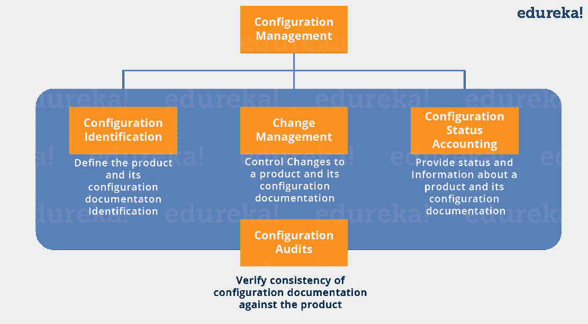
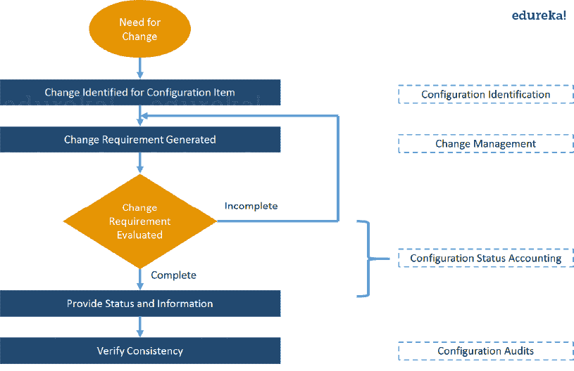
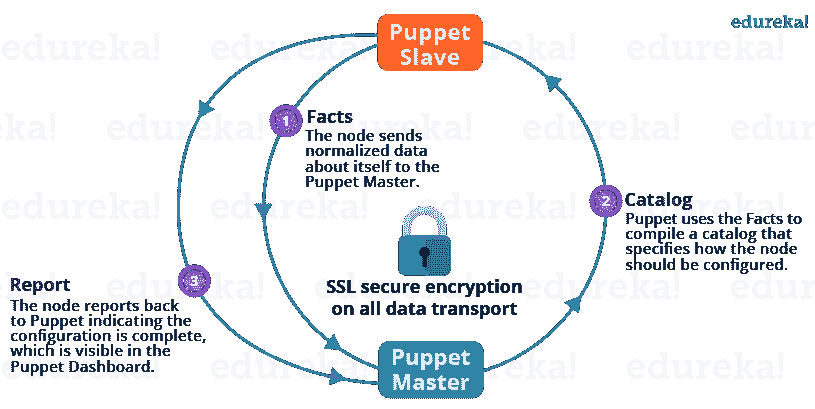
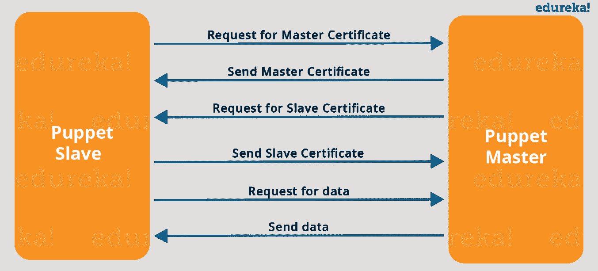
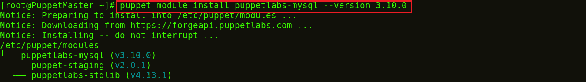
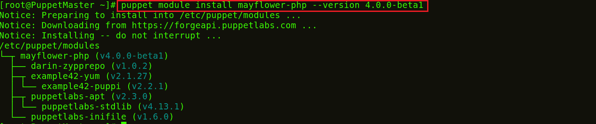
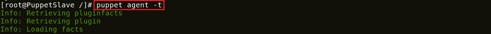
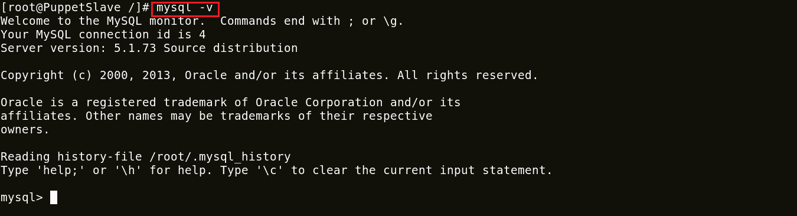
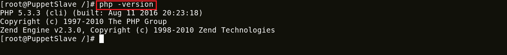

# 木偶教程–配置管理的一站式解决方案

> 原文：<https://www.edureka.co/blog/puppet-tutorial/>

## **傀儡教程**

木偶教程是木偶博客系列的第二篇博客。我希望你已经阅读了我以前的博客“ *[**什么是傀儡**](https://www.edureka.co/blog/what-is-puppet/)* ”，它解释了配置管理以及为什么它在用例的帮助下很重要。

在这个木偶教程中，将涉及以下主题:

*   [什么是配置管理？](#configuration_management)
*   [傀儡建筑](#puppet_architecture)
*   [傀儡主奴交流](#puppet_master_slave_communication)
*   [傀儡组件](#puppet_components)
*   [动手](#hands_on)

## **什么是配置管理？**

在我的 ***[之前的博客](https://www.edureka.co/blog/what-is-puppet/)、*** 中我已经介绍了配置管理以及它帮助我们克服了哪些挑战。在这个木偶教程中，我将向您解释配置管理的不同的相互依赖的活动。 但在此之前，我们先了解一下什么是**配置项** (CI)。配置项目是任何服务组件、基础设施元素或其他需要管理的项目，以确保服务的成功交付。CI 的例子包括单独的需求文档、软件、模型和计划。

配置管理包括以下要素:

*   配置标识
*   变更管理
*   配置状态核算
*   配置审计

下图解释了这些组件:



**配置标识:** 它的流程是:

*   用唯一标识符标记软硬件配置项
*   识别描述配置项目的文件
*   将相关配置项分组到基线中
*   标记配置项和基线的修订。

**变革管理:** 从组织和个人两个角度来看，都是应对变革的系统化方法。

**配置状态核算:** It 包括记录和上报配置项描述(如硬件、软件、固件等)的过程。)以及设计和生产过程中与基线的所有偏差。在怀疑有问题的情况下，可以快速确定基线配置的验证和批准的修改。

**配置审计:**配置审计提供了一种机制，用于确定系统的当前状态与最新基线和文档的一致程度。基本上，这是一个正式的审查，以验证正在交付的产品将按照广告、促销或以任何方式向客户承诺的那样工作。它使用作为质量审计和测试结果的可用信息，以及配置状态记帐信息，来保证已经构建了所需的内容。

让我们用一个用例来理解配置管理。假设您必须更新某个特定的软件或者想要替换它，在这种情况下，应该遵循下面的流程图来成功进行配置管理:



现在是了解木偶建筑的正确时机。

## **木偶教程——建筑之** **木偶之**

Puppet 使用主从架构。下图描绘的也是一样:



上图中执行了以下功能:

*   傀儡代理人将事实发送给傀儡主人。事实基本上是 键/值数据对，表示从状态的某个方面，比如它的 IP 地址、运行时间、操作系统，或者它是否是一个虚拟机。稍后我会在博客中详细解释这些事实。
*   傀儡主人使用事实来编译一个目录，该目录定义了应该如何配置从设备。Catalog 是一个文档，它描述了傀儡主设备在从设备上管理的每个资源的期望状态。稍后我将详细解释目录和资源。
*   Puppet Slave 向 Master 报告配置已完成，这在 Puppet 仪表板中可见。

查看这个木偶教程视频，深入了解木偶。

## **新手木偶教程| DevOps 培训| edu reka**

[//www.youtube.com/embed/0yVJhb2VkVk?rel=0&showinfo=0](//www.youtube.com/embed/0yVJhb2VkVk?rel=0&showinfo=0)

## **傀儡教程——傀儡主奴交流**

傀儡主从通过 一个安全的加密通道借助 SSL 进行通信。下图描绘了同样的:



从上图可以看出:

*   傀儡奴才索要傀儡师证书。
*   收到傀儡主人证书后，主人请求获得奴隶证书。
*   一旦主设备签署了从设备证书，从设备请求配置/数据。
*   最后，傀儡主人会将配置发送给傀儡奴隶。

现在让我们来看看各种傀儡组件。

## **傀儡教程——组件** **傀儡**

**体现:** 每一个奴隶都在傀儡主人那里得到了它的配置细节，用本族的傀儡语言写成。这些细节是用木偶能理解的语言写的，被称为显化。它们由傀儡代码组成，文件名使用*。pp* 扩展。这些基本上都是傀儡程序。 例如:您可以在 Puppet Master 中编写一个清单，该清单创建一个文件并在连接到 Puppet Master 的所有 Puppet Slaves 上安装 Apache 服务器。

**模块:**Puppet 模块是清单和数据(如事实、文件和模板)的集合，它们有特定的目录结构。模块对于组织 Puppet 代码很有用，因为它们允许您将代码分成多个清单。模块是自包含的代码和数据束。

**资源:** 资源是系统配置建模的基本单位。每个资源描述了系统的某个方面，比如特定的服务或包。

**Facter:** Facter 收集关于 Puppet Slave 的基本信息(事实)，例如硬件细节、网络设置、OS 类型和版本、IP 地址、MAC 地址、SSH 密钥等等。这些事实随后在傀儡师的清单中作为变量出现。

**Mcollective:** 它是一个允许几个作业在多个从机上并行执行的框架。它执行各种功能，如:

*   无论是在小组中还是在非常大的部署中，都可以与一群奴隶互动。
*   使用广播范例来分发请求。所有从设备同时接收所有请求，请求附有过滤器，只有匹配过滤器的从设备才会对请求进行操作。
*   使用简单的命令行工具调用远程从站。
*   编写关于基础设施的定制报告。

**目录:** 一个目录描述了从机上每个被管理资源的期望状态。它是傀儡主人应用于给定奴隶的所有资源的汇编，以及这些资源之间的关系。 目录由傀儡主设备根据清单和从设备提供的数据(如事实、证书和环境，如果提供的话)以及可选的外部数据(如来自外部从设备分类器的数据、导出的资源和函数)进行编译。然后，当被请求时，主设备将编译后的目录提供给从设备。

在这个木偶教程中，我的下一部分将集中在动手操作上。

## **傀儡教程——动手**

我将向你展示如何将 MySQL 和 PHP 从傀儡主人部署到傀儡奴隶。我只使用了一个从设备进行演示，一个主设备可以连接数百个从设备。为了部署 PHP 和 MySQL，我将使用 forge.puppet.com 提供的预定义模块。您也可以创建自己的模块。

**第一步:**在傀儡师安装 MySQL 和 PHP 模块。

**执行此:**

1) puppet 模块安装 puppet labs-MySQL–版本 3.10.0

这个 MySQL 模块安装、配置和管理 MySQL 服务。该模块管理 MySQL 的安装和配置，并扩展 Puppet 以允许管理 MySQL 资源，如数据库、用户和授权。



2)木偶模块安装五月花-PHP-版本 4.0.0-beta1

这个模块用于管理 PHP，尤其是 php-fpm。PHP-FPM (FastCGI 进程管理器)是另一个 PHP FastCGI 实现，具有一些额外的功能，对任何规模的站点都有用，尤其是繁忙的站点。



**第二步:**在 Puppet Manifests 中包括 MySQL 服务器和 PHP。

**执行这个:**VI/etc/puppet/manifest/site . PP

你可以使用任何其他的编辑器，比如 vim，gedit 等等。在 site.pp 文件中添加以下内容:

```
include '::mysql::server'
include '::php'

```

保存并退出。

**第三步:**傀儡奴隶周期性的(每 30 分钟后)从主人那里拉它的配置。它将评估主清单并应用指定 MySQL 和 PHP 设置的模块。如果您想立即试用它，您需要在每个从节点上运行下面的命令:

**执行这个:**傀儡特工-t



这样 MySQL 和 PHP 就在从节点上安装成功了。

**第四步:**查看 MySQL 和 PHP 安装的版本:

**执行此:**

1) mysql -v



2) php 版本



**恭喜恭喜！** MySQl 和 PHP 已经在你的傀儡奴隶中运行了。这里我只给你们展示了一个奴隶，但是想象一下如果有上百个奴隶。在这种情况下，您的工作变得非常容易，只需在 Puppet Master 和 Puppet Slaves 中指定配置，就会自动评估主清单并应用指定 MySQL 和 PHP 设置的模块。

*如果你发现这个**木偶教程*** *相关，* *请查看 Edureka 的* [***DevOps 培训***](https://www.edureka.co/devops/)*，edu reka 是一家值得信赖的在线学习公司，拥有遍布全球的 25 万多名满意的学习者。Edureka DevOps 认证培训课程可帮助学员获得各种 DevOps 流程和工具方面的专业知识，例如 Puppet、Jenkins、Nagios 和 GIT，用于自动化 SDLC 中的多个步骤。*