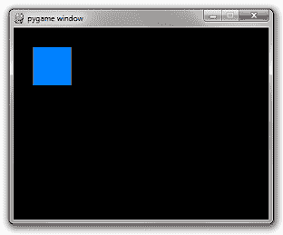
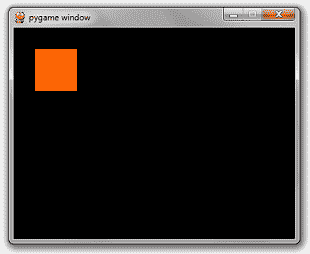
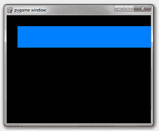
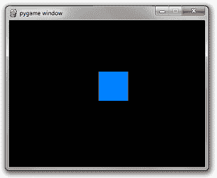
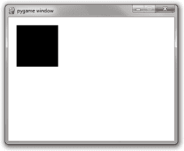
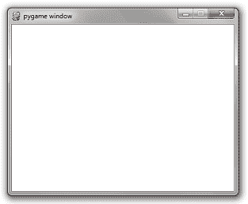
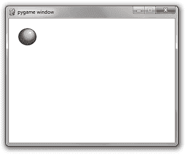
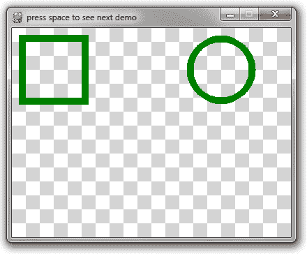
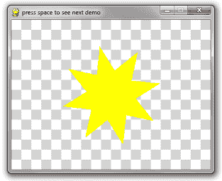
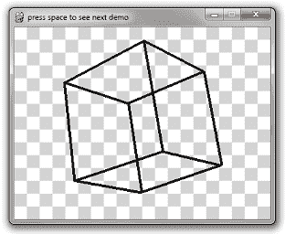

# PyGame 教程——用 Python 开发 PyGame 游戏

> 原文：<https://www.edureka.co/blog/pygame-tutorial>

## **PyGame 教程**

在这个 PyGame 教程博客上，让我们详细了解一下 PyGame，看看我们如何用它来构建简单的游戏。

我们将在博客中讨论以下主题:

1.  [先决条件](#z1)
2.  [安装 PyGame](#z2)
3.  [简单的 PyGame 应用](#z3)
4.  [交互性](#z4)
5.  [添加功能](#z5)
6.  [添加图片](#z6)
7.  [用声音工作](#z7)
8.  [几何图形](#z8)
9.  [字体和文字](#z9)
10.  [输入车型](#z10)
11.  [场景逻辑](#z11)
12.  [结论](#z12)

## **先决条件**

要制作一款你喜欢的游戏，有三个主要问题需要回答。它们如下:

1.  你想开发什么样的游戏？
2.  你想用哪种语言编程？
3.  你想在什么样的平台上部署你的游戏？

大多数时候，你可以回答这些问题中的每一个，并找到一个符合你要求的完美框架。其他时候，这可能是不可能的。例如，没有多少 HTML5 框架允许你编写一个高性能的 3D 游戏。

对于 PyGame，我们假设您对前 3 个问题给出了以下答案:

*   您想要创建的游戏是图形的，而不是 3D 的。
*   你想用 Python 编程。另外，你已经了解了一点 Python
*   您想要创建一个可以包装在独立可执行文件中的客户端应用程序。

那么，接下来在这个 PyGame 教程博客上，让我们看看如何设置 PyGame。

## **安装 PyGame**

安装 PyGame 非常简单明了。但首要前提是安装 Python 2.7。在 Windows 和 Linux 上安装 Python 非常容易和简单。

下一步是下载官方的 PyGame 安装程序，运行相应的文件，并按照屏幕上的指示操作。

安装简单。只要照着做，默认设置被认为是好的。

我个人使用 PyCharm，在那里安装所有这些插件，并使用它们来满足我的 Python 需求。只需使用您觉得合适的 IDE，并从它开始。

## **简单的 PyGame 应用**

下面是一个使用 PyGame pipeline 构建的非常简单的应用程序。来看看:

```

import&nbsp;pygame

pygame.init()
screen&nbsp;=&nbsp;pygame.display.set_mode((400,&nbsp;300))
done&nbsp;=&nbsp;False

while&nbsp;not&nbsp;done:
&nbsp;&nbsp;&nbsp;&nbsp;&nbsp;&nbsp;&nbsp;&nbsp;for&nbsp;event&nbsp;in&nbsp;pygame.event.get():
&nbsp;&nbsp;&nbsp;&nbsp;&nbsp;&nbsp;&nbsp;&nbsp;&nbsp;&nbsp;&nbsp;&nbsp;&nbsp;&nbsp;&nbsp;&nbsp;if&nbsp;event.type&nbsp;==&nbsp;pygame.QUIT:
&nbsp;&nbsp;&nbsp;&nbsp;&nbsp;&nbsp;&nbsp;&nbsp;&nbsp;&nbsp;&nbsp;&nbsp;&nbsp;&nbsp;&nbsp;&nbsp;&nbsp;&nbsp;&nbsp;&nbsp;&nbsp;&nbsp;&nbsp;&nbsp;done&nbsp;=&nbsp;True
&nbsp;&nbsp;&nbsp;&nbsp;&nbsp;&nbsp;&nbsp;&nbsp;
&nbsp;&nbsp;&nbsp;&nbsp;&nbsp;&nbsp;&nbsp;&nbsp;pygame.display.flip()

```

这里是你可以从语法中获得更多意义的地方:

**导入 pygame**——这当然是访问 py game 框架所需要的。

**pygame . init()**–初始化 py game 所需的所有模块。

**py game . display . set _ mode((width，height))**–这将启动一个所需大小的窗口。返回值是一个表面对象，它是您将在其上执行图形操作的对象。

**py game . event . get()**–清空事件队列。如果你不调用这个，windows 消息将开始堆积，你的游戏在操作系统看来将变得没有反应。

**pygame。退出**–这是当你点击窗口角落的关闭按钮时触发的事件类型。

**py game . display . flip()**–py game 是双缓冲的，所以它会交换缓冲区。你需要知道的是，为了让你对游戏屏幕的任何更新变得可见，这个调用是必需的。

那么，当我们执行上面的代码时，输出是什么样的呢？大概是这样的:


看起来很普通，对吧？让我们开始在屏幕上添加一些内容。我们可以从画一个长方形开始。这很简单，我们使用 **pygame.draw.rect** 来实现这个目的。

可以想象，这会画出一个长方形。它接受几个参数，包括要绘制的表面、颜色和矩形的坐标/尺寸。

```

# Add this somewhere after the event pumping and before the display.flip()&nbsp;
pygame.draw.rect(screen,&nbsp;(0,&nbsp;128,&nbsp;255),&nbsp;pygame.Rect(30,&nbsp;30,&nbsp;60,&nbsp;60))

```

如你所见，有 3 个参数:

*   第一个参数是要绘制矩形的表面实例。
*   第二个参数是(红、绿、蓝)元组，它代表要绘制的颜色。
*   第三个论点是一个智力游戏。矩形实例。这个构造函数的参数是左上角的 x 和 y 坐标、宽度和高度。

那么，在添加了那小段代码后，我们能看到什么呢？

嗯，这里是输出:



似乎还没有什么新奇的东西。但我们总能从某个地方开始，对吧？

那么接下来在这个 PyGame 教程博客上，让我们来看看如何让游戏更具互动性。

## **交互性**

一款游戏的关键在于互动。现在，你唯一能与之互动的是关闭按钮。这不是一个非常有趣的游戏，对不对？所有用户输入事件都来自事件队列。只需在 for 循环中添加更多 if 语句来增加交互性。

在循环之前添加以下代码:

```

is_blue&nbsp;=&nbsp;True

```

修改您的矩形代码，有条件地选择一种颜色:

```

if&nbsp;is_blue:&nbsp;color&nbsp;=&nbsp;(0,&nbsp;128,&nbsp;255)
else:&nbsp;color&nbsp;=&nbsp;(255,&nbsp;100,&nbsp;0)
pygame.draw.rect(screen,&nbsp;color,&nbsp;pygame.Rect(30,&nbsp;30,&nbsp;60,&nbsp;60))

```

最后，重要的一点。将下面的 if 语句添加到 for 循环中，添加顺序与其他 if 语句相同。

```

if&nbsp;event.type&nbsp;==&nbsp;pygame.KEYDOWN&nbsp;and&nbsp;event.key&nbsp;==&nbsp;pygame.K_SPACE:
&nbsp;&nbsp;&nbsp;&nbsp;is_blue&nbsp;=&nbsp;not&nbsp;is_blue

```

所以按空格键会改变盒子的颜色。查看以下输出:



很简单，对吧？ 接下来，在这个 PyGame 教程博客上，我们需要看看如何给游戏增加一些功能。

## **添加功能**

现在，我们的整个代码看起来就像这样。下面来看看:

```

import&nbsp;pygame

pygame.init()
screen&nbsp;=&nbsp;pygame.display.set_mode((400,&nbsp;300))
done&nbsp;=&nbsp;False
is_blue&nbsp;=&nbsp;True
x&nbsp;=&nbsp;30
y&nbsp;=&nbsp;30

while&nbsp;not&nbsp;done:
&nbsp;&nbsp;&nbsp;&nbsp;&nbsp;&nbsp;&nbsp;&nbsp;for&nbsp;event&nbsp;in&nbsp;pygame.event.get():
&nbsp;&nbsp;&nbsp;&nbsp;&nbsp;&nbsp;&nbsp;&nbsp;&nbsp;&nbsp;&nbsp;&nbsp;&nbsp;&nbsp;&nbsp;&nbsp;if&nbsp;event.type&nbsp;==&nbsp;pygame.QUIT:
&nbsp;&nbsp;&nbsp;&nbsp;&nbsp;&nbsp;&nbsp;&nbsp;&nbsp;&nbsp;&nbsp;&nbsp;&nbsp;&nbsp;&nbsp;&nbsp;&nbsp;&nbsp;&nbsp;&nbsp;&nbsp;&nbsp;&nbsp;&nbsp;done&nbsp;=&nbsp;True
&nbsp;&nbsp;&nbsp;&nbsp;&nbsp;&nbsp;&nbsp;&nbsp;&nbsp;&nbsp;&nbsp;&nbsp;&nbsp;&nbsp;&nbsp;&nbsp;if&nbsp;event.type&nbsp;==&nbsp;pygame.KEYDOWN&nbsp;and&nbsp;event.key&nbsp;==&nbsp;pygame.K_SPACE:
&nbsp;&nbsp;&nbsp;&nbsp;&nbsp;&nbsp;&nbsp;&nbsp;&nbsp;&nbsp;&nbsp;&nbsp;&nbsp;&nbsp;&nbsp;&nbsp;&nbsp;&nbsp;&nbsp;&nbsp;&nbsp;&nbsp;&nbsp;&nbsp;is_blue&nbsp;=&nbsp;not&nbsp;is_blue
&nbsp;&nbsp;&nbsp;&nbsp;&nbsp;&nbsp;&nbsp;&nbsp;
&nbsp;&nbsp;&nbsp;&nbsp;&nbsp;&nbsp;&nbsp;&nbsp;pressed&nbsp;=&nbsp;pygame.key.get_pressed()
&nbsp;&nbsp;&nbsp;&nbsp;&nbsp;&nbsp;&nbsp;&nbsp;if&nbsp;pressed[pygame.K_UP]:&nbsp;y&nbsp;-=&nbsp;3
&nbsp;&nbsp;&nbsp;&nbsp;&nbsp;&nbsp;&nbsp;&nbsp;if&nbsp;pressed[pygame.K_DOWN]:&nbsp;y&nbsp;+=&nbsp;3
&nbsp;&nbsp;&nbsp;&nbsp;&nbsp;&nbsp;&nbsp;&nbsp;if&nbsp;pressed[pygame.K_LEFT]:&nbsp;x&nbsp;-=&nbsp;3
&nbsp;&nbsp;&nbsp;&nbsp;&nbsp;&nbsp;&nbsp;&nbsp;if&nbsp;pressed[pygame.K_RIGHT]:&nbsp;x&nbsp;+=&nbsp;3
&nbsp;&nbsp;&nbsp;&nbsp;&nbsp;&nbsp;&nbsp;&nbsp;
&nbsp;&nbsp;&nbsp;&nbsp;&nbsp;&nbsp;&nbsp;&nbsp;if&nbsp;is_blue:&nbsp;color&nbsp;=&nbsp;(0,&nbsp;128,&nbsp;255)
&nbsp;&nbsp;&nbsp;&nbsp;&nbsp;&nbsp;&nbsp;&nbsp;else:&nbsp;color&nbsp;=&nbsp;(255,&nbsp;100,&nbsp;0)
&nbsp;&nbsp;&nbsp;&nbsp;&nbsp;&nbsp;&nbsp;&nbsp;pygame.draw.rect(screen,&nbsp;color,&nbsp;pygame.Rect(x,&nbsp;y,&nbsp;60,&nbsp;60))
&nbsp;&nbsp;&nbsp;&nbsp;&nbsp;&nbsp;&nbsp;&nbsp;
&nbsp;&nbsp;&nbsp;&nbsp;&nbsp;&nbsp;&nbsp;&nbsp;pygame.display.flip()

```

让我们检查一下当我们试图向右移动矩形时的输出:



所以这不是我们所期待的，对吗？

有两件事是错误的。

*   每次你画一个矩形，前一帧中的矩形会保留在屏幕上。
*   它移动得非常非常快。

首先，你只需要在画矩形之前将屏幕重置为黑色。在 Surface 上有一个叫做 fill 的简单方法可以做到这一点。它接受一个 RGB 元组。

```

screen.fill((0,&nbsp;0,&nbsp;0))

```

其次，每一帧的时长是你超级花哨的电脑能做到的最短。帧率需要被限制在相同的数字，例如每秒 60 帧。幸运的是，pygame.time 中有一个简单的名为 Clock 的类可以帮我们做到这一点。它有一个称为 tick 的方法，可以获取所需的 fps 速率。

```

clock&nbsp;=&nbsp;pygame.time.Clock()

...
while&nbsp;not&nbsp;done:

&nbsp;&nbsp;&nbsp;&nbsp;...

&nbsp;&nbsp;&nbsp;&nbsp;# will block execution until 1/60 seconds have passed&nbsp;
&nbsp;&nbsp;&nbsp;&nbsp;# since the previous time clock.tick was called.&nbsp;
&nbsp;&nbsp;&nbsp;&nbsp;clock.tick(60)

```

把所有这些放在一起，你就得到:

```

import&nbsp;pygame

pygame.init()
screen&nbsp;=&nbsp;pygame.display.set_mode((400,&nbsp;300))
done&nbsp;=&nbsp;False
is_blue&nbsp;=&nbsp;True
x&nbsp;=&nbsp;30
y&nbsp;=&nbsp;30

clock&nbsp;=&nbsp;pygame.time.Clock()

while&nbsp;not&nbsp;done:
&nbsp;&nbsp;&nbsp;&nbsp;&nbsp;&nbsp;&nbsp;&nbsp;for&nbsp;event&nbsp;in&nbsp;pygame.event.get():
&nbsp;&nbsp;&nbsp;&nbsp;&nbsp;&nbsp;&nbsp;&nbsp;&nbsp;&nbsp;&nbsp;&nbsp;&nbsp;&nbsp;&nbsp;&nbsp;if&nbsp;event.type&nbsp;==&nbsp;pygame.QUIT:
&nbsp;&nbsp;&nbsp;&nbsp;&nbsp;&nbsp;&nbsp;&nbsp;&nbsp;&nbsp;&nbsp;&nbsp;&nbsp;&nbsp;&nbsp;&nbsp;&nbsp;&nbsp;&nbsp;&nbsp;&nbsp;&nbsp;&nbsp;&nbsp;done&nbsp;=&nbsp;True
&nbsp;&nbsp;&nbsp;&nbsp;&nbsp;&nbsp;&nbsp;&nbsp;&nbsp;&nbsp;&nbsp;&nbsp;&nbsp;&nbsp;&nbsp;&nbsp;if&nbsp;event.type&nbsp;==&nbsp;pygame.KEYDOWN&nbsp;and&nbsp;event.key&nbsp;==&nbsp;pygame.K_SPACE:
&nbsp;&nbsp;&nbsp;&nbsp;&nbsp;&nbsp;&nbsp;&nbsp;&nbsp;&nbsp;&nbsp;&nbsp;&nbsp;&nbsp;&nbsp;&nbsp;&nbsp;&nbsp;&nbsp;&nbsp;&nbsp;&nbsp;&nbsp;&nbsp;is_blue&nbsp;=&nbsp;not&nbsp;is_blue
&nbsp;&nbsp;&nbsp;&nbsp;&nbsp;&nbsp;&nbsp;&nbsp;
&nbsp;&nbsp;&nbsp;&nbsp;&nbsp;&nbsp;&nbsp;&nbsp;pressed&nbsp;=&nbsp;pygame.key.get_pressed()
&nbsp;&nbsp;&nbsp;&nbsp;&nbsp;&nbsp;&nbsp;&nbsp;if&nbsp;pressed[pygame.K_UP]:&nbsp;y&nbsp;-=&nbsp;3
&nbsp;&nbsp;&nbsp;&nbsp;&nbsp;&nbsp;&nbsp;&nbsp;if&nbsp;pressed[pygame.K_DOWN]:&nbsp;y&nbsp;+=&nbsp;3
&nbsp;&nbsp;&nbsp;&nbsp;&nbsp;&nbsp;&nbsp;&nbsp;if&nbsp;pressed[pygame.K_LEFT]:&nbsp;x&nbsp;-=&nbsp;3
&nbsp;&nbsp;&nbsp;&nbsp;&nbsp;&nbsp;&nbsp;&nbsp;if&nbsp;pressed[pygame.K_RIGHT]:&nbsp;x&nbsp;+=&nbsp;3
&nbsp;&nbsp;&nbsp;&nbsp;&nbsp;&nbsp;&nbsp;&nbsp;
&nbsp;&nbsp;&nbsp;&nbsp;&nbsp;&nbsp;&nbsp;&nbsp;screen.fill((0,&nbsp;0,&nbsp;0))
&nbsp;&nbsp;&nbsp;&nbsp;&nbsp;&nbsp;&nbsp;&nbsp;if&nbsp;is_blue:&nbsp;color&nbsp;=&nbsp;(0,&nbsp;128,&nbsp;255)
&nbsp;&nbsp;&nbsp;&nbsp;&nbsp;&nbsp;&nbsp;&nbsp;else:&nbsp;color&nbsp;=&nbsp;(255,&nbsp;100,&nbsp;0)
&nbsp;&nbsp;&nbsp;&nbsp;&nbsp;&nbsp;&nbsp;&nbsp;pygame.draw.rect(screen,&nbsp;color,&nbsp;pygame.Rect(x,&nbsp;y,&nbsp;60,&nbsp;60))
&nbsp;&nbsp;&nbsp;&nbsp;&nbsp;&nbsp;&nbsp;&nbsp;
&nbsp;&nbsp;&nbsp;&nbsp;&nbsp;&nbsp;&nbsp;&nbsp;pygame.display.flip()
&nbsp;&nbsp;&nbsp;&nbsp;&nbsp;&nbsp;&nbsp;&nbsp;clock.tick(60)

```

那么现在的输出是什么样的呢？来看看:



接下来，在这个 PyGame 教程博客中，我们将看到如何处理图像，以及如何将它们整合到我们的游戏中。

## **添加图片**

你可以通过调用带有宽度和高度元组的表面构造函数来实例化一个空白表面。

```

surface&nbsp;=&nbsp;pygame.Surface((100,&nbsp;100))

```

这将创建一个 100 x 100 像素的空白 24 位 RGB 图像。默认颜色是黑色。 在白色背景上 blit 这样的图像会导致: 

然而，如果你想要一个 32 位的 RGBA 图像，你也可以在表面构造函数中包含一个可选参数。只需在代码中添加下面一行:

```

surface&nbsp;=&nbsp;pygame.Surface((100,&nbsp;100),&nbsp;pygame.SRCALPHA)

```

这将创建一个初始化为透明的 100 x 100 的图像。 在白色背景上渲染这样的图像会导致:



纯色图像和矩形不是很有趣。让我们使用一个图像文件:

考虑一个球的 PNG 图像。好听的名字叫‘ball . png’。就是这个图，来看看:


要从文件中加载图像，只需简单调用 pygame.image.load()

查看以下语法:

```

image&nbsp;=&nbsp;pygame.image.load('ball.png')

```

取代 pygame。使用上述代码的 Surface((100，100))代码将产生如下输出。来看看:



不要在游戏循环中对同一张图片重复使用 pygame.image.load。这不是一种有效的编码方式。最好的方法是只初始化一次，以后可以多次使用。

你能做的最好的事情是在一个集中的位置创建一个从字符串到表面的字典。然后编写一个名为 get_image 的函数，它接受一个文件路径。如果图像已经被加载，那么它返回初始化的图像。

如果没有，则进行初始化。它的优点是速度快，而且在游戏逻辑的关键区域开始时，它消除了初始化图像的混乱。您还可以使用它来集中不同操作系统的目录分隔符的抽象。但是一段代码胜过千言万语。

下面是代码片段:

```

import&nbsp;pygame
import&nbsp;os

_image_library&nbsp;=&nbsp;{}
def&nbsp;get_image(path):
&nbsp;&nbsp;&nbsp;&nbsp;&nbsp;&nbsp;&nbsp;&nbsp;global&nbsp;_image_library
&nbsp;&nbsp;&nbsp;&nbsp;&nbsp;&nbsp;&nbsp;&nbsp;image&nbsp;=&nbsp;_image_library.get(path)
&nbsp;&nbsp;&nbsp;&nbsp;&nbsp;&nbsp;&nbsp;&nbsp;if&nbsp;image&nbsp;==&nbsp;None:
&nbsp;&nbsp;&nbsp;&nbsp;&nbsp;&nbsp;&nbsp;&nbsp;&nbsp;&nbsp;&nbsp;&nbsp;&nbsp;&nbsp;&nbsp;&nbsp;canonicalized_path&nbsp;=&nbsp;path.replace('/',&nbsp;os.sep).replace('',&nbsp;os.sep)
&nbsp;&nbsp;&nbsp;&nbsp;&nbsp;&nbsp;&nbsp;&nbsp;&nbsp;&nbsp;&nbsp;&nbsp;&nbsp;&nbsp;&nbsp;&nbsp;image&nbsp;=&nbsp;pygame.image.load(canonicalized_path)
&nbsp;&nbsp;&nbsp;&nbsp;&nbsp;&nbsp;&nbsp;&nbsp;&nbsp;&nbsp;&nbsp;&nbsp;&nbsp;&nbsp;&nbsp;&nbsp;_image_library[path]&nbsp;=&nbsp;image
&nbsp;&nbsp;&nbsp;&nbsp;&nbsp;&nbsp;&nbsp;&nbsp;return&nbsp;image

pygame.init()
screen&nbsp;=&nbsp;pygame.display.set_mode((400,&nbsp;300))
done&nbsp;=&nbsp;False
clock&nbsp;=&nbsp;pygame.time.Clock()

while&nbsp;not&nbsp;done:
&nbsp;&nbsp;&nbsp;&nbsp;&nbsp;&nbsp;&nbsp;&nbsp;for&nbsp;event&nbsp;in&nbsp;pygame.event.get():
&nbsp;&nbsp;&nbsp;&nbsp;&nbsp;&nbsp;&nbsp;&nbsp;&nbsp;&nbsp;&nbsp;&nbsp;&nbsp;&nbsp;&nbsp;&nbsp;if&nbsp;event.type&nbsp;==&nbsp;pygame.QUIT:
&nbsp;&nbsp;&nbsp;&nbsp;&nbsp;&nbsp;&nbsp;&nbsp;&nbsp;&nbsp;&nbsp;&nbsp;&nbsp;&nbsp;&nbsp;&nbsp;&nbsp;&nbsp;&nbsp;&nbsp;&nbsp;&nbsp;&nbsp;&nbsp;done&nbsp;=&nbsp;True
&nbsp;&nbsp;&nbsp;&nbsp;&nbsp;&nbsp;&nbsp;&nbsp;
&nbsp;&nbsp;&nbsp;&nbsp;&nbsp;&nbsp;&nbsp;&nbsp;screen.fill((255,&nbsp;255,&nbsp;255))
&nbsp;&nbsp;&nbsp;&nbsp;&nbsp;&nbsp;&nbsp;&nbsp;
&nbsp;&nbsp;&nbsp;&nbsp;&nbsp;&nbsp;&nbsp;&nbsp;screen.blit(get_image('ball.png'),&nbsp;(20,&nbsp;20))
&nbsp;&nbsp;&nbsp;&nbsp;&nbsp;&nbsp;&nbsp;&nbsp;
&nbsp;&nbsp;&nbsp;&nbsp;&nbsp;&nbsp;&nbsp;&nbsp;pygame.display.flip()
&nbsp;&nbsp;&nbsp;&nbsp;&nbsp;&nbsp;&nbsp;&nbsp;clock.tick(60)

```

注意:Windows 不区分文件名的大小写。所有其他主要的操作系统都是。如果你的文件叫做 ball.png，你使用 pygame.image.load('BALL。如果你用的是 windows，它就能工作。然而，当你把你的游戏给在 mac 或 Linux 上运行的人时，它将不能工作，并且可能以一个错误的输出结束。

接下来，在这个 PyGame 教程博客上，让我们看看如何在游戏中实现音乐和音效。

## **声音和音乐**

The sound and music API’s are fairly simple. Let us go though the basics and we can work our way from there.Playing a song once:

```
pygame.mixer.music.load('foo.mp3')
pygame.mixer.music.play(0)

```

Playing a song infinitely:

```
pygame.mixer.music.load('foo.mp3')
pygame.mixer.music.play(-1)

```

传入的数字是歌曲重复播放的次数。0 将播放一次。

打电话不带号码就跟打电话带 0 一样。

```

pygame.mixer.music.play()&nbsp;# play once

```

排队听歌:

```

pygame.mixer.music.queue('next_song.mp3')

```

停止一首歌曲:

```

pygame.mixer.music.stop()

```

停止功能还会使队列中的任何条目无效。

洗牌并重复:

例如，如果您想从 5 首歌曲列表中随机播放，可以创建一个歌曲列表作为全局列表:

```

_songs&nbsp;=&nbsp;['song_1.mp3',&nbsp;'song_2.mp3',&nbsp;'song_3.mp3',&nbsp;'song_4.mp3',&nbsp;'song_5.mp3']

```

添加一个标志，指示当前正在播放的歌曲:

```

_currently_playing_song&nbsp;=&nbsp;None

```

编写一个函数，随机选择一首不同的歌曲，每次触发 SONG_END 事件时调用该函数:

```

import&nbsp;random

def&nbsp;play_a_different_song():
&nbsp;&nbsp;&nbsp;&nbsp;global&nbsp;_currently_playing_song,&nbsp;_songs
&nbsp;&nbsp;&nbsp;&nbsp;next_song&nbsp;=&nbsp;random.choice(_songs)
&nbsp;&nbsp;&nbsp;&nbsp;while&nbsp;next_song&nbsp;==&nbsp;_currently_playing_song:
&nbsp;&nbsp;&nbsp;&nbsp;&nbsp;&nbsp;&nbsp;&nbsp;next_song&nbsp;=&nbsp;random.choice(_songs)
&nbsp;&nbsp;&nbsp;&nbsp;_currently_playing_song&nbsp;=&nbsp;next_song
&nbsp;&nbsp;&nbsp;&nbsp;pygame.mixer.music.load(next_song)
&nbsp;&nbsp;&nbsp;&nbsp;pygame.mixer.music.play()

```

或者您希望他们每次都以相同的顺序播放:

```

def&nbsp;play_next_song():
&nbsp;&nbsp;&nbsp;&nbsp;global&nbsp;_songs
&nbsp;&nbsp;&nbsp;&nbsp;_songs&nbsp;=&nbsp;_songs[1:]&nbsp;+&nbsp;[_songs[0]]&nbsp;# move current song to the back of the list&nbsp;
&nbsp;&nbsp;&nbsp;&nbsp;pygame.mixer.music.load(_songs[0])
&nbsp;&nbsp;&nbsp;&nbsp;pygame.mixer.music.play()

```

音乐 API 是非常集中的。然而，声音需要创建你必须抓住的声音对象。很像图像。听起来很简单。play()方法将开始播放声音。

```

effect&nbsp;=&nbsp;pygame.mixer.Sound('beep.wav')
effect.play()

```

因为你可能会犯冗余存储声音实例的错误，所以我建议创建一个声音库，就像图像库一样:

```

_sound_library&nbsp;=&nbsp;{}
def&nbsp;play_sound(path):
&nbsp;&nbsp;global&nbsp;_sound_library
&nbsp;&nbsp;sound&nbsp;=&nbsp;_sound_library.get(path)
&nbsp;&nbsp;if&nbsp;sound&nbsp;==&nbsp;None:
&nbsp;&nbsp;&nbsp;&nbsp;canonicalized_path&nbsp;=&nbsp;path.replace('/',&nbsp;os.sep).replace('',&nbsp;os.sep)
&nbsp;&nbsp;&nbsp;&nbsp;sound&nbsp;=&nbsp;pygame.mixer.Sound(canonicalized_path)
&nbsp;&nbsp;&nbsp;&nbsp;_sound_library[path]&nbsp;=&nbsp;sound
&nbsp;&nbsp;sound.play()

```

还有更多功能，但这真的是你所需要做的，大多数游戏对你的要求的 95%。

接下来，在这个 PyGame 教程博客中，让我们看看如何在游戏中实现几何图形。

## **几何图形**

就像混音器模块一样，绘图 API 非常简单，只需几个例子。

**绘制矩形:**

```

pygame.draw.rect(surface,&nbsp;color,&nbsp;pygame.Rect(left,&nbsp;top,&nbsp;width,&nbsp;height))

```


**画圆:**

```

pygame.draw.circle(surface,&nbsp;color,&nbsp;(x,&nbsp;y),&nbsp;radius)

```


内置轮廓不好，真的不好！

这是你应该知道的第一个警告。PyGame 为圆形创建“更粗”轮廓的方法是绘制多个 1 像素的轮廓。理论上听起来还行，直到你看到结果:


圆圈中有明显的像素间隙。更令人尴尬的是矩形，它在所需的厚度下使用了 4 个画线调用。这造成了奇怪的角落。

大多数绘图 API 调用的方法是传递一个可选的最后参数，即厚度。

```

# draw a rectangle&nbsp;
pygame.draw.rect(surface,&nbsp;color,&nbsp;pygame.Rect(10,&nbsp;10,&nbsp;100,&nbsp;100),&nbsp;10)
# draw a circle&nbsp;
pygame.draw.circle(surface,&nbsp;color,&nbsp;(300,&nbsp;60),&nbsp;50,&nbsp;10)

```

注意:当你画多边形、矩形、圆形等时，用 1 个像素的厚度填充。其他的都没有很好的实现。

**可接受的轮廓:**

如果你必须画一个有 10 像素厚的边框的矩形，那么最好你自己用 10 个 1 像素厚的矩形调用或者 4 个 10 像素厚的矩形调用来重新实现这个逻辑。



**绘制多边形:**

这个 API 非常简单。点列表是多边形的 x-y 坐标元组列表。



```

pygame.draw.polygon(surface,&nbsp;color,&nbsp;point_list)

```

**画一条线:**

```

pygame.draw.line(surface,&nbsp;color,&nbsp;(startX,&nbsp;startY),&nbsp;(endX,&nbsp;endY),&nbsp;width)

```

看看这个神奇的 3D 旋转线框立方体，它是用直线法和大量数学运算创建的:



```

import&nbsp;pygame
import&nbsp;math
import&nbsp;time

# Ignore these 3 functions. Scroll down for the relevant code.&nbsp;

def&nbsp;create_background(width,&nbsp;height):
&nbsp;&nbsp;&nbsp;&nbsp;&nbsp;&nbsp;&nbsp;&nbsp;colors&nbsp;=&nbsp;[(255,&nbsp;255,&nbsp;255),&nbsp;(212,&nbsp;212,&nbsp;212)]
&nbsp;&nbsp;&nbsp;&nbsp;&nbsp;&nbsp;&nbsp;&nbsp;background&nbsp;=&nbsp;pygame.Surface((width,&nbsp;height))
&nbsp;&nbsp;&nbsp;&nbsp;&nbsp;&nbsp;&nbsp;&nbsp;tile_width&nbsp;=&nbsp;20
&nbsp;&nbsp;&nbsp;&nbsp;&nbsp;&nbsp;&nbsp;&nbsp;y&nbsp;=&nbsp;0
&nbsp;&nbsp;&nbsp;&nbsp;&nbsp;&nbsp;&nbsp;&nbsp;while&nbsp;y&nbsp;&lt;&nbsp;height:
&nbsp;&nbsp;&nbsp;&nbsp;&nbsp;&nbsp;&nbsp;&nbsp;&nbsp;&nbsp;&nbsp;&nbsp;&nbsp;&nbsp;&nbsp;&nbsp;x&nbsp;=&nbsp;0
&nbsp;&nbsp;&nbsp;&nbsp;&nbsp;&nbsp;&nbsp;&nbsp;&nbsp;&nbsp;&nbsp;&nbsp;&nbsp;&nbsp;&nbsp;&nbsp;while&nbsp;x&nbsp;&lt;&nbsp;width:
&nbsp;&nbsp;&nbsp;&nbsp;&nbsp;&nbsp;&nbsp;&nbsp;&nbsp;&nbsp;&nbsp;&nbsp;&nbsp;&nbsp;&nbsp;&nbsp;&nbsp;&nbsp;&nbsp;&nbsp;&nbsp;&nbsp;&nbsp;&nbsp;row&nbsp;=&nbsp;y&nbsp;//&nbsp;tile_width
&nbsp;&nbsp;&nbsp;&nbsp;&nbsp;&nbsp;&nbsp;&nbsp;&nbsp;&nbsp;&nbsp;&nbsp;&nbsp;&nbsp;&nbsp;&nbsp;&nbsp;&nbsp;&nbsp;&nbsp;&nbsp;&nbsp;&nbsp;&nbsp;col&nbsp;=&nbsp;x&nbsp;//&nbsp;tile_width
&nbsp;&nbsp;&nbsp;&nbsp;&nbsp;&nbsp;&nbsp;&nbsp;&nbsp;&nbsp;&nbsp;&nbsp;&nbsp;&nbsp;&nbsp;&nbsp;&nbsp;&nbsp;&nbsp;&nbsp;&nbsp;&nbsp;&nbsp;&nbsp;pygame.draw.rect(
&nbsp;&nbsp;&nbsp;&nbsp;&nbsp;&nbsp;&nbsp;&nbsp;&nbsp;&nbsp;&nbsp;&nbsp;&nbsp;&nbsp;&nbsp;&nbsp;&nbsp;&nbsp;&nbsp;&nbsp;&nbsp;&nbsp;&nbsp;&nbsp;&nbsp;&nbsp;&nbsp;&nbsp;&nbsp;&nbsp;&nbsp;&nbsp;background,&nbsp;
&nbsp;&nbsp;&nbsp;&nbsp;&nbsp;&nbsp;&nbsp;&nbsp;&nbsp;&nbsp;&nbsp;&nbsp;&nbsp;&nbsp;&nbsp;&nbsp;&nbsp;&nbsp;&nbsp;&nbsp;&nbsp;&nbsp;&nbsp;&nbsp;&nbsp;&nbsp;&nbsp;&nbsp;&nbsp;&nbsp;&nbsp;&nbsp;colors[(row&nbsp;+&nbsp;col)&nbsp;%&nbsp;2],
&nbsp;&nbsp;&nbsp;&nbsp;&nbsp;&nbsp;&nbsp;&nbsp;&nbsp;&nbsp;&nbsp;&nbsp;&nbsp;&nbsp;&nbsp;&nbsp;&nbsp;&nbsp;&nbsp;&nbsp;&nbsp;&nbsp;&nbsp;&nbsp;&nbsp;&nbsp;&nbsp;&nbsp;&nbsp;&nbsp;&nbsp;&nbsp;pygame.Rect(x,&nbsp;y,&nbsp;tile_width,&nbsp;tile_width))
&nbsp;&nbsp;&nbsp;&nbsp;&nbsp;&nbsp;&nbsp;&nbsp;&nbsp;&nbsp;&nbsp;&nbsp;&nbsp;&nbsp;&nbsp;&nbsp;&nbsp;&nbsp;&nbsp;&nbsp;&nbsp;&nbsp;&nbsp;&nbsp;x&nbsp;+=&nbsp;tile_width
&nbsp;&nbsp;&nbsp;&nbsp;&nbsp;&nbsp;&nbsp;&nbsp;&nbsp;&nbsp;&nbsp;&nbsp;&nbsp;&nbsp;&nbsp;&nbsp;y&nbsp;+=&nbsp;tile_width
&nbsp;&nbsp;&nbsp;&nbsp;&nbsp;&nbsp;&nbsp;&nbsp;return&nbsp;background

def&nbsp;is_trying_to_quit(event):
&nbsp;&nbsp;&nbsp;&nbsp;&nbsp;&nbsp;&nbsp;&nbsp;pressed_keys&nbsp;=&nbsp;pygame.key.get_pressed()
&nbsp;&nbsp;&nbsp;&nbsp;&nbsp;&nbsp;&nbsp;&nbsp;alt_pressed&nbsp;=&nbsp;pressed_keys[pygame.K_LALT]&nbsp;or&nbsp;pressed_keys[pygame.K_RALT]
&nbsp;&nbsp;&nbsp;&nbsp;&nbsp;&nbsp;&nbsp;&nbsp;x_button&nbsp;=&nbsp;event.type&nbsp;==&nbsp;pygame.QUIT
&nbsp;&nbsp;&nbsp;&nbsp;&nbsp;&nbsp;&nbsp;&nbsp;altF4&nbsp;=&nbsp;alt_pressed&nbsp;and&nbsp;event.type&nbsp;==&nbsp;pygame.KEYDOWN&nbsp;and&nbsp;event.key&nbsp;==&nbsp;pygame.K_F4
&nbsp;&nbsp;&nbsp;&nbsp;&nbsp;&nbsp;&nbsp;&nbsp;escape&nbsp;=&nbsp;event.type&nbsp;==&nbsp;pygame.KEYDOWN&nbsp;and&nbsp;event.key&nbsp;==&nbsp;pygame.K_ESCAPE
&nbsp;&nbsp;&nbsp;&nbsp;&nbsp;&nbsp;&nbsp;&nbsp;return&nbsp;x_button&nbsp;or&nbsp;altF4&nbsp;or&nbsp;escape

def&nbsp;run_demos(width,&nbsp;height,&nbsp;fps):
&nbsp;&nbsp;&nbsp;&nbsp;&nbsp;&nbsp;&nbsp;&nbsp;pygame.init()
&nbsp;&nbsp;&nbsp;&nbsp;&nbsp;&nbsp;&nbsp;&nbsp;screen&nbsp;=&nbsp;pygame.display.set_mode((width,&nbsp;height))
&nbsp;&nbsp;&nbsp;&nbsp;&nbsp;&nbsp;&nbsp;&nbsp;pygame.display.set_caption('press space to see next demo')
&nbsp;&nbsp;&nbsp;&nbsp;&nbsp;&nbsp;&nbsp;&nbsp;background&nbsp;=&nbsp;create_background(width,&nbsp;height)
&nbsp;&nbsp;&nbsp;&nbsp;&nbsp;&nbsp;&nbsp;&nbsp;clock&nbsp;=&nbsp;pygame.time.Clock()
&nbsp;&nbsp;&nbsp;&nbsp;&nbsp;&nbsp;&nbsp;&nbsp;demos&nbsp;=&nbsp;[
&nbsp;&nbsp;&nbsp;&nbsp;&nbsp;&nbsp;&nbsp;&nbsp;&nbsp;&nbsp;&nbsp;&nbsp;&nbsp;&nbsp;&nbsp;&nbsp;do_rectangle_demo,
&nbsp;&nbsp;&nbsp;&nbsp;&nbsp;&nbsp;&nbsp;&nbsp;&nbsp;&nbsp;&nbsp;&nbsp;&nbsp;&nbsp;&nbsp;&nbsp;do_circle_demo,
&nbsp;&nbsp;&nbsp;&nbsp;&nbsp;&nbsp;&nbsp;&nbsp;&nbsp;&nbsp;&nbsp;&nbsp;&nbsp;&nbsp;&nbsp;&nbsp;do_horrible_outlines,
&nbsp;&nbsp;&nbsp;&nbsp;&nbsp;&nbsp;&nbsp;&nbsp;&nbsp;&nbsp;&nbsp;&nbsp;&nbsp;&nbsp;&nbsp;&nbsp;do_nice_outlines,
&nbsp;&nbsp;&nbsp;&nbsp;&nbsp;&nbsp;&nbsp;&nbsp;&nbsp;&nbsp;&nbsp;&nbsp;&nbsp;&nbsp;&nbsp;&nbsp;do_polygon_demo,
&nbsp;&nbsp;&nbsp;&nbsp;&nbsp;&nbsp;&nbsp;&nbsp;&nbsp;&nbsp;&nbsp;&nbsp;&nbsp;&nbsp;&nbsp;&nbsp;do_line_demo
&nbsp;&nbsp;&nbsp;&nbsp;&nbsp;&nbsp;&nbsp;&nbsp;&nbsp;&nbsp;&nbsp;&nbsp;&nbsp;&nbsp;&nbsp;&nbsp;]
&nbsp;&nbsp;&nbsp;&nbsp;&nbsp;&nbsp;&nbsp;&nbsp;the_world_is_a_happy_place&nbsp;=&nbsp;0
&nbsp;&nbsp;&nbsp;&nbsp;&nbsp;&nbsp;&nbsp;&nbsp;while&nbsp;True:
&nbsp;&nbsp;&nbsp;&nbsp;&nbsp;&nbsp;&nbsp;&nbsp;&nbsp;&nbsp;&nbsp;&nbsp;&nbsp;&nbsp;&nbsp;&nbsp;the_world_is_a_happy_place&nbsp;+=&nbsp;1
&nbsp;&nbsp;&nbsp;&nbsp;&nbsp;&nbsp;&nbsp;&nbsp;&nbsp;&nbsp;&nbsp;&nbsp;&nbsp;&nbsp;&nbsp;&nbsp;for&nbsp;event&nbsp;in&nbsp;pygame.event.get():
&nbsp;&nbsp;&nbsp;&nbsp;&nbsp;&nbsp;&nbsp;&nbsp;&nbsp;&nbsp;&nbsp;&nbsp;&nbsp;&nbsp;&nbsp;&nbsp;&nbsp;&nbsp;&nbsp;&nbsp;&nbsp;&nbsp;&nbsp;&nbsp;if&nbsp;is_trying_to_quit(event):
&nbsp;&nbsp;&nbsp;&nbsp;&nbsp;&nbsp;&nbsp;&nbsp;&nbsp;&nbsp;&nbsp;&nbsp;&nbsp;&nbsp;&nbsp;&nbsp;&nbsp;&nbsp;&nbsp;&nbsp;&nbsp;&nbsp;&nbsp;&nbsp;&nbsp;&nbsp;&nbsp;&nbsp;&nbsp;&nbsp;&nbsp;&nbsp;return
&nbsp;&nbsp;&nbsp;&nbsp;&nbsp;&nbsp;&nbsp;&nbsp;&nbsp;&nbsp;&nbsp;&nbsp;&nbsp;&nbsp;&nbsp;&nbsp;&nbsp;&nbsp;&nbsp;&nbsp;&nbsp;&nbsp;&nbsp;&nbsp;if&nbsp;event.type&nbsp;==&nbsp;pygame.KEYDOWN&nbsp;and&nbsp;event.key&nbsp;==&nbsp;pygame.K_SPACE:
&nbsp;&nbsp;&nbsp;&nbsp;&nbsp;&nbsp;&nbsp;&nbsp;&nbsp;&nbsp;&nbsp;&nbsp;&nbsp;&nbsp;&nbsp;&nbsp;&nbsp;&nbsp;&nbsp;&nbsp;&nbsp;&nbsp;&nbsp;&nbsp;&nbsp;&nbsp;&nbsp;&nbsp;&nbsp;&nbsp;&nbsp;&nbsp;demos&nbsp;=&nbsp;demos[1:]
&nbsp;&nbsp;&nbsp;&nbsp;&nbsp;&nbsp;&nbsp;&nbsp;&nbsp;&nbsp;&nbsp;&nbsp;&nbsp;&nbsp;&nbsp;&nbsp;screen.blit(background,&nbsp;(0,&nbsp;0))
&nbsp;&nbsp;&nbsp;&nbsp;&nbsp;&nbsp;&nbsp;&nbsp;&nbsp;&nbsp;&nbsp;&nbsp;&nbsp;&nbsp;&nbsp;&nbsp;if&nbsp;len(demos)&nbsp;==&nbsp;0:
&nbsp;&nbsp;&nbsp;&nbsp;&nbsp;&nbsp;&nbsp;&nbsp;&nbsp;&nbsp;&nbsp;&nbsp;&nbsp;&nbsp;&nbsp;&nbsp;&nbsp;&nbsp;&nbsp;&nbsp;&nbsp;&nbsp;&nbsp;&nbsp;return
&nbsp;&nbsp;&nbsp;&nbsp;&nbsp;&nbsp;&nbsp;&nbsp;&nbsp;&nbsp;&nbsp;&nbsp;&nbsp;&nbsp;&nbsp;&nbsp;demos[0](screen,&nbsp;the_world_is_a_happy_place)
&nbsp;&nbsp;&nbsp;&nbsp;&nbsp;&nbsp;&nbsp;&nbsp;&nbsp;&nbsp;&nbsp;&nbsp;&nbsp;&nbsp;&nbsp;&nbsp;pygame.display.flip()
&nbsp;&nbsp;&nbsp;&nbsp;&nbsp;&nbsp;&nbsp;&nbsp;&nbsp;&nbsp;&nbsp;&nbsp;&nbsp;&nbsp;&nbsp;&nbsp;clock.tick(fps)

# Everything above this line is irrelevant to this tutorial.&nbsp;

def&nbsp;do_rectangle_demo(surface,&nbsp;counter):
&nbsp;&nbsp;&nbsp;&nbsp;&nbsp;&nbsp;&nbsp;&nbsp;left&nbsp;=&nbsp;(counter&nbsp;//&nbsp;2)&nbsp;%&nbsp;surface.get_width()
&nbsp;&nbsp;&nbsp;&nbsp;&nbsp;&nbsp;&nbsp;&nbsp;top&nbsp;=&nbsp;(counter&nbsp;//&nbsp;3)&nbsp;%&nbsp;surface.get_height()
&nbsp;&nbsp;&nbsp;&nbsp;&nbsp;&nbsp;&nbsp;&nbsp;width&nbsp;=&nbsp;30
&nbsp;&nbsp;&nbsp;&nbsp;&nbsp;&nbsp;&nbsp;&nbsp;height&nbsp;=&nbsp;30
&nbsp;&nbsp;&nbsp;&nbsp;&nbsp;&nbsp;&nbsp;&nbsp;color&nbsp;=&nbsp;(128,&nbsp;0,&nbsp;128)&nbsp;# purple&nbsp;
&nbsp;&nbsp;&nbsp;&nbsp;&nbsp;&nbsp;&nbsp;&nbsp;
&nbsp;&nbsp;&nbsp;&nbsp;&nbsp;&nbsp;&nbsp;&nbsp;# Draw a rectangle&nbsp;
&nbsp;&nbsp;&nbsp;&nbsp;&nbsp;&nbsp;&nbsp;&nbsp;pygame.draw.rect(surface,&nbsp;color,&nbsp;pygame.Rect(left,&nbsp;top,&nbsp;width,&nbsp;height))

def&nbsp;do_circle_demo(surface,&nbsp;counter):
&nbsp;&nbsp;&nbsp;&nbsp;&nbsp;&nbsp;&nbsp;&nbsp;x&nbsp;=&nbsp;surface.get_width()&nbsp;//&nbsp;2
&nbsp;&nbsp;&nbsp;&nbsp;&nbsp;&nbsp;&nbsp;&nbsp;y&nbsp;=&nbsp;surface.get_height()&nbsp;//&nbsp;2
&nbsp;&nbsp;&nbsp;&nbsp;&nbsp;&nbsp;&nbsp;&nbsp;max_radius&nbsp;=&nbsp;min(x,&nbsp;y)&nbsp;*&nbsp;4&nbsp;//&nbsp;5
&nbsp;&nbsp;&nbsp;&nbsp;&nbsp;&nbsp;&nbsp;&nbsp;radius&nbsp;=&nbsp;abs(int(math.sin(counter&nbsp;*&nbsp;3.14159&nbsp;*&nbsp;2&nbsp;/&nbsp;200)&nbsp;*&nbsp;max_radius))&nbsp;+&nbsp;1
&nbsp;&nbsp;&nbsp;&nbsp;&nbsp;&nbsp;&nbsp;&nbsp;color&nbsp;=&nbsp;(0,&nbsp;140,&nbsp;255)&nbsp;# aquamarine&nbsp;
&nbsp;&nbsp;&nbsp;&nbsp;&nbsp;&nbsp;&nbsp;&nbsp;
&nbsp;&nbsp;&nbsp;&nbsp;&nbsp;&nbsp;&nbsp;&nbsp;# Draw a circle&nbsp;
&nbsp;&nbsp;&nbsp;&nbsp;&nbsp;&nbsp;&nbsp;&nbsp;pygame.draw.circle(surface,&nbsp;color,&nbsp;(x,&nbsp;y),&nbsp;radius)

def&nbsp;do_horrible_outlines(surface,&nbsp;counter):
&nbsp;&nbsp;&nbsp;&nbsp;&nbsp;&nbsp;&nbsp;&nbsp;color&nbsp;=&nbsp;(255,&nbsp;0,&nbsp;0)&nbsp;# red&nbsp;
&nbsp;&nbsp;&nbsp;&nbsp;&nbsp;&nbsp;&nbsp;&nbsp;
&nbsp;&nbsp;&nbsp;&nbsp;&nbsp;&nbsp;&nbsp;&nbsp;# draw a rectangle&nbsp;
&nbsp;&nbsp;&nbsp;&nbsp;&nbsp;&nbsp;&nbsp;&nbsp;pygame.draw.rect(surface,&nbsp;color,&nbsp;pygame.Rect(10,&nbsp;10,&nbsp;100,&nbsp;100),&nbsp;10)

&nbsp;&nbsp;&nbsp;&nbsp;&nbsp;&nbsp;&nbsp;&nbsp;# draw a circle&nbsp;
&nbsp;&nbsp;&nbsp;&nbsp;&nbsp;&nbsp;&nbsp;&nbsp;pygame.draw.circle(surface,&nbsp;color,&nbsp;(300,&nbsp;60),&nbsp;50,&nbsp;10)
&nbsp;&nbsp;&nbsp;&nbsp;&nbsp;&nbsp;&nbsp;&nbsp;
def&nbsp;do_nice_outlines(surface,&nbsp;counter):
&nbsp;&nbsp;&nbsp;&nbsp;&nbsp;&nbsp;&nbsp;&nbsp;color&nbsp;=&nbsp;(0,&nbsp;128,&nbsp;0)&nbsp;# green&nbsp;
&nbsp;&nbsp;&nbsp;&nbsp;&nbsp;&nbsp;&nbsp;&nbsp;
&nbsp;&nbsp;&nbsp;&nbsp;&nbsp;&nbsp;&nbsp;&nbsp;# draw a rectangle&nbsp;
&nbsp;&nbsp;&nbsp;&nbsp;&nbsp;&nbsp;&nbsp;&nbsp;pygame.draw.rect(surface,&nbsp;color,&nbsp;pygame.Rect(10,&nbsp;10,&nbsp;100,&nbsp;10))
&nbsp;&nbsp;&nbsp;&nbsp;&nbsp;&nbsp;&nbsp;&nbsp;pygame.draw.rect(surface,&nbsp;color,&nbsp;pygame.Rect(10,&nbsp;10,&nbsp;10,&nbsp;100))
&nbsp;&nbsp;&nbsp;&nbsp;&nbsp;&nbsp;&nbsp;&nbsp;pygame.draw.rect(surface,&nbsp;color,&nbsp;pygame.Rect(100,&nbsp;10,&nbsp;10,&nbsp;100))
&nbsp;&nbsp;&nbsp;&nbsp;&nbsp;&nbsp;&nbsp;&nbsp;pygame.draw.rect(surface,&nbsp;color,&nbsp;pygame.Rect(10,&nbsp;100,&nbsp;100,&nbsp;10))
&nbsp;&nbsp;&nbsp;&nbsp;&nbsp;&nbsp;&nbsp;&nbsp;
&nbsp;&nbsp;&nbsp;&nbsp;&nbsp;&nbsp;&nbsp;&nbsp;# draw a circle&nbsp;
&nbsp;&nbsp;&nbsp;&nbsp;&nbsp;&nbsp;&nbsp;&nbsp;center_x&nbsp;=&nbsp;300
&nbsp;&nbsp;&nbsp;&nbsp;&nbsp;&nbsp;&nbsp;&nbsp;center_y&nbsp;=&nbsp;60
&nbsp;&nbsp;&nbsp;&nbsp;&nbsp;&nbsp;&nbsp;&nbsp;radius&nbsp;=&nbsp;45
&nbsp;&nbsp;&nbsp;&nbsp;&nbsp;&nbsp;&nbsp;&nbsp;iterations&nbsp;=&nbsp;150
&nbsp;&nbsp;&nbsp;&nbsp;&nbsp;&nbsp;&nbsp;&nbsp;for&nbsp;i&nbsp;in&nbsp;range(iterations):
&nbsp;&nbsp;&nbsp;&nbsp;&nbsp;&nbsp;&nbsp;&nbsp;&nbsp;&nbsp;&nbsp;&nbsp;&nbsp;&nbsp;&nbsp;&nbsp;ang&nbsp;=&nbsp;i&nbsp;*&nbsp;3.14159&nbsp;*&nbsp;2&nbsp;/&nbsp;iterations
&nbsp;&nbsp;&nbsp;&nbsp;&nbsp;&nbsp;&nbsp;&nbsp;&nbsp;&nbsp;&nbsp;&nbsp;&nbsp;&nbsp;&nbsp;&nbsp;dx&nbsp;=&nbsp;int(math.cos(ang)&nbsp;*&nbsp;radius)
&nbsp;&nbsp;&nbsp;&nbsp;&nbsp;&nbsp;&nbsp;&nbsp;&nbsp;&nbsp;&nbsp;&nbsp;&nbsp;&nbsp;&nbsp;&nbsp;dy&nbsp;=&nbsp;int(math.sin(ang)&nbsp;*&nbsp;radius)
&nbsp;&nbsp;&nbsp;&nbsp;&nbsp;&nbsp;&nbsp;&nbsp;&nbsp;&nbsp;&nbsp;&nbsp;&nbsp;&nbsp;&nbsp;&nbsp;x&nbsp;=&nbsp;center_x&nbsp;+&nbsp;dx
&nbsp;&nbsp;&nbsp;&nbsp;&nbsp;&nbsp;&nbsp;&nbsp;&nbsp;&nbsp;&nbsp;&nbsp;&nbsp;&nbsp;&nbsp;&nbsp;y&nbsp;=&nbsp;center_y&nbsp;+&nbsp;dy
&nbsp;&nbsp;&nbsp;&nbsp;&nbsp;&nbsp;&nbsp;&nbsp;&nbsp;&nbsp;&nbsp;&nbsp;&nbsp;&nbsp;&nbsp;&nbsp;pygame.draw.circle(surface,&nbsp;color,&nbsp;(x,&nbsp;y),&nbsp;5)

def&nbsp;do_polygon_demo(surface,&nbsp;counter):
&nbsp;&nbsp;&nbsp;&nbsp;&nbsp;&nbsp;&nbsp;&nbsp;color&nbsp;=&nbsp;(255,&nbsp;255,&nbsp;0)&nbsp;# yellow&nbsp;
&nbsp;&nbsp;&nbsp;&nbsp;&nbsp;&nbsp;&nbsp;&nbsp;
&nbsp;&nbsp;&nbsp;&nbsp;&nbsp;&nbsp;&nbsp;&nbsp;num_points&nbsp;=&nbsp;8
&nbsp;&nbsp;&nbsp;&nbsp;&nbsp;&nbsp;&nbsp;&nbsp;point_list&nbsp;=&nbsp;[]
&nbsp;&nbsp;&nbsp;&nbsp;&nbsp;&nbsp;&nbsp;&nbsp;center_x&nbsp;=&nbsp;surface.get_width()&nbsp;//&nbsp;2
&nbsp;&nbsp;&nbsp;&nbsp;&nbsp;&nbsp;&nbsp;&nbsp;center_y&nbsp;=&nbsp;surface.get_height()&nbsp;//&nbsp;2
&nbsp;&nbsp;&nbsp;&nbsp;&nbsp;&nbsp;&nbsp;&nbsp;for&nbsp;i&nbsp;in&nbsp;range(num_points&nbsp;*&nbsp;2):
&nbsp;&nbsp;&nbsp;&nbsp;&nbsp;&nbsp;&nbsp;&nbsp;&nbsp;&nbsp;&nbsp;&nbsp;&nbsp;&nbsp;&nbsp;&nbsp;radius&nbsp;=&nbsp;100
&nbsp;&nbsp;&nbsp;&nbsp;&nbsp;&nbsp;&nbsp;&nbsp;&nbsp;&nbsp;&nbsp;&nbsp;&nbsp;&nbsp;&nbsp;&nbsp;if&nbsp;i&nbsp;%&nbsp;2&nbsp;==&nbsp;0:
&nbsp;&nbsp;&nbsp;&nbsp;&nbsp;&nbsp;&nbsp;&nbsp;&nbsp;&nbsp;&nbsp;&nbsp;&nbsp;&nbsp;&nbsp;&nbsp;&nbsp;&nbsp;&nbsp;&nbsp;&nbsp;&nbsp;&nbsp;&nbsp;radius&nbsp;=&nbsp;radius&nbsp;//&nbsp;2
&nbsp;&nbsp;&nbsp;&nbsp;&nbsp;&nbsp;&nbsp;&nbsp;&nbsp;&nbsp;&nbsp;&nbsp;&nbsp;&nbsp;&nbsp;&nbsp;ang&nbsp;=&nbsp;i&nbsp;*&nbsp;3.14159&nbsp;/&nbsp;num_points&nbsp;+&nbsp;counter&nbsp;*&nbsp;3.14159&nbsp;/&nbsp;60
&nbsp;&nbsp;&nbsp;&nbsp;&nbsp;&nbsp;&nbsp;&nbsp;&nbsp;&nbsp;&nbsp;&nbsp;&nbsp;&nbsp;&nbsp;&nbsp;x&nbsp;=&nbsp;center_x&nbsp;+&nbsp;int(math.cos(ang)&nbsp;*&nbsp;radius)
&nbsp;&nbsp;&nbsp;&nbsp;&nbsp;&nbsp;&nbsp;&nbsp;&nbsp;&nbsp;&nbsp;&nbsp;&nbsp;&nbsp;&nbsp;&nbsp;y&nbsp;=&nbsp;center_y&nbsp;+&nbsp;int(math.sin(ang)&nbsp;*&nbsp;radius)
&nbsp;&nbsp;&nbsp;&nbsp;&nbsp;&nbsp;&nbsp;&nbsp;&nbsp;&nbsp;&nbsp;&nbsp;&nbsp;&nbsp;&nbsp;&nbsp;point_list.append((x,&nbsp;y))
&nbsp;&nbsp;&nbsp;&nbsp;&nbsp;&nbsp;&nbsp;&nbsp;pygame.draw.polygon(surface,&nbsp;color,&nbsp;point_list)

def&nbsp;rotate_3d_points(points,&nbsp;angle_x,&nbsp;angle_y,&nbsp;angle_z):
&nbsp;&nbsp;&nbsp;&nbsp;&nbsp;&nbsp;&nbsp;&nbsp;new_points&nbsp;=&nbsp;[]
&nbsp;&nbsp;&nbsp;&nbsp;&nbsp;&nbsp;&nbsp;&nbsp;for&nbsp;point&nbsp;in&nbsp;points:
&nbsp;&nbsp;&nbsp;&nbsp;&nbsp;&nbsp;&nbsp;&nbsp;&nbsp;&nbsp;&nbsp;&nbsp;&nbsp;&nbsp;&nbsp;&nbsp;x&nbsp;=&nbsp;point[0]
&nbsp;&nbsp;&nbsp;&nbsp;&nbsp;&nbsp;&nbsp;&nbsp;&nbsp;&nbsp;&nbsp;&nbsp;&nbsp;&nbsp;&nbsp;&nbsp;y&nbsp;=&nbsp;point[1]
&nbsp;&nbsp;&nbsp;&nbsp;&nbsp;&nbsp;&nbsp;&nbsp;&nbsp;&nbsp;&nbsp;&nbsp;&nbsp;&nbsp;&nbsp;&nbsp;z&nbsp;=&nbsp;point[2]
&nbsp;&nbsp;&nbsp;&nbsp;&nbsp;&nbsp;&nbsp;&nbsp;&nbsp;&nbsp;&nbsp;&nbsp;&nbsp;&nbsp;&nbsp;&nbsp;new_y&nbsp;=&nbsp;y&nbsp;*&nbsp;math.cos(angle_x)&nbsp;-&nbsp;z&nbsp;*&nbsp;math.sin(angle_x)
&nbsp;&nbsp;&nbsp;&nbsp;&nbsp;&nbsp;&nbsp;&nbsp;&nbsp;&nbsp;&nbsp;&nbsp;&nbsp;&nbsp;&nbsp;&nbsp;new_z&nbsp;=&nbsp;y&nbsp;*&nbsp;math.sin(angle_x)&nbsp;+&nbsp;z&nbsp;*&nbsp;math.cos(angle_x)
&nbsp;&nbsp;&nbsp;&nbsp;&nbsp;&nbsp;&nbsp;&nbsp;&nbsp;&nbsp;&nbsp;&nbsp;&nbsp;&nbsp;&nbsp;&nbsp;y&nbsp;=&nbsp;new_y
&nbsp;&nbsp;&nbsp;&nbsp;&nbsp;&nbsp;&nbsp;&nbsp;&nbsp;&nbsp;&nbsp;&nbsp;&nbsp;&nbsp;&nbsp;&nbsp;# isn't math fun, kids?&nbsp;
&nbsp;&nbsp;&nbsp;&nbsp;&nbsp;&nbsp;&nbsp;&nbsp;&nbsp;&nbsp;&nbsp;&nbsp;&nbsp;&nbsp;&nbsp;&nbsp;z&nbsp;=&nbsp;new_z
&nbsp;&nbsp;&nbsp;&nbsp;&nbsp;&nbsp;&nbsp;&nbsp;&nbsp;&nbsp;&nbsp;&nbsp;&nbsp;&nbsp;&nbsp;&nbsp;new_x&nbsp;=&nbsp;x&nbsp;*&nbsp;math.cos(angle_y)&nbsp;-&nbsp;z&nbsp;*&nbsp;math.sin(angle_y)
&nbsp;&nbsp;&nbsp;&nbsp;&nbsp;&nbsp;&nbsp;&nbsp;&nbsp;&nbsp;&nbsp;&nbsp;&nbsp;&nbsp;&nbsp;&nbsp;new_z&nbsp;=&nbsp;x&nbsp;*&nbsp;math.sin(angle_y)&nbsp;+&nbsp;z&nbsp;*&nbsp;math.cos(angle_y)
&nbsp;&nbsp;&nbsp;&nbsp;&nbsp;&nbsp;&nbsp;&nbsp;&nbsp;&nbsp;&nbsp;&nbsp;&nbsp;&nbsp;&nbsp;&nbsp;x&nbsp;=&nbsp;new_x
&nbsp;&nbsp;&nbsp;&nbsp;&nbsp;&nbsp;&nbsp;&nbsp;&nbsp;&nbsp;&nbsp;&nbsp;&nbsp;&nbsp;&nbsp;&nbsp;z&nbsp;=&nbsp;new_z
&nbsp;&nbsp;&nbsp;&nbsp;&nbsp;&nbsp;&nbsp;&nbsp;&nbsp;&nbsp;&nbsp;&nbsp;&nbsp;&nbsp;&nbsp;&nbsp;new_x&nbsp;=&nbsp;x&nbsp;*&nbsp;math.cos(angle_z)&nbsp;-&nbsp;y&nbsp;*&nbsp;math.sin(angle_z)
&nbsp;&nbsp;&nbsp;&nbsp;&nbsp;&nbsp;&nbsp;&nbsp;&nbsp;&nbsp;&nbsp;&nbsp;&nbsp;&nbsp;&nbsp;&nbsp;new_y&nbsp;=&nbsp;x&nbsp;*&nbsp;math.sin(angle_z)&nbsp;+&nbsp;y&nbsp;*&nbsp;math.cos(angle_z)
&nbsp;&nbsp;&nbsp;&nbsp;&nbsp;&nbsp;&nbsp;&nbsp;&nbsp;&nbsp;&nbsp;&nbsp;&nbsp;&nbsp;&nbsp;&nbsp;x&nbsp;=&nbsp;new_x
&nbsp;&nbsp;&nbsp;&nbsp;&nbsp;&nbsp;&nbsp;&nbsp;&nbsp;&nbsp;&nbsp;&nbsp;&nbsp;&nbsp;&nbsp;&nbsp;y&nbsp;=&nbsp;new_y
&nbsp;&nbsp;&nbsp;&nbsp;&nbsp;&nbsp;&nbsp;&nbsp;&nbsp;&nbsp;&nbsp;&nbsp;&nbsp;&nbsp;&nbsp;&nbsp;new_points.append([x,&nbsp;y,&nbsp;z])
&nbsp;&nbsp;&nbsp;&nbsp;&nbsp;&nbsp;&nbsp;&nbsp;return&nbsp;new_points

def&nbsp;do_line_demo(surface,&nbsp;counter):
&nbsp;&nbsp;&nbsp;&nbsp;&nbsp;&nbsp;&nbsp;&nbsp;color&nbsp;=&nbsp;(0,&nbsp;0,&nbsp;0)&nbsp;# black&nbsp;
&nbsp;&nbsp;&nbsp;&nbsp;&nbsp;&nbsp;&nbsp;&nbsp;cube_points&nbsp;=&nbsp;[
&nbsp;&nbsp;&nbsp;&nbsp;&nbsp;&nbsp;&nbsp;&nbsp;&nbsp;&nbsp;&nbsp;&nbsp;&nbsp;&nbsp;&nbsp;&nbsp;[-1,&nbsp;-1,&nbsp;1],
&nbsp;&nbsp;&nbsp;&nbsp;&nbsp;&nbsp;&nbsp;&nbsp;&nbsp;&nbsp;&nbsp;&nbsp;&nbsp;&nbsp;&nbsp;&nbsp;[-1,&nbsp;1,&nbsp;1],
&nbsp;&nbsp;&nbsp;&nbsp;&nbsp;&nbsp;&nbsp;&nbsp;&nbsp;&nbsp;&nbsp;&nbsp;&nbsp;&nbsp;&nbsp;&nbsp;[1,&nbsp;1,&nbsp;1],
&nbsp;&nbsp;&nbsp;&nbsp;&nbsp;&nbsp;&nbsp;&nbsp;&nbsp;&nbsp;&nbsp;&nbsp;&nbsp;&nbsp;&nbsp;&nbsp;[1,&nbsp;-1,&nbsp;1],
&nbsp;&nbsp;&nbsp;&nbsp;&nbsp;&nbsp;&nbsp;&nbsp;&nbsp;&nbsp;&nbsp;&nbsp;&nbsp;&nbsp;&nbsp;&nbsp;[-1,&nbsp;-1,&nbsp;-1],
&nbsp;&nbsp;&nbsp;&nbsp;&nbsp;&nbsp;&nbsp;&nbsp;&nbsp;&nbsp;&nbsp;&nbsp;&nbsp;&nbsp;&nbsp;&nbsp;[-1,&nbsp;1,&nbsp;-1],
&nbsp;&nbsp;&nbsp;&nbsp;&nbsp;&nbsp;&nbsp;&nbsp;&nbsp;&nbsp;&nbsp;&nbsp;&nbsp;&nbsp;&nbsp;&nbsp;[1,&nbsp;1,&nbsp;-1],
&nbsp;&nbsp;&nbsp;&nbsp;&nbsp;&nbsp;&nbsp;&nbsp;&nbsp;&nbsp;&nbsp;&nbsp;&nbsp;&nbsp;&nbsp;&nbsp;[1,&nbsp;-1,&nbsp;-1]]
&nbsp;&nbsp;&nbsp;&nbsp;&nbsp;&nbsp;&nbsp;&nbsp;&nbsp;&nbsp;&nbsp;&nbsp;&nbsp;&nbsp;&nbsp;&nbsp;
&nbsp;&nbsp;&nbsp;&nbsp;&nbsp;&nbsp;&nbsp;&nbsp;connections&nbsp;=&nbsp;[
&nbsp;&nbsp;&nbsp;&nbsp;&nbsp;&nbsp;&nbsp;&nbsp;&nbsp;&nbsp;&nbsp;&nbsp;&nbsp;&nbsp;&nbsp;&nbsp;(0,&nbsp;1),
&nbsp;&nbsp;&nbsp;&nbsp;&nbsp;&nbsp;&nbsp;&nbsp;&nbsp;&nbsp;&nbsp;&nbsp;&nbsp;&nbsp;&nbsp;&nbsp;(1,&nbsp;2),
&nbsp;&nbsp;&nbsp;&nbsp;&nbsp;&nbsp;&nbsp;&nbsp;&nbsp;&nbsp;&nbsp;&nbsp;&nbsp;&nbsp;&nbsp;&nbsp;(2,&nbsp;3),
&nbsp;&nbsp;&nbsp;&nbsp;&nbsp;&nbsp;&nbsp;&nbsp;&nbsp;&nbsp;&nbsp;&nbsp;&nbsp;&nbsp;&nbsp;&nbsp;(3,&nbsp;0),
&nbsp;&nbsp;&nbsp;&nbsp;&nbsp;&nbsp;&nbsp;&nbsp;&nbsp;&nbsp;&nbsp;&nbsp;&nbsp;&nbsp;&nbsp;&nbsp;(4,&nbsp;5),
&nbsp;&nbsp;&nbsp;&nbsp;&nbsp;&nbsp;&nbsp;&nbsp;&nbsp;&nbsp;&nbsp;&nbsp;&nbsp;&nbsp;&nbsp;&nbsp;(5,&nbsp;6),
&nbsp;&nbsp;&nbsp;&nbsp;&nbsp;&nbsp;&nbsp;&nbsp;&nbsp;&nbsp;&nbsp;&nbsp;&nbsp;&nbsp;&nbsp;&nbsp;(6,&nbsp;7),
&nbsp;&nbsp;&nbsp;&nbsp;&nbsp;&nbsp;&nbsp;&nbsp;&nbsp;&nbsp;&nbsp;&nbsp;&nbsp;&nbsp;&nbsp;&nbsp;(7,&nbsp;4),
&nbsp;&nbsp;&nbsp;&nbsp;&nbsp;&nbsp;&nbsp;&nbsp;&nbsp;&nbsp;&nbsp;&nbsp;&nbsp;&nbsp;&nbsp;&nbsp;(0,&nbsp;4),
&nbsp;&nbsp;&nbsp;&nbsp;&nbsp;&nbsp;&nbsp;&nbsp;&nbsp;&nbsp;&nbsp;&nbsp;&nbsp;&nbsp;&nbsp;&nbsp;(1,&nbsp;5),
&nbsp;&nbsp;&nbsp;&nbsp;&nbsp;&nbsp;&nbsp;&nbsp;&nbsp;&nbsp;&nbsp;&nbsp;&nbsp;&nbsp;&nbsp;&nbsp;(2,&nbsp;6),
&nbsp;&nbsp;&nbsp;&nbsp;&nbsp;&nbsp;&nbsp;&nbsp;&nbsp;&nbsp;&nbsp;&nbsp;&nbsp;&nbsp;&nbsp;&nbsp;(3,&nbsp;7)
&nbsp;&nbsp;&nbsp;&nbsp;&nbsp;&nbsp;&nbsp;&nbsp;&nbsp;&nbsp;&nbsp;&nbsp;&nbsp;&nbsp;&nbsp;&nbsp;]
&nbsp;&nbsp;&nbsp;&nbsp;&nbsp;&nbsp;&nbsp;&nbsp;&nbsp;&nbsp;&nbsp;&nbsp;&nbsp;&nbsp;&nbsp;&nbsp;
&nbsp;&nbsp;&nbsp;&nbsp;&nbsp;&nbsp;&nbsp;&nbsp;t&nbsp;=&nbsp;counter&nbsp;*&nbsp;2&nbsp;*&nbsp;3.14159&nbsp;/&nbsp;60&nbsp;# this angle is 1 rotation per second&nbsp;
&nbsp;&nbsp;&nbsp;&nbsp;&nbsp;&nbsp;&nbsp;&nbsp;
&nbsp;&nbsp;&nbsp;&nbsp;&nbsp;&nbsp;&nbsp;&nbsp;# rotate about x axis every 2 seconds&nbsp;
&nbsp;&nbsp;&nbsp;&nbsp;&nbsp;&nbsp;&nbsp;&nbsp;# rotate about y axis every 4 seconds&nbsp;
&nbsp;&nbsp;&nbsp;&nbsp;&nbsp;&nbsp;&nbsp;&nbsp;# rotate about z axis every 6 seconds&nbsp;
&nbsp;&nbsp;&nbsp;&nbsp;&nbsp;&nbsp;&nbsp;&nbsp;points&nbsp;=&nbsp;rotate_3d_points(cube_points,&nbsp;t&nbsp;/&nbsp;2,&nbsp;t&nbsp;/&nbsp;4,&nbsp;t&nbsp;/&nbsp;6)
&nbsp;&nbsp;&nbsp;&nbsp;&nbsp;&nbsp;&nbsp;&nbsp;flattened_points&nbsp;=&nbsp;[]
&nbsp;&nbsp;&nbsp;&nbsp;&nbsp;&nbsp;&nbsp;&nbsp;for&nbsp;point&nbsp;in&nbsp;points:
&nbsp;&nbsp;&nbsp;&nbsp;&nbsp;&nbsp;&nbsp;&nbsp;&nbsp;&nbsp;&nbsp;&nbsp;&nbsp;&nbsp;&nbsp;&nbsp;flattened_points.append(
&nbsp;&nbsp;&nbsp;&nbsp;&nbsp;&nbsp;&nbsp;&nbsp;&nbsp;&nbsp;&nbsp;&nbsp;&nbsp;&nbsp;&nbsp;&nbsp;&nbsp;&nbsp;&nbsp;&nbsp;&nbsp;&nbsp;&nbsp;&nbsp;(point[0]&nbsp;*&nbsp;(1&nbsp;+&nbsp;1.0&nbsp;/&nbsp;(point[2]&nbsp;+&nbsp;3)),
&nbsp;&nbsp;&nbsp;&nbsp;&nbsp;&nbsp;&nbsp;&nbsp;&nbsp;&nbsp;&nbsp;&nbsp;&nbsp;&nbsp;&nbsp;&nbsp;&nbsp;&nbsp;&nbsp;&nbsp;&nbsp;&nbsp;&nbsp;&nbsp;&nbsp;point[1]&nbsp;*&nbsp;(1&nbsp;+&nbsp;1.0&nbsp;/&nbsp;(point[2]&nbsp;+&nbsp;3))))
&nbsp;&nbsp;&nbsp;&nbsp;&nbsp;&nbsp;&nbsp;&nbsp;
&nbsp;&nbsp;&nbsp;&nbsp;&nbsp;&nbsp;&nbsp;&nbsp;for&nbsp;con&nbsp;in&nbsp;connections:
&nbsp;&nbsp;&nbsp;&nbsp;&nbsp;&nbsp;&nbsp;&nbsp;&nbsp;&nbsp;&nbsp;&nbsp;&nbsp;&nbsp;&nbsp;&nbsp;p1&nbsp;=&nbsp;flattened_points[con[0]]
&nbsp;&nbsp;&nbsp;&nbsp;&nbsp;&nbsp;&nbsp;&nbsp;&nbsp;&nbsp;&nbsp;&nbsp;&nbsp;&nbsp;&nbsp;&nbsp;p2&nbsp;=&nbsp;flattened_points[con[1]]
&nbsp;&nbsp;&nbsp;&nbsp;&nbsp;&nbsp;&nbsp;&nbsp;&nbsp;&nbsp;&nbsp;&nbsp;&nbsp;&nbsp;&nbsp;&nbsp;x1&nbsp;=&nbsp;p1[0]&nbsp;*&nbsp;60&nbsp;+&nbsp;200
&nbsp;&nbsp;&nbsp;&nbsp;&nbsp;&nbsp;&nbsp;&nbsp;&nbsp;&nbsp;&nbsp;&nbsp;&nbsp;&nbsp;&nbsp;&nbsp;y1&nbsp;=&nbsp;p1[1]&nbsp;*&nbsp;60&nbsp;+&nbsp;150
&nbsp;&nbsp;&nbsp;&nbsp;&nbsp;&nbsp;&nbsp;&nbsp;&nbsp;&nbsp;&nbsp;&nbsp;&nbsp;&nbsp;&nbsp;&nbsp;x2&nbsp;=&nbsp;p2[0]&nbsp;*&nbsp;60&nbsp;+&nbsp;200
&nbsp;&nbsp;&nbsp;&nbsp;&nbsp;&nbsp;&nbsp;&nbsp;&nbsp;&nbsp;&nbsp;&nbsp;&nbsp;&nbsp;&nbsp;&nbsp;y2&nbsp;=&nbsp;p2[1]&nbsp;*&nbsp;60&nbsp;+&nbsp;150
&nbsp;&nbsp;&nbsp;&nbsp;&nbsp;&nbsp;&nbsp;&nbsp;&nbsp;&nbsp;&nbsp;&nbsp;&nbsp;&nbsp;&nbsp;&nbsp;
&nbsp;&nbsp;&nbsp;&nbsp;&nbsp;&nbsp;&nbsp;&nbsp;&nbsp;&nbsp;&nbsp;&nbsp;&nbsp;&nbsp;&nbsp;&nbsp;# This is the only line that really matters&nbsp;
&nbsp;&nbsp;&nbsp;&nbsp;&nbsp;&nbsp;&nbsp;&nbsp;&nbsp;&nbsp;&nbsp;&nbsp;&nbsp;&nbsp;&nbsp;&nbsp;pygame.draw.line(surface,&nbsp;color,&nbsp;(x1,&nbsp;y1),&nbsp;(x2,&nbsp;y2),&nbsp;4)
&nbsp;&nbsp;&nbsp;&nbsp;&nbsp;&nbsp;&nbsp;&nbsp;&nbsp;&nbsp;&nbsp;&nbsp;&nbsp;&nbsp;&nbsp;&nbsp;
&nbsp;&nbsp;&nbsp;&nbsp;&nbsp;&nbsp;&nbsp;&nbsp;
run_demos(400,&nbsp;300,&nbsp;60)

```

接下来，在这个 PyGame 教程博客中，让我们来看看如何使用字体和文本。

## **字体和文字**

如果你正在寻找如何渲染文本的快速答案，这里就是:

```

import&nbsp;pygame

pygame.init()
screen&nbsp;=&nbsp;pygame.display.set_mode((640,&nbsp;480))
clock&nbsp;=&nbsp;pygame.time.Clock()
done&nbsp;=&nbsp;False

font&nbsp;=&nbsp;pygame.font.SysFont(&quot;comicsansms&quot;,&nbsp;72)

text&nbsp;=&nbsp;font.render(&quot;Hello, World&quot;,&nbsp;True,&nbsp;(0,&nbsp;128,&nbsp;0))

while&nbsp;not&nbsp;done:
&nbsp;&nbsp;&nbsp;&nbsp;for&nbsp;event&nbsp;in&nbsp;pygame.event.get():
&nbsp;&nbsp;&nbsp;&nbsp;&nbsp;&nbsp;&nbsp;&nbsp;if&nbsp;event.type&nbsp;==&nbsp;pygame.QUIT:
&nbsp;&nbsp;&nbsp;&nbsp;&nbsp;&nbsp;&nbsp;&nbsp;&nbsp;&nbsp;&nbsp;&nbsp;done&nbsp;=&nbsp;True
&nbsp;&nbsp;&nbsp;&nbsp;&nbsp;&nbsp;&nbsp;&nbsp;if&nbsp;event.type&nbsp;==&nbsp;pygame.KEYDOWN&nbsp;and&nbsp;event.key&nbsp;==&nbsp;pygame.K_ESCAPE:
&nbsp;&nbsp;&nbsp;&nbsp;&nbsp;&nbsp;&nbsp;&nbsp;&nbsp;&nbsp;&nbsp;&nbsp;done&nbsp;=&nbsp;True
&nbsp;&nbsp;&nbsp;&nbsp;
&nbsp;&nbsp;&nbsp;&nbsp;screen.fill((255,&nbsp;255,&nbsp;255))
&nbsp;&nbsp;&nbsp;&nbsp;screen.blit(text,
&nbsp;&nbsp;&nbsp;&nbsp;&nbsp;&nbsp;&nbsp;&nbsp;(320&nbsp;-&nbsp;text.get_width()&nbsp;//&nbsp;2,&nbsp;240&nbsp;-&nbsp;text.get_height()&nbsp;//&nbsp;2))
&nbsp;&nbsp;&nbsp;&nbsp;
&nbsp;&nbsp;&nbsp;&nbsp;pygame.display.flip()
&nbsp;&nbsp;&nbsp;&nbsp;clock.tick(60)

```


当然，这也有一些不太理想的地方。

规则#1:你不应该假设用户的电脑上安装了某种字体。即使在 CSS 中，也有一种方法来定义要使用的字体层次。如果没有字体的最佳选择，将使用替代字体。你应该遵循同样的模式。幸运的是，PyGame 有一种方法可以枚举机器上所有可用的字体:

```

all_fonts&nbsp;=&nbsp;pygame.font.get_fonts()

```

另外，有一种方法可以实例化默认的系统字体:

```

font&nbsp;=&nbsp;pygame.font.Font(None,&nbsp;size)

```

或者，你可以在你的代码中包含一个字体文件名，而不是什么都没有，以保证完美字体的存在:

```

font&nbsp;=&nbsp;pygame.font.Font(&quot;myresources/fonts/Papyrus.ttf&quot;,&nbsp;26)

```

使用上面的任意组合，你可以编写一个更好的字体创建函数。例如，这里有一个函数，它接受一个字体名称、字体大小的列表，并将为列表中第一个可用的字体创建一个字体实例。如果没有可用的，它将使用默认的系统字体。

```

def&nbsp;make_font(fonts,&nbsp;size):
&nbsp;&nbsp;&nbsp;&nbsp;available&nbsp;=&nbsp;pygame.font.get_fonts()
&nbsp;&nbsp;&nbsp;&nbsp;# get_fonts() returns a list of lowercase spaceless font names&nbsp;
&nbsp;&nbsp;&nbsp;&nbsp;choices&nbsp;=&nbsp;map(lambda&nbsp;x:x.lower().replace(' ',&nbsp;''),&nbsp;fonts)
&nbsp;&nbsp;&nbsp;&nbsp;for&nbsp;choice&nbsp;in&nbsp;choices:
&nbsp;&nbsp;&nbsp;&nbsp;&nbsp;&nbsp;&nbsp;&nbsp;if&nbsp;choice&nbsp;in&nbsp;available:
&nbsp;&nbsp;&nbsp;&nbsp;&nbsp;&nbsp;&nbsp;&nbsp;&nbsp;&nbsp;&nbsp;&nbsp;return&nbsp;pygame.font.SysFont(choice,&nbsp;size)
&nbsp;&nbsp;&nbsp;&nbsp;return&nbsp;pygame.font.Font(None,&nbsp;size)

```

您甚至可以通过按字体名称和大小缓存字体实例来进一步改进它。

```

_cached_fonts&nbsp;=&nbsp;{}
def&nbsp;get_font(font_preferences,&nbsp;size):
&nbsp;&nbsp;&nbsp;&nbsp;global&nbsp;_cached_fonts
&nbsp;&nbsp;&nbsp;&nbsp;key&nbsp;=&nbsp;str(font_preferences)&nbsp;+&nbsp;'|'&nbsp;+&nbsp;str(size)
&nbsp;&nbsp;&nbsp;&nbsp;font&nbsp;=&nbsp;_cached_fonts.get(key,&nbsp;None)
&nbsp;&nbsp;&nbsp;&nbsp;if&nbsp;font&nbsp;==&nbsp;None:
&nbsp;&nbsp;&nbsp;&nbsp;&nbsp;&nbsp;&nbsp;&nbsp;font&nbsp;=&nbsp;make_font(font_preferences,&nbsp;size)
&nbsp;&nbsp;&nbsp;&nbsp;&nbsp;&nbsp;&nbsp;&nbsp;_cached_fonts[key]&nbsp;=&nbsp;font
&nbsp;&nbsp;&nbsp;&nbsp;return&nbsp;font

```

你可以更进一步，实际缓存渲染文本本身。存储一个图像比渲染一个新图像更便宜，尤其是如果您计划让相同的文本在多个连续的帧中显示。是的。如果你想让它可读，这就是你的计划。

```

_cached_text&nbsp;=&nbsp;{}
def&nbsp;create_text(text,&nbsp;fonts,&nbsp;size,&nbsp;color):
&nbsp;&nbsp;&nbsp;&nbsp;global&nbsp;_cached_text
&nbsp;&nbsp;&nbsp;&nbsp;key&nbsp;=&nbsp;'|'.join(map(str,&nbsp;(fonts,&nbsp;size,&nbsp;color,&nbsp;text)))
&nbsp;&nbsp;&nbsp;&nbsp;image&nbsp;=&nbsp;_cached_text.get(key,&nbsp;None)
&nbsp;&nbsp;&nbsp;&nbsp;if&nbsp;image&nbsp;==&nbsp;None:
&nbsp;&nbsp;&nbsp;&nbsp;&nbsp;&nbsp;&nbsp;&nbsp;font&nbsp;=&nbsp;get_font(fonts,&nbsp;size)
&nbsp;&nbsp;&nbsp;&nbsp;&nbsp;&nbsp;&nbsp;&nbsp;image&nbsp;=&nbsp;font.render(text,&nbsp;True,&nbsp;color)
&nbsp;&nbsp;&nbsp;&nbsp;&nbsp;&nbsp;&nbsp;&nbsp;_cached_text[key]&nbsp;=&nbsp;image
&nbsp;&nbsp;&nbsp;&nbsp;return&nbsp;image

```

将所有这些放在一起，这里是“Hello，World”代码，但代码有所改进:

```

import&nbsp;pygame

def&nbsp;make_font(fonts,&nbsp;size):
&nbsp;&nbsp;&nbsp;&nbsp;available&nbsp;=&nbsp;pygame.font.get_fonts()
&nbsp;&nbsp;&nbsp;&nbsp;# get_fonts() returns a list of lowercase spaceless font names&nbsp;
&nbsp;&nbsp;&nbsp;&nbsp;choices&nbsp;=&nbsp;map(lambda&nbsp;x:x.lower().replace(' ',&nbsp;''),&nbsp;fonts)
&nbsp;&nbsp;&nbsp;&nbsp;for&nbsp;choice&nbsp;in&nbsp;choices:
&nbsp;&nbsp;&nbsp;&nbsp;&nbsp;&nbsp;&nbsp;&nbsp;if&nbsp;choice&nbsp;in&nbsp;available:
&nbsp;&nbsp;&nbsp;&nbsp;&nbsp;&nbsp;&nbsp;&nbsp;&nbsp;&nbsp;&nbsp;&nbsp;return&nbsp;pygame.font.SysFont(choice,&nbsp;size)
&nbsp;&nbsp;&nbsp;&nbsp;return&nbsp;pygame.font.Font(None,&nbsp;size)
&nbsp;&nbsp;&nbsp;&nbsp;
_cached_fonts&nbsp;=&nbsp;{}
def&nbsp;get_font(font_preferences,&nbsp;size):
&nbsp;&nbsp;&nbsp;&nbsp;global&nbsp;_cached_fonts
&nbsp;&nbsp;&nbsp;&nbsp;key&nbsp;=&nbsp;str(font_preferences)&nbsp;+&nbsp;'|'&nbsp;+&nbsp;str(size)
&nbsp;&nbsp;&nbsp;&nbsp;font&nbsp;=&nbsp;_cached_fonts.get(key,&nbsp;None)
&nbsp;&nbsp;&nbsp;&nbsp;if&nbsp;font&nbsp;==&nbsp;None:
&nbsp;&nbsp;&nbsp;&nbsp;&nbsp;&nbsp;&nbsp;&nbsp;font&nbsp;=&nbsp;make_font(font_preferences,&nbsp;size)
&nbsp;&nbsp;&nbsp;&nbsp;&nbsp;&nbsp;&nbsp;&nbsp;_cached_fonts[key]&nbsp;=&nbsp;font
&nbsp;&nbsp;&nbsp;&nbsp;return&nbsp;font

_cached_text&nbsp;=&nbsp;{}
def&nbsp;create_text(text,&nbsp;fonts,&nbsp;size,&nbsp;color):
&nbsp;&nbsp;&nbsp;&nbsp;global&nbsp;_cached_text
&nbsp;&nbsp;&nbsp;&nbsp;key&nbsp;=&nbsp;'|'.join(map(str,&nbsp;(fonts,&nbsp;size,&nbsp;color,&nbsp;text)))
&nbsp;&nbsp;&nbsp;&nbsp;image&nbsp;=&nbsp;_cached_text.get(key,&nbsp;None)
&nbsp;&nbsp;&nbsp;&nbsp;if&nbsp;image&nbsp;==&nbsp;None:
&nbsp;&nbsp;&nbsp;&nbsp;&nbsp;&nbsp;&nbsp;&nbsp;font&nbsp;=&nbsp;get_font(fonts,&nbsp;size)
&nbsp;&nbsp;&nbsp;&nbsp;&nbsp;&nbsp;&nbsp;&nbsp;image&nbsp;=&nbsp;font.render(text,&nbsp;True,&nbsp;color)
&nbsp;&nbsp;&nbsp;&nbsp;&nbsp;&nbsp;&nbsp;&nbsp;_cached_text[key]&nbsp;=&nbsp;image
&nbsp;&nbsp;&nbsp;&nbsp;return&nbsp;image

pygame.init()
screen&nbsp;=&nbsp;pygame.display.set_mode((640,&nbsp;480))
clock&nbsp;=&nbsp;pygame.time.Clock()
done&nbsp;=&nbsp;False

font_preferences&nbsp;=&nbsp;[
&nbsp;&nbsp;&nbsp;&nbsp;&nbsp;&nbsp;&nbsp;&nbsp;&quot;Bizarre-Ass Font Sans Serif&quot;,
&nbsp;&nbsp;&nbsp;&nbsp;&nbsp;&nbsp;&nbsp;&nbsp;&quot;They definitely dont have this installed Gothic&quot;,
&nbsp;&nbsp;&nbsp;&nbsp;&nbsp;&nbsp;&nbsp;&nbsp;&quot;Papyrus&quot;,
&nbsp;&nbsp;&nbsp;&nbsp;&nbsp;&nbsp;&nbsp;&nbsp;&quot;Comic Sans MS&quot;]

text&nbsp;=&nbsp;create_text(&quot;Hello, World&quot;,&nbsp;font_preferences,&nbsp;72,&nbsp;(0,&nbsp;128,&nbsp;0))

while&nbsp;not&nbsp;done:
&nbsp;&nbsp;&nbsp;&nbsp;for&nbsp;event&nbsp;in&nbsp;pygame.event.get():
&nbsp;&nbsp;&nbsp;&nbsp;&nbsp;&nbsp;&nbsp;&nbsp;if&nbsp;event.type&nbsp;==&nbsp;pygame.QUIT:
&nbsp;&nbsp;&nbsp;&nbsp;&nbsp;&nbsp;&nbsp;&nbsp;&nbsp;&nbsp;&nbsp;&nbsp;done&nbsp;=&nbsp;True
&nbsp;&nbsp;&nbsp;&nbsp;&nbsp;&nbsp;&nbsp;&nbsp;if&nbsp;event.type&nbsp;==&nbsp;pygame.KEYDOWN&nbsp;and&nbsp;event.key&nbsp;==&nbsp;pygame.K_ESCAPE:
&nbsp;&nbsp;&nbsp;&nbsp;&nbsp;&nbsp;&nbsp;&nbsp;&nbsp;&nbsp;&nbsp;&nbsp;done&nbsp;=&nbsp;True
&nbsp;&nbsp;&nbsp;&nbsp;
&nbsp;&nbsp;&nbsp;&nbsp;screen.fill((255,&nbsp;255,&nbsp;255))
&nbsp;&nbsp;&nbsp;&nbsp;screen.blit(text,
&nbsp;&nbsp;&nbsp;&nbsp;&nbsp;&nbsp;&nbsp;&nbsp;(320&nbsp;-&nbsp;text.get_width()&nbsp;//&nbsp;2,&nbsp;240&nbsp;-&nbsp;text.get_height()&nbsp;//&nbsp;2))
&nbsp;&nbsp;&nbsp;&nbsp;
&nbsp;&nbsp;&nbsp;&nbsp;pygame.display.flip()
&nbsp;&nbsp;&nbsp;&nbsp;clock.tick(60)

```

在这个 Pygame 教程博客的下一篇文章中，我们需要看看如何考虑输入。

## **输入车型**

有两种基本方法可以获得任何输入设备的状态。这些是检查事件队列或轮询。每次按下或释放一个键或按钮，或者移动鼠标，都会有一个事件添加到事件队列中。您必须通过调用 pygame.event.get()或 pygame.event.pump()清空每个帧的事件队列。

pygame.event.get()将返回自上次清空队列以来所有事件的列表。处理这些事件的方式取决于事件本身的类型。可以通过读取 event.type 字段来检查事件的类型。几乎每种常见事件的例子都可以在下面的扩展代码示例中看到。还有更多类型，但它们相当罕见。

检查事件的另一种方法是轮询按键或按钮的状态。

**py game . key . get _ pressed()**–这将得到一个描述每个键盘按键状态的布尔值列表。

**py game . mouse . get _ pos()**–返回鼠标光标的坐标。如果鼠标没有在屏幕上移动，将返回(0，0)。

**py game . mouse . get _ pressed()**–和 pygame.key.get_pressed()一样，返回每个鼠标按键的状态。返回值是一个大小为 3 的元组，对应于左、中和右按钮。

这里有一个小程序，什么都有:

*   移动鼠标会在其后画出一条轨迹。
*   按住 Ctrl 的同时按 W 将关闭窗口。Alt + F4 也一样。
*   按下关闭按钮将关闭窗口
*   按 r、g 或 b 键将使轨迹分别变成红色、绿色和蓝色。
*   按下鼠标左键会使轨迹变粗。
*   按下鼠标右键会使轨迹变细。

```

import&nbsp;pygame

def&nbsp;main():
&nbsp;&nbsp;&nbsp;&nbsp;pygame.init()
&nbsp;&nbsp;&nbsp;&nbsp;screen&nbsp;=&nbsp;pygame.display.set_mode((640,&nbsp;480))
&nbsp;&nbsp;&nbsp;&nbsp;clock&nbsp;=&nbsp;pygame.time.Clock()
&nbsp;&nbsp;&nbsp;&nbsp;
&nbsp;&nbsp;&nbsp;&nbsp;radius&nbsp;=&nbsp;15
&nbsp;&nbsp;&nbsp;&nbsp;x&nbsp;=&nbsp;0
&nbsp;&nbsp;&nbsp;&nbsp;y&nbsp;=&nbsp;0
&nbsp;&nbsp;&nbsp;&nbsp;mode&nbsp;=&nbsp;'blue'
&nbsp;&nbsp;&nbsp;&nbsp;points&nbsp;=&nbsp;[]
&nbsp;&nbsp;&nbsp;&nbsp;
&nbsp;&nbsp;&nbsp;&nbsp;while&nbsp;True:
&nbsp;&nbsp;&nbsp;&nbsp;&nbsp;&nbsp;&nbsp;&nbsp;
&nbsp;&nbsp;&nbsp;&nbsp;&nbsp;&nbsp;&nbsp;&nbsp;pressed&nbsp;=&nbsp;pygame.key.get_pressed()
&nbsp;&nbsp;&nbsp;&nbsp;&nbsp;&nbsp;&nbsp;&nbsp;
&nbsp;&nbsp;&nbsp;&nbsp;&nbsp;&nbsp;&nbsp;&nbsp;alt_held&nbsp;=&nbsp;pressed[pygame.K_LALT]&nbsp;or&nbsp;pressed[pygame.K_RALT]
&nbsp;&nbsp;&nbsp;&nbsp;&nbsp;&nbsp;&nbsp;&nbsp;ctrl_held&nbsp;=&nbsp;pressed[pygame.K_LCTRL]&nbsp;or&nbsp;pressed[pygame.K_RCTRL]
&nbsp;&nbsp;&nbsp;&nbsp;&nbsp;&nbsp;&nbsp;&nbsp;
&nbsp;&nbsp;&nbsp;&nbsp;&nbsp;&nbsp;&nbsp;&nbsp;for&nbsp;event&nbsp;in&nbsp;pygame.event.get():
&nbsp;&nbsp;&nbsp;&nbsp;&nbsp;&nbsp;&nbsp;&nbsp;&nbsp;&nbsp;&nbsp;&nbsp;
&nbsp;&nbsp;&nbsp;&nbsp;&nbsp;&nbsp;&nbsp;&nbsp;&nbsp;&nbsp;&nbsp;&nbsp;#&nbsp;determin&nbsp;if&nbsp;X&nbsp;was&nbsp;clicked,&nbsp;or&nbsp;Ctrl+W&nbsp;or&nbsp;Alt+F4&nbsp;was&nbsp;used
&nbsp;&nbsp;&nbsp;&nbsp;&nbsp;&nbsp;&nbsp;&nbsp;&nbsp;&nbsp;&nbsp;&nbsp;if&nbsp;event.type&nbsp;==&nbsp;pygame.QUIT:
&nbsp;&nbsp;&nbsp;&nbsp;&nbsp;&nbsp;&nbsp;&nbsp;&nbsp;&nbsp;&nbsp;&nbsp;&nbsp;&nbsp;&nbsp;&nbsp;return
&nbsp;&nbsp;&nbsp;&nbsp;&nbsp;&nbsp;&nbsp;&nbsp;&nbsp;&nbsp;&nbsp;&nbsp;if&nbsp;event.type&nbsp;==&nbsp;pygame.KEYDOWN:
&nbsp;&nbsp;&nbsp;&nbsp;&nbsp;&nbsp;&nbsp;&nbsp;&nbsp;&nbsp;&nbsp;&nbsp;&nbsp;&nbsp;&nbsp;&nbsp;if&nbsp;event.key&nbsp;==&nbsp;pygame.K_w&nbsp;and&nbsp;ctrl_held:
&nbsp;&nbsp;&nbsp;&nbsp;&nbsp;&nbsp;&nbsp;&nbsp;&nbsp;&nbsp;&nbsp;&nbsp;&nbsp;&nbsp;&nbsp;&nbsp;&nbsp;&nbsp;&nbsp;&nbsp;return
&nbsp;&nbsp;&nbsp;&nbsp;&nbsp;&nbsp;&nbsp;&nbsp;&nbsp;&nbsp;&nbsp;&nbsp;&nbsp;&nbsp;&nbsp;&nbsp;if&nbsp;event.key&nbsp;==&nbsp;pygame.K_F4&nbsp;and&nbsp;alt_held:
&nbsp;&nbsp;&nbsp;&nbsp;&nbsp;&nbsp;&nbsp;&nbsp;&nbsp;&nbsp;&nbsp;&nbsp;&nbsp;&nbsp;&nbsp;&nbsp;&nbsp;&nbsp;&nbsp;&nbsp;return
&nbsp;&nbsp;&nbsp;&nbsp;&nbsp;&nbsp;&nbsp;&nbsp;&nbsp;&nbsp;&nbsp;&nbsp;&nbsp;&nbsp;&nbsp;&nbsp;if&nbsp;event.key&nbsp;==&nbsp;pygame.K_ESCAPE:
&nbsp;&nbsp;&nbsp;&nbsp;&nbsp;&nbsp;&nbsp;&nbsp;&nbsp;&nbsp;&nbsp;&nbsp;&nbsp;&nbsp;&nbsp;&nbsp;&nbsp;&nbsp;&nbsp;&nbsp;return
&nbsp;&nbsp;&nbsp;&nbsp;&nbsp;&nbsp;&nbsp;&nbsp;&nbsp;&nbsp;&nbsp;&nbsp;
&nbsp;&nbsp;&nbsp;&nbsp;&nbsp;&nbsp;&nbsp;&nbsp;&nbsp;&nbsp;&nbsp;&nbsp;&nbsp;&nbsp;&nbsp;&nbsp;#&nbsp;determine&nbsp;if&nbsp;a&nbsp;letter&nbsp;key&nbsp;was&nbsp;pressed&nbsp;
&nbsp;&nbsp;&nbsp;&nbsp;&nbsp;&nbsp;&nbsp;&nbsp;&nbsp;&nbsp;&nbsp;&nbsp;&nbsp;&nbsp;&nbsp;&nbsp;if&nbsp;event.key&nbsp;==&nbsp;pygame.K_r:
&nbsp;&nbsp;&nbsp;&nbsp;&nbsp;&nbsp;&nbsp;&nbsp;&nbsp;&nbsp;&nbsp;&nbsp;&nbsp;&nbsp;&nbsp;&nbsp;&nbsp;&nbsp;&nbsp;&nbsp;mode&nbsp;=&nbsp;'red'
&nbsp;&nbsp;&nbsp;&nbsp;&nbsp;&nbsp;&nbsp;&nbsp;&nbsp;&nbsp;&nbsp;&nbsp;&nbsp;&nbsp;&nbsp;&nbsp;elif&nbsp;event.key&nbsp;==&nbsp;pygame.K_g:
&nbsp;&nbsp;&nbsp;&nbsp;&nbsp;&nbsp;&nbsp;&nbsp;&nbsp;&nbsp;&nbsp;&nbsp;&nbsp;&nbsp;&nbsp;&nbsp;&nbsp;&nbsp;&nbsp;&nbsp;mode&nbsp;=&nbsp;'green'
&nbsp;&nbsp;&nbsp;&nbsp;&nbsp;&nbsp;&nbsp;&nbsp;&nbsp;&nbsp;&nbsp;&nbsp;&nbsp;&nbsp;&nbsp;&nbsp;elif&nbsp;event.key&nbsp;==&nbsp;pygame.K_b:
&nbsp;&nbsp;&nbsp;&nbsp;&nbsp;&nbsp;&nbsp;&nbsp;&nbsp;&nbsp;&nbsp;&nbsp;&nbsp;&nbsp;&nbsp;&nbsp;&nbsp;&nbsp;&nbsp;&nbsp;mode&nbsp;=&nbsp;'blue'
&nbsp;&nbsp;&nbsp;&nbsp;&nbsp;&nbsp;&nbsp;&nbsp;&nbsp;&nbsp;&nbsp;&nbsp;
&nbsp;&nbsp;&nbsp;&nbsp;&nbsp;&nbsp;&nbsp;&nbsp;&nbsp;&nbsp;&nbsp;&nbsp;if&nbsp;event.type&nbsp;==&nbsp;pygame.MOUSEBUTTONDOWN:
&nbsp;&nbsp;&nbsp;&nbsp;&nbsp;&nbsp;&nbsp;&nbsp;&nbsp;&nbsp;&nbsp;&nbsp;&nbsp;&nbsp;&nbsp;&nbsp;if&nbsp;event.button&nbsp;==&nbsp;1:&nbsp;#&nbsp;left&nbsp;click&nbsp;grows&nbsp;radius&nbsp;
&nbsp;&nbsp;&nbsp;&nbsp;&nbsp;&nbsp;&nbsp;&nbsp;&nbsp;&nbsp;&nbsp;&nbsp;&nbsp;&nbsp;&nbsp;&nbsp;&nbsp;&nbsp;&nbsp;&nbsp;radius&nbsp;=&nbsp;min(200,&nbsp;radius&nbsp;+&nbsp;1)
&nbsp;&nbsp;&nbsp;&nbsp;&nbsp;&nbsp;&nbsp;&nbsp;&nbsp;&nbsp;&nbsp;&nbsp;&nbsp;&nbsp;&nbsp;&nbsp;elif&nbsp;event.button&nbsp;==&nbsp;3:&nbsp;#&nbsp;right&nbsp;click&nbsp;shrinks&nbsp;radius
&nbsp;&nbsp;&nbsp;&nbsp;&nbsp;&nbsp;&nbsp;&nbsp;&nbsp;&nbsp;&nbsp;&nbsp;&nbsp;&nbsp;&nbsp;&nbsp;&nbsp;&nbsp;&nbsp;&nbsp;radius&nbsp;=&nbsp;max(1,&nbsp;radius&nbsp;-&nbsp;1)
&nbsp;&nbsp;&nbsp;&nbsp;&nbsp;&nbsp;&nbsp;&nbsp;&nbsp;&nbsp;&nbsp;&nbsp;
&nbsp;&nbsp;&nbsp;&nbsp;&nbsp;&nbsp;&nbsp;&nbsp;&nbsp;&nbsp;&nbsp;&nbsp;if&nbsp;event.type&nbsp;==&nbsp;pygame.MOUSEMOTION:
&nbsp;&nbsp;&nbsp;&nbsp;&nbsp;&nbsp;&nbsp;&nbsp;&nbsp;&nbsp;&nbsp;&nbsp;&nbsp;&nbsp;&nbsp;&nbsp;#&nbsp;if&nbsp;mouse&nbsp;moved,&nbsp;add&nbsp;point&nbsp;to&nbsp;list&nbsp;
&nbsp;&nbsp;&nbsp;&nbsp;&nbsp;&nbsp;&nbsp;&nbsp;&nbsp;&nbsp;&nbsp;&nbsp;&nbsp;&nbsp;&nbsp;&nbsp;position&nbsp;=&nbsp;event.pos
&nbsp;&nbsp;&nbsp;&nbsp;&nbsp;&nbsp;&nbsp;&nbsp;&nbsp;&nbsp;&nbsp;&nbsp;&nbsp;&nbsp;&nbsp;&nbsp;points&nbsp;=&nbsp;points&nbsp;+&nbsp;[position]
&nbsp;&nbsp;&nbsp;&nbsp;&nbsp;&nbsp;&nbsp;&nbsp;&nbsp;&nbsp;&nbsp;&nbsp;&nbsp;&nbsp;&nbsp;&nbsp;points&nbsp;=&nbsp;points[-256:]
&nbsp;&nbsp;&nbsp;&nbsp;&nbsp;&nbsp;&nbsp;&nbsp;&nbsp;&nbsp;&nbsp;&nbsp;&nbsp;&nbsp;&nbsp;&nbsp;
&nbsp;&nbsp;&nbsp;&nbsp;&nbsp;&nbsp;&nbsp;&nbsp;screen.fill((0,&nbsp;0,&nbsp;0))
&nbsp;&nbsp;&nbsp;&nbsp;&nbsp;&nbsp;&nbsp;&nbsp;
&nbsp;&nbsp;&nbsp;&nbsp;&nbsp;&nbsp;&nbsp;&nbsp;#&nbsp;draw&nbsp;all&nbsp;points&nbsp;
&nbsp;&nbsp;&nbsp;&nbsp;&nbsp;&nbsp;&nbsp;&nbsp;i&nbsp;=&nbsp;0
&nbsp;&nbsp;&nbsp;&nbsp;&nbsp;&nbsp;&nbsp;&nbsp;while&nbsp;i&nbsp;&lt;&nbsp;len(points)&nbsp;-&nbsp;1:
&nbsp;&nbsp;&nbsp;&nbsp;&nbsp;&nbsp;&nbsp;&nbsp;&nbsp;&nbsp;&nbsp;&nbsp;drawLineBetween(screen,&nbsp;i,&nbsp;points[i],&nbsp;points[i&nbsp;+&nbsp;1],&nbsp;radius,&nbsp;mode)
&nbsp;&nbsp;&nbsp;&nbsp;&nbsp;&nbsp;&nbsp;&nbsp;&nbsp;&nbsp;&nbsp;&nbsp;i&nbsp;+=&nbsp;1
&nbsp;&nbsp;&nbsp;&nbsp;&nbsp;&nbsp;&nbsp;&nbsp;
&nbsp;&nbsp;&nbsp;&nbsp;&nbsp;&nbsp;&nbsp;&nbsp;pygame.display.flip()
&nbsp;&nbsp;&nbsp;&nbsp;&nbsp;&nbsp;&nbsp;&nbsp;
&nbsp;&nbsp;&nbsp;&nbsp;&nbsp;&nbsp;&nbsp;&nbsp;clock.tick(60)

def&nbsp;drawLineBetween(screen,&nbsp;index,&nbsp;start,&nbsp;end,&nbsp;width,&nbsp;color_mode):
&nbsp;&nbsp;&nbsp;&nbsp;c1&nbsp;=&nbsp;max(0,&nbsp;min(255,&nbsp;2&nbsp;*&nbsp;index&nbsp;-&nbsp;256))
&nbsp;&nbsp;&nbsp;&nbsp;c2&nbsp;=&nbsp;max(0,&nbsp;min(255,&nbsp;2&nbsp;*&nbsp;index))
&nbsp;&nbsp;&nbsp;&nbsp;
&nbsp;&nbsp;&nbsp;&nbsp;if&nbsp;color_mode&nbsp;==&nbsp;'blue':
&nbsp;&nbsp;&nbsp;&nbsp;&nbsp;&nbsp;&nbsp;&nbsp;color&nbsp;=&nbsp;(c1,&nbsp;c1,&nbsp;c2)
&nbsp;&nbsp;&nbsp;&nbsp;elif&nbsp;color_mode&nbsp;==&nbsp;'red':
&nbsp;&nbsp;&nbsp;&nbsp;&nbsp;&nbsp;&nbsp;&nbsp;color&nbsp;=&nbsp;(c2,&nbsp;c1,&nbsp;c1)
&nbsp;&nbsp;&nbsp;&nbsp;elif&nbsp;color_mode&nbsp;==&nbsp;'green':
&nbsp;&nbsp;&nbsp;&nbsp;&nbsp;&nbsp;&nbsp;&nbsp;color&nbsp;=&nbsp;(c1,&nbsp;c2,&nbsp;c1)
&nbsp;&nbsp;&nbsp;&nbsp;
&nbsp;&nbsp;&nbsp;&nbsp;dx&nbsp;=&nbsp;start[0]&nbsp;-&nbsp;end[0]
&nbsp;&nbsp;&nbsp;&nbsp;dy&nbsp;=&nbsp;start[1]&nbsp;-&nbsp;end[1]
&nbsp;&nbsp;&nbsp;&nbsp;iterations&nbsp;=&nbsp;max(abs(dx),&nbsp;abs(dy))
&nbsp;&nbsp;&nbsp;&nbsp;
&nbsp;&nbsp;&nbsp;&nbsp;for&nbsp;i&nbsp;in&nbsp;range(iterations):
&nbsp;&nbsp;&nbsp;&nbsp;&nbsp;&nbsp;&nbsp;&nbsp;progress&nbsp;=&nbsp;1.0&nbsp;*&nbsp;i&nbsp;/&nbsp;iterations
&nbsp;&nbsp;&nbsp;&nbsp;&nbsp;&nbsp;&nbsp;&nbsp;aprogress&nbsp;=&nbsp;1&nbsp;-&nbsp;progress
&nbsp;&nbsp;&nbsp;&nbsp;&nbsp;&nbsp;&nbsp;&nbsp;x&nbsp;=&nbsp;int(aprogress&nbsp;*&nbsp;start[0]&nbsp;+&nbsp;progress&nbsp;*&nbsp;end[0])
&nbsp;&nbsp;&nbsp;&nbsp;&nbsp;&nbsp;&nbsp;&nbsp;y&nbsp;=&nbsp;int(aprogress&nbsp;*&nbsp;start[1]&nbsp;+&nbsp;progress&nbsp;*&nbsp;end[1])
&nbsp;&nbsp;&nbsp;&nbsp;&nbsp;&nbsp;&nbsp;&nbsp;pygame.draw.circle(screen,&nbsp;color,&nbsp;(x,&nbsp;y),&nbsp;width)

main()

```

最后，在这个 PyGame 教程博客上，我们需要看看所谓的集中式场景逻辑。

## **集中场景逻辑**

这本身并不是一个专门针对 PyGame 的教程。它更多的是好的软件设计概念的应用。这种做事模式在很多复杂的游戏中都很好地服务了我。

如果你不熟悉 Python 中的面向对象编程，现在就熟悉一下吧。

搞定了？非常好。

下面是一个场景库的类定义:

```

class&nbsp;SceneBase:
def&nbsp;__init__(self):
self.next&nbsp;=&nbsp;self

def&nbsp;ProcessInput(self,&nbsp;events):
print(&quot;uh-oh,&nbsp;you&nbsp;didn't&nbsp;override&nbsp;this&nbsp;in&nbsp;the&nbsp;child&nbsp;class&quot;)

def&nbsp;Update(self):
print(&quot;uh-oh,&nbsp;you&nbsp;didn't&nbsp;override&nbsp;this&nbsp;in&nbsp;the&nbsp;child&nbsp;class&quot;)

def&nbsp;Render(self,&nbsp;screen):
print(&quot;uh-oh,&nbsp;you&nbsp;didn't&nbsp;override&nbsp;this&nbsp;in&nbsp;the&nbsp;child&nbsp;class&quot;)

def&nbsp;SwitchToScene(self,&nbsp;next_scene):
self.next&nbsp;=&nbsp;next_scene

```

当你覆盖这个类时，你有 3 个方法实现需要填充。

*   process input–该方法将接收自上一帧以来发生的所有事件。
*   更新——把你的游戏逻辑放在这里。
*   渲染–把你的渲染代码放在这里。它将接收主屏幕表面作为输入。

当然，这个类需要合适的装具来工作。下面是一个简单的示例程序:它启动 PyGame 管道，场景是空白的红色背景。当您按下回车键时，它会变成蓝色。

这段代码看起来有些多余，但是它也做了很多其他微妙的事情，同时将你的游戏逻辑的复杂性包含在一个时髦的面向对象模型中。一旦你开始给你的游戏增加更多的复杂性，这个模型将为你节省大量调试和修改代码的时间。

```

import&nbsp;pygame

def&nbsp;main():
&nbsp;&nbsp;&nbsp;&nbsp;pygame.init()
&nbsp;&nbsp;&nbsp;&nbsp;screen&nbsp;=&nbsp;pygame.display.set_mode((640,&nbsp;480))
&nbsp;&nbsp;&nbsp;&nbsp;clock&nbsp;=&nbsp;pygame.time.Clock()
&nbsp;&nbsp;&nbsp;&nbsp;
&nbsp;&nbsp;&nbsp;&nbsp;radius&nbsp;=&nbsp;15
&nbsp;&nbsp;&nbsp;&nbsp;x&nbsp;=&nbsp;0
&nbsp;&nbsp;&nbsp;&nbsp;y&nbsp;=&nbsp;0
&nbsp;&nbsp;&nbsp;&nbsp;mode&nbsp;=&nbsp;'blue'
&nbsp;&nbsp;&nbsp;&nbsp;points&nbsp;=&nbsp;[]
&nbsp;&nbsp;&nbsp;&nbsp;
&nbsp;&nbsp;&nbsp;&nbsp;while&nbsp;True:
&nbsp;&nbsp;&nbsp;&nbsp;&nbsp;&nbsp;&nbsp;&nbsp;
&nbsp;&nbsp;&nbsp;&nbsp;&nbsp;&nbsp;&nbsp;&nbsp;pressed&nbsp;=&nbsp;pygame.key.get_pressed()
&nbsp;&nbsp;&nbsp;&nbsp;&nbsp;&nbsp;&nbsp;&nbsp;
&nbsp;&nbsp;&nbsp;&nbsp;&nbsp;&nbsp;&nbsp;&nbsp;alt_held&nbsp;=&nbsp;pressed[pygame.K_LALT]&nbsp;or&nbsp;pressed[pygame.K_RALT]
&nbsp;&nbsp;&nbsp;&nbsp;&nbsp;&nbsp;&nbsp;&nbsp;ctrl_held&nbsp;=&nbsp;pressed[pygame.K_LCTRL]&nbsp;or&nbsp;pressed[pygame.K_RCTRL]
&nbsp;&nbsp;&nbsp;&nbsp;&nbsp;&nbsp;&nbsp;&nbsp;
&nbsp;&nbsp;&nbsp;&nbsp;&nbsp;&nbsp;&nbsp;&nbsp;for&nbsp;event&nbsp;in&nbsp;pygame.event.get():
&nbsp;&nbsp;&nbsp;&nbsp;&nbsp;&nbsp;&nbsp;&nbsp;&nbsp;&nbsp;&nbsp;&nbsp;
&nbsp;&nbsp;&nbsp;&nbsp;&nbsp;&nbsp;&nbsp;&nbsp;&nbsp;&nbsp;&nbsp;&nbsp;#&nbsp;determin&nbsp;if&nbsp;X&nbsp;was&nbsp;clicked,&nbsp;or&nbsp;Ctrl+W&nbsp;or&nbsp;Alt+F4&nbsp;was&nbsp;used
&nbsp;&nbsp;&nbsp;&nbsp;&nbsp;&nbsp;&nbsp;&nbsp;&nbsp;&nbsp;&nbsp;&nbsp;if&nbsp;event.type&nbsp;==&nbsp;pygame.QUIT:
&nbsp;&nbsp;&nbsp;&nbsp;&nbsp;&nbsp;&nbsp;&nbsp;&nbsp;&nbsp;&nbsp;&nbsp;&nbsp;&nbsp;&nbsp;&nbsp;return
&nbsp;&nbsp;&nbsp;&nbsp;&nbsp;&nbsp;&nbsp;&nbsp;&nbsp;&nbsp;&nbsp;&nbsp;if&nbsp;event.type&nbsp;==&nbsp;pygame.KEYDOWN:
&nbsp;&nbsp;&nbsp;&nbsp;&nbsp;&nbsp;&nbsp;&nbsp;&nbsp;&nbsp;&nbsp;&nbsp;&nbsp;&nbsp;&nbsp;&nbsp;if&nbsp;event.key&nbsp;==&nbsp;pygame.K_w&nbsp;and&nbsp;ctrl_held:
&nbsp;&nbsp;&nbsp;&nbsp;&nbsp;&nbsp;&nbsp;&nbsp;&nbsp;&nbsp;&nbsp;&nbsp;&nbsp;&nbsp;&nbsp;&nbsp;&nbsp;&nbsp;&nbsp;&nbsp;return
&nbsp;&nbsp;&nbsp;&nbsp;&nbsp;&nbsp;&nbsp;&nbsp;&nbsp;&nbsp;&nbsp;&nbsp;&nbsp;&nbsp;&nbsp;&nbsp;if&nbsp;event.key&nbsp;==&nbsp;pygame.K_F4&nbsp;and&nbsp;alt_held:
&nbsp;&nbsp;&nbsp;&nbsp;&nbsp;&nbsp;&nbsp;&nbsp;&nbsp;&nbsp;&nbsp;&nbsp;&nbsp;&nbsp;&nbsp;&nbsp;&nbsp;&nbsp;&nbsp;&nbsp;return
&nbsp;&nbsp;&nbsp;&nbsp;&nbsp;&nbsp;&nbsp;&nbsp;&nbsp;&nbsp;&nbsp;&nbsp;&nbsp;&nbsp;&nbsp;&nbsp;if&nbsp;event.key&nbsp;==&nbsp;pygame.K_ESCAPE:
&nbsp;&nbsp;&nbsp;&nbsp;&nbsp;&nbsp;&nbsp;&nbsp;&nbsp;&nbsp;&nbsp;&nbsp;&nbsp;&nbsp;&nbsp;&nbsp;&nbsp;&nbsp;&nbsp;&nbsp;return
&nbsp;&nbsp;&nbsp;&nbsp;&nbsp;&nbsp;&nbsp;&nbsp;&nbsp;&nbsp;&nbsp;&nbsp;
&nbsp;&nbsp;&nbsp;&nbsp;&nbsp;&nbsp;&nbsp;&nbsp;&nbsp;&nbsp;&nbsp;&nbsp;&nbsp;&nbsp;&nbsp;&nbsp;#&nbsp;determine&nbsp;if&nbsp;a&nbsp;letter&nbsp;key&nbsp;was&nbsp;pressed&nbsp;
&nbsp;&nbsp;&nbsp;&nbsp;&nbsp;&nbsp;&nbsp;&nbsp;&nbsp;&nbsp;&nbsp;&nbsp;&nbsp;&nbsp;&nbsp;&nbsp;if&nbsp;event.key&nbsp;==&nbsp;pygame.K_r:
&nbsp;&nbsp;&nbsp;&nbsp;&nbsp;&nbsp;&nbsp;&nbsp;&nbsp;&nbsp;&nbsp;&nbsp;&nbsp;&nbsp;&nbsp;&nbsp;&nbsp;&nbsp;&nbsp;&nbsp;mode&nbsp;=&nbsp;'red'
&nbsp;&nbsp;&nbsp;&nbsp;&nbsp;&nbsp;&nbsp;&nbsp;&nbsp;&nbsp;&nbsp;&nbsp;&nbsp;&nbsp;&nbsp;&nbsp;elif&nbsp;event.key&nbsp;==&nbsp;pygame.K_g:
&nbsp;&nbsp;&nbsp;&nbsp;&nbsp;&nbsp;&nbsp;&nbsp;&nbsp;&nbsp;&nbsp;&nbsp;&nbsp;&nbsp;&nbsp;&nbsp;&nbsp;&nbsp;&nbsp;&nbsp;mode&nbsp;=&nbsp;'green'
&nbsp;&nbsp;&nbsp;&nbsp;&nbsp;&nbsp;&nbsp;&nbsp;&nbsp;&nbsp;&nbsp;&nbsp;&nbsp;&nbsp;&nbsp;&nbsp;elif&nbsp;event.key&nbsp;==&nbsp;pygame.K_b:
&nbsp;&nbsp;&nbsp;&nbsp;&nbsp;&nbsp;&nbsp;&nbsp;&nbsp;&nbsp;&nbsp;&nbsp;&nbsp;&nbsp;&nbsp;&nbsp;&nbsp;&nbsp;&nbsp;&nbsp;mode&nbsp;=&nbsp;'blue'
&nbsp;&nbsp;&nbsp;&nbsp;&nbsp;&nbsp;&nbsp;&nbsp;&nbsp;&nbsp;&nbsp;&nbsp;
&nbsp;&nbsp;&nbsp;&nbsp;&nbsp;&nbsp;&nbsp;&nbsp;&nbsp;&nbsp;&nbsp;&nbsp;if&nbsp;event.type&nbsp;==&nbsp;pygame.MOUSEBUTTONDOWN:
&nbsp;&nbsp;&nbsp;&nbsp;&nbsp;&nbsp;&nbsp;&nbsp;&nbsp;&nbsp;&nbsp;&nbsp;&nbsp;&nbsp;&nbsp;&nbsp;if&nbsp;event.button&nbsp;==&nbsp;1:&nbsp;#&nbsp;left&nbsp;click&nbsp;grows&nbsp;radius&nbsp;
&nbsp;&nbsp;&nbsp;&nbsp;&nbsp;&nbsp;&nbsp;&nbsp;&nbsp;&nbsp;&nbsp;&nbsp;&nbsp;&nbsp;&nbsp;&nbsp;&nbsp;&nbsp;&nbsp;&nbsp;radius&nbsp;=&nbsp;min(200,&nbsp;radius&nbsp;+&nbsp;1)
&nbsp;&nbsp;&nbsp;&nbsp;&nbsp;&nbsp;&nbsp;&nbsp;&nbsp;&nbsp;&nbsp;&nbsp;&nbsp;&nbsp;&nbsp;&nbsp;elif&nbsp;event.button&nbsp;==&nbsp;3:&nbsp;#&nbsp;right&nbsp;click&nbsp;shrinks&nbsp;radius
&nbsp;&nbsp;&nbsp;&nbsp;&nbsp;&nbsp;&nbsp;&nbsp;&nbsp;&nbsp;&nbsp;&nbsp;&nbsp;&nbsp;&nbsp;&nbsp;&nbsp;&nbsp;&nbsp;&nbsp;radius&nbsp;=&nbsp;max(1,&nbsp;radius&nbsp;-&nbsp;1)
&nbsp;&nbsp;&nbsp;&nbsp;&nbsp;&nbsp;&nbsp;&nbsp;&nbsp;&nbsp;&nbsp;&nbsp;
&nbsp;&nbsp;&nbsp;&nbsp;&nbsp;&nbsp;&nbsp;&nbsp;&nbsp;&nbsp;&nbsp;&nbsp;if&nbsp;event.type&nbsp;==&nbsp;pygame.MOUSEMOTION:
&nbsp;&nbsp;&nbsp;&nbsp;&nbsp;&nbsp;&nbsp;&nbsp;&nbsp;&nbsp;&nbsp;&nbsp;&nbsp;&nbsp;&nbsp;&nbsp;#&nbsp;if&nbsp;mouse&nbsp;moved,&nbsp;add&nbsp;point&nbsp;to&nbsp;list&nbsp;
&nbsp;&nbsp;&nbsp;&nbsp;&nbsp;&nbsp;&nbsp;&nbsp;&nbsp;&nbsp;&nbsp;&nbsp;&nbsp;&nbsp;&nbsp;&nbsp;position&nbsp;=&nbsp;event.pos
&nbsp;&nbsp;&nbsp;&nbsp;&nbsp;&nbsp;&nbsp;&nbsp;&nbsp;&nbsp;&nbsp;&nbsp;&nbsp;&nbsp;&nbsp;&nbsp;points&nbsp;=&nbsp;points&nbsp;+&nbsp;[position]
&nbsp;&nbsp;&nbsp;&nbsp;&nbsp;&nbsp;&nbsp;&nbsp;&nbsp;&nbsp;&nbsp;&nbsp;&nbsp;&nbsp;&nbsp;&nbsp;points&nbsp;=&nbsp;points[-256:]
&nbsp;&nbsp;&nbsp;&nbsp;&nbsp;&nbsp;&nbsp;&nbsp;&nbsp;&nbsp;&nbsp;&nbsp;&nbsp;&nbsp;&nbsp;&nbsp;
&nbsp;&nbsp;&nbsp;&nbsp;&nbsp;&nbsp;&nbsp;&nbsp;screen.fill((0,&nbsp;0,&nbsp;0))
&nbsp;&nbsp;&nbsp;&nbsp;&nbsp;&nbsp;&nbsp;&nbsp;
&nbsp;&nbsp;&nbsp;&nbsp;&nbsp;&nbsp;&nbsp;&nbsp;#&nbsp;draw&nbsp;all&nbsp;points&nbsp;
&nbsp;&nbsp;&nbsp;&nbsp;&nbsp;&nbsp;&nbsp;&nbsp;i&nbsp;=&nbsp;0
&nbsp;&nbsp;&nbsp;&nbsp;&nbsp;&nbsp;&nbsp;&nbsp;while&nbsp;i&nbsp;&lt;&nbsp;len(points)&nbsp;-&nbsp;1:
&nbsp;&nbsp;&nbsp;&nbsp;&nbsp;&nbsp;&nbsp;&nbsp;&nbsp;&nbsp;&nbsp;&nbsp;drawLineBetween(screen,&nbsp;i,&nbsp;points[i],&nbsp;points[i&nbsp;+&nbsp;1],&nbsp;radius,&nbsp;mode)
&nbsp;&nbsp;&nbsp;&nbsp;&nbsp;&nbsp;&nbsp;&nbsp;&nbsp;&nbsp;&nbsp;&nbsp;i&nbsp;+=&nbsp;1
&nbsp;&nbsp;&nbsp;&nbsp;&nbsp;&nbsp;&nbsp;&nbsp;
&nbsp;&nbsp;&nbsp;&nbsp;&nbsp;&nbsp;&nbsp;&nbsp;pygame.display.flip()
&nbsp;&nbsp;&nbsp;&nbsp;&nbsp;&nbsp;&nbsp;&nbsp;
&nbsp;&nbsp;&nbsp;&nbsp;&nbsp;&nbsp;&nbsp;&nbsp;clock.tick(60)

def&nbsp;drawLineBetween(screen,&nbsp;index,&nbsp;start,&nbsp;end,&nbsp;width,&nbsp;color_mode):
&nbsp;&nbsp;&nbsp;&nbsp;c1&nbsp;=&nbsp;max(0,&nbsp;min(255,&nbsp;2&nbsp;*&nbsp;index&nbsp;-&nbsp;256))
&nbsp;&nbsp;&nbsp;&nbsp;c2&nbsp;=&nbsp;max(0,&nbsp;min(255,&nbsp;2&nbsp;*&nbsp;index))
&nbsp;&nbsp;&nbsp;&nbsp;
&nbsp;&nbsp;&nbsp;&nbsp;if&nbsp;color_mode&nbsp;==&nbsp;'blue':
&nbsp;&nbsp;&nbsp;&nbsp;&nbsp;&nbsp;&nbsp;&nbsp;color&nbsp;=&nbsp;(c1,&nbsp;c1,&nbsp;c2)
&nbsp;&nbsp;&nbsp;&nbsp;elif&nbsp;color_mode&nbsp;==&nbsp;'red':
&nbsp;&nbsp;&nbsp;&nbsp;&nbsp;&nbsp;&nbsp;&nbsp;color&nbsp;=&nbsp;(c2,&nbsp;c1,&nbsp;c1)
&nbsp;&nbsp;&nbsp;&nbsp;elif&nbsp;color_mode&nbsp;==&nbsp;'green':
&nbsp;&nbsp;&nbsp;&nbsp;&nbsp;&nbsp;&nbsp;&nbsp;color&nbsp;=&nbsp;(c1,&nbsp;c2,&nbsp;c1)
&nbsp;&nbsp;&nbsp;&nbsp;
&nbsp;&nbsp;&nbsp;&nbsp;dx&nbsp;=&nbsp;start[0]&nbsp;-&nbsp;end[0]
&nbsp;&nbsp;&nbsp;&nbsp;dy&nbsp;=&nbsp;start[1]&nbsp;-&nbsp;end[1]
&nbsp;&nbsp;&nbsp;&nbsp;iterations&nbsp;=&nbsp;max(abs(dx),&nbsp;abs(dy))
&nbsp;&nbsp;&nbsp;&nbsp;
&nbsp;&nbsp;&nbsp;&nbsp;for&nbsp;i&nbsp;in&nbsp;range(iterations):
&nbsp;&nbsp;&nbsp;&nbsp;&nbsp;&nbsp;&nbsp;&nbsp;progress&nbsp;=&nbsp;1.0&nbsp;*&nbsp;i&nbsp;/&nbsp;iterations
&nbsp;&nbsp;&nbsp;&nbsp;&nbsp;&nbsp;&nbsp;&nbsp;aprogress&nbsp;=&nbsp;1&nbsp;-&nbsp;progress
&nbsp;&nbsp;&nbsp;&nbsp;&nbsp;&nbsp;&nbsp;&nbsp;x&nbsp;=&nbsp;int(aprogress&nbsp;*&nbsp;start[0]&nbsp;+&nbsp;progress&nbsp;*&nbsp;end[0])
&nbsp;&nbsp;&nbsp;&nbsp;&nbsp;&nbsp;&nbsp;&nbsp;y&nbsp;=&nbsp;int(aprogress&nbsp;*&nbsp;start[1]&nbsp;+&nbsp;progress&nbsp;*&nbsp;end[1])
&nbsp;&nbsp;&nbsp;&nbsp;&nbsp;&nbsp;&nbsp;&nbsp;pygame.draw.circle(screen,&nbsp;color,&nbsp;(x,&nbsp;y),&nbsp;width)

main()

```

## **结论**

我希望这个 PyGame 教程能帮助你开始学习 PyGame。 看完这篇关于使用 Python 的 PyGame 教程的博客后，我很确定你想了解更多关于 Python 的知识。想要了解更多关于 Python 的知识，你可以参考下面的博客:

1.  **[Python 教程——Python 编程初学者](https://www.edureka.co/blog/python-tutorial/)**
2.  **[用于数据科学的 Python](https://www.edureka.co/blog/learn-python-for-data-science/)**
3.  [**你应该学习 Python 的 10 大理由**](https://www.edureka.co/blog/10-reasons-why-you-should-learn-python)

我想以下关于 Python 概念的博客也会让你感兴趣。来看看:

*   [Python 熊猫教程](https://www.edureka.co/blog/python-pandas-tutorial/)
*   [Python Numpy 教程](https://www.edureka.co/blog/python-numpy-tutorial/)
*   [Python 异常教程](https://www.edureka.co/blog/exceptions-in-python/)
*   [Python Matplotlib 教程](https://www.edureka.co/blog/python-matplotlib-tutorial/)

如果你对本教程有任何疑问，请在评论中告诉我。

使用教程开发一些游戏，并在下面的评论区告诉我，我会玩一些游戏！

[https://www.youtube.com/embed/cJbnWZGX-XY?rel=0&showinfo=0](https://www.youtube.com/embed/cJbnWZGX-XY?rel=0&showinfo=0)


Master Python with the certification training now! [<button>Read Now</button>](https://www.edureka.co)