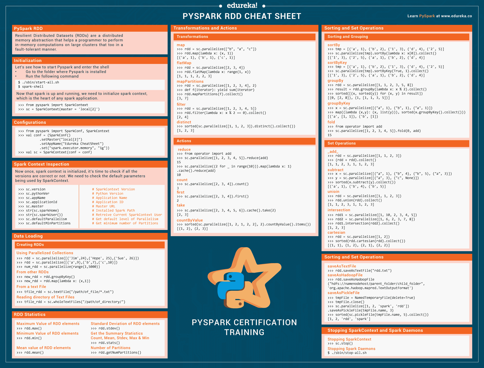

# PySpark CheatSheet:用 Python 实现 Spark RDD

> 原文：<https://www.edureka.co/blog/cheatsheets/pyspark-cheat-sheet-python/>

[**Apache Spark**](https://www.edureka.co/blog/pyspark-tutorial/)说到 [**大数据分析**](https://www.edureka.co/blog/big-data-analytics/) 是最好的框架之一。这项强大的技术刚与 Python 这样简单而高效的语言集成，就给了我们一个极其方便易用的 API，叫做 PySpark。在本备忘单中，我们将探索 PySpark 的一个构建模块，称为**弹性分布式数据集**，或者更通俗地称为 **PySpark RDD** 。

## Pyspark 备忘单

弹性分布式数据集(RDDs)是一种分布式内存抽象，帮助程序员在大型集群上以容错方式执行内存计算。

它是无模式数据结构的先驱之一，可以处理结构化和非结构化数据。内存数据共享使得 RDDs **比网络和磁盘共享快 10-100 倍**。


[](https://d1jnx9ba8s6j9r.cloudfront.net/blog/wp-content/uploads/2018/10/PySpark_CheatSheet_Edureka.pdf)

## 初始化和配置

## 初始化

我们来看看如何启动 Pyspark 进入 shell

*   转到安装 Pyspark 的文件夹
*   运行以下命令

```
$ ./sbin/start-all.sh
$ spark-shell

```

现在 spark 已经启动并运行，我们需要初始化 spark 上下文，这是任何 spark 应用程序的核心。

```
>>> from pyspark import SparkContext
>>> sc = SparkContext(master = 'local[2]')
```

## 配置

```
>>> from pyspark import SparkConf, SparkContext
>>> val conf = (SparkConf()
           .setMaster("local[2]")
           .setAppName("Edureka CheatSheet")
           .set("spark.executor.memory", "1g"))
>>> val sc = SparkContext(conf = conf)
```

## 火花上下文检查

现在一旦 spark 上下文被初始化，就该检查所有的**版本**是否正确了。我们需要检查 SparkContext 使用的默认参数。

```
# SparkContext Version >>> sc.version
# Python Version >>> sc.pythonVer
# Application Name >>> sc.appName
# Application ID >>> sc.applicationId 
# Master URL >>> sc.master 
# Installed Spark Path >>> str(sc.sparkHome) 
# Retreive Spark User Currently using SparkContext >>> str(sc.sparkUser())
# Get default level of Parallelism >>> sc.defaultParallelism 
# Get minimum number of Partitions >>> sc.defaultMinPartitions 
```

## 数据加载

## 创建 rdd

一旦整个环境建立起来。现在是时候学习如何创建 RDD 了。[**【RDD】(弹性分布式数据集)**](https://www.edureka.co/blog/pyspark-rdd/) 充当 Pyspark 的中坚力量。创建 rdd 有三种方法。让我们看看他们每一个人。

```
# Using Parallelized Collections >>> rdd = sc.parallelize([('Jim',24),('Hope', 25),('Sue', 26)])
>>> rdd = sc.parallelize([('a',9),('b',7),('c',10)])
>>> num_rdd = sc.parallelize(range(1,5000))

# From other RDDs >>> new_rdd = rdd.groupByKey()
>>> new_rdd = rdd.map(lambda x: (x,1))

# From a text File >>> tfile_rdd = sc.textFile("/path/of_file/*.txt")

# Reading directory of Text Files >>> tfile_rdd = sc.wholeTextFiles("/path/of_directory/")
```

## RDD 统计

一旦我们将数据载入 RDD。我们可以使用以下命令查看特定 RDD 的统计数据。我们可以得到平均值，方差，最大值，最小值等等。

```
# Maximum Value of RDD elements >>> rdd.max()
# Minimum Value of RDD elements >>> rdd.min()
# Mean value of RDD elements >>> rdd.mean()
# Standard Deviation of RDD elements >>> rdd.stdev()
# Get the Summary Statistics
Count, Mean, Stdev, Max & Min
>>> rdd.stats()

# Number of Partitions >>> rdd.getNumPartitions()
```

## 转换和操作

## 转换

这些是应用于 RDD 以创建新 RDD 的操作。转换遵循**惰性评估的原则。**这允许你在任何时候通过调用数据操作来执行操作。

```
# map
Return a new RDD by applying a function to each element of this RDD
>>> rdd = sc.parallelize(["b", "a", "c"])
>>> rdd.**map**(lambda x: (x, 1))
[('a', 1), ('b', 1), ('c', 1)]

# flatMap Return a new RDD by first applying a function to all elements of this RDD, and then flattening the results.
>>> rdd = sc.parallelize([2, 3, 4])
>>> rdd.flatMap(lambda x: range(1, x))
[1, 1, 1, 2, 2, 3]

# mapPartitions Return a new RDD by applying a function to each partition of this RDD.
>>> rdd = sc.parallelize([1, 2, 3, 4], 2)
>>> def f(iterator): yield sum(iterator)
>>> rdd.mapPartitions(f).collect()
[3, 7]

# filter Return a new RDD containing only the elements that satisfy a predicate.
>>> rdd = sc.parallelize([1, 2, 3, 4, 5])
>>> rdd.filter(lambda x: x % 2 == 0).collect()
[2, 4]

# distinct Return a new RDD containing the distinct elements in this RDD.
>>> sorted(sc.parallelize([1, 1, 2, 3]).distinct().collect())
[1, 2, 3]
```

## 行动

动作是应用在 RDD 上的操作，指示 Apache Spark 应用**计算**，并将结果返回给驱动程序。让我们来看看其中的一些动作。

```
# reduce Reduces the elements of this RDD using the specified commutative 
and associative binary operator. Currently reduces partitions locally.
>>> from operator import add
>>> sc.parallelize([1, 2, 3, 4, 5]).reduce(add)
15
>>> sc.parallelize((2 for _ in range(10))).map(lambda x: 1).cache().reduce(add)
10

# count Return the number of elements in this RDD.
>>> sc.parallelize([2, 3, 4]).count()
3

# first Return the first element in this RDD.
>>> sc.parallelize([2, 3, 4]).first()
2

# take Take the first "n" num elements of the RDD.
>>> sc.parallelize([2, 3, 4, 5, 6]).cache().take(2)
[2, 3]

# countByValue Return the count of each unique value in this RDD as a 
dictionary of (value, count) pairs.
>>> sorted(sc.parallelize([1, 2, 1, 2, 2], 2).countByValue().items())
[(1, 2), (2, 3)]
```

## 排序和集合操作

## 排序和分组

让我们看看如何在 rdd 上执行**排序**。

## 集合操作

让我们看看如何在 rdd 上执行**集合操作**。

```
# sortBy Sorts this RDD by the given keyfunc
>>> tmp = [('a', 1), ('b', 2), ('1', 3), ('d', 4), ('2', 5)]
>>> sc.parallelize(tmp).sortBy(lambda x: x[0]).collect()
[('1', 3), ('2', 5), ('a', 1), ('b', 2), ('d', 4)]

# sortByKey Sorts this RDD, which is assumed to consist of (key, value) pairs.
>>> tmp = [('a', 1), ('b', 2), ('1', 3), ('d', 4), ('2', 5)]
>>> sc.parallelize(tmp).sortByKey(True, 1).collect()
[('1', 3), ('2', 5), ('a', 1), ('b', 2), ('d', 4)]

# groupBy Return an RDD of grouped items.
>>> rdd = sc.parallelize([1, 1, 2, 3, 5, 8])
>>> result = rdd.groupBy(lambda x: x % 2).collect()
>>> sorted([(x, sorted(y)) for (x, y) in result])
[(0, [2, 8]), (1, [1, 1, 3, 5])]

# groupByKey Group the values for each key in the RDD into a single sequence.
>>> x = sc.parallelize([("a", 1), ("b", 1), ("a", 1)])
>>> map((lambda (x,y): (x, list(y))), sorted(x.groupByKey().collect()))
[('a', [1, 1]), ('b', [1])

# fold Aggregate the elements of each partition, and then the results for 
all the partitions, using a given associative function and a neutral "zero value."
>>> from operator import add
>>> sc.parallelize([1, 2, 3, 4, 5]).fold(0, add)
15 
```

```
# _add_ Return the union of this RDD and another one.
>>> rdd = sc.parallelize([1, 1, 2, 3])
>>> (rdd + rdd).collect()
[1, 1, 2, 3, 1, 1, 2, 3]

# subtract Return each value in self that is not contained in other.
>>> x = sc.parallelize([("a", 1), ("b", 4), ("b", 5), ("a", 3)])
>>> y = sc.parallelize([("a", 3), ("c", None)])
>>> sorted(x.subtract(y).collect())
[('a', 1), ('b', 4), ('b', 5)]

# unioin Return the union of this RDD and another one.
>>> rdd = sc.parallelize([1, 1, 2, 3])
>>> rdd.union(rdd).collect()
[1, 1, 2, 3, 1, 1, 2, 3]

# intersection Return the intersection of this RDD and another one
>>> rdd1 = sc.parallelize([1, 10, 2, 3, 4, 5])
>>> rdd2 = sc.parallelize([1, 6, 2, 3, 7, 8])
>>> rdd1.intersection(rdd2).collect()
[1, 2, 3]

# cartesian Return the Cartesian product of this RDD and another one.
>>> rdd = sc.parallelize([1, 2])
>>> sorted(rdd.cartesian(rdd).collect())
[(1, 1), (1, 2), (2, 1), (2, 2)] 
```

## 保存 rdd

## 保存 rdd

既然我们已经看到了各种各样的转变和行动。是时候**将这些 rdd 以不同的格式保存**了。

```
# saveAsTextFile Save this RDD as a text file, using string representations of elements.
>>> rdd.saveAsTextFile("rdd.txt")

# saveAsHadoopFile Output a Python RDD of key-value pairs (of form RDD[(K, V)]) to any Hadoop file system
>>> rdd.saveAsHadoopFile("hdfs://namenodehost/parent_folder/child_folder",'org.apache.hadoop.mapred.TextOutputFormat')

# saveAsPickleFile Save this RDD as a SequenceFile of serialized objects
>>> tmpFile = NamedTemporaryFile(delete=True)
>>> tmpFile.close()
>>> sc.parallelize([1, 2, 'spark', 'rdd']).saveAsPickleFile(tmpFile.name, 3)
>>> sorted(sc.pickleFile(tmpFile.name, 5).collect())
[1, 2, 'rdd', 'spark'] 
```

[**下载 Pyspark 小抄 Edureka**](/blog/wp-content/uploads/2018/10/PySpark_CheatSheet_Edureka.pdf)

至此，我们结束了 **Pyspark RDD 小抄**。查看由 **Edureka** 使用 PySpark 进行的 Python Spark 认证培训，Edureka 是一家值得信赖的在线学习公司，拥有遍布全球的 250，000 多名满意的学习者。Edureka 的 [***Python Spark 认证培训***](https://www.edureka.co/pyspark-certification-training) 使用 PySpark 旨在为您提供成为一名成功的使用 Python 的 Spark 开发人员所需的知识和技能，并为您准备 **Cloudera Hadoop 和 Spark 开发人员认证考试(CCA175)** 。