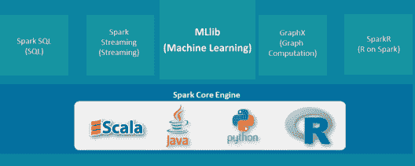

# PySpark MLlib 教程:使用 PySpark 进行机器学习

> 原文：<https://www.edureka.co/blog/pyspark-mllib-tutorial/>

机器学习经历了许多最近的发展，正变得日益流行。包括计算机科学、数学和管理在内的所有领域的人们都在各种项目中使用机器学习来寻找数据中隐藏的信息。Apache Spark 使用其 MLlib 库跳入 Python 的机器学习游戏只是时间问题。人们还注意到，Python 和 Apache Spark 的这种组合比 Scala 更受 Spark 的青睐，这导致了 ***PySpark 认证*** 成为当今市场上广泛关注的技能。所以，在这个 **PySpark MLlib 教程**中，我将讨论以下主题:

*   [**什么是机器学习？**](#machine_learning)
*   [**什么是 PySpark MLlib？**](#what_is_mllib)
*   [**机器学习(Python)工业用例**](#industry_use_cases)
*   [**机器学习生命周期**](#ml_lifecycle)
*   [**PySpark MLlib 特性及算法**](#mllib_features)
*   [**用 PySpark MLlib**](#hackers_mllib) 寻找黑客
*   [**用 PySpark MLlib 预测客户流失**](#churn_prediction_mllib)

## **什么是机器学习？**

机器学习是一种自动建立分析模型的**数据分析**方法。使用从数据中迭代学习的算法，机器学习允许计算机**找到隐藏的洞察力**，而无需显式编程去哪里寻找。它专注于计算机程序的开发，这些程序可以在接触到新数据时**自学**成长和变化。机器学习使用这些数据来检测数据集中的模式，并相应地调整程序操作。

大多数处理大量数据的行业都认识到了机器学习技术的价值。通过从这些数据中收集见解(通常是实时的),组织能够更高效地工作，或者获得超越竞争对手的优势。想了解更多关于机器学习及其各种类型可以参考这个 [***什么是机器学习？***](https://www.edureka.co/blog/what-is-machine-learning/) 博客。

现在你已经对什么是机器学习有了一个简单的概念，让我们继续这个 PySpark MLlib 教程博客，了解什么是 MLlib，它有什么特性？

## **什么是 PySpark MLlib？**

PySpark MLlib 是一个机器学习库。它是 PySpark 核心上的一个包装器，使用机器学习算法进行数据分析。它适用于分布式系统，并且是可扩展的。我们可以在 PySpark MLlib 中找到分类、聚类、线性回归和其他机器学习算法的实现。

## **PySpark MLlib 教程| Edureka**

[//www.youtube.com/embed/oDTJxEl95Go?rel=0&showinfo=0](//www.youtube.com/embed/oDTJxEl95Go?rel=0&showinfo=0)

本视频将为您提供 PySpark MLlib 的详细而全面的知识。

Learn PySpark from Experts [<button>Enroll now</button>](https://www.edureka.co/pyspark-certification-training)

## **机器学习(Python)工业用例**

机器学习算法、应用和平台正在帮助制造商找到新的商业模式，微调产品质量，并将制造运营优化到车间级别。所以让我们继续我们的 PySpark MLlib 教程，了解各个行业是如何使用机器学习的。

**政府:**

公共安全和公共事业等政府机构对机器学习有着特殊的需求。他们用它来进行人脸检测、安全和欺诈检测。公共部门机构正在将机器学习用于政府计划，以获得对政策数据的重要见解。

**营销与电子商务:**

网上购物的数量正在稳步增长，这使得公司能够收集整个客户体验的详细数据。根据以前的购买情况推荐你可能喜欢的商品的网站正在使用机器学习来分析你的购买历史，并推广你感兴趣的其他商品。

**交通:**

分析数据以识别模式和趋势对运输行业至关重要，这依赖于提高**路线的效率**和预测潜在问题以增加盈利能力。公司使用 ML 来实现高效的拼车市场，识别可疑或欺诈账户，建议最佳的上车点和下车点。

**金融:**

今天，机器学习已经在金融生态系统的许多阶段发挥了不可或缺的作用，从批准贷款到管理资产，再到评估风险。银行和金融行业的其他业务使用机器学习技术来**防止欺诈。**

**医疗:**

由于可穿戴设备和传感器的出现，机器学习是医疗保健行业的一个快速发展趋势，这些设备和传感器可以使用数据来实时评估患者的健康状况。**谷歌**开发了一种机器学习算法，来帮助识别乳房 x 光照片上的癌性肿瘤。**斯坦福**正在使用深度学习算法来识别皮肤癌。

现在你已经了解了什么是机器学习以及它在行业中的各种应用领域，让我们继续我们的 PySpark MLlib 教程，并了解典型的机器学习生命周期是什么样子的。

#### 订阅我们的 youtube 频道获取新的更新..！