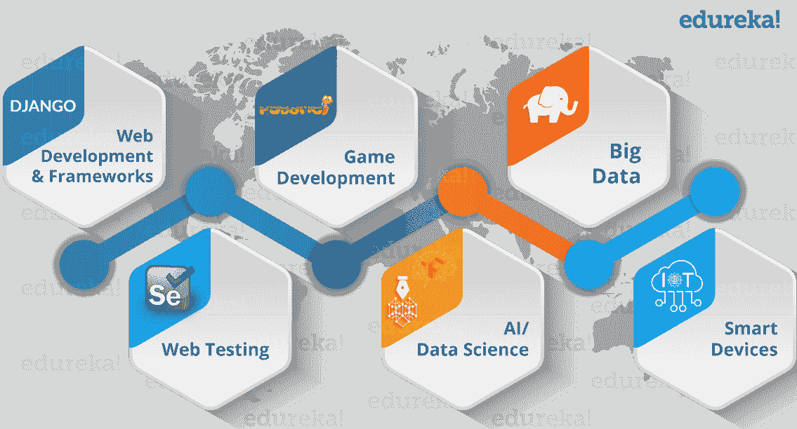
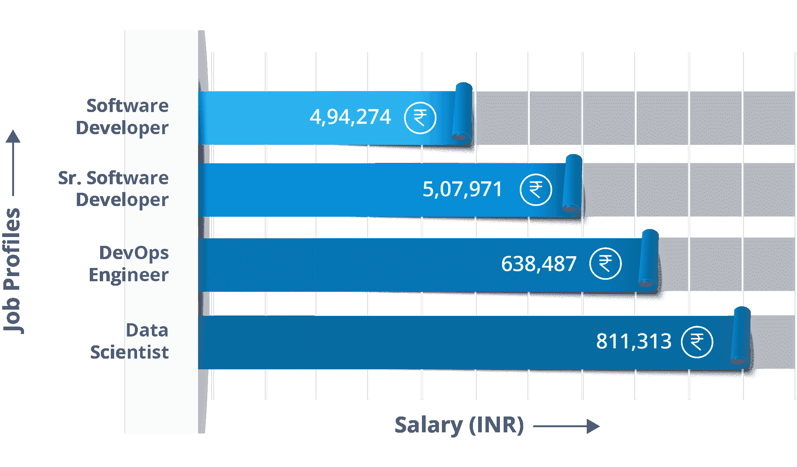
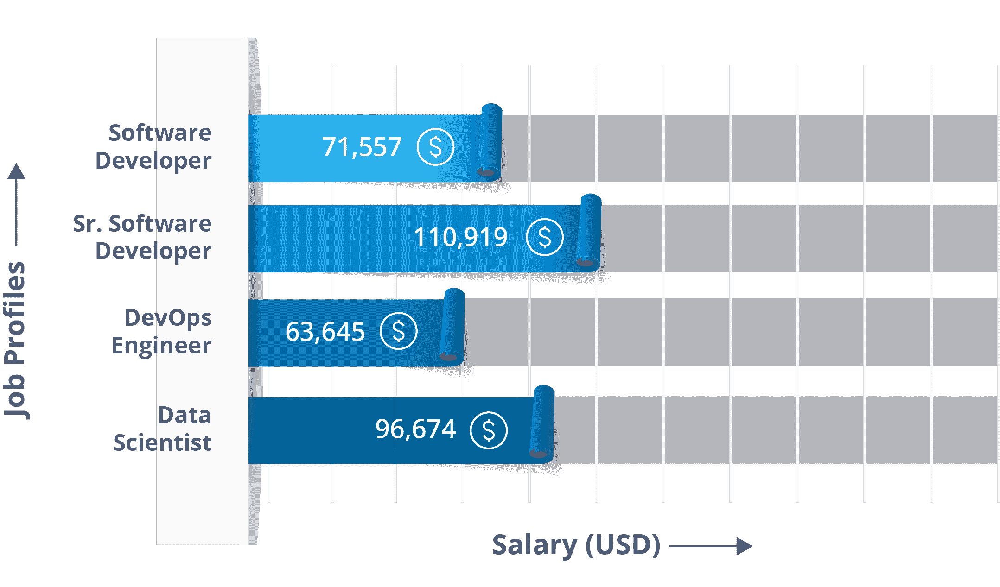
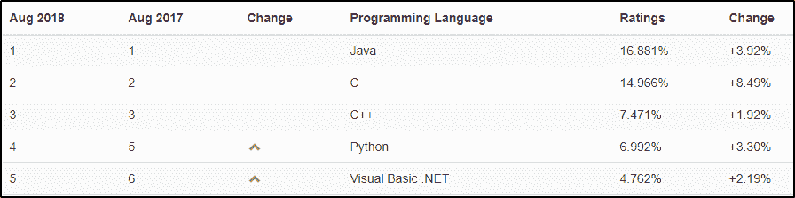

# Python 职业机会:Python 编程职业指南

> 原文：<https://www.edureka.co/blog/python-career-opportunities-your-guide-to-a-career-in-python-programming>

在这个瞬息万变的动态世界中， **Python** 的流行似乎从未停止。如今， ***[Python 认证](https://www.edureka.co/python-programming-certification-training)*** 是整个编程领域最抢手的技能之一。但是你有没有想过，这样做真的值得吗？如果是，它会带你去哪里？除了这些，还有一些其他的问题可能会困扰你。在这篇文章中，我将回答所有这些关于 **Python 职业机会**和**它带给你的成长**的问题。

Python 作为一种编程语言，学习起来既容易又简单。Python 以其简单易读的语法和易于编译的特性将开发时间缩短了一半。此外，它还有大量支持数据分析、操作和可视化的库。因此，它已经发展成为最受欢迎的语言，被认为是职业人士的和。今天，我们将讨论 Python 程序员可以获得的各种 Python 职业机会。

## **Python 职业机会**

由于 Python 要求我们弄脏自己的手，并且喜欢摆弄系统中的错误和其他问题，所以我们渴望有好奇心和动手能力。

一项独立的第三方调查发现，Python 编程语言是目前全球**数据科学家**最流行的语言。IEEE 证实了这一说法，它通过流行度来跟踪编程语言。根据他们的说法，Python 是 2018 年最受欢迎的编程语言之一。不仅如此，Python 还在不同的领域找到了它的应用，如下图所示。

在印度和世界其他国家，惊人的技能差距正促使企业将目光投向来自生活成本更高的国家的人才。印度《T2 时报》最近的一篇文章写道:“印度最大的软件公司之一面临着艰难的处境”。 它赢得了 2 亿美元(Rs。120 亿卢比)的合同，为一家大型美国银行开发应用商店， 但没有足够数量的程序员可以用 Python(最适合这项工作的语言)编写代码。最终，它向美国的一群自由 Python 程序员支付了三倍的费用，并学到了一门以英国电视喜剧系列片 **Monty Python 命名的语言的重要性。**

幸运的是，这种情况现在正在改变，开发人员意识到需要将 Python 加入他们的简历，这既是为了更快的编程，也是为了有利可图的全球职业生涯。

## **Python 工作简介**

*   软件工程师
*   Python 开发者
*   研究分析师
*   数据分析师
*   数据科学家
*   软件开发商

## **蟒薪**

到 2017 年底，Python 交付了一些令人印象深刻的数字。最近 Indeed.com 的一项调查显示，美国至少有 55，000 个 Python 职位，薪水数字呈指数增长。

据 Payscale.com 报道，下面是描绘和 **[美国](https://www.payscale.com/research/US/Skill=Python/Salary)** 的 Python 平均工资的图表。

**职位简介 IND–Python 职业–edu reka**

**工作简介美国 Python 职业-edu reka**

**Python 编程的流行**

Python 编程的受欢迎程度正在稳步上升，Python 的就业机会也是如此。

根据追踪编程语言流行程度的 [TIOBE](https://www.tiobe.com/tiobe-index/) 编程社区指数，Python 仅在去年一年就跃升了四位，在该指数中**将**排在第四位！

**2018 年 8 月 TIOBE 指数——Python 职业**

令人印象深刻的是，在很短的时间内，世界上有 41 个大型组织已经采用 Python 作为他们的主要编程语言。一些大玩家，如 Quora、脸书、YouTube、SlideShare、Dropbox、Pinterest、Reddit 和网飞 的大部分新代码都是用 Python 编写的。在开发者世界里，这是一个公开的秘密:谷歌现在已经采用 Python 作为它的二级编码语言，并承诺在其新产品中更多地使用它。

Edureka 专门策划了一门课程，旨在帮助开发者掌握 Python 语言。由行业从业者共同创建的现场互动课程涵盖了 Python 的关键方面，如机器学习、Hadoop 和 Web 抓取等的集成。

*有问题吗？请在“Python 职业机会”博客的评论部分提到它，我们会给你回复。*